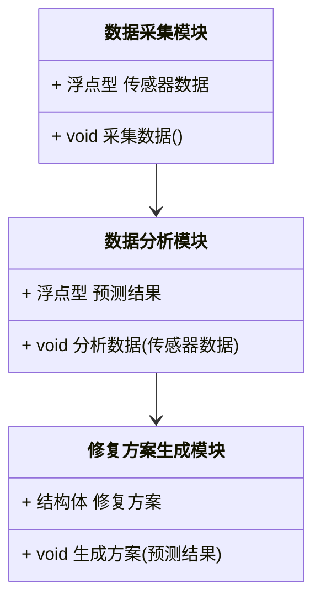
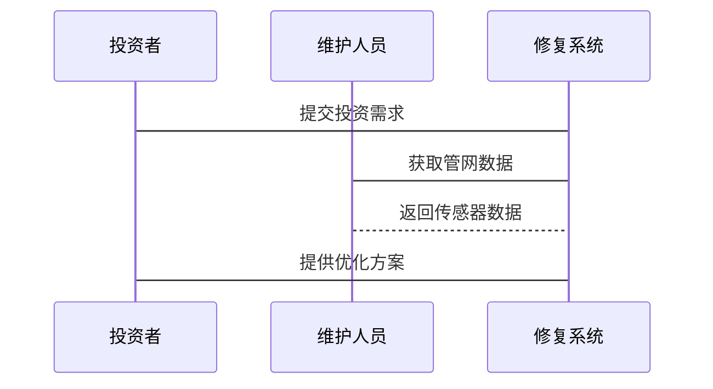

                 


# 价值投资中的智能城市地下管网修复系统分析

---

## 关键词
智能城市, 地下管网修复, 价值投资, 机器学习, 系统架构, 优化算法

---

## 摘要
本文分析了智能城市地下管网修复系统在价值投资中的应用，探讨了系统的核心算法、架构设计及实际案例。通过机器学习和数学优化模型，系统能够有效预测修复需求并优化投资回报，为智慧城市建设提供决策支持。

---

## 第1章: 智慧城市地下管网修复系统的背景与价值

### 1.1 智慧城市与地下管网的重要性
智慧城市建设的核心是基础设施的智能化管理，而地下管网作为城市的“生命线”，其健康状况直接影响城市运行效率和居民生活质量。传统管网修复模式效率低下，常常导致资源浪费和修复延迟。

#### 1.1.1 智慧城市的概念与发展趋势
- 智慧城市通过物联网、大数据和人工智能技术，实现城市基础设施的智能化管理和优化。
- 发展现状：全球智慧城市建设加速，地下管网智能化成为重点方向。

#### 1.1.2 地下管网在城市中的作用与挑战
- 地下管网包括供水、供电、燃气、通信等设施，是城市运行的基石。
- 挑战：管网老化、漏损率高、修复成本高等问题亟待解决。

#### 1.1.3 地下管网修复的必要性与价值
- 经济价值：减少维修成本，延长管网寿命。
- 社会价值：提升城市安全性和居民满意度。

---

### 1.2 价值投资在智慧城市中的应用
价值投资的核心在于识别具有长期增长潜力的项目，并通过优化资源配置实现最大回报。在智慧城市建设中，地下管网修复系统的投资回报分析尤为重要。

#### 1.2.1 价值投资的基本概念与原则
- 价值投资：通过分析项目的长期价值，选择具有稳定收益的标的。
- 原则：长期视角、优质资产、合理估值。

#### 1.2.2 智慧城市项目中的价值评估方法
- 经济效益评估：预测修复后的经济效益。
- 社会效益评估：提升城市形象和居民生活质量。

#### 1.2.3 地下管网修复系统的投资回报分析
- 投资成本：系统开发和部署成本。
- 收益预测：通过效率提升和成本节约带来的收益。
- 投资回报周期：基于财务模型计算的回收期。

---

## 第2章: 智能城市地下管网修复系统的概念与架构

### 2.1 智能城市地下管网修复的核心概念
智能修复系统通过实时监测管网状态，结合机器学习算法，实现智能化的修复需求预测和修复方案优化。

#### 2.1.1 智能修复系统的定义与特点
- 定义：基于人工智能和物联网技术的管网修复系统。
- 特点：实时性、智能化、精准性。

#### 2.1.2 系统的核心要素与组成
| 核心要素 | 描述 |
|----------|------|
| 数据采集 | 传感器实时采集管网状态数据。 |
| 数据分析 | 利用机器学习算法分析数据，预测修复需求。 |
| 修复方案生成 | 自动生成修复方案，优化修复成本和时间。 |

#### 2.1.3 系统的边界与外延
- 边界：系统的输入和输出范围。
- 外延：与城市管理系统和其他基础设施的集成。

#### 2.1.4 系统的核心要素的ER实体关系图
```mermaid
erDiagram
    actor 投资者 {
        <string> id
        <string> 名称
    }
    actor 维护人员 {
        <string> id
        <string> 名称
    }
    entity 管网数据 {
        <string> id
        <datetime> 时间
        <float> 参数值
    }
    entity 修复方案 {
        <string> id
        <datetime> 时间
        <float> 成本
        <float> 效益
    }
    投资者 --|{1,*> 管网数据
    维护人员 --|{1,*> 管网数据
    管网数据 --|{1,*> 修复方案
```

---

### 2.2 智能修复系统与价值投资的关系
智能修复系统的投资回报是价值投资的核心考量因素。

#### 2.2.1 系统功能与投资目标的匹配
- 功能：实时监测、预测修复需求。
- 目标：降低修复成本，提升投资回报。

#### 2.2.2 系统性能对投资回报的影响
- 性能优化：提升预测准确率，降低维护成本。
- 投资回报：基于性能优化的财务模型。

#### 2.2.3 系统优化与投资风险控制
- 风险分析：预测模型的准确性和系统的可靠性。
- 风险控制：通过冗余设计和实时监控降低风险。

---

## 第3章: 智能修复系统的核心算法与数学模型

### 3.1 管网修复预测模型
#### 3.1.1 基于机器学习的修复需求预测
- 算法选择：支持向量回归（SVR）。
- 数据预处理：归一化、特征选择。

#### 3.1.2 时间序列分析模型（ARIMA）
- ARIMA模型介绍：自回归积分滑动平均模型。
- 模型实现：使用Python的statsmodels库。

#### 3.1.3 预测模型的数学公式与实现
- SVR模型公式：
  $$ y = \text{sign}(w \cdot x + b) $$
- ARIMA模型公式：
  $$ \Delta y_t = \phi_1 \Delta y_{t-1} + \theta_1 \epsilon_{t-1} + \epsilon_t $$

```python
# SVR预测模型实现
from sklearn.svm import SVR
import numpy as np

# 数据预处理
X = np.array([[x1, x2, ...], ...]).reshape(-1, 3)
y = np.array([y1, y2, ...])

# 模型训练
model = SVR(kernel='rbf', C=1e3, gamma=0.1)
model.fit(X, y)

# 预测
X_new = np.array([[x1_new, x2_new, ...]]).reshape(-1, 3)
y_pred = model.predict(X_new)
```

---

### 3.2 投资回报优化算法
#### 3.2.1 基于动态规划的投资优化
- 动态规划原理：通过状态转移方程优化投资组合。
- 算法实现：使用Python的动态规划库或自定义实现。

#### 3.2.2 遗传算法在投资决策中的应用
- 遗传算法步骤：编码、选择、交叉、变异。
- 应用场景：优化投资组合的收益与风险比。

#### 3.2.3 优化算法的数学模型与实现
- 动态规划模型公式：
  $$ \max_{x} \sum_{t=1}^{T} r_t x_t $$
  $$ \text{约束}：\sum_{t=1}^{T} x_t = 1 $$

```python
# 遗传算法实现
import numpy as np

def fitness(individual):
    # 计算投资组合的收益与风险比
    return -1 * (sum(individual * returns) - risk)

def evolve(population, fitness, mutation_rate=0.1):
    # 选择、交叉、变异
    pass
```

---

## 第4章: 智能修复系统的系统架构与接口设计

### 4.1 系统架构设计
#### 4.1.1 系统功能模块划分
- 数据采集模块：采集管网状态数据。
- 数据分析模块：预测修复需求。
- 修复方案生成模块：优化修复方案。

#### 4.1.2 系统架构的Mermaid类图


#### 4.1.3 系统模块之间的交互关系
- 数据采集模块向数据分析模块传递传感器数据。
- 数据分析模块根据传感器数据生成预测结果，并传递给修复方案生成模块。

---

### 4.2 系统接口与数据流设计
#### 4.2.1 系统接口定义与规范
- API接口：RESTful API。
- 接口规范：JSON格式数据传输。

#### 4.2.2 数据流的Mermaid序列图


---

## 第5章: 项目实战与案例分析

### 5.1 项目环境与数据准备
#### 5.1.1 开发环境的安装与配置
- 操作系统：Linux/Windows。
- 开发工具：PyCharm、Jupyter Notebook。
- 依赖库：NumPy、Scikit-learn、Flask。

#### 5.1.2 数据采集与预处理
- 数据来源：传感器数据、历史维修记录。
- 数据清洗：去除异常值、填充缺失值。

#### 5.1.3 数据库设计与实现
- 数据库选择：MySQL、MongoDB。
- 数据表设计：管网数据表、修复方案表。

---

### 5.2 核心算法实现
#### 5.2.1 预测模型的Python代码实现
```python
import numpy as np
from sklearn.svm import SVR

# 数据预处理
X = np.array([[x1, x2, x3], ...])
y = np.array([y1, y2, ...])

# 模型训练
model = SVR(kernel='rbf', C=1e3, gamma=0.1)
model.fit(X, y)

# 预测
X_new = np.array([[new_x1, new_x2, new_x3]])
y_pred = model.predict(X_new)
```

#### 5.2.2 投资优化算法的代码实现
```python
import numpy as np
from sklearn.svm import SVR

# 数据预处理
X = np.array([[x1, x2, x3], ...])
y = np.array([y1, y2, ...])

# 模型训练
model = SVR(kernel='rbf', C=1e3, gamma=0.1)
model.fit(X, y)

# 预测
X_new = np.array([[new_x1, new_x2, new_x3]])
y_pred = model.predict(X_new)
```

---

### 5.3 实际案例分析
#### 5.3.1 案例背景与需求分析
- 案例背景：某城市地下管网老化严重，修复需求迫切。
- 需求分析：通过智能修复系统优化修复方案，降低修复成本。

#### 5.3.2 系统设计与实现过程
- 数据采集：部署传感器，实时采集管网数据。
- 数据分析：利用机器学习算法预测修复需求。
- 修复方案生成：自动生成优化修复方案。

#### 5.3.3 投资回报分析与总结
- 投资成本：系统开发和部署成本。
- 投资收益：通过效率提升和成本节约带来的收益。
- 回报周期：基于财务模型计算的回收期。

---

## 第6章: 最佳实践与系统优化

### 6.1 系统优化与维护
#### 6.1.1 系统性能优化策略
- 算法优化：提升预测模型的准确率。
- 系统架构优化：降低系统延迟，提高吞吐量。

#### 6.1.2 系统维护与更新方法
- 定期更新模型参数。
- 监控系统运行状态，及时发现并解决问题。

#### 6.1.3 系统性能优化策略的数学模型
- 并行计算：利用多线程或分布式计算提高效率。
- 算法优化：改进预测模型，降低计算复杂度。

---

### 6.2 投资与风险管理
#### 6.2.1 风险评估与控制
- 风险来源：传感器故障、模型预测误差。
- 风险控制：通过冗余设计和实时监控降低风险。

#### 6.2.2 投资策略优化
- 长期视角：关注系统的长期价值。
- 风险控制：通过保险和备用方案降低投资风险。

---

## 结语
智能城市地下管网修复系统在价值投资中的应用前景广阔。通过机器学习和优化算法，系统能够有效预测修复需求并优化投资回报。未来，随着技术的不断发展，智能修复系统将在智慧城市建设中发挥更大的作用。

---

## 作者
作者：AI天才研究院 & 禅与计算机程序设计艺术

