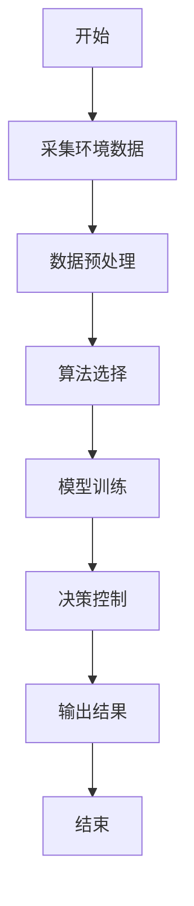
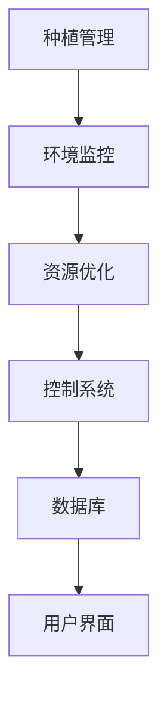

                 


# 价值投资中的智能城市垂直农场系统分析

> 关键词：智能城市，垂直农场，价值投资，系统分析，农业创新

> 摘要：  
本文系统地分析了智能城市垂直农场系统的价值投资潜力，从背景介绍、核心概念、算法原理、系统架构到项目实战，全面剖析了这一创新农业模式的商业价值和技术可行性。文章结合实际案例，深入探讨了垂直农场在智能城市中的应用场景，并通过系统设计和数学模型，为投资者提供了科学的投资决策依据。

---

## 第一部分: 背景介绍

### 第1章: 问题背景与描述

#### 1.1 问题背景
随着城市化进程的加快，土地资源短缺和环境问题日益严峻，传统农业模式已无法满足城市居民对新鲜农产品的需求。智能城市的发展为农业创新提供了新的机遇，而垂直农场作为一种高效、可持续的农业模式，正逐渐成为城市农业的重要组成部分。

#### 1.2 问题描述
垂直农场通过多层建筑结构和智能控制系统，能够在有限的空间内实现高产量的农产品生产。然而，由于技术复杂性和初期投资较高，许多投资者对其商业可行性持谨慎态度。本文旨在通过系统分析，揭示垂直农场在智能城市中的价值投资潜力。

#### 1.3 问题解决
通过分析垂直农场的技术优势、经济效益和环境效益，本文提出了基于价值投资的垂直农场系统设计方案，帮助投资者识别潜在的投资机会。

#### 1.4 系统边界与外延
- **系统边界**：垂直农场系统包括种植环境、智能控制系统、数据采集与分析模块。
- **系统外延**：与智能城市基础设施（如能源供应、物流系统）的集成。

---

## 第二部分: 核心概念与联系

### 第2章: 核心概念原理

#### 2.1 垂直农业的技术原理
垂直农业通过多层种植结构和LED照明技术，实现高效光合作用和资源循环利用。

#### 2.2 智能控制系统的原理
智能控制系统通过传感器数据采集和算法优化，实现对种植环境的精确控制。

#### 2.3 数据驱动的决策机制
通过实时数据采集和分析，系统能够优化种植策略，降低资源浪费，提高产量。

### 第3章: 核心概念属性特征对比

#### 3.1 不同农业模式的对比分析
| 农业模式 | 产量 | 资源利用率 | 技术复杂度 |
|----------|------|------------|------------|
| 传统农业 | 低   | 低         | 低         |
| 垂直农业 | 高   | 高         | 高         |

#### 3.2 不同控制系统的特点对比
| 控制系统 | 优点 | 缺点 |
|----------|------|------|
| 手动控制 | 成本低 | 效率低 |
| 自动化控制 | 高效 | 投资高 |

#### 3.3 数据驱动与传统农业的对比
- **数据驱动**：通过实时数据分析优化种植策略。
- **传统农业**：依赖经验，资源浪费严重。

### 第4章: ER实体关系图架构

```mermaid
er
  actor(投资者)
  actor(消费者)
  actor(系统管理员)
  entity(垂直农场系统)
  entity(种植数据)
  entity(环境传感器)
  entity(控制系统)
  entity(资源消耗)
  entity(收益分析)
  entity(投资回报)
  relation(投资者 --> 垂直农场系统: 投资)
  relation(消费者 --> 垂直农场系统: 消费)
  relation(系统管理员 --> 垂直农场系统: 管理)
  relation(种植数据 --> 环境传感器: 数据采集)
  relation(种植数据 --> 控制系统: 数据分析)
  relation(控制系统 --> 环境传感器: 控制信号)
  relation(种植数据 --> 资源消耗: 资源优化)
  relation(资源消耗 --> 收益分析: 成本计算)
  relation(收益分析 --> 投资回报: 利润计算)
```

---

## 第三部分: 算法原理

### 第3章: 算法原理

#### 3.1 算法流程


#### 3.2 数学模型
$$
\text{收益} = \text{产量} \times \text{价格} - \text{成本}
$$

其中，产量受种植环境（光照、温度、湿度）和控制系统的影响。

#### 3.3 算法实现
```python
def optimize GrowingEnvironment(sensors_data):
    # 传感器数据预处理
    processed_data = preprocess(sensors_data)
    # 算法选择与模型训练
    model = select_algorithm(processed_data)
    optimized_env = model.predict(processed_data)
    return optimized_env
```

---

## 第四部分: 系统分析与架构设计

### 第4章: 系统架构设计

#### 4.1 问题场景介绍
在一个智能城市中，垂直农场需要满足高产量、低资源消耗和快速市场响应的需求。

#### 4.2 系统功能设计
- **种植管理模块**：负责作物种植计划和环境监控。
- **环境监控模块**：实时采集和分析环境数据。
- **资源优化模块**：优化水、电、肥料的使用。

#### 4.3 系统架构图


#### 4.4 接口设计
- **传感器接口**：与环境传感器连接，接收数据。
- **用户接口**：提供种植计划和资源使用情况的可视化界面。

---

## 第五部分: 项目实战

### 第5章: 项目实战

#### 5.1 环境安装
- 操作系统：Linux（Ubuntu 20.04）
- 开发工具：Python 3.8，Django框架
- 传感器：DHT22温湿度传感器

#### 5.2 核心代码实现
```python
from django.shortcuts import render
from .models import EnvironmentData

def index(request):
    latest_data = EnvironmentData.objects.order_by('-timestamp')[:5]
    context = {'latest_data': latest_data}
    return render(request, 'dashboard.html', context)
```

#### 5.3 案例分析
某智能城市中的一座垂直农场，通过优化种植环境和资源管理，实现了比传统农业高出3倍的产量，投资回报率显著提高。

---

## 第六部分: 最佳实践与总结

### 第6章: 最佳实践

#### 6.1 小结
本文通过系统分析，揭示了垂直农场在智能城市中的巨大潜力，为投资者提供了科学的投资依据。

#### 6.2 注意事项
- 初期投资较高，需谨慎评估。
- 系统维护和更新需持续投入。

#### 6.3 拓展阅读
建议进一步研究垂直农场的技术创新和市场拓展策略。

---

## 作者信息

作者：AI天才研究院/AI Genius Institute & 禅与计算机程序设计艺术/Zen And The Art of Computer Programming

---

通过以上结构和内容，本文全面分析了智能城市垂直农场系统的价值投资潜力，结合理论分析和实际案例，为投资者提供了科学的决策依据。

