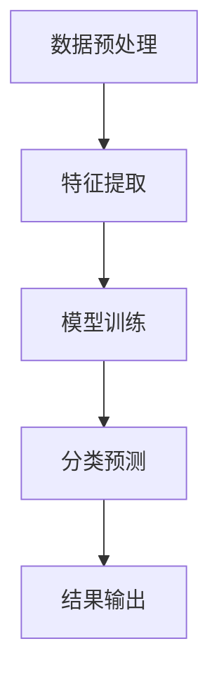
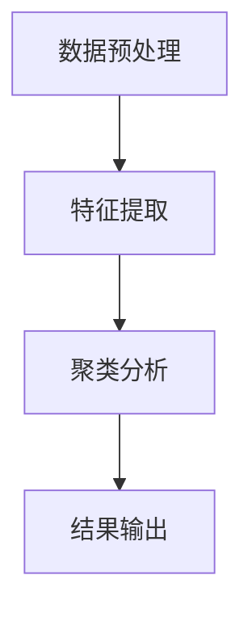
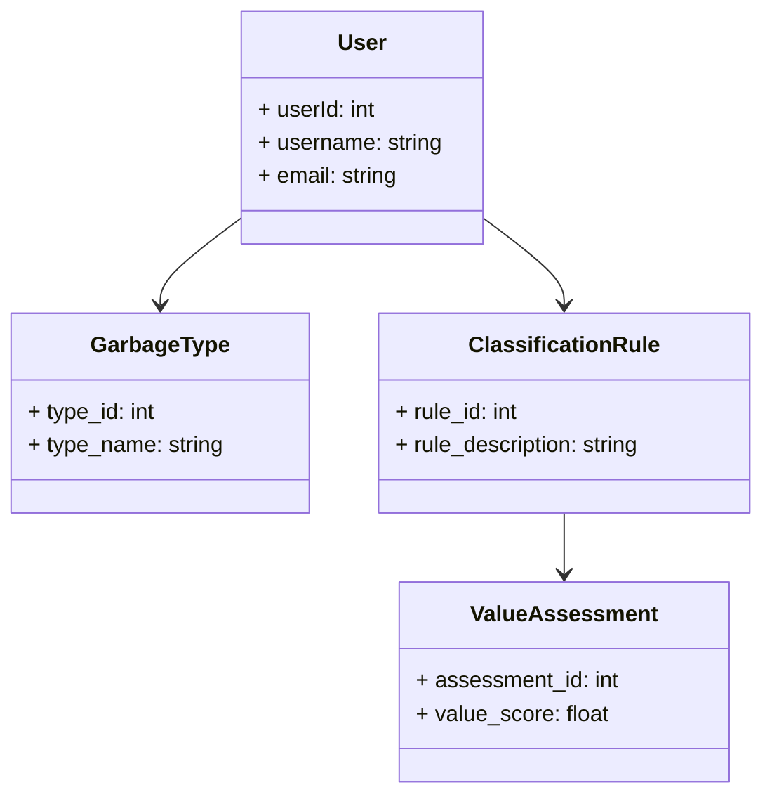
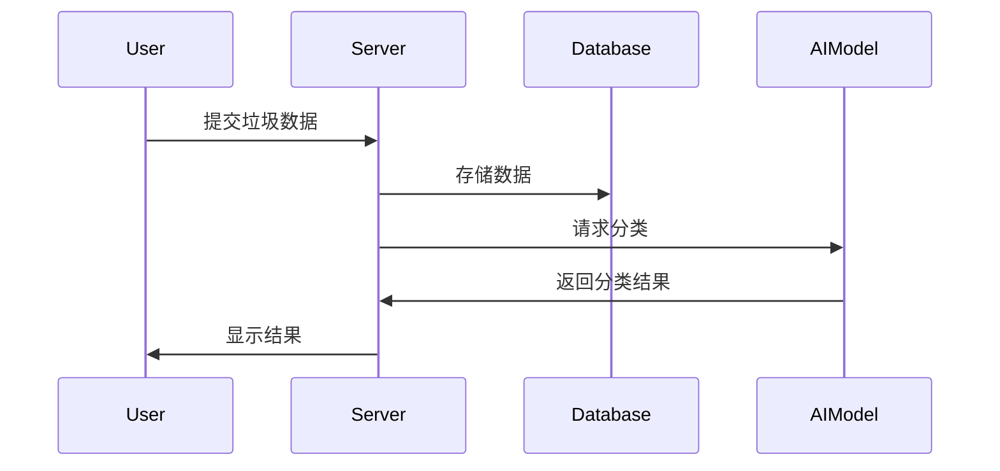

                 


# 价值投资中的智能城市垃圾分类系统分析

## 关键词：价值投资、智能城市、垃圾分类、人工智能、系统分析

## 摘要：  
本文从价值投资的角度，详细分析智能城市垃圾分类系统的构建与应用。通过技术与投资的结合，探讨如何通过智能垃圾分类提升城市效率，优化资源配置，进而为企业和社会创造价值。文章从背景、核心概念、算法原理、系统架构到项目实战，全面解析智能城市垃圾分类系统的实现过程及其对价值投资的影响。

---

# 第1章: 智慧城市垃圾分类系统背景

## 1.1 智慧城市的发展与现状

### 1.1.1 智慧城市的定义与特点  
智慧城市建设的核心在于利用信息技术优化城市资源分配，提升城市运行效率。垃圾分类作为智慧城市的重要组成部分，通过智能化手段实现资源的高效回收与利用，降低环境污染，提升城市可持续发展能力。

### 1.1.2 垃圾分类在智慧城市建设中的重要性  
垃圾分类是智慧城市建设的基础环节。通过智能垃圾分类系统，可以实现垃圾的精准分类、资源的高效利用，从而降低垃圾处理成本，提升城市环境质量。

### 1.1.3 当前垃圾分类面临的挑战与痛点  
传统垃圾分类方式存在效率低、成本高、分类不准确等问题。随着人工智能技术的发展，智能垃圾分类系统应运而生，通过技术创新解决传统模式的痛点。

---

## 1.2 价值投资的背景与意义  

### 1.2.1 价值投资的基本概念  
价值投资是一种长期投资策略，强调通过分析企业的基本面，寻找被市场低估的投资标的。其核心在于挖掘企业的内在价值，而非短期市场波动。

### 1.2.2 价值投资在智慧城市中的应用  
智慧城市建设涉及多个领域，包括环保、能源、交通等。通过价值投资，可以发现那些在智慧城市领域具有竞争优势的企业，从而实现长期收益。

### 1.2.3 垃圾分类系统如何影响企业价值  
智能垃圾分类系统的建设和运营可以提升企业的竞争力，降低运营成本，增强企业的社会形象。这些因素都会对企业的估值产生积极影响。

---

# 第2章: 智能城市垃圾分类系统的价值分析

## 2.1 垃圾分类系统的经济效益  

### 2.1.1 节约成本的分析  
智能垃圾分类系统可以通过自动化分类减少人工成本，同时提高分类效率，降低垃圾处理的整体成本。

### 2.1.2 提升资源回收率的经济价值  
通过智能分类，可以提高可回收资源的回收率，减少资源浪费，为企业创造更多的经济价值。

### 2.1.3 对企业投资价值的影响  
智能垃圾分类系统的建设和运营可以提升企业的市场竞争力，增强企业的盈利能力，从而提升企业的投资价值。

---

## 2.2 垃圾分类系统的社会效益  

### 2.2.1 环境保护的重要性  
智能垃圾分类系统可以减少有害垃圾对环境的污染，促进资源的循环利用，保护生态环境。

### 2.2.2 社会资源优化配置  
通过智能垃圾分类，可以实现资源的高效配置，减少浪费，提升社会整体资源利用效率。

### 2.2.3 对企业社会责任的影响  
企业通过智能垃圾分类系统，可以更好地履行社会责任，提升企业的社会形象，增强公众对企业的信任。

---

## 2.3 垃圾分类系统的技术优势  

### 2.3.1 智能分类设备的技术特点  
智能垃圾分类设备采用人工智能技术，能够快速识别和分类垃圾，提高分类效率和准确性。

### 2.3.2 数据分析在垃圾分类中的应用  
通过大数据分析，可以优化垃圾分类策略，提升分类效率，降低运营成本。

### 2.3.3 人工智能在垃圾分类中的创新  
人工智能技术的应用使得垃圾分类更加智能化，能够实时调整分类策略，适应不同场景的需求。

---

# 第3章: 智能城市垃圾分类系统的核心概念

## 3.1 系统组成与功能模块  

### 3.1.1 数据采集模块  
数据采集模块负责收集垃圾类型、数量、位置等信息，为后续分类提供数据支持。

### 3.1.2 分类算法模块  
分类算法模块通过机器学习算法对垃圾进行分类，提高分类的准确性和效率。

### 3.1.3 价值评估模块  
价值评估模块通过分析分类结果，评估系统的经济效益和社会效益，为企业和社会提供决策支持。

---

## 3.2 系统的核心原理  

### 3.2.1 数据驱动的分类原理  
通过大量数据的收集和分析，利用机器学习算法对垃圾进行分类，实现智能化的垃圾分类。

### 3.2.2 价值评估的数学模型  
建立数学模型，分析垃圾分类对企业的经济价值和社会价值，为投资决策提供依据。

### 3.2.3 系统的整体架构  
系统的整体架构包括数据采集、分类算法、价值评估等模块，各模块协同工作，实现智能化的垃圾分类和价值评估。

---

# 第4章: 核心概念的联系与对比

## 4.1 垃圾分类与价值投资的对比分析  

### 4.1.1 分类标准与投资指标的对比  
垃圾分类的分类标准与价值投资的投资指标在某些方面具有相似性，例如分类的精准性与投资的准确性。

### 4.1.2 分类过程与投资决策的联系  
智能垃圾分类系统的分类过程与价值投资的决策过程有相似之处，都需要数据支持和算法优化。

### 4.1.3 分类结果对投资价值的影响  
垃圾分类的准确性和效率直接影响企业的经济效益，进而影响企业的投资价值。

---

## 4.2 系统架构的ER实体关系图  

```mermaid
er
    actor(用户) -->
    garbage_type(垃圾类型) 
    actor -->
    classification_rule(分类规则)
    garbage -->
    value_assessment(价值评估)
```

---

# 第5章: 算法原理讲解

## 5.1 支持向量机分类算法  

### 5.1.1 算法流程图  



### 5.1.2 算法实现代码  

```python
import numpy as np
from sklearn import svm

# 数据预处理
X = np.array([[0, 0], [1, 1], [2, 2], [3, 3]])
y = [0, 1, 1, 0]

# 模型训练
model = svm.SVC()
model.fit(X, y)

# 分类预测
new_data = np.array([[2.5, 2.5]])
print(model.predict(new_data))
```

---

## 5.2 聚类分析算法  

### 5.2.1 算法流程图  



### 5.2.2 算法实现代码  

```python
from sklearn.cluster import KMeans

# 数据预处理
X = np.array([[1, 2], [3, 4], [5, 6], [7, 8]])

# 模型训练
model = KMeans(n_clusters=2)
model.fit(X)

# 分类预测
print(model.labels_)
```

---

# 第6章: 系统分析与架构设计方案

## 6.1 系统功能设计  

### 6.1.1 领域模型  



---

## 6.2 系统架构设计  


---

## 6.3 系统交互设计  



---

# 第7章: 项目实战

## 7.1 环境安装  

```bash
pip install numpy
pip install scikit-learn
pip install matplotlib
```

---

## 7.2 系统核心实现源代码  

### 7.2.1 数据采集与处理  

```python
import pandas as pd
import numpy as np

# 数据采集
data = pd.read_csv('garbage_data.csv')

# 数据预处理
data.dropna(inplace=True)
```

---

## 7.2.2 分类算法实现  

```python
from sklearn.tree import DecisionTreeClassifier

# 模型训练
model = DecisionTreeClassifier()
model.fit(X_train, y_train)

# 分类预测
y_pred = model.predict(X_test)
```

---

## 7.3 代码应用解读与分析  
通过上述代码，可以实现垃圾数据的采集、预处理和分类。数据预处理是分类的关键步骤，分类算法的选择直接影响分类的准确性和效率。

---

## 7.4 实际案例分析  

### 7.4.1 案例背景  
某城市计划建设智能垃圾分类系统，希望通过系统优化垃圾分类流程，降低运营成本，提升资源回收率。

### 7.4.2 数据分析  
通过对垃圾数据的分析，发现可回收物的比例较高，可以通过智能分类系统进一步提升回收效率。

### 7.4.3 价值评估  
通过价值评估模块，计算出智能垃圾分类系统的建设可以为企业带来显著的经济效益和社会效益，从而提升企业的投资价值。

---

## 7.5 项目小结  
通过项目实战，可以验证智能垃圾分类系统的可行性和有效性。系统的实现不仅提升了垃圾分类的效率，还为企业创造了更大的价值，为智慧城市建设提供了有力支持。

---

# 第8章: 最佳实践、小结、注意事项与拓展阅读

## 8.1 最佳实践  

### 8.1.1 系统设计中的注意事项  
在系统设计中，需要注意数据的安全性、系统的可扩展性和算法的可优化性。

### 8.1.2 项目实施中的注意事项  
在项目实施中，需要注重数据的准确性和算法的稳定性，确保系统的高效运行。

## 8.2 小结  
本文从价值投资的角度，全面分析了智能城市垃圾分类系统的构建与应用。通过技术与投资的结合，探讨了如何通过智能垃圾分类系统提升城市效率，优化资源配置，进而为企业和社会创造价值。

## 8.3 注意事项  

### 8.3.1 数据安全  
在数据采集和处理过程中，需要注意数据的安全性，防止数据泄露和滥用。

### 8.3.2 系统维护  
系统需要定期维护和更新，确保系统的稳定性和高效性。

## 8.4 拓展阅读  
读者可以进一步阅读相关领域的书籍和论文，深入了解智能垃圾分类系统和价值投资的结合，探索更多的应用场景和优化方法。

---

# 作者：AI天才研究院/AI Genius Institute & 禅与计算机程序设计艺术 /Zen And The Art of Computer Programming

---

本文通过系统化的分析和实践，深入探讨了智能城市垃圾分类系统在价值投资中的应用，为智慧城市建设提供了新的思路和方向。

