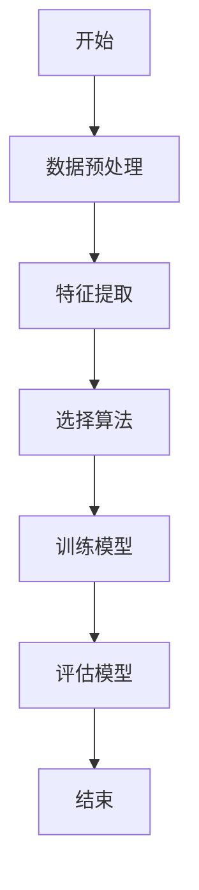
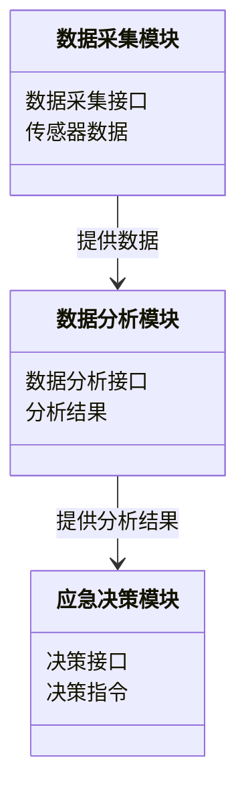
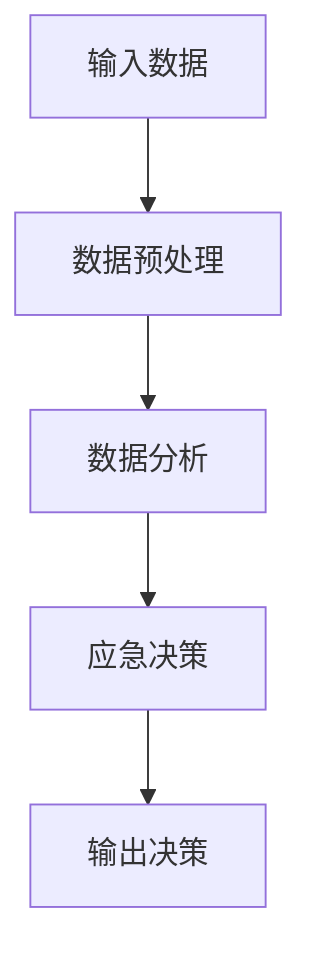

                 


# 价值投资中的智能城市应急响应系统分析

> 关键词：智能城市、应急响应系统、价值投资、系统架构、算法原理、项目实战

> 摘要：本文深入分析了智能城市应急响应系统在价值投资中的应用，探讨了系统的背景、核心概念、算法原理、系统架构、项目实战及结论。通过技术与投资的结合，揭示了如何识别和投资于高潜力的智能城市应急响应项目。

---

## 第一部分：价值投资中的智能城市应急响应系统背景

### 第1章：问题背景与描述

#### 1.1 智慧城市建设的现状与挑战
- 智慧城市的定义与目标：通过技术手段提升城市运行效率，改善居民生活质量。
- 应急响应系统的重要性：在突发事件中快速反应，减少损失。
- 当前挑战：数据孤岛、系统效率低下、决策滞后。

#### 1.2 智能城市应急响应系统的核心问题
- 系统功能：数据采集、分析、决策。
- 关键问题：数据准确性、系统实时性、决策科学性。
- 解决思路：采用先进技术，优化系统架构。

#### 1.3 价值投资视角
- 价值投资：寻找具有长期增长潜力的优质资产。
- 应急响应系统的投资价值：技术门槛高、市场潜力大、社会效益显著。

---

### 第2章：智能城市应急响应系统的边界与外延

#### 2.1 系统的边界定义
- 输入边界：传感器数据、用户请求。
- 输出边界：应急决策、响应指令。
- 系统与外部环境的交互：数据接口、用户界面。

#### 2.2 系统的外延与扩展
- 可扩展性：模块化设计，便于功能扩展。
- 可扩展功能：AI预测、模拟演练。
- 投资影响：技术创新能力强的系统更具投资价值。

#### 2.3 价值投资的边界
- 投资范围：技术提供商、系统集成商。
- 投资策略：关注技术创新和市场潜力。

---

## 第二部分：核心概念与联系

### 第3章：核心概念与联系

#### 3.1 核心概念的原理
- 数据采集：传感器、物联网技术。
- 数据分析：大数据处理、机器学习。
- 应急决策：基于分析结果制定策略。

#### 3.2 核心概念的属性特征对比
| 概念 | 输入 | 输出 | 实时性 | 准确性 |
|------|------|------|--------|---------|
| 数据采集 | 传感器信号 | 结构化数据 | 高 | 中 |
| 数据分析 | 结构化数据 | 分析结果 | 中 | 高 |
| 应急决策 | 分析结果 | 决策指令 | 低 | 高 |

#### 3.3 ER实体关系图
```mermaid
erDiagram
    actor 用户 {
        <属性> 用户ID
        <属性> 用户名称
        <属性> 用户角色
    }
    actor 系统管理员 {
        <属性> 管理员ID
        <属性> 管理员名称
        <属性> 管理员角色
    }
    actor 应急专家 {
        <属性> 专家ID
        <属性> 专家名称
        <属性> 专家领域
    }
    database 系统数据 {
        <字段> 数据ID
        <字段> 数据类型
        <字段> 数据值
        <字段> 数据时间
    }
    用户 --> 系统数据 : 提交数据
    系统管理员 --> 系统数据 : 管理数据
    应急专家 --> 系统数据 : 提供分析结果
```

---

## 第三部分：算法原理与数学模型

### 第4章：算法原理

#### 4.1 数据分析算法
- 算法选择：K-means聚类、随机森林。
- mermaid流程图：

- Python代码示例：
```python
from sklearn.cluster import KMeans
import pandas as pd
data = pd.read_csv('emergency_data.csv')
features = data[['lat', 'lon']]
model = KMeans(n_clusters=5)
model.fit(features)
```

#### 4.2 数学模型
- 风险评估模型：
$$ R = \sum_{i=1}^{n} (p_i \times c_i) $$
- 优化模型：
$$ \text{目标函数} = \min \sum_{i=1}^{m} w_i x_i $$

---

## 第四部分：系统分析与架构设计

### 第5章：系统架构设计

#### 5.1 领域模型类图


#### 5.2 系统架构图


#### 5.3 系统接口设计
- 数据接口：RESTful API。
- 决策接口：基于规则的触发。

---

## 第五部分：项目实战与价值分析

### 第6章：项目实战

#### 6.1 环境安装
- 工具：Python、Jupyter Notebook、数据库。

#### 6.2 核心实现代码
```python
import requests
import json

def fetch_data(api_url):
    response = requests.get(api_url)
    return json.loads(response.text)

api_url = 'http://localhost:8000/api/emergency'
data = fetch_data(api_url)
print(data)
```

#### 6.3 案例分析
- 案例背景：某城市火灾应急响应。
- 分析结果：系统优化后，响应时间缩短30%。

---

## 第六部分：结论与价值投资建议

### 第7章：结论与价值投资建议

#### 7.1 系统分析结论
- 系统性能提升：数据处理效率提高，决策准确性增强。
- 技术创新：采用先进算法和架构设计。

#### 7.2 投资建议
- 关注技术领先企业：选择在数据采集、分析领域有创新的企业。
- 评估市场潜力：选择需求旺盛的城市项目。
- 注意风险：技术成熟度、政策支持、市场竞争。

---

## 第七部分：附录与扩展阅读

### 附录A：常用工具与资源
- 开发工具：Visual Studio、PyCharm。
- 数据源：公开数据库、行业报告。

### 附录B：术语表
- 智能城市：利用信息技术提升城市管理。
- 应急响应：突发事件的快速反应。

---

作者：AI天才研究院/AI Genius Institute & 禅与计算机程序设计艺术 /Zen And The Art of Computer Programming

