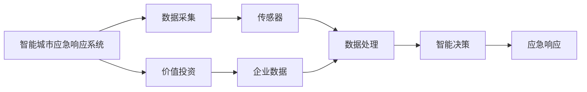

                 


# 价值投资中的智能城市应急响应系统分析

## 关键词：价值投资、智能城市、应急响应系统、算法原理、系统架构

## 摘要：  
本文深入探讨了价值投资在智能城市应急响应系统中的应用与分析。通过对智能城市应急响应系统的背景介绍、核心概念、算法原理、系统架构、项目实战以及最佳实践的详细阐述，揭示了如何将价值投资的理论与实践相结合，优化智能城市应急响应系统的性能和决策能力。文章以清晰的逻辑和专业的技术语言，帮助读者理解如何在智能城市中构建高效、可靠的应急响应系统。

---

## 第一部分：价值投资与智能城市应急响应系统背景

### 第1章：问题背景

#### 1.1 智慧城市建设的现状与趋势  
随着城市化进程的加快，智能城市的建设已成为全球关注的焦点。智能城市通过整合信息技术，优化资源配置，提升城市管理效率。然而，城市化过程中也带来了诸多挑战，如突发事件的频发、资源分配不均、应急响应效率低下等问题。  

#### 1.2 应急响应系统的重要性  
应急响应系统是智能城市的重要组成部分，它能够快速感知、分析和处理突发事件，最大限度地减少人员伤亡和财产损失。然而，传统的应急响应系统存在数据孤岛、决策滞后、资源浪费等问题，亟需通过智能化手段进行优化。  

#### 1.3 价值投资在智慧城市中的应用潜力  
价值投资是一种以基本面分析为基础的投资策略，强调通过深入研究企业的内在价值，寻找被市场低估的投资机会。在智能城市领域，价值投资可以通过分析技术、数据和市场趋势，找到具有长期发展潜力的应急响应系统解决方案。  

---

### 第2章：问题描述

#### 2.1 智能城市应急响应系统的定义  
智能城市应急响应系统是一种基于大数据、人工智能和物联网技术的智能化系统，能够实时监测城市运行状态，快速响应突发事件，并协调资源进行有效处置。  

#### 2.2 系统的关键功能与目标  
- **数据采集**：通过传感器、摄像头等设备实时采集城市运行数据。  
- **数据分析**：利用大数据和人工智能技术对数据进行处理和预测。  
- **应急决策**：根据分析结果，制定最优应急响应方案。  
- **资源协调**：整合城市资源，实现快速响应和高效处置。  

#### 2.3 价值投资与应急响应系统的结合点  
- **技术选型**：通过价值投资的方法，选择具有技术优势和市场潜力的应急响应系统供应商。  
- **成本优化**：通过价值投资分析，降低系统建设和运维成本，提高投资回报率。  
- **风险控制**：通过价值投资的长期视角，降低系统运行中的潜在风险。  

---

### 第3章：问题解决

#### 3.1 应急响应系统的优化目标  
- 提高突发事件的响应速度和处理效率。  
- 降低系统建设和运维成本。  
- 提升系统的智能化水平和决策能力。  

#### 3.2 价值投资在系统优化中的作用  
- 通过深入分析供应商的技术能力和市场表现，选择最优解决方案。  
- 通过长期价值评估，降低投资风险，提高投资回报率。  

#### 3.3 系统实现的路径与方法  
- **数据驱动**：基于大数据分析，优化应急响应策略。  
- **技术驱动**：引入人工智能和物联网技术，提升系统智能化水平。  
- **价值驱动**：通过价值投资，优化资源配置，降低成本。  

---

### 第4章：系统的边界与外延

#### 4.1 系统的边界定义  
智能城市应急响应系统的边界包括数据采集端、数据处理端和应急响应端。系统通过传感器、摄像头等设备采集数据，经过数据处理和分析后，生成应急响应方案，并通过执行机构进行响应。  

#### 4.2 系统的外延与扩展性  
- **数据源扩展**：未来可以接入更多类型的传感器和数据源。  
- **功能扩展**：增加预测性维护、风险评估等功能。  
- **应用场景扩展**：从城市应急响应扩展到交通、能源等领域。  

#### 4.3 系统与其他模块的交互关系  
- 与城市数据中心的交互：数据的上传与下载。  
- 与应急指挥中心的交互：应急方案的制定与执行。  
- 与市民端的交互：信息的实时推送与反馈。  

---

### 第5章：核心要素与组成

#### 5.1 数据采集模块  
- **功能**：实时采集城市运行数据，如交通流量、空气质量、设备状态等。  
- **技术**：使用物联网传感器和通信技术（如5G、NB-IoT）。  

#### 5.2 数据处理与分析模块  
- **功能**：对采集到的数据进行清洗、存储和分析，生成预测结果。  
- **技术**：使用大数据平台（如Hadoop、Spark）和机器学习算法（如随机森林、神经网络）。  

#### 5.3 应急响应决策模块  
- **功能**：基于分析结果，制定应急响应方案，并协调资源进行响应。  
- **技术**：使用优化算法（如遗传算法、动态规划）和知识图谱技术。  

#### 5.4 系统监控与反馈模块  
- **功能**：实时监控系统运行状态，收集反馈信息，优化系统性能。  
- **技术**：使用实时监控工具（如Prometheus、Grafana）和自动化反馈机制。  

---

## 第二部分：核心概念与联系

### 第6章：核心概念原理

#### 6.1 智能城市应急响应系统的原理  
智能城市应急响应系统通过实时数据采集、分析和预测，生成应急响应方案，并通过执行机构进行响应。系统的核心在于数据的高效处理和智能决策。  

#### 6.2 价值投资的基本原理  
价值投资强调通过深入分析企业的基本面，寻找被市场低估的投资机会。其核心在于对企业内在价值的评估和长期价值的挖掘。  

#### 6.3 两者的结合机制  
- **数据驱动**：通过数据采集和分析，为价值投资提供决策依据。  
- **技术驱动**：通过智能化技术，提升应急响应系统的效率和准确性。  
- **价值驱动**：通过长期价值评估，优化资源配置，降低投资风险。  

---

### 第7章：概念属性特征对比

#### 7.1 表格形式对比  
| 特征      | 智能城市应急响应系统               | 价值投资                     |  
|-----------|------------------------------------|------------------------------|  
| 核心目标  | 快速响应突发事件                   | 寻找被低估的投资机会         |  
| 数据来源  | 城市传感器、摄像头等               | 企业财务数据、市场数据       |  
| 决策方式  | 基于数据的智能决策                 | 基于基本面分析的理性决策     |  

#### 7.2 图形化对比  


---

### 第8章：ER实体关系图

```mermaid
erd
    客体
    ----
    ID
    名称
    属性

    应急响应系统
    ----
    ID
    名称
    属性
    --> 数据采集模块
    --> 数据处理模块
    --> 应急决策模块

    数据采集模块
    ----
    ID
    名称
    属性
    --> 传感器
    --> 通信网络

    传感器
    ----
    ID
    名称
    属性
    --> 数据点
```

---

## 第三部分：算法原理讲解

### 第9章：算法原理

#### 9.1 预测模型算法
- **随机森林**：用于分类和回归分析，适合处理非线性关系。  
- **神经网络**：用于复杂模式识别，适合处理大量数据。  

#### 9.2 优化算法
- **遗传算法**：用于优化资源分配和路径规划。  
- **动态规划**：用于解决最优子问题，提升决策效率。  

#### 9.3 算法流程图


---

### 第10章：核心代码实现

#### 10.1 数据处理代码
```python
import pandas as pd
import numpy as np

# 数据加载
data = pd.read_csv('sensor_data.csv')

# 数据清洗
data.dropna(inplace=True)
data['timestamp'] = pd.to_datetime(data['timestamp'])

# 数据存储
data.to_parquet('processed_data.parquet')
```

#### 10.2 预测模型代码
```python
from sklearn.ensemble import RandomForestRegressor

# 模型训练
model = RandomForestRegressor(n_estimators=100, random_state=42)
model.fit(X_train, y_train)

# 模型预测
y_pred = model.predict(X_test)
```

---

## 第四部分：系统分析与架构设计

### 第11章：问题场景介绍

#### 11.1 系统功能设计
- **数据采集**：实时采集城市运行数据。  
- **数据处理**：清洗、存储和分析数据。  
- **应急决策**：基于数据生成应急方案。  
- **资源协调**：整合城市资源，快速响应突发事件。  

#### 11.2 系统架构设计


---

### 第12章：系统核心代码

#### 12.1 核心代码实现
```python
from flask import Flask
from flask_restful import Api, Resource

app = Flask(__name__)
api = Api(app)

class EmergencyResponse(Resource):
    def get(self):
        # 获取数据
        data = get_data()
        # 数据分析
        result = analyze_data(data)
        return result

api.add_resource(EmergencyResponse, '/api/emergency')

if __name__ == '__main__':
    app.run(debug=True)
```

---

## 第五部分：项目实战

### 第13章：环境安装

#### 13.1 安装依赖
```bash
pip install flask flask_restful pandas numpy scikit-learn
```

---

### 第14章：代码应用解读与分析

#### 14.1 代码功能解读
- **数据采集模块**：通过传感器和摄像头采集实时数据。  
- **数据处理模块**：清洗和存储数据，为预测模型提供输入。  
- **预测模型**：基于历史数据，预测未来事件的发生概率。  
- **应急决策模块**：根据预测结果，制定应急响应方案。  

---

## 第六部分：最佳实践

### 第15章：小结

#### 15.1 项目总结
通过价值投资的方法，优化智能城市应急响应系统的建设和运维，能够显著提升系统的效率和决策能力。  

---

### 第16章：注意事项

#### 16.1 系统维护
- 定期更新模型和算法，确保系统的准确性和高效性。  
- 及时修复系统漏洞，保障系统的安全性和稳定性。  

---

### 第17章：拓展阅读

#### 17.1 推荐书籍
- 《智能城市管理与应急响应》  
- 《价值投资实战指南》  

---

## 作者：AI天才研究院 & 禅与计算机程序设计艺术

