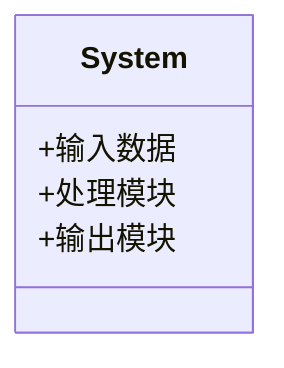
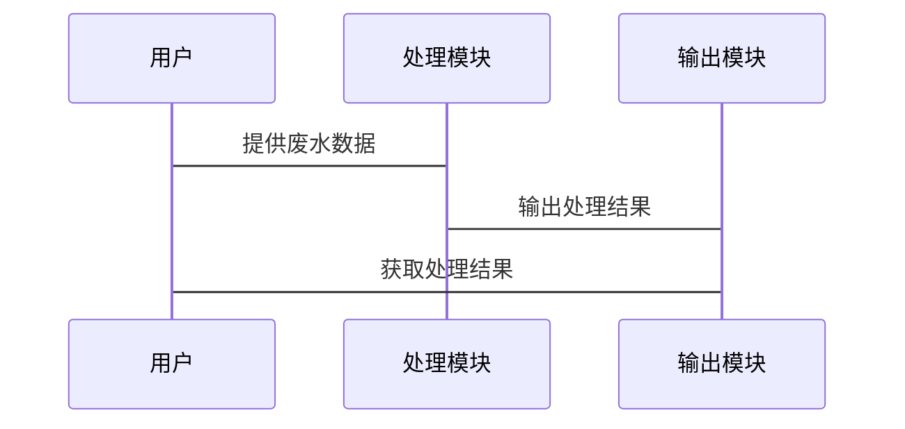

                 


# 《价值投资中的智能城市废水处理与再利用系统分析》

---

## 关键词：  
智能城市，废水处理，再利用系统，价值投资，系统分析，算法原理

---

## 摘要：  
本文从价值投资的角度，深入分析智能城市废水处理与再利用系统的构建与优化。通过系统分析、算法设计和项目实战，揭示废水处理系统的经济价值与社会意义，为投资者提供数据驱动的决策支持。

---

## 目录大纲：

### 第1章：背景介绍与问题分析

#### 1.1 智慧城市建设与废水处理的背景  
- 智慧城市建设的现状与趋势  
- 废水处理与再利用的重要性  
- 价值投资在智慧城市中的应用潜力  

#### 1.2 废水处理与再利用的系统分析  
- 废水处理的核心问题与挑战  
- 废水再利用的经济价值与社会意义  
- 价值投资视角下的废水处理系统分析  

#### 1.3 本章小结  

---

### 第2章：智能城市废水处理与再利用系统的核心概念与联系

#### 2.1 系统构成与核心概念  
- 智能城市废水处理系统的构成要素  
- 废水处理与再利用的流程图分析  
- 系统核心概念的ER实体关系图  

#### 2.2 核心概念的数学模型与公式  
- 废水处理效率的数学模型  
$$ E = \frac{Q_{\text{处理}}}{Q_{\text{总}}} $$  
- 废水再利用率的计算公式  
$$ R = \frac{Q_{\text{再利用}}}{Q_{\text{处理}}} $$  

#### 2.3 本章小结  

---

### 第3章：智能城市废水处理与再利用系统的算法原理

#### 3.1 算法选择与优化策略  
- 废水处理效率优化的算法选择  
- 废水再利用系统的预测算法  

#### 3.2 算法原理与流程图  
- 基于机器学习的废水处理效率优化算法  
- 废水再利用系统的预测流程图  

#### 3.3 算法实现与代码分析  
- 算法实现的Python代码  
```python
def optimize_efficiency(data):
    # 算法实现代码
    pass
```
- 代码功能分析与优化建议  

#### 3.4 本章小结  

---

### 第4章：智能城市废水处理与再利用系统的系统架构设计

#### 4.1 系统功能需求分析  
- 系统功能需求分析  
- 系统架构设计的领域模型  

#### 4.2 系统架构设计图  
- 系统架构的Mermaid类图  

- 系统交互的Mermaid序列图  


#### 4.3 接口设计与实现  

---

### 第5章：项目实战与案例分析

#### 5.1 项目环境与工具安装  
- 环境配置与工具安装  

#### 5.2 项目核心实现  
- 系统核心功能的实现与代码分析  

#### 5.3 案例分析与结果解读  
- 废水处理系统的实际案例分析  
- 处理结果与优化建议  

#### 5.4 本章小结  

---

### 第6章：价值投资策略与系统优化

#### 6.1 价值投资策略  
- 废水处理项目的投资价值分析  
- 投资风险与收益平衡  

#### 6.2 系统优化与投资回报  
- 系统优化建议与投资回报分析  

#### 6.3 本章小结  

---

### 第7章：结论与展望

#### 7.1 研究总结  
- 全文总结与核心观点回顾  

#### 7.2 未来展望  
- 智能城市废水处理系统的未来研究方向  
- 价值投资在智能城市中的潜力  

#### 7.3 本章小结  

---

## 作者：  
AI天才研究院/AI Genius Institute & 禅与计算机程序设计艺术 /Zen And The Art of Computer Programming

