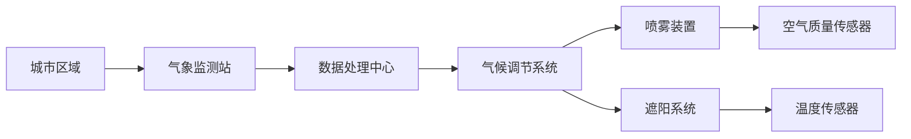

                 

# 价值投资中的智能城市微气候调节系统分析

> **关键词**：智能城市，微气候调节，价值投资，系统架构，优化算法

> **摘要**：本文从价值投资的角度分析智能城市微气候调节系统，探讨其在城市经济中的潜在价值。通过详细的技术分析，包括系统架构、算法原理、项目实战等，揭示该系统如何通过优化气候调节提升城市资产价值，为投资者提供数据支持。

---

## 第一部分: 价值投资中的智能城市微气候调节系统背景

### 第1章: 问题背景与价值分析

#### 1.1 智慧城市建设的背景
- **1.1.1 城市化进程中气候问题的凸显**  
  随着城市化进程的加快，城市热岛效应、空气质量下降等问题日益严重，直接影响居民生活质量和城市经济价值。通过智能系统调节微气候，可以有效缓解这些问题，提升城市宜居性和经济潜力。

- **1.1.2 智慧城市概念的提出与发展**  
  智慧城市概念的提出旨在通过技术手段优化城市资源分配，提升城市运行效率。微气候调节作为智慧城市的重要组成部分，能够显著改善城市环境，进而影响城市价值。

- **1.1.3 气候调节在城市价值中的重要性**  
  气候调节不仅关系到城市的环境质量，还直接影响房地产价值、商业活力和居民健康。通过智能系统调节微气候，可以提升城市整体价值，为投资者带来更高的收益。

#### 1.2 微气候调节的必要性
- **1.2.1 城市微气候的基本概念**  
  微气候是指在城市中较小区域内形成的气候特征，受地理位置、建筑布局和人类活动等多种因素影响。通过智能系统调节微气候，可以优化局部环境，提升居民生活质量。

- **1.2.2 气候变化对城市经济的影响**  
  气候变化可能导致极端天气增多，影响城市基础设施和经济发展。智能微气候调节系统能够有效应对这些挑战，降低气候风险，保障城市经济稳定。

- **1.2.3 微气候调节对城市价值的提升**  
  良好的微气候环境能够提升房地产价值、吸引投资和人才，进而推动城市经济的全面发展。通过调节微气候，可以打造更具竞争力的城市环境。

#### 1.3 价值投资视角下的气候调节系统
- **1.3.1 价值投资与城市发展的关系**  
  价值投资关注长期收益，通过分析城市发展潜力选择投资标的。智能微气候调节系统作为城市基础设施的重要组成部分，能够显著提升城市价值，为投资者带来长期收益。

- **1.3.2 气候调节系统的投资价值**  
  气候调节系统通过优化城市环境，提升城市资产价值。从投资角度看，该系统的建设和维护成本较低，但带来的经济收益显著，具有较高的投资回报潜力。

- **1.3.3 系统调节对城市资产的影响**  
  通过调节微气候，可以提升房地产价格、商业活力和居民健康水平，从而增加城市资产的总价值。这对于投资者来说意味着更高的回报和更稳定的资产增值。

#### 1.4 系统调节的边界与外延
- **1.4.1 微气候调节的地理范围**  
  微气候调节主要在城市的小范围内进行，例如社区或工业园区。系统设计时需明确调节范围，确保调节效果的最大化。

- **1.4.2 调节系统的功能边界**  
  调节系统的核心功能包括数据采集、分析、决策和执行。系统设计需明确各功能模块的边界，确保各模块协同工作，避免功能重叠或遗漏。

- **1.4.3 系统调节的长期与短期效果**  
  微气候调节的长期效果体现在城市环境的持续优化和资产价值的稳步提升，而短期效果则体现在居民生活质量的改善和商业活力的增强。

## 第二部分: 智能城市微气候调节系统的核心概念

### 第2章: 核心概念与系统架构

#### 2.1 系统组成模块
- **2.1.1 数据采集模块**  
  数据采集模块负责收集城市中的气象数据，包括温度、湿度、风速等。通过多种传感器实现数据的实时采集，确保数据的准确性和及时性。

- **2.1.2 数据分析模块**  
  数据分析模块对采集到的气象数据进行处理，结合历史数据和地理信息，分析城市微气候的变化趋势和潜在风险。

- **2.1.3 调节决策模块**  
  调节决策模块基于数据分析结果，制定气候调节策略。通过优化算法，选择最优的调节方案，确保调节效果最大化。

- **2.1.4 执行控制模块**  
  执行控制模块负责将决策模块的调节方案转化为实际操作，控制相关设备（如喷雾装置、遮阳系统等）执行调节任务。

#### 2.2 核心概念对比分析
- **2.2.1 数据采集方式对比**  
  对比不同数据采集方式的优劣，包括有线传感器、无线传感器和卫星遥感等。分析各种方式的适用场景和成本效益。

- **2.2.2 分析算法的优劣**  
  对比不同的数据分析算法，如线性回归、随机森林和神经网络等。分析各种算法的准确性和计算效率，选择最适合应用场景的算法。

- **2.2.3 调节策略的差异**  
  对比不同的气候调节策略，如局部降温、增加绿化覆盖等。分析各种策略的实施难度和效果持续性，选择最优的调节方案。

#### 2.3 实体关系图

---

通过以上结构，文章详细分析了智能城市微气候调节系统在价值投资中的应用，从背景、概念、算法、架构到实战案例，层层深入，为读者提供了全面的技术解读。

