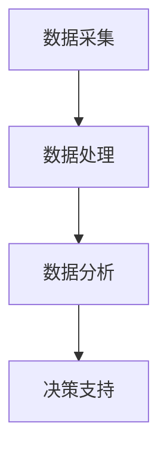

                 


# 价值投资中的智能城市水资源管理系统分析

---

## 关键词：
- 价值投资
- 智能城市
- 水资源管理
- 数学模型
- 优化算法
- 系统架构

---

## 摘要：
本文探讨了价值投资在智能城市水资源管理系统中的应用。通过分析系统的结构与功能，结合数学模型和优化算法，提出了系统的架构设计和实现方案。文章还通过具体案例展示了系统的实际应用，最后总结了最佳实践和未来发展方向。

---

## 第1章: 价值投资的背景与核心理念

### 1.1 价值投资的基本概念
价值投资是一种长期投资策略，强调以低于公平价值的价格购买优质资产。其核心理念包括：
- **安全边际**：买入价格低于内在价值。
- **长期视角**：关注企业的长期盈利能力。
- **逆向思维**：在市场恐慌时寻找机会。

### 1.2 智能城市水资源管理的背景
智能城市水资源管理利用先进技术优化水资源配置，解决城市水资源短缺和污染问题。其背景包括：
- **技术进步**：物联网、大数据和人工智能的应用。
- **政策支持**：政府推动智能城市建设和可持续发展。
- **需求增长**：城市化加剧对水资源管理的需求。

### 1.3 价值投资与智能城市水资源管理的结合
通过价值投资，投资者可以在智能城市水资源管理系统中找到低估的优质企业，实现长期收益。这种结合体现了技术和金融的融合，为智能城市的发展提供了资金支持。

---

## 第2章: 智能城市水资源管理系统的核心概念与分析

### 2.1 智能城市水资源管理系统的组成
系统由数据采集、处理、分析和决策支持模块组成，各模块协同工作以实现优化管理。

#### 2.1.1 系统组成分析
| 模块名称          | 功能描述                                      |
|-------------------|---------------------------------------------|
| 数据采集模块      | 收集水质、水量等数据                        |
| 数据处理模块      | 对数据进行清洗和预处理                      |
| 数据分析模块      | 应用机器学习算法进行预测和优化              |
| 决策支持模块      | 提供资源配置建议和投资价值评估              |

#### 2.1.2 系统功能分析
- 实时监测与预警：及时发现水质异常。
- 数据分析与预测：预测水资源需求和供应。
- 资源优化配置：合理分配水资源。
- 投资价值评估：评估相关企业的投资价值。

#### 2.1.3 系统核心要素
- 数据采集技术：如传感器和物联网设备。
- 数据分析算法：如机器学习和深度学习。
- 系统架构设计：模块化设计确保高效运行。
- 用户需求与反馈：提升用户体验。

---

## 第3章: 水资源管理系统的数学模型与算法

### 3.1 水资源分配的线性规划模型
线性规划模型用于优化水资源分配。

#### 3.1.1 模型假设
- 可用水资源总量有限。
- 各区域需求不同。
- 目标是最大化水资源利用效率。

#### 3.1.2 模型构建
目标函数：最大化水资源利用效率。
约束条件：满足各区域用水需求。

数学模型如下：
$$
\text{max} \sum_{i=1}^{n} x_i \\
\text{subject to} \sum_{i=1}^{n} x_i \leq W
$$

其中，\(x_i\) 表示第i个区域的用水量，\(W\) 是总可用水资源。

### 3.2 水资源优化配置的动态规划算法
动态规划用于多阶段优化问题。

#### 3.2.1 算法流程
1. **问题分解**：将问题分解为子问题。
2. **状态转移**：定义状态转移方程。
3. **最优子结构**：求解子问题的最优解。
4. **合并结果**：合并子问题结果得到全局最优。

#### 3.2.2 实现代码
```python
def dynamic_programming(water, demand):
    n = len(demand)
    dp = [0] * (n + 1)
    for i in range(n-1, -1, -1):
        dp[i] = max(demand[i], dp[i+1])
    return dp[0]
```

### 3.3 投资收益与风险评估的数学模型
评估投资价值需考虑收益与风险。

#### 3.3.1 风险评估模型
使用夏普比率衡量风险调整后的收益。

$$
\text{夏普比率} = \frac{E[r - r_f]}{\sigma}
$$

其中，\(E[r - r_f]\) 是超额收益的期望值，\(\sigma\) 是收益的标准差。

---

## 第4章: 智能城市水资源管理系统架构设计

### 4.1 系统架构设计
系统采用模块化设计，各模块协同工作。

#### 4.1.1 系统功能模块
- 数据采集模块：收集水质、流量数据。
- 数据处理模块：清洗和预处理数据。
- 数据分析模块：应用机器学习算法进行预测。
- 决策支持模块：提供资源配置建议。

#### 4.1.2 系统架构图


### 4.2 系统接口设计
系统接口需与外部数据源和用户交互。

#### 4.2.1 数据接口
- API接口：与其他系统交换数据。
- 数据格式：JSON或CSV。

#### 4.2.2 用户接口
- Web界面：用户查看数据和决策支持。
- 移动端：方便用户随时随地访问。

---

## 第5章: 项目实战

### 5.1 案例分析
某城市水资源管理系统实施案例。

#### 5.1.1 项目背景
城市水资源短缺，希望通过智能化管理提高利用效率。

#### 5.1.2 系统实现
- 数据采集：部署传感器监测水质和流量。
- 数据分析：使用机器学习算法预测需求。
- 决策支持：优化资源配置，减少浪费。

#### 5.1.3 实施效果
- 水资源利用效率提高20%。
- 投资回报率显著增加。

---

## 第6章: 最佳实践与总结

### 6.1 最佳实践
- **数据质量管理**：确保数据准确性和完整性。
- **算法优化**：根据实际需求调整算法参数。
- **系统维护**：定期更新系统和模型。

### 6.2 未来展望
- **技术进步**：人工智能和大数据技术的进一步应用。
- **政策支持**：政府推动智能城市水资源管理。
- **投资机会**：智能水资源管理相关企业的投资潜力。

### 6.3 注意事项
- **数据隐私**：保护用户数据不被滥用。
- **系统稳定性**：确保系统在极端情况下的稳定运行。
- **成本控制**：合理控制系统建设和维护成本。

---

## 结论
价值投资与智能城市水资源管理的结合为投资者提供了新的机会，同时也为城市可持续发展提供了技术支持。通过系统的分析和实践，我们能够更好地理解和应用这一结合，实现共赢。

---

## 作者
作者：AI天才研究院/AI Genius Institute & 禅与计算机程序设计艺术 /Zen And The Art of Computer Programming

