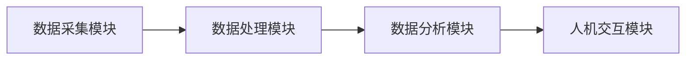

                 


# 价值投资中的智能城市空气净化系统分析

> 关键词：智能城市，空气净化系统，价值投资，算法原理，系统架构，投资回报

> 摘要：本文从价值投资的角度分析智能城市空气净化系统的潜力和价值。通过详细的技术分析和案例研究，探讨系统的核心算法、架构设计、实际应用场景以及投资回报分析，为投资者和决策者提供深度参考。

---

## 第一部分: 智能城市空气净化系统概述

### 第1章: 引言

#### 1.1 智能城市与空气净化系统
智能城市是通过信息技术和数据驱动的方式优化城市运行效率，改善居民生活质量。空气净化系统作为智慧城市的重要组成部分，直接关系到居民健康和城市可持续发展。

#### 1.2 价值投资视角
价值投资关注长期回报和系统性分析。智能城市空气净化系统的投资价值不仅体现在经济效益上，还包括社会价值和环境价值。

#### 1.3 研究背景与意义
随着城市化进程加快，空气污染问题日益严重。智能空气净化系统通过技术创新和数据优化，为城市环境治理提供新思路。从价值投资角度看，分析其经济回报和社会效益具有重要意义。

---

## 第二部分: 空气净化系统的核心概念与技术原理

### 第2章: 系统核心概念

#### 2.1 空气净化系统的基本原理
空气净化系统通过过滤、吸附、催化等技术，去除空气中的有害物质。智能系统结合传感器和物联网技术，实现实时监测和智能控制。

#### 2.2 智能化技术的应用
- 数据采集：空气质量传感器实时监测PM2.5、甲醛等指标。
- 数据分析：通过机器学习算法预测空气质量变化。
- 自动控制：根据数据分析结果，自动调节净化设备运行状态。

#### 2.3 系统的核心价值
- 提高空气质量，改善居民健康。
- 节能减排，降低运行成本。
- 增强城市环境形象，提升城市竞争力。

---

### 第3章: 系统的算法原理

#### 3.1 空气质量预测模型
基于历史数据和实时监测数据，构建空气质量预测模型。模型通过机器学习算法（如随机森林、神经网络）预测未来空气质量。

#### 3.2 模型实现
使用Python代码实现空气质量预测：
```python
import numpy as np
from sklearn.ensemble import RandomForestRegressor

# 示例数据集
X = np.array([[2, 3, 4], [5, 6, 7]])  # 输入特征
y = np.array([10, 20])  # 输出目标

# 创建模型
model = RandomForestRegressor(n_estimators=100)
model.fit(X, y)

# 预测
new_X = np.array([[6, 7, 8]])
print(model.predict(new_X))
```

#### 3.3 算法优化
通过超参数调优（如调整树的深度、特征选择）提升模型预测精度。使用交叉验证评估模型性能，确保预测结果的准确性。

---

## 第三部分: 系统架构设计与实现

### 第4章: 系统架构设计

#### 4.1 系统架构概述
智能城市空气净化系统由以下模块组成：
- 数据采集模块：空气质量传感器。
- 数据处理模块：数据清洗、特征提取。
- 数据分析模块：空气质量预测、设备控制。
- 人机交互模块：用户界面、报警系统。

#### 4.2 系统架构图


#### 4.3 接口设计
系统通过API接口与其他城市管理系统（如交通系统、能源系统）集成，实现数据共享和协同优化。

---

### 第5章: 项目实战

#### 5.1 实验环境搭建
- 硬件：空气质量传感器、单片机。
- 软件：Python、机器学习库（如scikit-learn、TensorFlow）。
- 数据集：公开空气质量数据集（如Kaggle上的AQI数据）。

#### 5.2 系统实现
```python
import pandas as pd
from sklearn.model_selection import train_test_split
from sklearn.metrics import mean_absolute_error

# 数据加载
data = pd.read_csv('air_quality.csv')

# 特征与目标分离
X = data.drop('AQI', axis=1)
y = data['AQI']

# 数据分割
X_train, X_test, y_train, y_test = train_test_split(X, y, test_size=0.2)

# 模型训练
model = RandomForestRegressor(n_estimators=200)
model.fit(X_train, y_train)

# 模型预测
y_pred = model.predict(X_test)
print(mean_absolute_error(y_test, y_pred))
```

#### 5.3 案例分析
以某城市为例，分析系统在实际应用中的效果。通过对比传统净化系统和智能净化系统的运行成本和净化效率，验证系统的投资价值。

---

## 第四部分: 价值投资分析与总结

### 第6章: 投资价值分析

#### 6.1 系统的经济价值
- 运营成本降低：智能系统通过优化控制降低能耗。
- 市场需求增长：随着环保意识增强，智能空气净化系统需求量增加。

#### 6.2 社会价值
- 提升居民健康水平，减少因空气污染引发的疾病。
- 促进城市可持续发展，增强城市竞争力。

#### 6.3 投资回报分析
通过财务模型计算系统的投资回收期、净现值等指标，评估系统的投资回报潜力。

---

### 第7章: 总结与展望

#### 7.1 总结
智能城市空气净化系统结合了技术创新和价值投资理念，具有显著的经济和社会价值。通过本文的分析，投资者可以更好地把握系统的投资机会。

#### 7.2 展望
随着技术进步和市场需求增长，智能空气净化系统将在智慧城市中发挥更重要的作用。未来研究可以进一步优化算法、降低成本，推动系统大规模应用。

---

## 参考文献

（此处列出相关参考文献）

---

## 作者

作者：AI天才研究院/AI Genius Institute & 禅与计算机程序设计艺术 /Zen And The Art of Computer Programming

