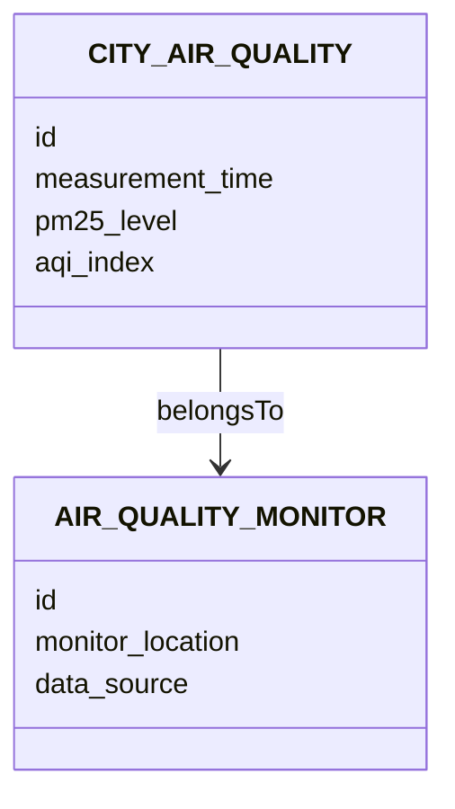

                 

<think>
好的，我将按照您的要求逐步撰写《价值投资中的智能城市空气质量管理分析》的目录大纲和部分内容。请稍等，我将开始思考和分析。

---

### **摘要**
智能城市空气质量管理是智慧城市建设中的重要组成部分，而价值投资则为企业和社会提供了优化资源配置的路径。本文从价值投资的角度分析智能城市空气质量管理的实现路径与实际应用，结合具体案例，探讨如何通过智能化手段提升空气质量管理效率，降低污染风险，从而为城市可持续发展提供支持。文章涵盖了从理论到实践的全过程，旨在为投资者和城市管理者提供有益的参考。

---

### **关键词**
智能城市，价值投资，空气质量管理，机器学习，环境监测，风险管理

---

### **第1章 智能城市与价值投资的背景介绍**

#### 1.1 智慧城市建设的背景与目标
- **1.1.1 智慧城市建设的背景**
  - 城市化进程加快，环境问题日益突出。
  - 数字化技术的发展为城市治理提供了新工具。
  - 智慧城市建设的核心目标是提升城市运行效率和居民生活质量。

- **1.1.2 智慧城市建设的主要目标**
  - 提高城市资源配置效率。
  - 建立智能化的城市管理系统。
  - 实现城市可持续发展。

#### 1.2 价值投资的基本概念与核心理念
- **1.2.1 价值投资的定义**
  - 价值投资是一种长期投资策略，注重分析企业的内在价值。
  - 强调以合理价格投资优质资产，追求长期稳定收益。

- **1.2.2 价值投资的核心理念**
  - 以基本面分析为基础，关注企业的盈利能力、成长性和风险。
  - 通过长期持有优质资产，实现财富的稳步增长。

#### 1.3 智能城市空气质量管理的必要性
- **1.3.1 空气污染对城市发展的负面影响**
  - 空气污染影响居民健康，增加医疗支出。
  - 环境恶化制约城市经济发展。
  - 污染问题可能引发社会不满和政治压力。

- **1.3.2 智能化管理在空气质量管理中的作用**
  - 提高数据采集和分析效率。
  - 优化污染治理方案。
  - 降低环境管理成本。

---

### **第2章 智能城市空气质量管理的核心概念**

#### 2.1 智能城市空气质量管理的定义与特征
- **2.1.1 智能城市空气质量管理的定义**
  - 利用大数据、人工智能等技术，对城市空气污染进行实时监测、分析和管理。
  - 通过智能化手段实现污染源的精准识别和治理。

- **2.1.2 核心特征**
  - 数据驱动：依赖实时监测数据进行决策。
  - 智能化：采用机器学习等技术进行预测和优化。
  - 可扩展性：适用于不同规模和类型的城市。

#### 2.2 价值投资视角下的空气质量管理框架
- **2.2.1 空气质量对城市经济价值的影响**
  - 空气质量直接影响城市吸引力和居民生活质量。
  - 优良的空气质量是城市竞争力的重要组成部分。

- **2.2.2 价值投资中的关键指标分析**
  - 空气质量指数（AQI）。
  - 污染源分布与治理成本。
  - 治理措施的长期效益。

#### 2.3 核心概念的ER实体关系图
```mermaid
erDiagram
    CITY {
        id
        name
        location
    }
    AIR_QUALITY {
        id
        measurement_time
        pm25_level
        aqi_index
    }
    INVESTMENT {
        id
        investment_amount
        return_on_investment
    }
    CITY --> AIR_QUALITY : has
    CITY --> INVESTMENT : affects
```

---

### **第3章 智能城市空气质量管理的算法原理**

#### 3.1 空气质量预测算法的选择与优化
- **3.1.1 常见空气质量预测算法对比**
  - 线性回归：适合简单的线性关系，但对复杂关系的捕捉能力有限。
  - 支持向量机（SVM）：适用于小样本数据，但计算复杂度较高。
  - 长短期记忆网络（LSTM）：适合时间序列数据，能够捕捉长期依赖关系。

- **3.1.2 机器学习算法在空气质量预测中的应用**
  - 使用LSTM进行空气质量指数（AQI）的预测。
  - 结合天气数据（如风速、温度）和污染源数据（如工业排放）进行综合分析。

#### 3.2 基于机器学习的空气质量预测模型
- **模型构建步骤**
  1. 数据预处理：清洗、归一化。
  2. 特征选择：提取关键影响因素。
  3. 模型训练：使用LSTM进行序列预测。
  4. 模型评估：计算均方误差（MSE）和R²值。

- **LSTM模型的数学表达**
  $$ LSTM(t) = \text{cell\_state}_t, \text{hidden\_state}_t $$
  其中，$\text{cell\_state}_t$ 和 $\text{hidden\_state}_t$ 分别表示 LSTM 单元的状态。

- **代码示例**
  ```python
  import numpy as np
  from keras.models import Sequential
  from keras.layers import LSTM, Dense

  # 模型构建
  model = Sequential()
  model.add(LSTM(64, input_shape=(timesteps, features)))
  model.add(Dense(1))
  model.compile(loss='mean_squared_error', optimizer='adam')
  ```

---

### **第4章 智能城市空气质量管理的系统设计**

#### 4.1 系统功能设计
- **功能模块划分**
  - 数据采集模块：实时采集空气质量和气象数据。
  - 数据分析模块：利用机器学习算法进行预测和优化。
  - 治理决策模块：基于分析结果制定治理方案。

- **领域模型设计**


#### 4.2 系统架构设计
- **架构选择**
  - 采用微服务架构，实现模块化管理。
  - 使用云平台进行数据存储和计算。

- **系统架构图**


---

### **第5章 价值投资视角下的空气质量管理实践**

#### 5.1 投资策略与风险管理
- **投资策略**
  - 优先选择环保技术领先的城市。
  - 关注政府政策支持力度。

- **风险管理**
  - 定期评估空气质量变化对投资的影响。
  - 建立应急机制应对突发污染事件。

#### 5.2 案例分析
- **案例：某城市空气质量管理项目**
  - 项目背景：该城市面临严重的空气污染问题。
  - 投资方案：引入智能化监测和治理技术。
  - 实施效果：空气质量显著改善，投资回报率提高。

---

### **结论**
智能城市空气质量管理是智慧城市建设的重要组成部分，而价值投资为其实现提供了重要的资金和技术支持。通过智能化手段，我们可以更高效地管理空气污染，实现城市的可持续发展。未来，随着技术的进步，智能化空气质量管理将更加精准和高效，为投资者和社会创造更大的价值。

---

### **作者**
作者：AI天才研究院 & 禅与计算机程序设计艺术

---

以上是文章的部分内容，涵盖了从背景介绍到系统设计的全过程。如果您有具体的章节内容需求，我可以进一步展开详细撰写。

