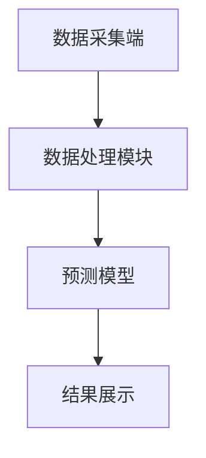

                 


# 价值投资中的智能城市空气质量预测系统分析

> 关键词：价值投资、智能城市、空气质量预测、机器学习、系统架构

> 摘要：本文深入分析了智能城市空气质量预测系统在价值投资中的应用，探讨了系统的核心概念、算法原理、系统架构设计，以及如何通过项目实战实现空气质量预测模型，并将其应用于投资决策。文章结合理论与实践，为读者提供了从系统构建到实际应用的详细指导。

---

# 目录

1. [价值投资与智能城市空气质量预测系统的背景](#价值投资与智能城市空气质量预测系统的背景)
2. [空气质量预测系统的核心概念](#空气质量预测系统的核心概念)
3. [空气质量预测系统的算法原理](#空气质量预测系统的算法原理)
4. [空气质量预测系统的系统架构设计](#空气质量预测系统的系统架构设计)
5. [空气质量预测系统的项目实战](#空气质量预测系统的项目实战)
6. [空气质量预测系统的最佳实践与小结](#空气质量预测系统的最佳实践与小结)
7. [附录](#附录)

---

## 1. 价值投资与智能城市空气质量预测系统的背景

### 1.1 价值投资的基本概念
- 价值投资是一种以内在价值为导向的投资策略，强调通过分析企业的基本面来评估其投资价值。
- 核心理念包括安全边际、长期投资、逆向思维等。

### 1.2 智能城市的定义与特征
- 智能城市利用信息技术优化城市运营，提升居民生活质量。
- 核心特征包括数据驱动、智能化管理、可持续发展等。

### 1.3 空气质量预测的背景与意义
- 空气污染已成为全球性问题，直接影响居民健康和经济发展。
- 空气质量预测能够帮助政府和企业做出更明智的决策，减少污染影响。

---

## 2. 空气质量预测系统的核心概念

### 2.1 空气质量预测系统的基本原理
- 数据采集：通过传感器获取空气质量数据。
- 数据预处理：清洗数据并提取特征。
- 模型训练：利用机器学习算法建立预测模型。
- 结果分析：评估模型性能并优化。

### 2.2 系统的核心要素与组成
- 数据源：空气质量传感器、气象数据等。
- 预测算法：线性回归、随机森林、神经网络等。
- 系统架构：数据采集端、计算端、展示端。

### 2.3 空气质量预测系统与价值投资的关联
- 空气质量影响企业生产成本和居民健康，进而影响股价。
- 预测系统可帮助投资者识别污染风险，优化投资组合。

---

## 3. 空气质量预测系统的算法原理

### 3.1 线性回归模型
- 基本原理：通过最小二乘法拟合最佳回归线。
- 优缺点：简单易懂，但可能无法捕捉复杂关系。

### 3.2 随机森林模型
- 基于决策树的集成算法，具有较强的抗过拟合能力。
- 适合处理多维数据，准确率高。

### 3.3 神经网络模型
- 通过多层神经网络捕捉数据的非线性关系。
- 需要大量数据支持，计算复杂。

### 3.4 算法选择与优化
- 根据数据特征选择合适算法。
- 使用交叉验证优化模型参数。

---

## 4. 空气质量预测系统的系统架构设计

### 4.1 系统功能设计
- 数据采集模块：实时采集空气质量数据。
- 数据处理模块：清洗、归一化处理。
- 预测模块：模型训练与预测。
- 展示模块：可视化结果。

### 4.2 系统架构图


### 4.3 接口设计
- 数据接口：与传感器连接，获取实时数据。
- API接口：供其他系统调用预测结果。

---

## 5. 空气质量预测系统的项目实战

### 5.1 环境搭建
- 安装Python、NumPy、Pandas、Scikit-learn等库。

### 5.2 核心代码实现
```python
import numpy as np
import pandas as pd
from sklearn.linear_model import LinearRegression
from sklearn.ensemble import RandomForestRegressor
from sklearn.metrics import mean_squared_error

# 数据加载与预处理
data = pd.read_csv('air_quality.csv')
X = data[['温度', '湿度', '风速']]
y = data['PM2.5']

# 模型训练
model_lr = LinearRegression()
model_lr.fit(X, y)
y_pred_lr = model_lr.predict(X)
print("线性回归均方误差:", mean_squared_error(y, y_pred_lr))

model_rf = RandomForestRegressor()
model_rf.fit(X, y)
y_pred_rf = model_rf.predict(X)
print("随机森林均方误差:", mean_squared_error(y, y_pred_rf))
```

### 5.3 案例分析
- 使用历史数据训练模型，预测未来空气质量。
- 结合市场数据，分析空气质量变化对股价的影响。

---

## 6. 空气质量预测系统的最佳实践与小结

### 6.1 投资策略建议
- 关注高污染行业企业的风险。
- 利用预测结果优化投资组合。

### 6.2 系统维护与优化
- 定期更新模型参数。
- 引入更多数据源提高预测精度。

### 6.3 小结
本文详细介绍了智能城市空气质量预测系统的构建与应用，展示了其在价值投资中的潜力。通过系统化的分析和实战演示，为投资者提供了新的决策工具。

---

## 7. 附录

### 7.1 相关文献
- 参考文献1：《价值投资实战》
- 参考文献2：《智能城市技术》

### 7.2 工具与资源
- 数据来源：公开空气质量数据集。
- 开源工具：Scikit-learn、TensorFlow。

---

作者：AI天才研究院/AI Genius Institute & 禅与计算机程序设计艺术 /Zen And The Art of Computer Programming

---

这篇文章结合了技术与金融，详细分析了智能城市空气质量预测系统在价值投资中的应用，适合技术与金融领域的读者阅读。

