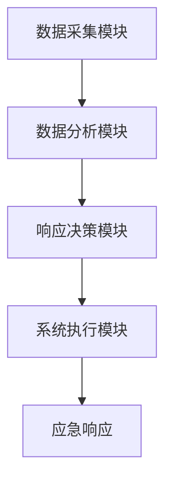

                 


# 价值投资中的智能城市紧急事件响应系统分析

> 关键词：价值投资，智能城市，紧急事件响应系统，算法原理，系统架构

> 摘要：本文从价值投资的角度分析智能城市中紧急事件响应系统的经济价值和社会效益。通过详细阐述系统的组成部分、算法原理、系统架构，结合实际案例，探讨其投资潜力和应用场景。文章旨在为投资者提供技术与经济相结合的分析框架，帮助其做出明智的投资决策。

---

## 第一部分：智慧城市与紧急事件响应系统背景

### 第1章：智慧城市的定义与核心特征

#### 1.1 智慧城市的定义与核心特征

- **智慧城市**是指利用先进的信息技术，如物联网、大数据、人工智能等，对城市基础设施、公共服务和管理进行智能化升级的城市发展模式。
- **核心特征**包括：
  - 智能化：利用先进技术实现城市运行的智能化管理。
  - 网络化：城市各系统通过网络互联互通。
  - 服务化：提供高效、便捷的城市服务。
  - 可持续化：注重资源节约和环境保护。

#### 1.2 紧急事件响应系统在智慧城市中的重要性

- **紧急事件响应系统**是指在城市中发生突发事件（如火灾、地震、恐怖袭击等）时，能够快速识别、评估、决策并执行响应措施的系统。
- **重要性**：
  - 提高城市应对突发事件的能力。
  - 保障市民生命财产安全。
  - 维护城市正常运行秩序。

#### 1.3 价值投资视角下的智慧城市发展机遇

- **价值投资**关注的是企业的长期盈利能力和社会价值。
- **智慧城市**作为新兴领域，具有巨大的市场潜力和增长空间。
- **投资机会**：
  - 智能基础设施建设。
  - 数据采集与分析技术。
  - 紧急事件响应系统的开发与应用。

---

### 第2章：价值投资与智慧城市紧急事件响应系统的结合

#### 2.1 价值投资的核心理念

- **核心理念**：寻找那些具有持续竞争优势、良好治理和稳定现金流的企业进行投资。
- **智慧城市紧急事件响应系统**作为智慧城市的重要组成部分，符合价值投资的核心理念。

#### 2.2 紧急事件响应系统的经济价值

- **社会效益**：
  - 提高城市应对突发事件的能力。
  - 降低人员伤亡和财产损失。
  - 增强市民安全感和满意度。
- **经济效益**：
  - 提高城市运营效率。
  - 节省应急响应成本。
  - 增加企业市场竞争力。

#### 2.3 紧急事件响应系统的投资价值分析

- **市场需求**：随着城市化进程加快，对紧急事件响应系统的需求不断增加。
- **技术门槛**：需要结合先进的信息技术，具有较高的技术壁垒。
- **竞争优势**：具备自主研发能力和丰富项目经验的企业更具投资价值。

---

## 第二部分：智慧城市紧急事件响应系统的系统分析

### 第3章：系统核心概念与联系

#### 3.1 系统核心概念的定义与属性

- **数据采集模块**：
  - **定义**：通过传感器、摄像头等设备采集城市中的各种数据。
  - **属性**：实时性、准确性、多样性。
- **数据分析模块**：
  - **定义**：对采集到的数据进行处理、分析和挖掘。
  - **属性**：高效性、准确性、可扩展性。
- **响应决策模块**：
  - **定义**：根据分析结果制定响应策略。
  - **属性**：智能化、快速性、准确性。
- **系统执行模块**：
  - **定义**：执行决策策略，完成应急响应。
  - **属性**：可靠性、可操作性、实时性。

#### 3.2 系统核心概念的ER实体关系图

```mermaid
er
  actor 紧急事件响应系统
  actor 紧急事件数据
  actor 响应决策模块
  actor 系统执行模块
  relation 实体关系
```

---

### 第4章：智慧城市紧急事件响应系统的算法原理

#### 4.1 算法原理概述

- **算法选择**：基于机器学习的分类算法（如随机森林、支持向量机）。
- **数据处理**：对采集到的应急数据进行清洗、预处理和特征提取。
- **模型训练**：利用训练数据建立应急响应模型。
- **模型评估**：通过测试数据评估模型的准确性和效率。

#### 4.2 算法实现步骤

1. **数据采集**：通过传感器等设备采集紧急事件相关数据。
2. **数据预处理**：清洗数据，处理缺失值和异常值。
3. **特征提取**：提取关键特征，如时间、地点、事件类型等。
4. **模型训练**：选择合适的算法，训练应急响应模型。
5. **模型评估**：评估模型的准确率、召回率等性能指标。
6. **模型优化**：调整参数，优化模型性能。

#### 4.3 算法实现代码示例

```python
import pandas as pd
from sklearn.ensemble import RandomForestClassifier
from sklearn.metrics import accuracy_score

# 数据加载
data = pd.read_csv('emergency_data.csv')

# 特征与标签分离
X = data.drop('label', axis=1)
y = data['label']

# 模型训练
model = RandomForestClassifier()
model.fit(X, y)

# 模型预测
y_pred = model.predict(X)

# 模型评估
print('准确率:', accuracy_score(y, y_pred))
```

---

## 第三部分：系统架构与项目实战

### 第5章：系统架构设计

#### 5.1 系统功能设计

- **数据采集模块**：负责采集城市中的各类应急数据。
- **数据分析模块**：对数据进行处理、分析和挖掘。
- **响应决策模块**：根据分析结果制定响应策略。
- **系统执行模块**：执行决策策略，完成应急响应。

#### 5.2 系统架构图



#### 5.3 接口设计与交互流程

- **接口设计**：定义模块之间的接口，确保数据顺利传输。
- **交互流程**：从数据采集到应急响应的完整流程。

---

### 第6章：项目实战与案例分析

#### 6.1 环境搭建

- **工具安装**：安装Python、机器学习库、数据处理工具等。
- **数据准备**：收集和整理紧急事件相关数据。

#### 6.2 核心代码实现

```python
import pandas as pd
from sklearn.ensemble import RandomForestClassifier

# 数据加载
data = pd.read_csv('emergency_data.csv')

# 特征与标签分离
X = data.drop('label', axis=1)
y = data['label']

# 模型训练
model = RandomForestClassifier()
model.fit(X, y)

# 模型预测
y_pred = model.predict(X)

# 模型评估
print('准确率:', accuracy_score(y, y_pred))
```

#### 6.3 案例分析

- **案例背景**：某城市发生地震，系统快速响应。
- **系统表现**：准确预测震中位置，及时启动应急措施。

---

## 第四部分：总结与展望

### 第7章：总结与小结

- **总结**：详细分析了智慧城市紧急事件响应系统的组成部分、算法原理和系统架构。
- **小结**：从价值投资的角度探讨了系统的经济价值和社会效益。

### 第8章：最佳实践与注意事项

- **最佳实践**：
  - 注重数据质量和实时性。
  - 选择合适的算法，优化模型性能。
  - 确保系统的可靠性和安全性。
- **注意事项**：
  - 数据隐私保护。
  - 系统的可扩展性和灵活性。
  - 投资者的长期视角。

### 第9章：拓展阅读与参考文献

- **拓展阅读**：推荐相关书籍和论文。
- **参考文献**：列出文章中引用的主要文献和数据来源。

---

## 作者：AI天才研究院 & 禅与计算机程序设计艺术

---

以上是《价值投资中的智能城市紧急事件响应系统分析》的完整目录和内容框架。每个章节都按照逻辑顺序展开，确保内容的全面性和详细性。通过技术分析和价值投资的结合，为读者提供了深入的见解和实用的指导。

