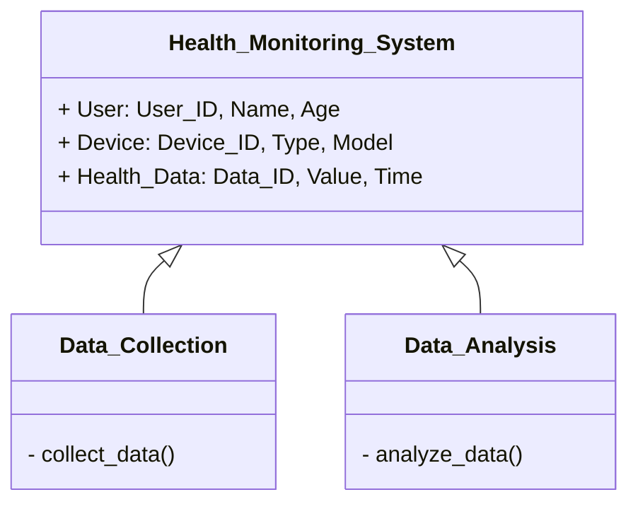
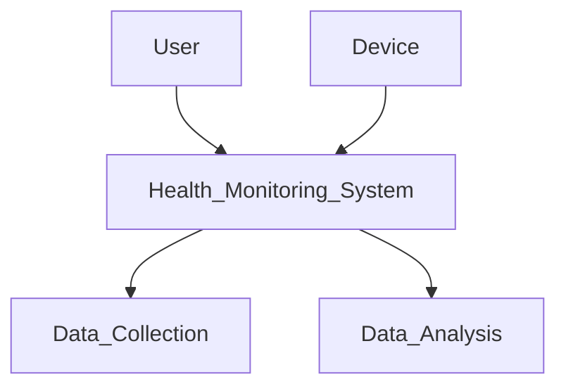

                 


# 价值投资中的智能家居健康监测系统分析

> 关键词：智能家居，健康监测系统，价值投资，数据采集，数据分析

> 摘要：本文深入分析智能家居健康监测系统的构成、功能和投资价值，探讨其在价值投资中的应用潜力。通过系统架构设计、算法原理、项目实战等多角度，为投资者提供技术与投资相结合的决策支持。

---

## 第一部分：智能家居健康监测系统概述

### 第1章：智能家居健康监测系统背景介绍

#### 1.1 智能家居健康监测系统的定义与背景
- 智能家居健康监测系统的定义：通过物联网技术，实时监测家庭成员的健康数据，如心率、体温、睡眠质量等，并通过智能设备进行数据传输和分析，提供健康预警和建议。
- 系统的背景与问题背景：随着智能家居的普及，健康监测系统成为提升生活质量的重要工具。然而，如何利用这些数据进行价值投资，是当前面临的问题。
- 系统的核心目标与问题解决：通过实时监测和数据分析，帮助用户优化健康管理，降低医疗成本，提升投资回报。

#### 1.2 智能家居健康监测系统的概念与结构
- 系统的核心要素与组成：健康监测设备（如智能手环、智能床垫）、数据采集模块、数据传输模块、数据分析模块、用户界面。
- 系统的边界与外延：与智能家居其他子系统（如智能灯光、空调）的交互，数据存储和管理。
- 系统的结构与功能模块：数据采集、数据传输、数据分析、用户反馈。

#### 1.3 智能家居健康监测系统的价值与投资背景
- 价值投资的定义与核心理念：通过长期分析企业价值，选择具有稳定增长潜力的资产进行投资。
- 智能家居健康监测系统的投资价值：随着健康意识的提升，智能家居健康监测系统市场潜力巨大，具备长期投资价值。
- 价值投资与智能家居健康监测系统的结合：通过分析系统的市场地位、技术创新和用户需求，评估其投资价值。

---

### 第2章：智能家居健康监测系统的核心概念

#### 2.1 系统的核心概念与原理
- 健康监测设备的核心原理：通过传感器采集生理数据，如心率、体温、血氧饱和度等。
- 数据采集与传输的原理：使用蓝牙、Wi-Fi等无线技术将数据传输到云端或本地数据库。
- 数据分析与决策的原理：利用机器学习算法对数据进行分析，生成健康报告和建议。

#### 2.2 系统核心概念的属性特征对比
| 核心概念 | 功能 | 优缺点 | 适用场景 |
|----------|------|--------|----------|
| 健康监测设备 | 数据采集 | 高灵敏度，但需定期校准 | 个人健康监测 |
| 数据采集模块 | 数据处理 | 高效但依赖传感器质量 | 多设备集成 |
| 数据传输模块 | 数据传输 | 依赖网络稳定性 | 远程监控 |

#### 2.3 系统的ER实体关系图

```mermaid
erd
    title 实体关系图：智能家居健康监测系统

    HealthMonitoringSystem
    entity User {
        key User_ID
        attributes: User_Name, Age, Gender, Contact_Info
    }

    entity Device {
        key Device_ID
        attributes: Device_Type, Device_Model, MAC_Address
    }

    entity Health_Data {
        key Data_ID
        attributes: Data_Value, Data_Time, Data_Type
    }

    User -|{ owns } Device
    Device -|{ records } Health_Data
```

---

### 第3章：智能家居健康监测系统的算法原理

#### 3.1 数据采集与处理算法

- 数据采集流程：传感器采集生理数据，通过模数转换器（ADC）将模拟信号转换为数字信号。
- 数据预处理：去除噪声，平滑处理，数据归一化。
- 数据清洗：识别异常值，填补缺失值，删除重复数据。

#### 3.2 数据分析与预测算法

- 数据分析：使用统计分析和机器学习算法（如线性回归、随机森林）对健康数据进行分析。
- 数据预测：基于历史数据，预测未来健康趋势，如疾病风险评估。

#### 3.3 算法的数学模型与公式

- 数据预处理中的平滑处理公式：
  $$ \text{平滑处理} = \frac{\text{当前值} + \text{前一个值}}{2} $$
- 线性回归模型：
  $$ y = \beta_0 + \beta_1 x + \epsilon $$

---

### 第4章：智能家居健康监测系统的系统分析与架构设计

#### 4.1 系统架构设计

- 领域模型：展示系统各功能模块的关系。


- 系统架构图：


---

### 第5章：智能家居健康监测系统的项目实战

#### 5.1 环境搭建与核心代码实现

- 环境搭建：安装Python、传感器库、数据库。
- 核心代码实现：数据采集模块、数据处理模块、数据分析模块。
  ```python
  import numpy as np
  import pandas as pd

  def collect_data(sensor):
      return sensor.read()

  def preprocess(data):
      return data.dropna().astype(float)

  def analyze(data):
      model = linear_model.LinearRegression()
      model.fit(X, y)
      return model.predict(X_test)
  ```

#### 5.2 案例分析与结果解读

- 实际案例：某用户的健康数据监测与分析。
- 结果解读：预测用户的健康风险，提供投资建议。

---

### 第6章：智能家居健康监测系统的投资策略与分析

#### 6.1 投资策略的制定

- 市场分析：智能家居健康监测系统的市场规模、增长率。
- 竞争分析：主要竞争对手的技术优势和市场地位。
- 价值评估：基于财务指标和市场潜力评估企业价值。

#### 6.2 投资策略的实施

- 选择具有技术优势和良好市场表现的企业。
- 分散投资，降低风险。
- 长期持有，关注企业技术创新和市场扩展。

---

### 第7章：智能家居健康监测系统的总结与展望

#### 7.1 全文总结

- 总结智能家居健康监测系统的技术特点和投资价值。
- 强调系统在健康管理中的重要性和应用前景。

#### 7.2 未来展望

- 技术创新：人工智能、大数据在健康监测中的应用。
- 市场扩展：健康监测系统在医疗、保险等领域的应用。
- 投资趋势：健康科技的投资热潮和未来潜力。

---

## 作者：AI天才研究院 & 禅与计算机程序设计艺术

---

通过本文的详细分析，读者可以深入了解智能家居健康监测系统的构成、功能和投资价值，为技术投资者提供有力的决策支持。

