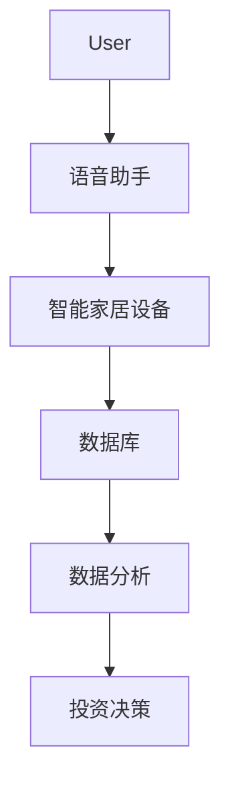

                 

# 价值投资中的智能家居语音控制系统分析

## 关键词：智能家居、语音控制、价值投资、自然语言处理、系统架构

## 摘要：本文分析了智能家居语音控制系统在价值投资中的应用，探讨了其技术基础、系统架构和实际案例，旨在为投资者提供技术支持和决策参考。

---

# 第1章 背景介绍与核心概念

## 1.1 智能家居语音控制系统的发展背景

### 1.1.1 智能家居的定义与现状

智能家居是指通过物联网技术将家庭设备连接到一起，实现智能化管理和控制的居住环境。近年来，随着技术的发展，智能家居设备种类日益丰富，包括智能音箱、智能灯泡、智能门锁等。这些设备通过互联互通，为用户提供便捷的生活体验。

### 1.1.2 语音控制技术的演进历程

语音控制技术从简单的语音识别发展到复杂的自然语言处理，经历了多个阶段。早期的语音识别技术主要用于特定场景的命令识别，而现代的自然语言处理技术能够理解用户的意图并生成相应的命令。

### 1.1.3 价值投资与智能家居的结合

价值投资关注的是长期的收益和潜在的价值点。智能家居语音控制系统可以通过数据分析和预测，帮助投资者找到潜在的价值点。例如，通过分析用户的语音指令，可以预测市场趋势，从而做出投资决策。

## 1.2 价值投资中的智能家居语音控制系统

### 1.2.1 系统的核心概念与目标

智能家居语音控制系统的目标是通过语音识别和自然语言处理技术，实现用户对智能家居设备的语音控制，并利用这些数据进行价值投资分析。系统的核心概念包括语音识别、自然语言处理、设备互联互通等。

### 1.2.2 系统的边界与外延

系统的边界包括用户、语音助手、智能家居设备、数据库和数据分析模块。系统的外延则涉及数据的采集、处理、分析和投资决策。

### 1.2.3 系统的核心要素组成

系统的核心要素包括语音识别模块、自然语言处理模块、智能家居设备、数据库和数据分析模块。这些模块协同工作，实现用户的语音指令处理和投资决策支持。

---

# 第2章 智能家居语音控制系统的技术基础

## 2.1 语音识别技术原理

### 2.1.1 语音识别的基本原理

语音识别的基本原理包括声音信号的处理、特征提取、模式匹配和结果输出。特征提取是关键步骤，常用的方法包括MFCC（Mel-Frequency Cepstral Coefficients）提取。

### 2.1.2 常见的语音识别算法

常见的语音识别算法包括基于HMM的传统方法和基于深度学习的神经网络方法。神经网络方法在准确性和适应性方面具有优势。

### 2.1.3 语音识别的实现流程

语音识别的实现流程包括语音输入、特征提取、模式匹配和结果输出。每个步骤都需要精确的算法支持。

## 2.2 自然语言处理技术

### 2.2.1 自然语言处理的定义与作用

自然语言处理（NLP）是人工智能的核心技术之一，主要用于理解和生成人类语言。在智能家居语音控制系统中，NLP用于理解用户的意图。

### 2.2.2 常见的自然语言处理算法

常见的NLP算法包括TF-IDF、Word2Vec和BERT。这些算法在不同的应用场景中表现各异。

### 2.2.3 自然语言处理在语音控制中的应用

NLP在语音控制中的应用包括意图识别和命令生成。通过NLP技术，系统能够准确理解用户的意图并生成相应的命令。

## 2.3 智能家居设备的互联互通

### 2.3.1 智能家居设备的分类与特点

智能家居设备可以分为家庭自动化设备、安全监控设备和能源管理设备。每类设备具有不同的功能和特点。

### 2.3.2 设备间的通信协议

设备间的通信协议包括ZigBee、Z-Wave、Wi-Fi和蓝牙等。不同的协议适用于不同的设备和场景。

### 2.3.3 设备互联互通的技术挑战

设备互联互通的技术挑战包括协议兼容性、数据同步和设备管理等。解决这些问题需要综合考虑技术和管理因素。

---

# 第3章 价值投资中的智能家居语音控制系统分析

## 3.1 系统的核心算法原理

### 3.1.1 语音识别算法的数学模型

语音识别的数学模型包括特征提取、分类器设计和结果评估。例如，特征提取可以使用MFCC，分类器可以使用支持向量机（SVM）。

### 3.1.2 自然语言处理算法的实现流程

自然语言处理的实现流程包括文本预处理、特征提取、模型训练和结果输出。例如，使用BERT模型进行意图识别。

## 3.2 系统的数学模型与公式

### 3.2.1 语音识别的特征提取公式

特征提取公式：
$$ X = \mathbf{R}^T \mathbf{S} \mathbf{R} $$
其中，$\mathbf{R}$是基矩阵，$\mathbf{S}$是特征向量。

### 3.2.2 自然语言处理的损失函数

损失函数：
$$ L = -\sum_{i=1}^{n} y_i \log p(y_i) $$

## 3.3 系统的实体关系图

---

# 第4章 系统架构与设计方案

## 4.1 系统架构设计

### 4.1.1 系统的功能模块划分

系统功能模块包括用户界面、语音处理、设备控制、数据管理和投资决策。每个模块都有明确的功能和交互关系。

### 4.1.2 系统的分层架构

系统的分层架构包括用户层、语音层、设备层和数据层。每一层都有相应的功能模块和接口设计。

## 4.2 系统的功能设计

### 4.2.1 用户界面设计

用户界面设计包括语音输入、结果显示和操作反馈。用户可以通过语音输入指令，系统显示处理结果。

### 4.2.2 语音处理模块

语音处理模块包括特征提取和模式匹配。特征提取用于获取语音特征，模式匹配用于识别语音内容。

### 4.2.3 设备控制模块

设备控制模块包括设备识别和命令执行。系统通过识别设备并执行命令，实现对智能家居设备的控制。

## 4.3 系统的接口设计

系统的接口设计包括用户与语音助手的接口、语音助手与智能家居设备的接口、设备与数据库的接口等。每个接口都需要明确输入输出数据格式和调用方式。

---

# 第5章 项目实战

## 5.1 环境安装与配置

### 5.1.1 安装Python和相关库

安装Python和必要的库，如TensorFlow、Keras、Numpy等。

### 5.1.2 配置智能家居设备API

配置智能家居设备的API，确保系统能够与设备进行通信。

## 5.2 核心代码实现

### 5.2.1 语音识别部分

使用Keras和TensorFlow实现语音识别模型，如简单分类器。

### 5.2.2 自然语言处理部分

使用预训练的BERT模型进行意图识别，生成相应的命令。

### 5.2.3 设备控制部分

通过API调用智能家居设备，实现设备的控制。

## 5.3 实际案例分析

### 5.3.1 案例背景

假设用户发出“关闭客厅灯”的指令，系统识别并执行。

### 5.3.2 数据分析与投资决策

通过分析用户的指令，系统预测市场趋势，帮助投资者做出决策。

---

# 第6章 总结与展望

## 6.1 系统总结

智能家居语音控制系统通过语音识别和自然语言处理技术，实现了用户对智能家居设备的语音控制，并为价值投资提供了数据支持。

## 6.2 未来展望

未来的发展方向包括更先进的语音识别算法、多模态交互技术和边缘计算的应用。系统的改进方向包括提高准确性和稳定性，优化用户体验。

---

作者：AI天才研究院/AI Genius Institute & 禅与计算机程序设计艺术/Zen And The Art of Computer Programming

