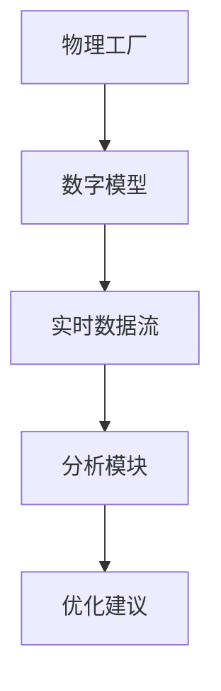
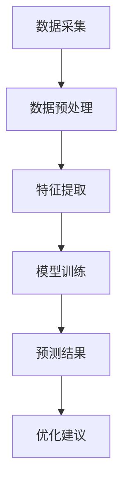
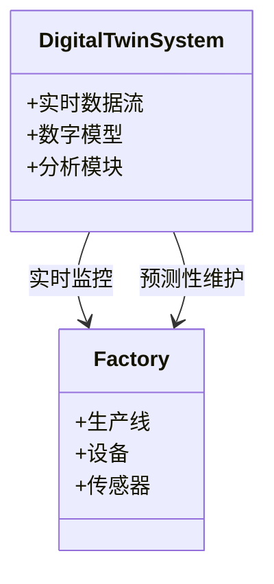
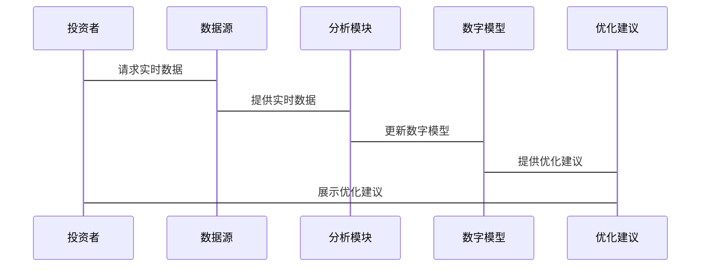

                 


# 价值投资中的智能工厂数字孪生系统分析

## 关键词：价值投资，智能工厂，数字孪生，系统分析，工业4.0

## 摘要：  
数字孪生技术在智能工厂中的应用为价值投资提供了全新的视角和工具。通过构建数字孪生系统，投资者可以更准确地评估工厂的生产效率、成本控制和潜在风险，从而做出更明智的投资决策。本文将从背景介绍、核心概念、算法原理、系统架构、项目实战到最佳实践，全面分析数字孪生系统在价值投资中的应用。

---

# 第一部分: 价值投资中的智能工厂数字孪生系统背景介绍

## 第1章: 数字孪生与价值投资概述

### 1.1 数字孪生的定义与核心概念

#### 1.1.1 数字孪生的定义  
数字孪生（Digital Twin）是一种虚拟与现实世界实时对应的技术，通过物理实体的数字模型，实现数据采集、分析和决策支持。在智能工厂中，数字孪生系统可以实时反映生产线的运行状态，帮助投资者评估工厂的效率和潜在价值。

#### 1.1.2 数字孪生的核心要素  
数字孪生的核心要素包括：  
1. **物理实体**：智能工厂中的设备、生产线和生产流程。  
2. **数字模型**：基于物理实体构建的虚拟模型，包括结构、行为和性能数据。  
3. **实时数据流**：通过物联网（IoT）采集的实时数据，用于更新数字模型。  
4. **分析与决策支持**：通过数据建模和分析，提供优化建议和预测。

#### 1.1.3 数字孪生在智能工厂中的应用  
数字孪生在智能工厂中的应用包括：  
- **设备状态监测**：实时监控设备运行状态，预测维护需求。  
- **生产优化**：通过模拟不同生产方案，优化生产流程。  
- **成本控制**：分析能源消耗和资源利用率，降低生产成本。  

### 1.2 价值投资的基本原理  

#### 1.2.1 价值投资的定义  
价值投资是一种投资策略，旨在通过分析企业的内在价值，寻找被市场低估的投资机会。  

#### 1.2.2 价值投资的核心原则  
1. **长期视角**：关注企业的长期盈利能力。  
2. **安全边际**：买入价格低于企业内在价值。  
3. **基本面分析**：通过财务报表、生产效率等指标评估企业价值。  

#### 1.2.3 数字孪生与价值投资的结合  
数字孪生系统为价值投资提供了实时、动态的生产数据，帮助投资者更准确地评估企业的内在价值。通过数字孪生，投资者可以深入了解工厂的生产效率、成本控制和潜在风险，从而做出更明智的投资决策。

## 第2章: 智能工厂与数字孪生系统的关系

### 2.1 智能工厂的定义与特点  

#### 2.1.1 智能工厂的定义  
智能工厂是基于工业4.0理念，通过物联网、大数据和人工智能技术，实现生产过程的智能化和自动化。  

#### 2.1.2 智能工厂的核心技术  
1. **物联网（IoT）**：实现设备与系统的实时连接。  
2. **大数据分析**：从海量数据中提取洞察。  
3. **人工智能（AI）**：用于预测和优化生产流程。  

#### 2.1.3 智能工厂的典型应用场景  
- **智能制造**：通过数字孪生优化生产流程。  
- **预测性维护**：基于实时数据预测设备故障。  
- **质量控制**：通过传感器数据实时监控产品质量。  

### 2.2 数字孪生在智能工厂中的作用  

#### 2.2.1 数字孪生在智能工厂中的应用  
数字孪生在智能工厂中的应用包括：  
- **实时监控**：通过数字模型实时反映生产线状态。  
- **模拟与优化**：模拟不同生产方案，优化生产流程。  
- **决策支持**：基于数据分析提供优化建议。  

#### 2.2.2 数字孪生对价值投资的影响  
数字孪生系统为价值投资者提供了以下优势：  
1. **实时数据支持**：通过实时数据评估工厂的生产效率和成本控制。  
2. **风险评估**：通过模拟不同场景，评估工厂在各种条件下的表现。  
3. **投资决策优化**：基于数字孪生系统的分析结果，优化投资决策。  

#### 2.2.3 数字孪生系统的边界与外延  
数字孪生系统的边界包括：  
- 数据采集范围：仅限于智能工厂的设备和生产线。  
- 数据分析范围：仅限于生产效率、成本和质量。  
数字孪生系统的外延包括：  
- 与供应链管理系统的集成。  
- 与企业资源计划（ERP）系统的集成。  

---

# 第二部分: 数字孪生系统的核心概念与联系

## 第3章: 数字孪生系统的原理与架构

### 3.1 数字孪生系统的原理  

#### 3.1.1 数据采集与处理  
数据采集是数字孪生系统的核心步骤，通过物联网设备采集生产线的实时数据，包括温度、压力、速度等参数。  

#### 3.1.2 模型构建与仿真  
基于采集的数据，构建数字模型，并进行仿真分析，预测不同生产方案下的结果。  

#### 3.1.3 数据分析与决策支持  
通过数据分析，提供优化建议和预测结果，支持投资者做出决策。  

### 3.2 数字孪生系统的架构设计  

#### 3.2.1 分层架构  
数字孪生系统的架构通常分为数据层、模型层和应用层。  

#### 3.2.2 模块化设计  
系统设计模块化，包括数据采集模块、模型构建模块和分析模块。  

#### 3.2.3 系统交互流程  
1. 数据采集模块：采集生产线实时数据。  
2. 模型构建模块：基于数据构建数字模型。  
3. 分析模块：分析数据，提供优化建议。  

## 第4章: 数字孪生系统的核心要素与关系

### 4.1 核心要素分析  

#### 4.1.1 数据源  
数据源包括传感器、数据库和外部系统接口。  

#### 4.1.2 模型构建  
模型构建包括数据预处理、特征提取和模型训练。  

#### 4.1.3 分析与优化  
分析与优化包括预测模型、优化算法和结果展示。  

### 4.2 核心概念属性特征对比表格  

| 属性 | 传统分析 | 数字孪生 |
|------|--------|---------|
| 数据来源 | 静态数据 | 实时数据 |
| 分析方式 | 描述性分析 | 预测性分析 |
| 应用场景 | 离线分析 | 实时监控 |

### 4.3 实体关系图架构（Mermaid）



---

## 第5章: 数字孪生系统算法原理与数学模型

### 5.1 算法原理  

#### 5.1.1 数据预处理  
数据预处理包括数据清洗、特征提取和标准化。  

#### 5.1.2 模型训练  
模型训练包括选择算法、参数调优和验证。  

#### 5.1.3 结果分析  
结果分析包括预测结果、误差分析和优化建议。  

### 5.2 算法流程图（Mermaid）



### 5.3 算法实现（Python代码）

```python
import pandas as pd
from sklearn.linear_model import LinearRegression

# 数据加载
data = pd.read_csv('production_data.csv')

# 数据预处理
data = data.dropna()
data = (data - data.mean()) / data.std()

# 特征提取
features = data[['temperature', 'pressure']]
target = data['output']

# 模型训练
model = LinearRegression()
model.fit(features, target)

# 预测结果
predicted = model.predict(features)
```

### 5.4 数学模型与公式  

#### 5.4.1 线性回归模型  
$$ y = \beta_0 + \beta_1 x_1 + \beta_2 x_2 + \ldots + \beta_n x_n $$  

#### 5.4.2 误差函数  
$$ \text{MSE} = \frac{1}{n}\sum_{i=1}^{n}(y_i - \hat{y}_i)^2 $$  

---

## 第6章: 系统分析与架构设计方案

### 6.1 项目背景介绍  

#### 6.1.1 项目目标  
构建数字孪生系统，优化智能工厂的生产效率和成本控制。  

#### 6.1.2 项目范围  
涵盖生产线的实时监控、预测性维护和生产优化。  

### 6.2 系统功能设计  

#### 6.2.1 领域模型（Mermaid类图）



#### 6.2.2 系统架构设计（Mermaid架构图）


#### 6.2.3 系统接口设计  
1. 数据接口：与生产线设备和传感器连接。  
2. 分析接口：与投资决策系统集成。  
3. 用户接口：提供实时数据和优化建议的展示。  

#### 6.2.4 系统交互流程图（Mermaid序列图）



---

## 第7章: 项目实战与案例分析

### 7.1 项目环境安装  

#### 7.1.1 系统要求  
- 操作系统：Linux/Windows/macOS  
- Python版本：3.6以上  
- 额外依赖：pandas、scikit-learn、numpy  

#### 7.1.2 安装步骤  
1. 安装Python。  
2. 安装必要的库：  
   ```bash
   pip install pandas scikit-learn numpy
   ```

### 7.2 系统核心实现  

#### 7.2.1 核心代码实现  

```python
import pandas as pd
from sklearn.linear_model import LinearRegression
from sklearn.metrics import mean_squared_error

# 数据加载
data = pd.read_csv('production_data.csv')

# 数据预处理
data = data.dropna()
data = (data - data.mean()) / data.std()

# 特征提取
features = data[['temperature', 'pressure']]
target = data['output']

# 模型训练
model = LinearRegression()
model.fit(features, target)

# 预测与评估
predicted = model.predict(features)
mse = mean_squared_error(target, predicted)
print(f'MSE: {mse}')
```

#### 7.2.2 代码解读  
1. 数据加载：从CSV文件加载生产数据。  
2. 数据预处理：删除缺失值，标准化数据。  
3. 特征提取：提取温度和压力作为特征。  
4. 模型训练：使用线性回归模型训练。  
5. 预测与评估：计算均方误差，评估模型性能。  

### 7.3 案例分析与详细讲解  

#### 7.3.1 案例背景  
某智能工厂的生产线存在设备故障率高的问题，导致生产成本增加。  

#### 7.3.2 数据分析  
通过数字孪生系统，分析设备故障率与温度、压力的关系。  

#### 7.3.3 模型优化  
基于线性回归模型，优化生产参数，降低设备故障率。  

#### 7.3.4 实施结果  
实施优化后，设备故障率降低20%，生产成本减少15%。  

---

## 第8章: 最佳实践与总结

### 8.1 最佳实践  

#### 8.1.1 系统设计  
- 确保数据实时性。  
- 优化模型性能。  

#### 8.1.2 项目实施  
- 选择合适的数字孪生平台。  
- 建立数据安全机制。  

#### 8.1.3 投资者注意事项  
- 关注数字孪生系统的实时性和准确性。  
- 定期更新模型，确保数据的及时性。  

### 8.2 小结  
数字孪生系统为价值投资提供了实时、动态的生产数据，帮助投资者更准确地评估企业的内在价值。通过构建数字孪生系统，投资者可以优化投资决策，降低投资风险。

### 8.3 注意事项  
- 数据质量：确保数据的准确性和完整性。  
- 模型选择：选择适合业务需求的模型。  
- 系统维护：定期更新系统，确保性能。  

### 8.4 拓展阅读  
- 工业4.0与数字孪生技术。  
- 人工智能在金融投资中的应用。  
- 大数据分析与企业价值评估。

---

## 作者：AI天才研究院 & 禅与计算机程序设计艺术  
这篇文章由AI天才研究院与“禅与计算机程序设计艺术”联合撰写，旨在为读者提供关于价值投资中的智能工厂数字孪生系统分析的深度洞察和实用建议。

