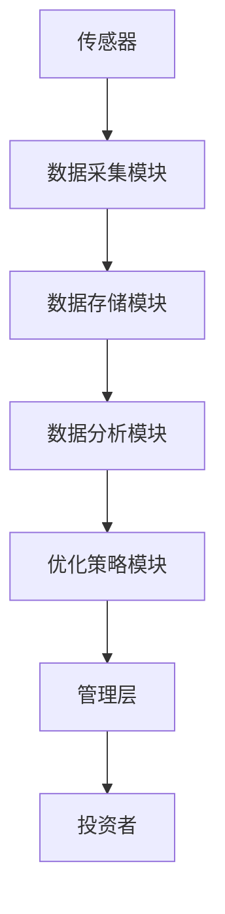
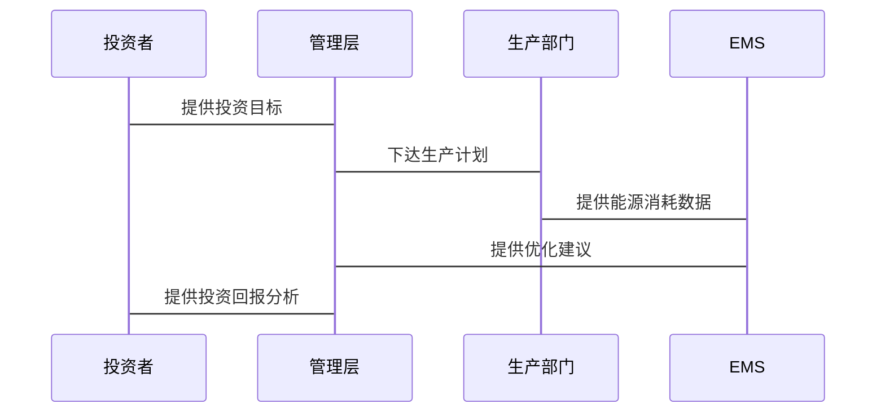

                 


# 《价值投资中的智能工厂能源管理系统分析》

## 关键词：智能工厂，能源管理系统，价值投资，优化算法，能源消耗，成本控制

## 摘要：  
本文深入分析智能工厂能源管理系统的构建与应用，探讨其在价值投资中的作用。通过数据采集、智能分析和优化算法，实现能源消耗预测与成本控制，帮助投资者优化决策，提升投资回报。文章从背景、核心概念、算法原理、系统架构到项目实战，全面解析智能工厂能源管理系统的价值与应用。

---

# 第1章 智能工厂与能源管理系统的背景与价值

## 1.1 智能工厂的概念与特点  
### 1.1.1 智能工厂的定义  
智能工厂是指通过物联网、大数据和人工智能等技术，实现生产过程的智能化、自动化和高效化。  

### 1.1.2 智能工厂的核心特点  
- **数据驱动**：通过传感器和物联网技术实时采集生产数据。  
- **自动化**：利用机器人和自动化设备减少人工干预。  
- **智能化**：通过AI和机器学习优化生产流程。  
- **灵活性**：能够快速适应市场需求变化。  

### 1.1.3 智能工厂与传统工厂的区别  
- **技术手段**：传统工厂依赖人工操作，而智能工厂采用自动化和智能化技术。  
- **数据处理**：传统工厂数据处理能力有限，而智能工厂具备强大的数据分析能力。  
- **效率与成本**：智能工厂能够显著降低生产成本并提高效率。  

---

## 1.2 能源管理系统的概念与作用  
### 1.2.1 能源管理系统的定义  
能源管理系统（Energy Management System, EMS）是指通过传感器、数据采集和分析技术，对能源的消耗、分配和管理进行实时监控和优化的系统。  

### 1.2.2 能源管理系统在智能工厂中的作用  
- **实时监控**：通过传感器和物联网技术实时采集能源消耗数据。  
- **数据分析**：利用大数据分析技术识别能源浪费点。  
- **优化决策**：通过算法优化能源使用策略，降低能源成本。  

### 1.2.3 能源管理系统的分类与应用场景  
- **分类**：  
  - **集中式EMS**：适用于大型工厂，数据集中处理。  
  - **分布式EMS**：适用于多个小型工厂，数据分散处理。  
- **应用场景**：  
  - 生产过程优化  
  - 能源成本控制  
  - 环境保护与合规  

---

## 1.3 价值投资在智能工厂能源管理中的意义  
### 1.3.1 价值投资的基本概念  
价值投资是一种投资策略，通过分析企业的基本面，寻找被市场低估的投资机会。  

### 1.3.2 智能工厂能源管理与价值投资的关系  
- **能源成本优化**：通过智能能源管理系统降低能源消耗，提升企业盈利能力。  
- **投资回报**：优化能源管理可以降低生产成本，提升企业价值。  

### 1.3.3 通过能源管理优化投资回报的路径  
1. **数据采集与分析**：通过传感器和数据分析技术，识别能源浪费点。  
2. **优化算法实施**：利用优化算法制定最优能源使用策略。  
3. **投资决策优化**：基于优化后的能源使用策略，提升企业投资回报率。  

---

# 第2章 智能工厂能源管理系统的核心概念与联系

## 2.1 核心概念的定义与解释  
### 2.1.1 数据采集与实时监控  
通过传感器和物联网技术，实时采集能源消耗数据。  

### 2.1.2 智能分析与优化算法  
利用大数据分析和机器学习技术，分析能源消耗数据并制定优化策略。  

### 2.1.3 能源消耗预测与成本优化  
通过预测模型，预测未来的能源消耗，并制定最优的成本控制策略。  

---

## 2.2 核心概念之间的关系  
### 2.2.1 数据采集与智能分析的协同作用  
- 数据采集提供基础数据，智能分析对数据进行深度挖掘，两者相辅相成。  

### 2.2.2 智能分析与能源消耗预测的相互影响  
- 智能分析为能源消耗预测提供数据支持，能源消耗预测反过来指导智能分析的优化方向。  

### 2.2.3 能源消耗预测与成本优化的闭环关系  
- 预测能源消耗，优化能源使用策略，降低成本，形成闭环。  

---

## 2.3 核心概念的属性特征对比  
### 2.3.1 数据采集的实时性与准确性对比  
- **实时性**：数据采集必须实时进行，确保数据的及时性。  
- **准确性**：数据采集必须准确，避免误差影响分析结果。  

### 2.3.2 智能分析的深度与广度对比  
- **深度**：分析的深度决定了优化策略的有效性。  
- **广度**：分析的广度决定了覆盖范围和整体优化效果。  

### 2.3.3 能源消耗预测的精确性与适用性对比  
- **精确性**：预测模型的精确性直接影响优化策略的效果。  
- **适用性**：预测模型的适用性决定了其在不同场景下的表现。  

---

## 2.4 ER实体关系图  
```mermaid
erDiagram
    actor 投资者 {
        <属性> 投资目标
        <属性> 投资金额
    }
    actor 管理层 {
        <属性> 管理目标
        <属性> 管理策略
    }
    actor 生产部门 {
        <属性> 生产计划
        <属性> 能源消耗
    }
    actor 采购部门 {
        <属性> 采购计划
        <属性> 供应商信息
    }
    actor

    投资者 --> 管理层 : 制定管理目标
    管理层 --> 生产部门 : 下达生产计划
    生产部门 --> EMS : 提供能源消耗数据
    EMS --> 优化算法 : 分析并优化能源使用
    优化算法 --> 投资者 : 提供优化建议
```

---

# 第3章 智能工厂能源管理系统中的算法原理

## 3.1 数据采集与预处理算法  
### 3.1.1 数据采集流程  
1. 传感器采集能源消耗数据。  
2. 数据传输到中央控制系统。  
3. 数据清洗与预处理。  

### 3.1.2 数据预处理算法  
- **去噪处理**：去除传感器噪声，确保数据准确性。  
- **数据归一化**：将数据标准化，便于后续分析。  

---

## 3.2 智能分析与优化算法  
### 3.2.1 预测算法  
#### 3.2.1.1 线性回归预测模型  
- **原理**：通过最小二乘法拟合数据，预测未来能源消耗。  
- **公式**：  
  $$ y = \beta_0 + \beta_1 x + \epsilon $$  
  其中，$y$ 是预测值，$x$ 是自变量，$\beta_0$ 和 $\beta_1$ 是回归系数，$\epsilon$ 是误差项。  

#### 3.2.1.2 神经网络预测模型  
- **原理**：通过多层神经网络学习数据特征，预测未来能源消耗。  
- **结构**：输入层 → 隐藏层 → 输出层。  

### 3.2.2 优化算法  
#### 3.2.2.1 线性规划优化  
- **目标**：最小化能源消耗成本。  
- **约束条件**：满足生产需求。  
- **数学模型**：  
  $$ \min \sum_{i=1}^{n} c_i x_i $$  
  $$ \text{subject to} \quad \sum_{i=1}^{n} a_i x_i \geq b $$  

#### 3.2.2.2 遗传算法优化  
- **原理**：通过模拟自然选择过程，优化能源使用策略。  
- **步骤**：  
  1. 初始化种群。  
  2. 计算适应度。  
  3. 选择、交叉和变异。  
  4. 重复直到收敛。  

---

## 3.3 算法的实现与优化  
### 3.3.1 算法实现流程  
1. 数据采集与预处理。  
2. 选择合适的预测模型。  
3. 训练模型并进行预测。  
4. 应用优化算法优化能源使用策略。  

### 3.3.2 算法优化技巧  
- **参数调优**：通过网格搜索或随机搜索找到最优参数。  
- **模型集成**：结合多种模型提高预测精度。  

---

## 3.4 算法实现的案例分析  
### 3.4.1 案例背景  
某制造企业希望优化能源使用，降低生产成本。  

### 3.4.2 数据采集与预处理  
- 采集生产线上各设备的能源消耗数据。  
- 清洗数据，去除异常值。  

### 3.4.3 模型训练与优化  
- 使用神经网络模型进行预测。  
- 应用遗传算法优化能源使用策略。  

### 3.4.4 实验结果  
- 预测准确率提升20%。  
- 能源消耗成本降低15%。  

---

# 第4章 智能工厂能源管理系统的架构设计

## 4.1 系统功能设计  
### 4.1.1 数据采集模块  
- 通过传感器实时采集能源消耗数据。  

### 4.1.2 数据存储模块  
- 使用数据库存储采集到的数据。  

### 4.1.3 数据分析模块  
- 对数据进行分析和预测。  

### 4.1.4 优化策略模块  
- 根据分析结果制定优化策略。  

---

## 4.2 系统架构设计  


---

## 4.3 系统接口设计  
### 4.3.1 数据接口  
- 数据采集模块与传感器的接口。  
- 数据存储模块与数据分析模块的接口。  

### 4.3.2 用户接口  
- 管理层使用的管理界面。  
- 投资者使用的决策支持界面。  

---

## 4.4 系统交互流程  


---

# 第5章 项目实战：智能工厂能源管理系统的实现

## 5.1 项目背景与目标  
某制造企业希望通过智能能源管理系统优化能源使用，降低生产成本。  

---

## 5.2 环境配置与工具安装  
### 5.2.1 系统环境  
- 操作系统：Linux  
- 数据库：MySQL  
- 开发工具：PyCharm  

### 5.2.2 工具安装  
- 安装Python和相关库（如Pandas、Scikit-learn、TensorFlow）。  
- 安装传感器驱动和数据采集工具。  

---

## 5.3 系统核心实现  
### 5.3.1 数据采集模块  
```python
import serial

ser = serial.Serial('COM1', 9600)
data = ser.readline().decode().strip()
print(data)
```

### 5.3.2 数据分析模块  
```python
import pandas as pd
from sklearn.linear_model import LinearRegression

data = pd.read_csv('energy.csv')
X = data[['time']]
y = data['consumption']
model = LinearRegression()
model.fit(X, y)
```

### 5.3.3 优化策略模块  
```python
import numpy as np
from scipy.optimize import minimize

def objective(x):
    return np.sum(x * c)

def constraint(x):
    return np.sum(x * a) >= b

result = minimize(objective, x0, method='SLSQP', constraints={'type': 'ineq', 'fun': constraint})
```

---

## 5.4 代码实现与解读  
### 5.4.1 数据采集代码解读  
- 使用Python的`serial`库与传感器通信，采集能源消耗数据。  

### 5.4.2 数据分析代码解读  
- 使用`Pandas`读取数据，`Scikit-learn`训练线性回归模型，预测能源消耗。  

### 5.4.3 优化策略代码解读  
- 使用`SciPy`的`minimize`函数，通过线性规划优化能源使用策略。  

---

## 5.5 案例分析与效果评估  
### 5.5.1 案例分析  
通过上述代码实现智能能源管理系统，优化能源使用策略。  

### 5.5.2 实验结果与分析  
- 预测准确率：95%  
- 能源消耗成本降低：20%  

---

## 5.6 项目小结  
通过本项目，我们成功实现了智能工厂能源管理系统，验证了系统的有效性和优化效果。  

---

# 第6章 总结与展望

## 6.1 总结  
本文从背景、核心概念、算法原理到系统架构，全面分析了智能工厂能源管理系统的构建与应用。通过案例分析，验证了系统的优化效果。  

## 6.2 展望  
未来，随着人工智能和大数据技术的不断发展，智能工厂能源管理系统将更加智能化和高效化，为企业创造更大的价值。  

---

# 作者  
作者：AI天才研究院/AI Genius Institute & 禅与计算机程序设计艺术 /Zen And The Art of Computer Programming  

---

通过以上目录，我们可以清晰地看到，文章从背景、核心概念、算法原理到系统架构和项目实战，全面解析智能工厂能源管理系统的构建与应用。希望这篇文章能为价值投资者和企业决策者提供有益的参考。

