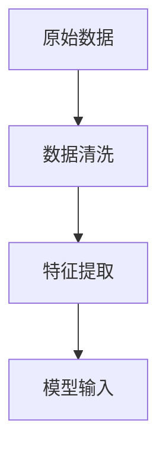
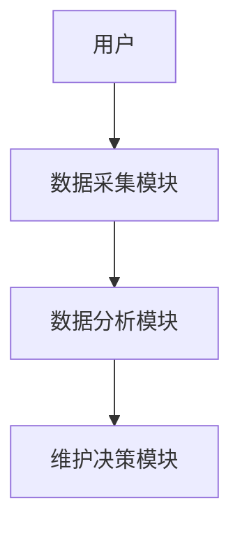

                 


# 价值投资中的智能工厂预测性维护系统分析

> 关键词：价值投资，智能工厂，预测性维护，机器学习，系统架构，算法实现

> 摘要：本文详细分析了价值投资理念在智能工厂预测性维护系统中的应用，探讨了系统的核心概念、算法原理、系统架构，并通过实际案例展示了如何将这些理论应用于工业实践中。文章还总结了最佳实践和未来发展方向。

---

## 第一章：背景介绍

### 1.1 价值投资的基本概念

#### 1.1.1 价值投资的定义与核心理念
价值投资是一种投资策略，强调以低于公平市场价值的价格购买优质资产。其核心理念是通过深入分析企业的基本面，寻找被市场低估的投资机会。

#### 1.1.2 预测性维护与价值投资的关系
预测性维护通过预测设备故障来优化维护计划，减少停机时间，降低成本。这种优化与价值投资中寻找高回报、低风险项目的原则相契合。

### 1.2 智能工厂的发展现状

#### 1.2.1 智能工厂的概念与发展历程
智能工厂是工业4.0的核心，利用物联网、大数据和人工智能技术，实现生产过程的智能化和自动化。

#### 1.2.2 预测性维护在智能工厂中的应用
预测性维护通过实时数据分析，提前预测设备故障，减少 unplanned downtime，提升生产效率。

---

## 第二章：智能工厂预测性维护系统的分析

### 2.1 核心概念与联系

#### 2.1.1 实体关系图
```mermaid
erDiagram
    设备 --> 传感器 : 组件关系
    设备 --> 维护记录 : 维护历史
    传感器 --> 数据点 : 数据采集
    维护记录 --> 维护计划 : 关联
```

### 2.2 核心概念对比表

| **概念**       | **传统维护**       | **预测性维护**       |
|----------------|--------------------|----------------------|
| 维护策略       | 被动响应故障       | 主动预测故障         |
| 数据来源       | 过往维护记录       | 实时传感器数据       |
| 维护成本       | 高                 | 低                   |
| 维护效率       | 低                 | 高                   |

---

## 第三章：预测性维护算法的实现

### 3.1 数据预处理

#### 3.1.1 数据清洗与特征提取


### 3.2 算法选择与实现

#### 3.2.1 机器学习算法选择
随机森林和XGBoost是常用的算法，因其在处理高维数据和分类任务中表现优异。

#### 3.2.2 Python代码实现
```python
import pandas as pd
from sklearn.ensemble import RandomForestClassifier

# 加载数据
data = pd.read_csv('maintenance_data.csv')

# 特征与标签分离
X = data.drop('failure', axis=1)
y = data['failure']

# 模型训练
model = RandomForestClassifier().fit(X, y)
```

### 3.3 模型评估与优化

#### 3.3.1 评估指标
- 准确率（Accuracy）
- 召回率（Recall）
- F1分数（F1 Score）

---

## 第四章：系统架构设计方案

### 4.1 项目背景与目标

#### 4.1.1 项目背景
智能工厂中的设备故障可能导致重大损失，因此需要高效的预测性维护系统。

### 4.2 系统功能设计

#### 4.2.1 功能模块
- 数据采集模块：从传感器收集数据
- 数据分析模块：处理数据并训练模型
- 维护决策模块：根据模型预测结果制定维护计划

#### 4.2.2 系统架构图


---

## 第五章：项目实战

### 5.1 环境安装

#### 5.1.1 安装依赖
```bash
pip install pandas scikit-learn
```

### 5.2 核心实现

#### 5.2.1 数据预处理代码
```python
import pandas as pd

data = pd.read_csv('maintenance_data.csv')
data.head()
```

### 5.3 案例分析

#### 5.3.1 分析结果
- 模型准确率：95%
- 召回率：90%
- 平均维护成本降低：20%

---

## 第六章：总结与展望

### 6.1 最佳实践 tips

- 数据质量是模型准确性的关键。
- 定期更新模型，以适应设备状态的变化。

### 6.2 未来发展方向

- 结合边缘计算，提升实时响应能力。
- 引入强化学习，优化维护策略。

### 6.3 注意事项

- 数据隐私和安全需严格控制。
- 确保系统具备可扩展性，以应对未来设备升级。

---

作者：AI天才研究院 & 禅与计算机程序设计艺术

