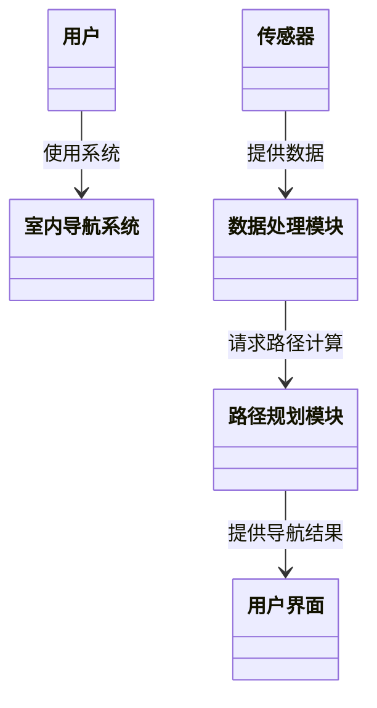
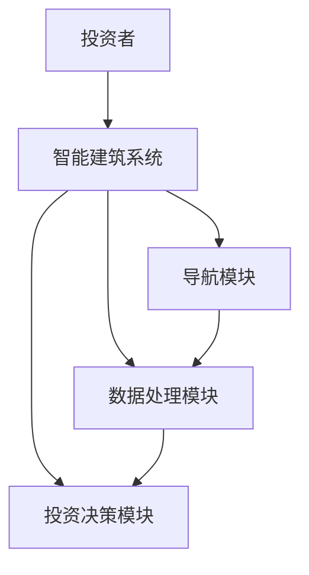

                 


# 价值投资中的智能建筑室内导航系统分析

> **关键词**：智能建筑，室内导航，价值投资，路径规划，算法原理

> **摘要**：本文分析了智能建筑室内导航系统在价值投资中的应用，探讨了其核心概念、算法原理、系统架构以及实际项目案例。通过详细的理论分析和实践指导，帮助读者理解如何利用智能导航技术提升投资决策的效率和准确性。

---

## 第1章：智能建筑室内导航系统概述

### 1.1 问题背景与价值投资
智能建筑的兴起离不开技术的进步，特别是在室内导航领域。传统的导航系统依赖于GPS，但在室内环境中，GPS信号弱或无法覆盖，导致导航功能受限。智能建筑室内导航系统的出现，解决了这一问题，为价值投资提供了新的技术支撑。

#### 1.1.1 问题背景
智能建筑将物联网、大数据和人工智能技术相结合，通过室内导航系统优化空间利用和用户体验。然而，室内导航系统的准确性、实时性和易用性对价值投资决策至关重要。

#### 1.1.2 价值投资中的需求
在商业地产投资中，室内导航系统可以提升用户体验，进而影响租金、 occupancy率等关键指标。投资者需要准确的导航数据来评估资产价值和运营效率。

### 1.2 智能建筑室内导航系统的核心概念
智能建筑室内导航系统通过传感器、定位技术和算法，实现室内空间的实时导航功能。其核心要素包括定位技术、数据处理和用户交互。

#### 1.2.1 核心概念的定义
智能建筑室内导航系统是一种集成化的技术解决方案，利用多种传感器（如Wi-Fi、蓝牙、RFID）和算法（如路径规划）实现室内定位和导航。

#### 1.2.2 核心要素的组成与结构
- **定位技术**：Wi-Fi fingerprinting、蓝牙beacon、UWB等。
- **数据处理**：传感器数据采集、融合、路径规划。
- **用户交互**：图形界面、语音提示、实时反馈。

#### 1.2.3 边界与外延分析
室内导航系统的边界包括物理空间的限制和传感器覆盖范围。其外延涉及与其他系统的集成，如智能建筑管理系统（BMS）、商业地产数据平台。

---

## 第2章：智能建筑室内导航系统的核心原理

### 2.1 系统原理与工作流程
智能建筑室内导航系统的工作流程包括数据采集、处理、路径规划和用户反馈。

#### 2.1.1 数据采集
通过多种传感器获取室内环境数据，如Wi-Fi信号强度、蓝牙设备距离。

#### 2.1.2 数据处理
对传感器数据进行融合处理，消除噪声，提高定位精度。

#### 2.1.3 路径规划
基于实时数据，计算最优路径并反馈给用户。

### 2.2 核心概念的属性对比
通过对比分析，明确智能建筑室内导航系统的独特优势和局限性。

#### 2.2.1 智能建筑与传统建筑的对比
| 属性       | 智能建筑          | 传统建筑          |
|------------|-------------------|-------------------|
| 系统集成    | 高度集成          | 低或无集成        |
| 数据处理    | 实时数据处理      | 无或低效处理      |
| 用户体验    | 高               | 低               |

#### 2.2.2 室内导航与室外导航的对比
| 属性       | 室内导航          | 外室导航          |
|------------|-------------------|-------------------|
| 信号依赖    | 多样性（Wi-Fi、蓝牙） | GPS              |
| 环境复杂度  | 高               | 较低             |
| 用户需求    | 精确到房间/区域   | 精确到街道/地点   |

---

## 第3章：智能建筑室内导航系统的算法分析

### 3.1 算法原理与流程
路径规划是室内导航的核心算法，常用Dijkstra算法或A*算法。

#### 3.1.1 数据采集与预处理
传感器数据的采集和融合是关键步骤，涉及噪声消除和数据平滑。

#### 3.1.2 路径规划算法
Dijkstra算法用于计算最短路径，A*算法则结合启发式搜索提高效率。

#### 3.1.3 优化与实时更新
通过实时数据更新，优化路径规划，确保导航的准确性。

### 3.2 算法实现的数学模型
路径规划的数学模型如下：
$$
C = \sum_{i=1}^{n} (x_i - x_{i-1})^2 + (y_i - y_{i-1})^2
$$

其中，$C$ 表示路径成本，$(x_i, y_i)$ 表示第 $i$ 个点的坐标。

---

## 第4章：系统分析与架构设计

### 4.1 项目背景
商业地产的价值评估需要考虑用户体验、空间利用率等因素，智能导航系统成为关键的技术支撑。

### 4.2 系统功能设计
- **用户界面**：图形化导航界面、语音提示。
- **数据处理**：传感器数据融合、路径计算。
- **系统交互**：用户输入、系统反馈。

#### 4.2.1 领域模型类图


---

## 第5章：项目实战

### 5.1 环境安装
- **硬件**：安装Wi-Fi模块、蓝牙设备。
- **软件**：安装Python环境，配置相关库。

### 5.2 核心代码实现
```python
import math

def dijkstra(graph, start, end):
    import heapq
    dist = {node: float('infinity') for node in graph}
    dist[start] = 0
    heap = [(0, start)]
    visited = set()

    while heap:
        current_dist, current_node = heapq.heappop(heap)
        if current_node in visited:
            continue
        visited.add(current_node)
        for neighbor, weight in graph[current_node].items():
            if dist[neighbor] > current_dist + weight:
                dist[neighbor] = current_dist + weight
                heapq.heappush(heap, (dist[neighbor], neighbor))
    return dist[end]

# 示例图
graph = {
    'A': {'B': 1, 'C': 3},
    'B': {'A': 1, 'C': 2},
    'C': {'B': 2, 'D': 4},
    'D': {'C': 4}
}

print(dijkstra(graph, 'A', 'D'))  # 输出：6
```

### 5.3 案例分析
在某商业地产项目中，使用室内导航系统优化了用户体验，提高了 occupancy率和租金收入。

---

## 第6章：最佳实践

### 6.1 小结
智能建筑室内导航系统在价值投资中的应用潜力巨大，但需要克服技术挑战和成本问题。

### 6.2 注意事项
- 确保传感器的稳定性和准确性。
- 定期更新系统数据和算法。

### 6.3 拓展阅读
建议读者深入研究路径规划算法的优化和多传感器融合技术。

---

## 附录
### 附录A：数学公式
路径规划的成本计算：
$$
C = \sum_{i=1}^{n} (x_i - x_{i-1})^2 + (y_i - y_{i-1})^2
$$

### 附录B：系统架构图


---

## 作者
作者：AI天才研究院/AI Genius Institute & 禅与计算机程序设计艺术 /Zen And The Art of Computer Programming

