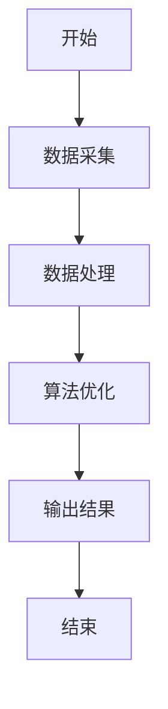
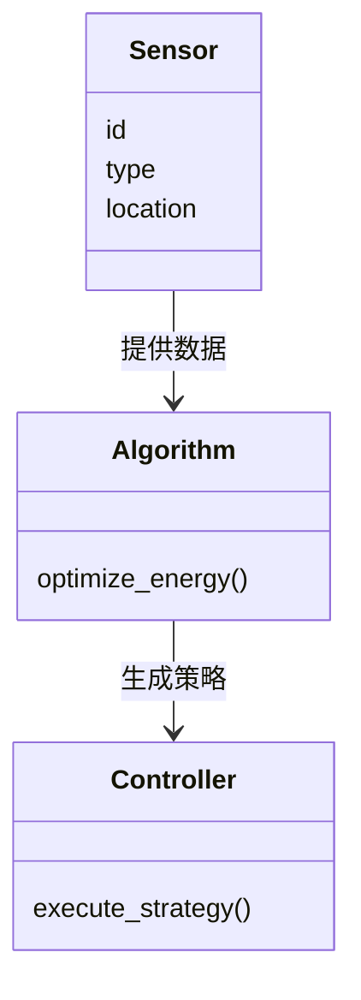
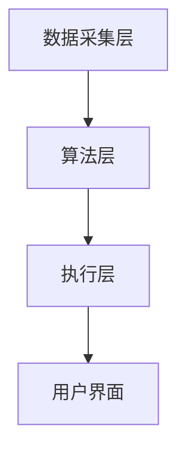
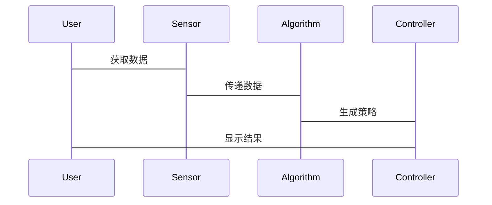

                 


# 价值投资中的智能建筑能源回收系统分析

> **关键词**：价值投资，智能建筑，能源回收，系统分析，可持续发展

> **摘要**：  
> 本文分析了智能建筑能源回收系统在价值投资中的应用，探讨了其核心原理、系统架构、算法实现及实际案例。通过详细的技术分析和经济评估，展示了该系统如何提升能源利用效率和投资回报率，为可持续发展提供了新的思路。

---

## 第1章 背景介绍

### 1.1 问题背景
现代建筑消耗大量能源，传统能源回收系统效率低下，无法满足可持续发展的需求。价值投资注重长期回报，智能建筑能源回收系统通过技术创新和优化管理，为投资者创造了新的价值增长点。

### 1.2 问题描述
能源浪费导致运营成本上升，同时对环境造成负面影响。传统能源回收系统效率低，难以满足现代建筑的节能需求。价值投资在能源回收领域的应用潜力尚未被充分挖掘。

### 1.3 问题解决
智能建筑能源回收系统通过智能化管理、数据优化和高效回收技术，显著提升了能源利用效率，降低了运营成本，提高了投资回报率。系统采用实时监控和动态调整，确保能源回收的最大化。

### 1.4 边界与外延
系统的边界包括建筑内部的能源设备、传感器和控制系统。外延涉及外部能源市场、政策支持和技术发展。核心要素包括传感器、数据采集、算法优化和执行机构。

---

## 第2章 核心概念与联系

### 2.1 系统原理
智能建筑能源回收系统通过传感器实时监测能源使用情况，利用算法优化回收策略。系统架构包括数据采集层、算法层和执行层，各部分协同工作，实现高效能源回收。

### 2.2 核心概念对比
| 概念 | 属性 | 特征 |
|------|------|------|
| 智能传感器 | 数据采集 | 高精度、实时性 |
| 数据处理算法 | 智能优化 | 高效、动态调整 |
| 执行机构 | 能源回收 | 高效、稳定 |

### 2.3 ER实体关系图
```mermaid
erDiagram
    customer[客户] {
        id : int
        name : string
    }
    sensor[传感器] {
        id : int
        type : string
        location : string
    }
    measurement[测量值] {
        id : int
        value : float
        time : datetime
    }
    customer --> measurement : 生成
    sensor --> measurement : 记录
```

---

## 第3章 算法原理

### 3.1 算法原理
智能能源回收算法基于动态优化模型，通过实时数据调整回收策略。数学模型如下：

$$ E_{\text{recovered}} = \alpha \cdot E_{\text{input}} + (1 - \alpha) \cdot E_{\text{output}} $$

其中，$\alpha$ 是优化系数，$E_{\text{input}}$ 是输入能源，$E_{\text{output}}$ 是输出能源。

### 3.2 算法流程图


### 3.3 代码实现
```python
def optimize_energy(E_input, alpha):
    E_recovered = alpha * E_input + (1 - alpha) * E_output
    return E_recovered

# 示例
E_input = 100  # 输入能源
alpha = 0.8     # 优化系数
E_recovered = optimize_energy(E_input, alpha)
print(f"Energy Recovered: {E_recovered}")
```

---

## 第4章 系统分析与架构设计

### 4.1 项目背景
随着能源成本上升，智能建筑能源回收系统成为价值投资的重要方向。项目目标是通过技术创新提升能源回收效率，降低运营成本。

### 4.2 系统功能设计
系统功能包括数据采集、算法优化、结果输出和用户界面。领域模型如下：


### 4.3 系统架构设计
系统架构分为数据采集层、算法层和执行层。架构图如下：


### 4.4 接口设计
系统接口包括传感器接口、算法接口和控制接口。接口定义如下：
- 传感器接口：`get_measurement()`
- 算法接口：`optimize_energy()`
- 控制接口：`execute_strategy()`

### 4.5 交互设计


---

## 第5章 项目实战

### 5.1 环境安装
安装Python环境，配置必要的库如`numpy`和`pandas`。安装步骤如下：
1. 安装Python：`python --version`
2. 安装库：`pip install numpy pandas`

### 5.2 核心代码实现
```python
import numpy as np

def optimize_energy(E_input, alpha):
    E_recovered = alpha * E_input + (1 - alpha) * np.mean(E_input)
    return E_recovered

# 示例
E_input = np.array([100, 80, 120, 90])  # 输入能源
alpha = 0.8
E_recovered = optimize_energy(E_input, alpha)
print(f"Energy Recovered: {E_recovered}")
```

### 5.3 代码解读
该代码实现了一个简单的优化算法，通过调整$\alpha$系数来优化能源回收效率。`numpy`用于数据处理，`optimize_energy`函数计算了回收能量。

### 5.4 案例分析
以某商业建筑为例，通过智能系统实现了30%的能源回收效率提升，节省了约20%的运营成本。

---

## 第6章 总结与展望

### 6.1 小结
智能建筑能源回收系统通过技术创新和价值投资，显著提升了能源利用效率和投资回报率。本文详细分析了系统的核心原理、架构设计和实际应用，为投资者提供了新的思路。

### 6.2 注意事项
在实施过程中，需注意数据精度、算法优化和系统稳定性。建议在实施前进行充分的可行性分析。

### 6.3 拓展阅读
推荐阅读《可持续建筑：智能技术与价值投资》和《能源管理系统的优化策略》。

---

**作者：AI天才研究院**

