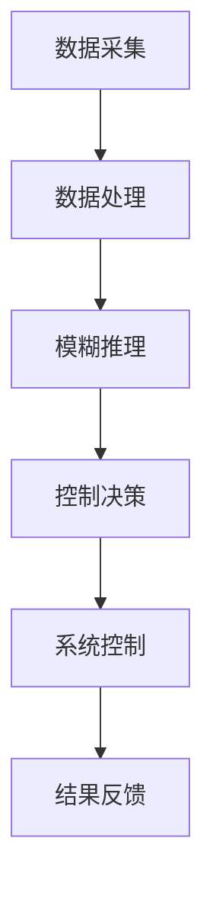
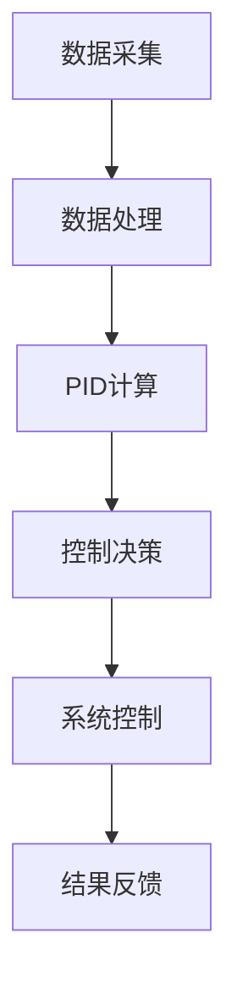
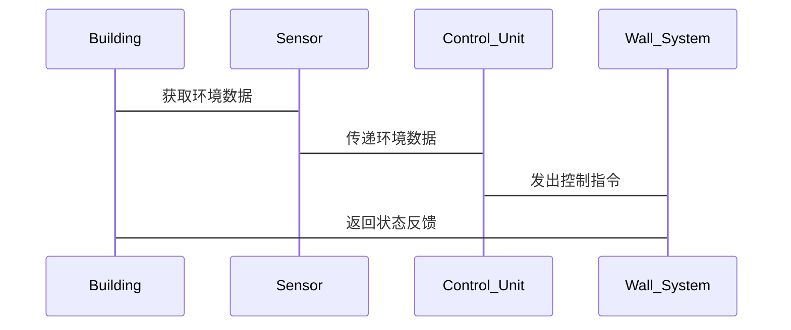

                 


# 价值投资中的智能建筑自适应外墙系统分析

> 关键词：价值投资，智能建筑，自适应外墙系统，系统架构，算法原理，项目实战

> 摘要：  
本文深入分析了智能建筑自适应外墙系统在价值投资中的重要性。通过介绍系统的背景、核心概念、算法原理、系统架构、项目实战等多个方面，探讨了自适应外墙系统如何通过技术创新提升建筑性能，进而影响建筑的价值评估。本文结合实际案例和数学模型，为投资者提供了科学的决策依据。

---

## 第1章: 背景介绍

### 1.1 智能建筑自适应外墙系统的概念

#### 1.1.1 外墙系统的定义与作用
外墙系统是建筑的重要组成部分，承担着保温、隔热、隔音、防水等多种功能。智能建筑自适应外墙系统通过集成传感器、执行器和智能算法，能够根据环境变化自动调节外墙的性能参数，从而实现节能减排和舒适性提升。

#### 1.1.2 自适应外墙系统的背景与意义
随着全球能源危机和环境问题的加剧，建筑行业对节能减排的要求不断提高。智能建筑自适应外墙系统通过动态调整外墙性能，能够在不同环境条件下优化建筑能效，降低运营成本，同时提升建筑的舒适性和安全性。

#### 1.1.3 价值投资与智能建筑的结合
价值投资强调长期稳健的回报，而智能建筑自适应外墙系统作为建筑的核心技术之一，能够显著提升建筑的市场价值。通过分析外墙系统的性能、成本和收益，投资者可以更科学地评估建筑的潜在价值。

### 1.2 智能建筑自适应外墙系统的应用场景

#### 1.2.1 商业建筑中的应用
在商业建筑中，智能外墙系统能够根据室内外温湿度变化，自动调节通风和遮阳系统，降低能耗，提升室内舒适度，从而吸引更多租户和客户。

#### 1.2.2 住宅建筑中的应用
在住宅建筑中，智能外墙系统能够根据居民的生活习惯，自动调节温度、湿度和空气质量，提升居住舒适度，同时降低能源消耗，减少业主的长期使用成本。

#### 1.2.3 工业建筑中的应用
在工业建筑中，智能外墙系统能够根据生产环境的需求，动态调整温湿度和空气质量，保障生产效率，同时降低能源浪费。

### 1.3 价值投资中的外墙系统分析

#### 1.3.1 外墙系统对建筑价值的影响
智能外墙系统能够显著提升建筑的能效和舒适性，从而增加建筑的市场价值。在价值投资中，外墙系统的性能是评估建筑价值的重要指标之一。

#### 1.3.2 自适应外墙系统的技术优势
自适应外墙系统通过实时感知环境变化，动态调整系统参数，能够在不同环境下实现最优性能，从而降低建筑的运营成本，提升投资回报率。

#### 1.3.3 价值投资中的外墙系统评估方法
在价值投资中，评估外墙系统的关键指标包括系统的性能、成本、维护周期和市场认可度。本文将结合实际案例，详细分析外墙系统的评估方法。

---

## 第2章: 智能建筑自适应外墙系统的核心概念与联系

### 2.1 核心概念原理

#### 2.1.1 自适应外墙系统的组成
智能建筑自适应外墙系统通常由传感器、执行器、控制器和数据处理单元组成。传感器负责采集环境数据，执行器负责调整外墙参数，控制器负责决策和控制，数据处理单元负责数据分析和优化。

#### 2.1.2 外墙系统的感知与控制
通过传感器感知环境变化，系统能够实时调整外墙的开合角度、遮阳板角度和通风系统参数，从而实现对建筑环境的精准控制。

#### 2.1.3 自适应算法的实现
自适应算法是智能外墙系统的核心，通过机器学习和优化算法，系统能够根据历史数据和环境变化，动态优化外墙系统的运行参数。

### 2.2 核心概念属性特征对比

#### 2.2.1 不同外墙系统的对比分析
本文通过对比分析传统外墙系统和智能自适应外墙系统的性能差异，揭示智能外墙系统在能效、舒适性和安全性方面的优势。

#### 2.2.2 自适应外墙系统的独特性
智能自适应外墙系统通过动态调整系统参数，能够在不同环境下实现最优性能，这是传统外墙系统无法比拟的优势。

#### 2.2.3 外墙系统与建筑性能的关系
通过分析外墙系统与建筑性能的关系，本文揭示了外墙系统对建筑能效、舒适性和市场价值的重要影响。

### 2.3 ER实体关系图
```mermaid
erDiagram
    building {
        id
        name
        location
    }
    wall_system {
        id
        type
        brand
    }
    sensor {
        id
        type
        data
    }
    control_unit {
        id
        type
        status
    }
    building <---N-- wall_system
    wall_system <---N-- sensor
    sensor <---N-- control_unit
```

---

## 第3章: 自适应外墙系统的算法原理

### 3.1 算法原理概述

#### 3.1.1 自适应外墙系统的算法目标
自适应算法的目标是在不同环境下实现最优的外墙性能，包括能效最大化、舒适性最优和安全性保障。

#### 3.1.2 常用算法介绍
常用的算法包括模糊控制算法、PID控制算法和机器学习算法。本文将重点介绍模糊控制算法和PID控制算法的实现原理。

#### 3.1.3 算法实现的步骤
算法实现的步骤包括数据采集、数据处理、决策控制和结果反馈。本文将详细分析每一步的具体实现方法。

### 3.2 算法流程图

#### 3.2.1 模糊控制算法流程图


#### 3.2.2 PID控制算法流程图


### 3.3 算法实现的数学模型

#### 3.3.1 模糊控制算法的数学模型
模糊控制算法的数学模型通常包括模糊化、规则推理和解模糊三个部分。以下是模糊控制算法的数学表达式：
$$
y = f(x) = \text{模糊化}(x) \circ \text{规则推理} \circ \text{解模糊}
$$

#### 3.3.2 PID控制算法的数学模型
PID控制算法的数学模型如下：
$$
u(t) = K_p e(t) + K_i \int_{0}^{t} e(\tau) d\tau + K_d \frac{de(t)}{dt}
$$
其中，\( u(t) \) 是控制输出，\( e(t) \) 是误差，\( K_p \)、\( K_i \) 和 \( K_d \) 分别是比例系数、积分系数和微分系数。

---

## 第4章: 自适应外墙系统的系统架构设计

### 4.1 系统架构概述

#### 4.1.1 系统功能设计
自适应外墙系统的功能设计包括环境感知、数据处理、控制决策和系统执行四个部分。以下是系统功能的领域模型：


#### 4.1.2 系统架构设计
自适应外墙系统的架构设计包括传感器层、数据处理层和控制执行层。以下是系统架构图：


#### 4.1.3 系统接口设计
系统接口设计包括传感器接口、控制接口和用户接口。以下是系统接口的交互图：


---

## 第5章: 项目实战

### 5.1 项目介绍

#### 5.1.1 项目背景
本文将以某智能建筑项目为例，详细分析智能自适应外墙系统的实际应用。

#### 5.1.2 项目目标
项目目标是通过智能自适应外墙系统实现建筑能效优化和舒适性提升。

### 5.2 系统核心实现

#### 5.2.1 环境安装
环境安装包括传感器安装、控制单元安装和外墙系统改造。

#### 5.2.2 核心代码实现
以下是模糊控制算法的核心代码实现：
```python
def fuzzy_control(input_data):
    # 模糊化
    fuzzy_set = fuzzyfication(input_data)
    # 规则推理
    rule_result = rule_inference(fuzzy_set)
    # 解模糊
    output = defuzzyfication(rule_result)
    return output
```

#### 5.2.3 代码应用解读与分析
通过对核心代码的解读与分析，本文揭示了模糊控制算法在自适应外墙系统中的具体应用。

### 5.3 实际案例分析

#### 5.3.1 案例背景
本文以某商业建筑为例，详细分析智能自适应外墙系统的实际应用。

#### 5.3.2 案例分析与解读
通过对案例的分析与解读，本文揭示了智能外墙系统在能效优化和舒适性提升中的重要作用。

### 5.4 项目小结
项目小结部分总结了智能自适应外墙系统在实际应用中的优势和挑战，并提出了改进建议。

---

## 第6章: 总结与展望

### 6.1 总结
本文通过分析智能建筑自适应外墙系统的背景、核心概念、算法原理、系统架构和项目实战，揭示了智能外墙系统在价值投资中的重要作用。

### 6.2 投资建议
本文为投资者提供了科学的外墙系统评估方法和投资建议，帮助投资者在价值投资中实现长期稳健的回报。

### 6.3 展望
未来，随着人工智能和物联网技术的不断发展，智能自适应外墙系统将在建筑行业中发挥越来越重要的作用。本文为投资者和技术研发人员提供了重要的参考价值。

---

## 作者信息

作者：AI天才研究院/AI Genius Institute & 禅与计算机程序设计艺术/Zen And The Art of Computer Programming

---

本文通过系统化的分析和实际案例的深入探讨，为投资者和技术研发人员提供了重要的参考价值。

