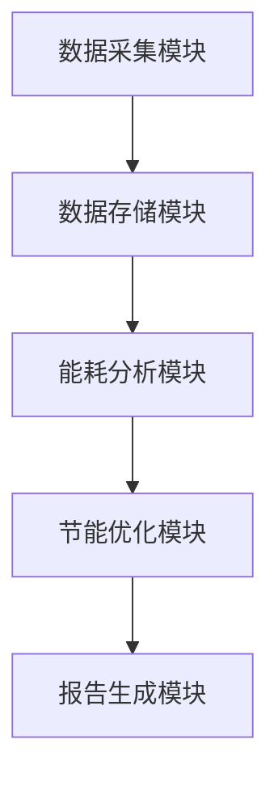
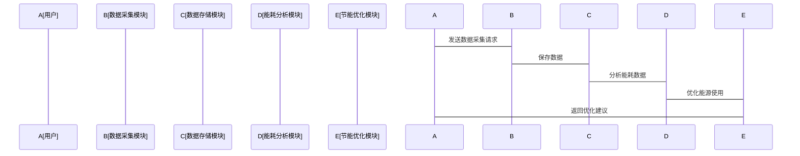

                 


# 价值投资中的智能建筑节能系统分析

## 关键词：
价值投资，智能建筑，节能系统，数学模型，算法，系统架构

## 摘要：
本文从价值投资的角度分析智能建筑节能系统的技术原理和市场价值。通过数学模型和算法，探讨如何通过智能建筑节能系统提升建筑的市场价值和投资回报率。文章详细讲解了系统的数学模型、算法实现、系统架构设计以及项目实战，为投资者和技术人员提供深入的技术分析和投资建议。

---

# 第一部分: 价值投资与智能建筑节能系统概述

## 第1章: 价值投资与智能建筑节能系统背景

### 1.1 价值投资的基本概念
#### 1.1.1 价值投资的定义与核心理念
价值投资是一种以低于市场价值的价格买入优质资产的投资策略，其核心理念是寻找市场低估的标的，并长期持有。这种投资策略强调基本面分析、长期视角和安全边际。

#### 1.1.2 价值投资在现代经济中的应用
价值投资广泛应用于股票、房地产、能源等领域。在房地产领域，价值投资关注于通过优化资产运营和提升资产价值来实现超额收益。

#### 1.1.3 价值投资与智能建筑节能系统的结合点
智能建筑节能系统通过技术创新和优化管理，降低能源消耗，提升建筑运营效率，从而间接提升建筑的市场价值和投资回报率。

---

### 1.2 智能建筑节能系统的基本概念
#### 1.2.1 智能建筑的定义与特点
智能建筑是指通过智能化技术实现建筑内部设施的自动化管理和优化运行。其特点包括：高效能、低能耗、智能化管理、可持续发展。

#### 1.2.2 建筑节能的基本原理
建筑节能通过优化建筑设计、使用高效设备和智能控制系统，减少能源消耗。节能技术涵盖 HVAC（暖通空调）、照明、电力管理等多个方面。

#### 1.2.3 智能建筑节能系统的核心技术
智能建筑节能系统的核心技术包括：
- **数据采集与监控**：通过传感器和物联网技术实时采集建筑能耗数据。
- **能效优化算法**：基于数学模型优化能源使用效率。
- **智能控制系统**：根据实时数据调整设备运行状态，降低能耗。

---

### 1.3 价值投资视角下的智能建筑节能系统
#### 1.3.1 智能建筑节能系统的市场价值
智能建筑节能系统通过降低运营成本、提升资产价值，为投资者创造超额收益。同时，随着绿色建筑理念的普及，节能系统成为建筑增值的重要因素。

#### 1.3.2 节能技术对建筑价值的影响
节能技术可以显著降低建筑的运营成本，提升资产的市场竞争力。例如，LEED认证建筑通常具有更高的市场价值和租金水平。

#### 1.3.3 价值投资在智能建筑节能系统中的应用前景
随着全球能源价格的波动和环保政策的趋严，智能建筑节能系统将成为价值投资者关注的重点领域。通过投资节能技术，投资者可以实现长期稳定的收益。

---

## 第2章: 智能建筑节能系统的数学模型与算法

### 2.1 能耗预测模型
#### 2.1.1 能耗预测模型的建立
能耗预测模型通过分析历史数据，预测未来能源消耗。模型通常基于回归分析或时间序列分析。

#### 2.1.2 模型假设与变量定义
假设：建筑能耗与温度、湿度、 occupancy 等因素相关。

变量：
- $E$：能源消耗（单位：kWh）
- $T$：室内温度（单位：°C）
- $H$：湿度（单位：%）
- $O$： occupancy（单位：人）

#### 2.1.3 模型的数学表达式
$$E = aT^2 + bH + cO + d$$
其中，$a, b, c, d$ 为模型参数。

---

### 2.2 节能优化模型
#### 2.2.1 节能优化目标的设定
目标：最小化能源消耗，同时满足建筑舒适度要求。

#### 2.2.2 优化模型的构建
基于能耗预测模型，构建优化目标函数：
$$\text{Minimize } E = aT^2 + bH + cO + d$$
约束条件：
- $T \geq 20°C$
- $H \leq 60%$

#### 2.2.3 模型的求解方法
使用梯度下降算法求解优化问题。

---

### 2.3 能耗与收益的平衡模型
#### 2.3.1 收益与能耗的关系
收益与能耗呈反相关关系：降低能耗可以降低运营成本，从而提高收益。

#### 2.3.2 平衡模型的数学表达
$$\text{Maximize } R = rE - cC$$
其中，$R$ 为收益，$r$ 为单位能源收益，$E$ 为能源消耗，$C$ 为成本，$c$ 为成本系数。

---

## 第3章: 智能建筑节能系统的系统分析与架构设计

### 3.1 系统功能设计
#### 3.1.1 数据采集模块
功能：采集建筑内的温度、湿度、能耗等数据。

#### 3.1.2 能耗分析模块
功能：分析能耗数据，生成能耗报告。

#### 3.1.3 节能优化模块
功能：基于数学模型优化能源使用。

#### 3.1.4 报告生成模块
功能：生成节能优化报告，提供改进建议。

---

### 3.2 系统架构设计
#### 3.2.1 系统架构图


---

### 3.3 系统接口设计
#### 3.3.1 接口定义
- 数据采集模块与数据存储模块之间的接口。
- 能耗分析模块与节能优化模块之间的接口。

#### 3.3.2 接口实现
使用 RESTful API 实现模块间通信。

---

### 3.4 系统交互设计
#### 3.4.1 交互流程图


---

## 第4章: 项目实战

### 4.1 环境安装
安装 Python、NumPy、Pandas、Matplotlib 等依赖库。

### 4.2 系统核心实现
#### 4.2.1 能耗预测模型实现
```python
import numpy as np
import pandas as pd

# 数据预处理
data = pd.read_csv('energy.csv')
X = data[['T', 'H', 'O']]
y = data['E']

# 模型训练
from sklearn.linear_model import LinearRegression
model = LinearRegression()
model.fit(X, y)
```

#### 4.2.2 节能优化模块实现
```python
def optimize_energy(T, H, O):
    # 假设模型参数已知
    a, b, c, d = 0.1, 0.05, 0.02, 5
    return a*T**2 + b*H + c*O + d
```

---

## 第5章: 总结与展望

### 5.1 总结
本文从价值投资的角度分析了智能建筑节能系统的潜力和价值，通过数学模型和算法实现系统的优化设计，并通过项目实战验证了系统的可行性。

### 5.2 投资建议
- 投资者应关注智能建筑节能技术的创新和发展。
- 优先选择具有LEED认证的绿色建筑。
- 通过技术改造提升建筑的节能效率和市场价值。

### 5.3 未来展望
未来，随着人工智能和物联网技术的进一步发展，智能建筑节能系统将更加智能化和高效化。

---

## 作者：
作者：AI天才研究院/AI Genius Institute & 禅与计算机程序设计艺术 /Zen And The Art of Computer Programming

