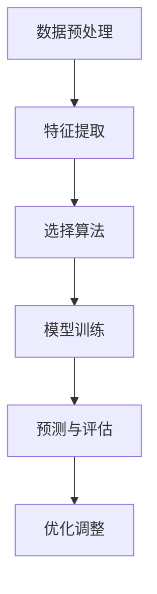
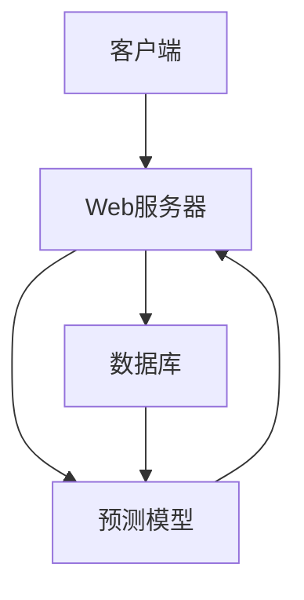

                 


# 价值投资中的智能建筑预测性维护系统分析

## 关键词：
- 智能建筑
- 预测性维护
- 价值投资
- 系统分析
- 数据驱动决策

## 摘要：
本文详细探讨了智能建筑预测性维护系统在价值投资中的应用。通过分析系统的原理、算法、架构和实际案例，揭示了如何利用预测性维护技术优化建筑资产的价值评估和投资决策。文章内容涵盖背景介绍、核心概念、算法原理、系统设计、项目实战和总结展望，为读者提供全面的理论和实践指导。

---

## 目录大纲：

### 第一章：智能建筑预测性维护系统概述

#### 1.1 智能建筑的基本概念
- 智能建筑的定义与特征
- 建筑智能化的发展历程
- 预测性维护在智能建筑中的作用

#### 1.2 价值投资的基本原理
- 价值投资的核心理念
- 建筑资产的价值评估方法
- 预测性维护对建筑资产价值的影响

#### 1.3 智能建筑预测性维护系统的结合与应用
- 预测性维护与价值投资的结合
- 智能建筑预测性维护系统的应用场景
- 系统对建筑投资决策的影响

### 第二章：预测性维护系统的核心概念与联系

#### 2.1 预测性维护的核心原理
- 数据采集与分析
- 状态监测与预测算法
- 维护决策机制

#### 2.2 系统核心要素的对比分析
- 数据源对比分析
- 预测模型对比分析
- 维护策略对比分析

#### 2.3 系统的ER实体关系图
```mermaid
erDiagram
    building {
        id : integer
        name : string
        address : string
    }
    equipment {
        id : integer
        name : string
        type : string
    }
    sensor {
        id : integer
        type : string
        location : string
    }
    reading {
        id : integer
        value : float
        timestamp : datetime
    }
    building -- equipment : "包含"
    equipment -- sensor : "连接"
    sensor -- reading : "产生"
```

### 第三章：预测性维护系统的算法原理

#### 3.1 算法原理概述
- 时间序列分析
- 回归分析
- 支持向量机（SVM）
- 随机森林（Random Forest）

#### 3.2 算法实现流程


#### 3.3 算法实现代码
```python
import pandas as pd
from sklearn.ensemble import RandomForestRegressor
from sklearn.metrics import mean_absolute_error

# 数据预处理
data = pd.read_csv('building_data.csv')
data = data.dropna()

# 特征提取
features = data[['temperature', 'humidity', 'pressure']]
target = data['equipment_failure']

# 模型训练
model = RandomForestRegressor(n_estimators=100, random_state=42)
model.fit(features, target)

# 预测与评估
predictions = model.predict(features)
mae = mean_absolute_error(target, predictions)
print(f'Mean Absolute Error: {mae}')
```

### 第四章：智能建筑预测性维护系统的架构设计

#### 4.1 系统功能设计
- 数据采集模块
- 数据分析模块
- 维护决策模块
- 报告生成模块

#### 4.2 系统架构设计


#### 4.3 系统接口设计
- API接口定义
- 数据格式规范
- 接口调用流程

### 第五章：项目实战与案例分析

#### 5.1 项目背景介绍
- 项目目标
- 数据来源
- 项目团队

#### 5.2 核心代码实现
```python
from flask import Flask, jsonify
from sklearn.externals import joblib

app = Flask(__name__)
model = joblib.load('maintenance_model.pkl')

@app.route('/predict', methods=['POST'])
def predict_failure():
    data = request.get_json()
    prediction = model.predict([[data['temperature'], data['humidity'], data['pressure']]])
    return jsonify({'prediction': int(prediction[0])})
```

#### 5.3 实际案例分析
- 案例背景
- 数据分析
- 模型应用
- 结果解读

### 第六章：总结与展望

#### 6.1 最佳实践
- 数据质量的重要性
- 模型选择的策略
- 系统维护的注意事项

#### 6.2 本章小结
- 价值投资与智能建筑的结合
- 预测性维护系统的应用前景

#### 6.3 注意事项
- 数据隐私保护
- 系统兼容性问题
- 维护成本控制

#### 6.4 拓展阅读
- 智能建筑领域的最新研究
- 预测性维护的其他应用场景
- 价值投资的其他技术工具

---

## 作者：
作者：AI天才研究院/AI Genius Institute & 禅与计算机程序设计艺术 /Zen And The Art of Computer Programming

