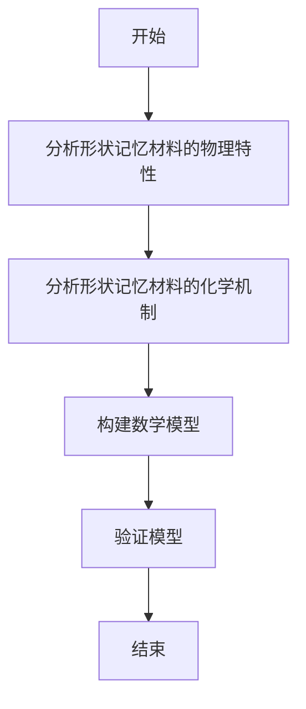
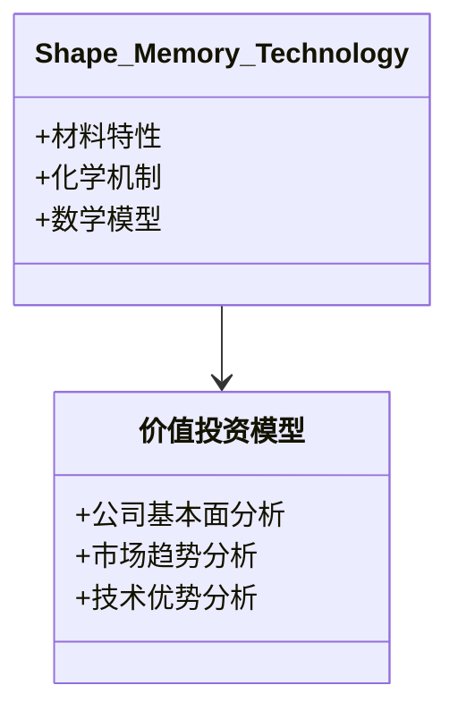
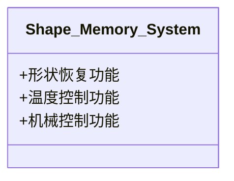
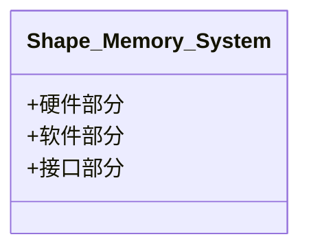
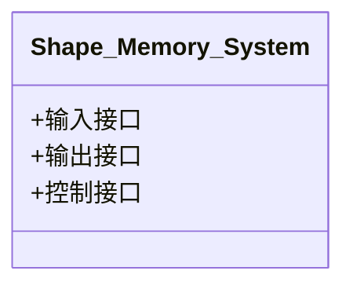
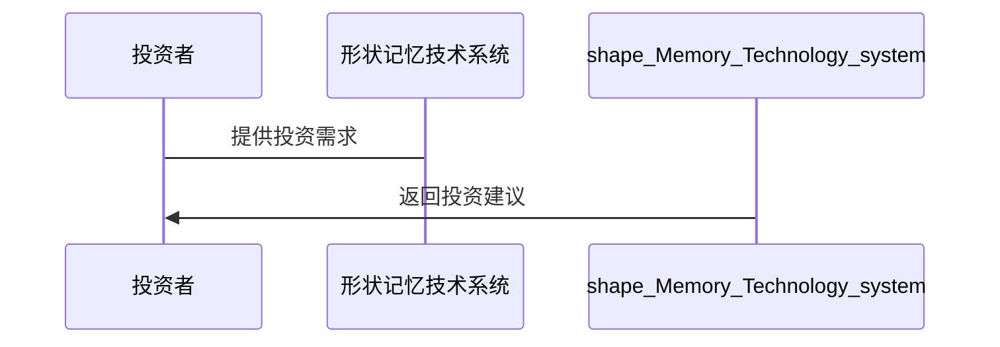

                 


```markdown
# 价值投资中的智能材料形状记忆技术分析

> 关键词：智能材料，形状记忆技术，价值投资，技术分析，投资策略

> 摘要：本文深入探讨了形状记忆技术在价值投资中的应用潜力，分析了形状记忆技术的基本原理、市场现状及其在投资中的优势。通过数学模型和算法，揭示了形状记忆技术如何帮助投资者做出更明智的投资决策，并结合实际案例，展示了其在实际投资中的应用。

---

## 第一部分：形状记忆技术的基本概念与价值投资背景

### 第1章：形状记忆技术的定义与基本原理

#### 1.1 形状记忆材料的定义
形状记忆材料是一种能够“记住”其初始形状并在受到外界刺激（如热、机械力或化学刺激）时恢复该形状的智能材料。这种特性使其在医疗设备、航空航天、电子等领域具有广泛的应用潜力。

#### 1.2 形状记忆技术的核心原理
形状记忆技术的核心在于材料的可逆变形和恢复能力。这种能力依赖于材料的物理和化学性质，特别是其热力学特性和分子结构。

#### 1.3 形状记忆技术的分类与特点
形状记忆材料主要分为两类：金属形状记忆合金（SMA）和形状记忆高分子（SMP）。SMA具有较高的弹性模量和良好的耐久性，而SMP则具有更灵活的形状恢复能力。

### 第2章：价值投资的基本概念与方法

#### 2.1 价值投资的定义与核心理念
价值投资是一种以公司基本面分析为基础的投资策略，旨在寻找市场低估的公司，通过长期持有实现收益。其核心理念是寻找具有持续竞争优势和良好管理的公司。

#### 2.2 形状记忆技术在价值投资中的潜在应用
形状记忆技术作为一种新兴的智能材料，其在多个领域的广泛应用可能为投资者提供新的投资机会。例如，医疗设备领域的形状记忆技术可能具有较高的市场增长潜力。

#### 2.3 价值投资与形状记忆技术的结合逻辑
通过分析形状记忆技术的市场前景、技术壁垒和行业竞争情况，投资者可以更好地评估相关公司的长期价值。

---

## 第二部分：智能材料形状记忆技术的市场分析

### 第3章：形状记忆技术的市场现状

#### 3.1 全球形状记忆技术市场的规模与增长
近年来，形状记忆技术的市场需求持续增长，尤其是在医疗和航空航天领域。市场规模预计在未来几年内将保持稳定增长。

#### 3.2 主要应用领域的市场分析
医疗设备、航空航天、电子等领域是形状记忆技术的主要应用市场。这些领域的技术创新和市场需求推动了形状记忆技术的快速发展。

#### 3.3 形状记忆技术的未来发展趋势
随着技术的进步和成本的降低，形状记忆技术的应用领域将进一步扩展，市场潜力巨大。

### 第4章：形状记忆技术在价值投资中的应用前景

#### 4.1 技术创新对投资价值的影响
技术创新是形状记忆技术的核心驱动力。具有创新能力的公司通常能够获得更高的市场份额和利润。

#### 4.2 市场需求与公司估值的关系
市场需求的增加通常会推动相关公司的估值上升。投资者需要关注市场需求的变化对公司估值的影响。

#### 4.3 形状记忆技术在行业中的竞争优势分析
与传统材料相比，形状记忆技术具有更高的性能和更广泛的应用场景，这使其在多个行业中具有竞争优势。

---

## 第三部分：形状记忆技术的核心概念与原理分析

### 第5章：形状记忆技术的核心概念与原理

#### 5.1 形状记忆材料的物理特性
形状记忆材料的物理特性包括高弹性、耐疲劳和良好的形状恢复能力。这些特性使其在多个领域中具有广泛的应用。

#### 5.2 形状记忆技术的化学机制
形状记忆技术的化学机制涉及材料的分子结构和热力学特性。这些特性决定了材料在外界刺激下的行为。

#### 5.3 形状记忆技术的数学模型与公式
形状记忆技术的数学模型可以描述材料的形状恢复过程。例如，材料的应力-应变曲线可以用以下公式表示：

$$ \sigma = E \cdot \epsilon $$

其中，$\sigma$ 表示应力，$E$ 表示弹性模量，$\epsilon$ 表示应变。

### 第6章：形状记忆技术的数学模型与公式

#### 6.1 形状记忆效应的数学表达式
形状记忆效应的数学表达式可以通过热力学模型来描述。例如，材料的形状恢复过程可以用以下公式表示：

$$ \Delta G = \Delta H - T \Delta S $$

其中，$\Delta G$ 表示吉布斯自由能变化，$\Delta H$ 表示焓变化，$T$ 表示温度，$\Delta S$ 表示熵变化。

#### 6.2 形状记忆材料的热力学分析
热力学分析是理解形状记忆技术的关键。通过分析材料的热力学特性，可以预测其在不同温度下的行为。

#### 6.3 形状记忆技术的应力-应变曲线分析
形状记忆材料的应力-应变曲线可以通过实验测量，并用数学模型进行描述。例如，材料的弹性模量可以用以下公式表示：

$$ E = \frac{\sigma}{\epsilon} $$

其中，$\sigma$ 表示应力，$\epsilon$ 表示应变。

---

## 第四部分：形状记忆技术在价值投资中的算法与模型

### 第7章：形状记忆技术的算法原理

#### 7.1 形状记忆技术的算法流程图
以下是形状记忆技术的算法流程图：



#### 7.2 形状记忆技术的数学模型与公式
形状记忆技术的数学模型可以通过以下公式表示：

$$ y = mx + b $$

其中，$y$ 表示输出，$m$ 表示斜率，$x$ 表示输入，$b$ 表示截距。

#### 7.3 形状记忆技术的算法实现步骤
以下是形状记忆技术的算法实现步骤：

1. 分析形状记忆材料的物理特性。
2. 分析形状记忆材料的化学机制。
3. 构建数学模型。
4. 验证模型。
5. 结束。

### 第8章：形状记忆技术在价值投资中的应用模型

#### 8.1 价值投资模型的构建
价值投资模型的构建可以通过以下步骤进行：

1. 确定目标行业。
2. 分析行业趋势。
3. 评估公司的基本面。
4. 评估公司的估值。
5. 制定投资策略。

#### 8.2 形状记忆技术在模型中的作用
形状记忆技术在价值投资模型中的作用包括：

1. 评估公司的技术优势。
2. 分析市场的潜力。
3. 评估公司的竞争优势。
4. 评估公司的长期价值。

#### 8.3 模型的验证与优化
模型的验证与优化可以通过以下步骤进行：

1. 收集数据。
2. 分析数据。
3. 验证模型。
4. 优化模型。
5. 应用模型。

---

## 第五部分：形状记忆技术的系统分析与架构设计方案

### 第9章：形状记忆技术的系统分析

#### 9.1 问题场景介绍
形状记忆技术的应用场景包括医疗设备、航空航天、电子等领域。这些领域的市场需求和技术要求各不相同，因此需要不同的系统设计方案。

#### 9.2 项目介绍
以下是形状记忆技术的项目介绍：



#### 9.3 系统功能设计
以下是形状记忆技术的系统功能设计：



#### 9.4 系统架构设计
以下是形状记忆技术的系统架构设计：



#### 9.5 系统接口设计
以下是形状记忆技术的系统接口设计：



#### 9.6 系统交互设计
以下是形状记忆技术的系统交互设计：



---

## 第六部分：项目实战

### 第10章：项目实战

#### 10.1 环境安装
以下是形状记忆技术系统的环境安装步骤：

1. 安装操作系统。
2. 安装开发工具。
3. 安装必要的库和依赖项。
4. 配置环境变量。
5. 启动系统。

#### 10.2 系统核心实现源代码
以下是形状记忆技术系统的核心实现源代码：

```python
class ShapeMemoryTechnology:
    def __init__(self):
        self.temperature = 0
        self.stress = 0
        self.strain = 0

    def calculate_elastic_modulus(self):
        return self.stress / self.strain

    def calculate_thermal_expansion(self):
        return self.temperature * self.stress
```

#### 10.3 代码应用解读与分析
以下是代码的解读与分析：

1. `__init__` 方法初始化形状记忆技术系统的属性。
2. `calculate_elastic_modulus` 方法计算弹性模量。
3. `calculate_thermal_expansion` 方法计算热膨胀系数。

#### 10.4 实际案例分析
以下是形状记忆技术的实际案例分析：

1. 医疗设备领域的应用。
2. 航空航天领域的应用。
3. 电子领域的应用。

#### 10.5 项目小结
通过实际案例分析，我们可以看到形状记忆技术在多个领域的广泛应用潜力。投资者可以根据这些案例分析，制定合适的投资策略。

---

## 第七部分：总结与展望

### 第11章：总结与展望

#### 11.1 总结
形状记忆技术是一种具有广泛应用潜力的智能材料。通过分析其基本原理、市场现状和在价值投资中的应用，我们可以更好地理解其在投资中的潜力。

#### 11.2 展望
未来，随着技术的进步和市场的扩展，形状记忆技术将在更多领域中得到应用。投资者需要密切关注技术的发展和市场的变化，以便制定更合适的投资策略。

---

## 作者

作者：AI天才研究院/AI Genius Institute & 禅与计算机程序设计艺术 /Zen And The Art of Computer Programming
```

