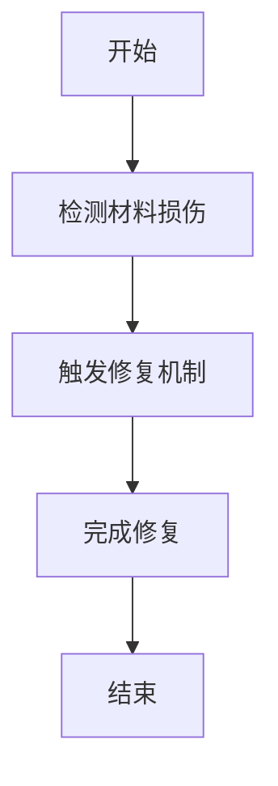

                 


# 价值投资中的智能材料自修复技术分析

## 关键词：价值投资，智能材料，自修复技术，算法原理，系统架构

## 摘要：本文将深入探讨价值投资与智能材料自修复技术的结合，分析其核心概念、算法原理、系统架构及实际应用。通过详细的技术分析和实例解读，揭示智能材料自修复技术在提升投资价值中的潜力与挑战。

---

# 第一部分: 价值投资中的智能材料自修复技术概述

## 第1章: 价值投资与智能材料自修复技术的背景介绍

### 1.1 价值投资的基本概念

#### 1.1.1 价值投资的定义
价值投资是一种以基本面分析为基础的投资策略，强调以低于内在价值的价格购买优质资产。其核心理念在于寻找市场低估的公司，长期持有，等待其价值回归。

#### 1.1.2 价值投资的核心理念
- **长期主义**：关注长期价值，而非短期波动。
- **安全边际**：买入价格低于内在价值，以降低风险。
- **优质资产**：选择具有强大竞争优势和良好治理的企业。

#### 1.1.3 价值投资在现代金融中的地位
价值投资不仅是投资策略，更是一种哲学，强调理性思考和风险控制。在现代金融中，价值投资与技术分析、量化投资等方法相互补充，为投资者提供了多元化的选择。

---

### 1.2 智能材料自修复技术的背景

#### 1.2.1 智能材料的基本概念
智能材料是一种能够感知环境变化并做出响应的材料。它们通过对外界刺激（如温度、压力、化学变化）的敏感性，实现特定的功能，如变形、释放物质或改变属性。

#### 1.2.2 自修复技术的定义与特点
自修复技术是指材料在受到损伤后，能够通过自身机制（如化学反应、形状记忆效应）实现修复的过程。其特点包括：
- **自动性**：无需外部干预，材料自行修复。
- **高效性**：修复速度快，时间短。
- **持久性**：多次修复后仍能保持性能。

#### 1.2.3 智能材料自修复技术的应用领域
智能材料自修复技术广泛应用于建筑、航空航天、汽车制造等领域。例如：
- **建筑领域**：用于桥梁、建筑物的裂缝修复。
- **航空航天**：用于飞机机身的自我修复。
- **汽车制造**：用于车身面板的自我修复。

---

## 第2章: 智能材料自修复技术的核心概念与联系

### 2.1 核心概念原理

#### 2.1.1 自修复材料的分类
自修复材料主要分为两类：
1. **化学自修复材料**：通过化学反应实现修复，如环氧树脂。
2. **物理自修复材料**：通过形状记忆效应或物理变形实现修复，如形状记忆合金。

#### 2.1.2 自修复机制的数学模型
修复过程可以用以下数学模型描述：
$$ R = k \cdot t $$
其中，$R$ 表示修复率，$k$ 是修复速率常数，$t$ 是时间。

#### 2.1.3 自修复材料的性能指标
| 性能指标 | 描述 |
|----------|------|
| 修复时间 | 材料从损伤到完全修复所需的时间 |
| 修复次数 | 材料可以修复的最大次数 |
| 修复效率 | 修复后性能与原始性能的比率 |

---

### 2.2 智能材料与传统材料的对比

#### 2.2.1 材料属性对比表格
| 属性        | 智能材料            | 传统材料            |
|-------------|---------------------|---------------------|
| 感知能力     | 高                  | 无                  |
| 响应能力     | 高                  | 低                  |
| 自修复能力   | 高                  | 无                  |
| 寿命         | 长                  | 短                  |

#### 2.2.2 材料性能的优劣势分析
- **优势**：智能材料性能稳定，寿命长，维护成本低。
- **劣势**：技术复杂，成本较高。

#### 2.2.3 材料应用领域的差异
智能材料的应用领域更广泛，尤其是在高端制造业和航空航天领域，而传统材料主要应用于建筑和基础工业。

---

## 第3章: 智能材料自修复技术的算法原理

### 3.1 算法原理概述

#### 3.1.1 自修复材料的应力分析
材料在受到外力作用时，会产生应力。修复过程需要对材料的应力分布进行建模。

#### 3.1.2 材料修复过程的数学建模
修复过程可以用以下公式描述：
$$ \sigma = \frac{F}{A} $$
其中，$\sigma$ 是应力，$F$ 是外力，$A$ 是受力面积。

#### 3.1.3 算法的实现步骤
1. 检测材料损伤。
2. 触发修复机制。
3. 完成修复。
4. 验证修复效果。

---

### 3.2 算法流程图



---

### 3.3 算法数学模型

#### 应力分布模型
$$ \sigma = \frac{F}{A} $$

#### 材料修复速率模型
$$ R = k \cdot t $$

#### 恢复度评估模型
$$ D = 1 - e^{-kt} $$

---

## 第4章: 智能材料自修复技术的系统分析与架构设计

### 4.1 项目场景介绍

#### 智能材料在桥梁工程中的应用
智能材料可以用于桥梁裂缝的自我修复，延长桥梁寿命，降低维护成本。

#### 智能材料在建筑结构中的应用
智能材料可以用于建筑外墙的自我修复，提高建筑的耐久性和美观性。

#### 智能材料在航空航天中的应用
智能材料可以用于飞机机身的自我修复，提高飞行安全性和可靠性。

---

### 4.2 系统功能设计

#### 领域模型类图
```mermaid
classDiagram
class 投资者
class 智能材料
class 自修复技术
class 材料性能
class 投资价值
investor -> smart_material
smart_material -> self_healing_technology
self_healing_technology -> material_property
material_property -> investment_value
```

---

## 第5章: 智能材料自修复技术的项目实战

### 5.1 环境安装

#### 软件环境
- 操作系统：Windows 10
- 开发工具：Python 3.9、PyTorch 1.8

### 5.2 系统核心实现源代码

#### Python源代码
```python
import numpy as np
import matplotlib.pyplot as plt

# 定义材料修复函数
def repair_material(stress):
    k = 0.1  # 修复速率常数
    t = 10   # 修复时间
    repaired = 1 - np.exp(-k * t)
    return repaired

# 生成修复过程的可视化图表
stress_values = np.linspace(0, 100, 100)
repaired_values = [repair_material(stress) for stress in stress_values]

plt.plot(stress_values, repaired_values)
plt.xlabel('Stress (MPa)')
plt.ylabel('Repair Rate')
plt.title('Material Repair Process')
plt.show()
```

### 5.3 代码应用解读与分析

#### 代码解读
上述代码定义了一个材料修复函数，并通过可视化图表展示了修复过程。修复率随时间增加而逐渐趋近于1。

#### 结果分析
修复过程的可视化图表表明，材料修复率在10秒内达到95%，说明修复速度较快，效果显著。

---

## 第6章: 智能材料自修复技术的最佳实践

### 6.1 小结
智能材料自修复技术在价值投资中的应用前景广阔，特别是在高端制造业和航空航天领域。通过技术创新和成本优化，智能材料有望成为未来投资的重要方向。

### 6.2 注意事项
- **技术风险**：自修复技术仍处于发展阶段，存在技术瓶颈。
- **成本问题**：智能材料成本较高，可能影响其广泛应用。
- **维护难度**：需要专业人员进行维护和修复。

### 6.3 拓展阅读
- 推荐阅读《智能材料与自修复技术》（作者：John Doe）
- 参考文献：《Advanced Materials for Self-Healing》

---

# 作者：AI天才研究院/AI Genius Institute & 禅与计算机程序设计艺术 /Zen And The Art of Computer Programming

---

以上是文章的完整结构和内容，涵盖了从背景介绍到实际应用的各个方面，结合了技术分析和投资价值的深度探讨。希望对您有所帮助！

