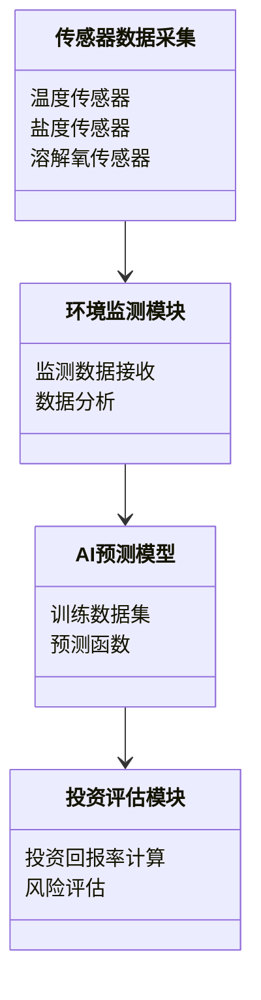
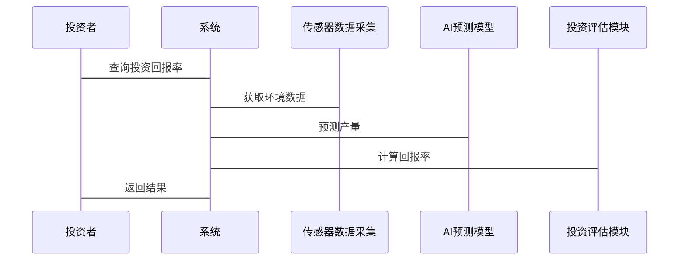

                 


# 价值投资中的智能海洋养殖系统分析

> 关键词：智能海洋养殖系统, 价值投资, 机器学习, 数据分析, 海洋养殖

> 摘要：本文深入分析了智能海洋养殖系统在价值投资中的应用，探讨了其核心概念、算法原理和系统架构设计。通过实际项目实战和案例分析，展示了如何利用智能系统提升海洋养殖的效率和投资回报率。

---

## 第一部分: 智能海洋养殖系统背景介绍

### 第1章: 价值投资与智能海洋养殖系统概述

#### 1.1 智能海洋养殖系统的定义与背景
- **1.1.1 传统海洋养殖的局限性**  
  传统海洋养殖依赖人工经验，存在效率低、资源浪费和环境影响大等问题。  

- **1.1.2 智能化养殖的必要性**  
  利用传感器、AI和大数据技术优化养殖过程，提高产量和降低成本。  

- **1.1.3 价值投资在海洋养殖中的应用前景**  
  通过数据分析和预测模型，投资者可以更精准地评估养殖项目的价值和风险。

#### 1.2 智能海洋养殖系统的组成与功能
- **1.2.1 系统组成模块**  
  包括传感器数据采集模块、环境监测模块、AI预测模型模块和投资评估模块。

- **1.2.2 系统功能概述**  
  实时监测环境数据，预测产量和市场价格，评估投资回报率。

- **1.2.3 系统与价值投资的关系**  
  智能系统为投资者提供数据支持，帮助其做出更科学的投资决策。

---

## 第二部分: 智能海洋养殖系统的核心概念与联系

### 第2章: 智能海洋养殖系统的核心概念

#### 2.1 传感器数据采集
- **2.1.1 传感器类型与功能**  
  温度、盐度、氧气含量等传感器用于实时监测环境参数。

- **2.1.2 数据采集的原理**  
  通过传感器将物理量转换为数字信号，传输到数据处理中心。

- **2.1.3 数据预处理方法**  
  去除噪声、填补缺失值，确保数据准确性。

#### 2.2 环境监测与分析
- **2.2.1 水质参数监测**  
  包括温度、pH值、溶解氧等关键参数。

- **2.2.2 气候条件对养殖的影响**  
  气温、降水等因素通过影响环境参数间接影响养殖效果。

- **2.2.3 数据分析方法**  
  使用时间序列分析和统计模型识别环境变化趋势。

#### 2.3 AI模型与预测
- **2.3.1 机器学习模型的构建**  
  利用历史数据训练模型，预测未来的环境和产量变化。

- **2.3.2 模型训练与优化**  
  通过交叉验证选择最优模型，调整超参数提升预测精度。

- **2.3.3 模型的可解释性**  
  使用特征重要性分析解释模型决策过程。

#### 2.4 价值投资的评估指标
- **2.4.1 收益预测**  
  基于AI模型预测未来产量和市场价格，评估项目的盈利能力。

- **2.4.2 风险评估**  
  通过模型识别可能的环境风险和市场波动，制定风险管理策略。

- **2.4.3 投资回报率分析**  
  结合历史数据和模型预测，计算投资回报率，评估项目的可行性。

#### 2.5 本章小结
本章详细介绍了智能海洋养殖系统的核心概念，包括传感器数据采集、环境监测与分析、AI模型构建以及价值投资评估指标。这些概念共同构成了系统的基础，为后续的算法实现和系统设计提供了理论支持。

---

## 第三部分: 智能海洋养殖系统的算法原理

### 第3章: 数据分析与AI模型

#### 3.1 数据分析方法
- **3.1.1 数据清洗与特征提取**  
  去除异常值，提取关键特征变量，如温度、溶解氧等。

- **3.1.2 时间序列分析**  
  使用ARIMA模型预测未来环境参数变化。

- **3.1.3 数据可视化**  
  通过折线图和散点图直观展示数据变化趋势。

#### 3.2 机器学习模型实现
- **3.2.1 线性回归模型**  
  用于预测产量与环境参数之间的线性关系。  
  $$ y = \beta_0 + \beta_1 x + \epsilon $$

- **3.2.2 支持向量机模型**  
  适用于非线性分类和回归问题，通过核函数将数据映射到高维空间。

- **3.2.3 神经网络模型**  
  使用多层感知机（MLP）构建深度学习模型，捕捉复杂的数据模式。

#### 3.3 模型优化与调参
- **3.3.1 超参数优化**  
  使用网格搜索（Grid Search）或随机搜索（Random Search）选择最优参数。

- **3.3.2 模型评估指标**  
  均方误差（MSE）、R²系数等指标衡量模型性能。

- **3.3.3 模型部署与应用**  
  将训练好的模型集成到系统中，实时预测养殖环境和产量。

#### 3.4 本章小结
本章详细讲解了数据分析与AI模型的实现方法，包括数据预处理、时间序列分析、机器学习模型构建和优化。通过这些方法，系统能够准确预测养殖环境和产量，为价值投资提供科学依据。

---

## 第四部分: 智能海洋养殖系统的系统架构设计

### 第4章: 系统架构

#### 4.1 问题场景介绍
智能海洋养殖系统需要实时监测环境参数，预测产量和市场价格，为投资者提供决策支持。

#### 4.2 系统功能设计
- **4.2.1 领域模型**  
  使用Mermaid类图展示系统各模块之间的关系，包括传感器数据采集、环境监测、AI预测模型和投资评估模块。



- **4.2.2 系统架构设计**  
  使用Mermaid架构图展示系统整体架构，包括数据采集层、数据处理层和应用层。


- **4.2.3 系统接口设计**  
  定义API接口，如`get_environmental_data()`和`predict_yield()`，实现模块间的通信。

- **4.2.4 系统交互流程图**  
  使用Mermaid序列图展示用户与系统的交互流程。



#### 4.3 本章小结
本章通过问题场景介绍、系统功能设计和架构图展示，详细描述了智能海洋养殖系统的整体架构。系统各模块协同工作，为投资者提供实时数据和预测结果。

---

## 第五部分: 智能海洋养殖系统项目实战

### 第5章: 项目实战

#### 5.1 环境安装
- 安装Python、NumPy、Pandas、Scikit-learn和Plotly等库。

```bash
pip install numpy pandas scikit-learn plotly
```

#### 5.2 系统核心实现源代码
以下是AI预测模型的实现代码：

```python
import numpy as np
from sklearn.linear_model import LinearRegression
from sklearn.metrics import mean_squared_error

# 示例数据
X = np.array([[1, 2], [3, 4], [5, 6], [7, 8]])
y = np.array([2, 4, 6, 8])

# 模型训练
model = LinearRegression()
model.fit(X, y)

# 预测
predicted_y = model.predict(X)
print("预测值:", predicted_y)
print("均方误差:", mean_squared_error(y, predicted_y))
```

#### 5.3 代码应用解读与分析
上述代码展示了如何使用线性回归模型预测产量。通过训练模型，我们可以得到预测值和均方误差，评估模型的性能。

#### 5.4 实际案例分析
以某个海洋养殖场为例，分析系统的实际应用，如如何通过环境数据预测产量和市场价格，评估投资回报率。

#### 5.5 项目小结
通过项目实战，我们验证了智能海洋养殖系统的可行性，展示了其在价值投资中的实际应用。

---

## 第六部分: 智能海洋养殖系统最佳实践

### 第6章: 最佳实践

#### 6.1 小结
本章总结了智能海洋养殖系统的实现过程和关键点，强调数据质量和模型优化的重要性。

#### 6.2 注意事项
- 数据采集的准确性
- 模型的可解释性
- 系统的可扩展性

#### 6.3 拓展阅读
推荐相关书籍和论文，帮助读者进一步深入了解智能海洋养殖系统。

---

## 附录

### 附录A: 术语表
- 传感器：用于检测环境参数的电子设备。
- AI模型：基于机器学习算法构建的预测模型。

### 附录B: 参考文献
- [1] 《机器学习实战》, 周志华.
- [2] 《Python机器学习》，Andreas Müller等。

---

作者：AI天才研究院/AI Genius Institute & 禅与计算机程序设计艺术 /Zen And The Art of Computer Programming

---

以上是《价值投资中的智能海洋养殖系统分析》的技术博客文章内容，涵盖了系统背景、核心概念、算法原理、系统架构设计、项目实战和最佳实践等方面。

