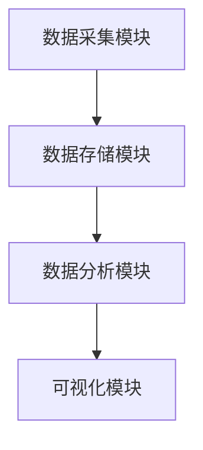

                 


---

# 价值投资中的智能海洋塑料污染监测系统分析

> **关键词**: 价值投资、智能监测、海洋塑料污染、数据分析、算法优化

> **摘要**: 本文从价值投资的角度，深入分析智能海洋塑料污染监测系统的构建与优化。通过技术与投资的结合，探讨如何利用智能系统实现对海洋塑料污染的有效监测，并从商业和技术创新两个维度，评估其投资价值和市场潜力。

---

# 第一部分: 价值投资中的智能海洋塑料污染监测系统背景介绍

## 第1章: 智能海洋塑料污染监测系统概述

### 1.1 问题背景与问题描述

#### 1.1.1 海洋塑料污染的现状与挑战
海洋塑料污染已成为全球性的环境问题，每年有数百万吨塑料垃圾进入海洋，对海洋生态系统造成严重威胁。这些塑料垃圾不仅危害海洋生物，还通过食物链对人体健康造成潜在影响。传统的海洋污染监测方法存在效率低、成本高、覆盖范围有限等问题，难以应对日益严峻的污染挑战。

#### 1.1.2 智能监测系统的需求与目标
智能海洋塑料污染监测系统的出现，旨在利用人工智能、大数据等技术，实现对海洋塑料污染的实时监测、数据采集、分析和预警。通过智能化手段，可以大幅提高监测效率，降低成本，并扩大监测范围。

#### 1.1.3 价值投资视角下的问题解决路径
从价值投资的角度来看，智能监测系统的建设和优化需要兼顾技术和商业两个维度。通过分析系统的功能需求、技术实现、市场前景和投资回报，我们可以找到最优的投资策略，实现技术和商业的双重成功。

### 1.2 智能监测系统的核心要素

#### 1.2.1 数据采集与处理
数据采集是智能监测系统的核心环节，包括使用传感器、摄像头、卫星遥感等多种手段，实时采集海洋环境中的塑料污染数据。数据处理则需要对采集到的海量数据进行清洗、归一化和存储，为后续分析提供高质量的数据支持。

#### 1.2.2 数据分析与建模
通过机器学习和深度学习算法，对数据进行分析和建模，识别塑料污染的分布规律、发展趋势和潜在风险。模型的输出结果为后续的监测和治理提供科学依据。

#### 1.2.3 可视化与决策支持
将分析结果以直观的方式呈现，帮助决策者快速理解数据，并制定有效的治理策略。可视化工具需要结合实际需求，提供多样化的数据展示方式，如地图、图表等。

---

## 第2章: 智能海洋塑料污染监测系统的核心概念与联系

### 2.1 核心概念原理

#### 2.1.1 数据采集技术
数据采集技术是智能监测系统的基础，包括传感器、摄像头、卫星遥感等多种手段。传感器可以实时监测海洋环境的物理参数，如温度、盐度、浊度等；摄像头可以捕捉海洋中的塑料垃圾图像；卫星遥感则可以覆盖更大的监测范围。

#### 2.1.2 数据分析算法
数据分析算法是智能监测系统的核心，包括机器学习、深度学习等技术。常用的算法有支持向量机（SVM）、随机森林（Random Forest）、卷积神经网络（CNN）等。这些算法可以帮助我们从海量数据中提取有用的信息，并预测塑料污染的趋势。

#### 2.1.3 可视化工具
可视化工具是智能监测系统的输出端，用于将分析结果以直观的方式呈现。常用工具包括Tableau、Power BI、Matplotlib等。通过可视化，我们可以更好地理解数据，并制定有效的治理策略。

### 2.2 概念属性对比表

| 概念                | 属性            | 描述                                                                 |
|---------------------|-----------------|----------------------------------------------------------------------|
| 数据采集技术        | 方法            | 传感器、摄像头、卫星遥感                                             |
| 数据分析算法        | 算法            | 支持向量机（SVM）、随机森林（Random Forest）、卷积神经网络（CNN）       |
| 可视化工具          | 工具            | Tableau、Power BI、Matplotlib                                       |

### 2.3 ER实体关系图

```mermaid
erd
    MarinePollutionMonitoringSystem {
        id: string
        name: string
        description: string
    }
    DataCollector {
        id: string
        type: string
        location: string
    }
    AnalysisAlgorithm {
        id: string
        name: string
        version: string
    }
    VisualizationTool {
        id: string
        name: string
        type: string
    }
    MarinePollutionMonitoringSystem --> DataCollector: 使用
    MarinePollutionMonitoringSystem --> AnalysisAlgorithm: 集成
    MarinePollutionMonitoringSystem --> VisualizationTool: 配置
```

---

## 第3章: 智能海洋塑料污染监测系统的算法原理

### 3.1 算法原理概述

#### 3.1.1 机器学习算法
机器学习算法是智能监测系统的核心，常用算法包括支持向量机（SVM）、随机森林（Random Forest）等。这些算法可以帮助我们从海量数据中提取有用的信息，并预测塑料污染的趋势。

#### 3.1.2 深度学习算法
深度学习算法，如卷积神经网络（CNN），可以用于图像识别和分类。通过训练CNN模型，我们可以识别海洋中的塑料垃圾，并预测其分布规律。

### 3.2 算法实现步骤

#### 3.2.1 数据预处理
数据预处理是算法实现的第一步，包括数据清洗、归一化和特征提取。例如，我们可以使用Python的Pandas库进行数据清洗，使用Scikit-learn库进行特征提取。

#### 3.2.2 模型训练
模型训练是算法实现的核心步骤，包括选择合适的算法、训练模型并评估其性能。例如，我们可以使用Scikit-learn库训练随机森林模型，并使用交叉验证评估其性能。

#### 3.2.3 模型部署
模型部署是算法实现的最后一步，包括将训练好的模型部署到生产环境，并实时接收数据进行预测。例如，我们可以使用Flask框架部署一个RESTful API，接收实时数据并返回预测结果。

### 3.3 算法代码示例

```python
# 使用随机森林算法进行分类
from sklearn.ensemble import RandomForestClassifier
from sklearn.model_selection import train_test_split
import pandas as pd

# 加载数据
data = pd.read_csv('marine_pollution_data.csv')

# 分割数据
X = data.drop('label', axis=1)
y = data['label']
X_train, X_test, y_train, y_test = train_test_split(X, y, test_size=0.2, random_state=42)

# 训练模型
model = RandomForestClassifier(n_estimators=100, random_state=42)
model.fit(X_train, y_train)

# 评估模型
score = model.score(X_test, y_test)
print(f'模型准确率: {score}')
```

### 3.4 数学公式与模型解析

#### 3.4.1 随机森林算法
随机森林算法是一种基于树的集成学习方法，其数学模型如下：

$$
\text{随机森林} = \{\text{决策树}_i\}_{i=1}^{n}
$$

每个决策树的输出概率为：

$$
P(y|x) = \frac{1}{n} \sum_{i=1}^{n} \text{Tree}_i(y|x)
$$

#### 3.4.2 卷积神经网络
卷积神经网络的数学模型如下：

$$
f(x) = \sigma(Wx + b)
$$

其中，$\sigma$ 是激活函数，$W$ 是权重矩阵，$b$ 是偏置向量。

---

## 第4章: 智能海洋塑料污染监测系统的系统分析与架构设计

### 4.1 系统功能设计

#### 4.1.1 数据采集模块
数据采集模块负责从传感器、摄像头、卫星等设备获取海洋环境数据，并将其存储到数据库中。

#### 4.1.2 数据分析模块
数据分析模块负责对数据进行清洗、归一化和建模分析，并生成预测结果。

#### 4.1.3 可视化模块
可视化模块负责将分析结果以直观的方式呈现，帮助用户理解数据并制定治理策略。

### 4.2 系统架构设计

#### 4.2.1 系统架构图


#### 4.2.2 系统接口设计
系统接口设计包括数据接口、算法接口和用户接口。数据接口用于与传感器、摄像头等设备交互；算法接口用于与数据分析模块交互；用户接口用于与最终用户交互。

#### 4.2.3 系统交互设计
系统交互设计包括数据采集、数据处理、数据分析和结果展示四个步骤。例如，用户可以通过Web界面上传数据，系统自动进行分析并生成报告。

---

## 第5章: 智能海洋塑料污染监测系统的项目实战

### 5.1 环境安装

#### 5.1.1 安装Python
安装Python 3.8以上版本，并安装必要的库，如Pandas、Scikit-learn、Flask等。

#### 5.1.2 安装数据库
安装MySQL或PostgreSQL数据库，并配置好数据存储和查询功能。

### 5.2 系统核心实现

#### 5.2.1 数据采集模块实现
使用Python的Pandas库和SQLAlchemy库，从数据库中读取数据，并进行数据清洗和特征提取。

#### 5.2.2 数据分析模块实现
使用Scikit-learn库训练随机森林模型，并对测试数据进行预测和评估。

#### 5.2.3 可视化模块实现
使用Plotly库生成交互式图表，并将结果展示在Web界面中。

### 5.3 实际案例分析

#### 5.3.1 数据采集与处理
从传感器和摄像头获取海洋环境数据，并进行数据清洗和归一化处理。

#### 5.3.2 数据分析与建模
训练随机森林模型，并对测试数据进行预测，评估模型的准确率和召回率。

#### 5.3.3 可视化与决策支持
将分析结果以地图和图表的形式展示，并帮助决策者制定治理策略。

### 5.4 项目小结
通过实际案例分析，我们可以看到智能海洋塑料污染监测系统的实际应用价值。该系统不仅可以提高监测效率，还可以降低成本，并扩大监测范围。

---

## 第6章: 智能海洋塑料污染监测系统的最佳实践

### 6.1 小结
智能海洋塑料污染监测系统是一种高效、智能的解决方案，可以有效应对海洋塑料污染的挑战。通过价值投资的方法，我们可以找到最优的投资策略，实现技术和商业的双重成功。

### 6.2 注意事项
在实际应用中，需要注意数据隐私、系统安全和用户体验等问题。例如，数据隐私可以通过加密和访问控制来保护；系统安全可以通过漏洞扫描和入侵检测来保障；用户体验可以通过用户反馈和迭代优化来提升。

### 6.3 拓展阅读
推荐阅读相关领域的书籍和论文，例如《深度学习》、《机器学习实战》等。这些资料可以帮助我们更好地理解智能监测系统的实现和优化。

---

# 作者

**作者：AI天才研究院/AI Genius Institute & 禅与计算机程序设计艺术 /Zen And The Art of Computer Programming**

---

**注**: 本文为技术博客文章，旨在从价值投资的角度，深入分析智能海洋塑料污染监测系统的构建与优化。通过技术与投资的结合，探讨如何利用智能系统实现对海洋塑料污染的有效监测，并从商业和技术创新两个维度，评估其投资价值和市场潜力。

