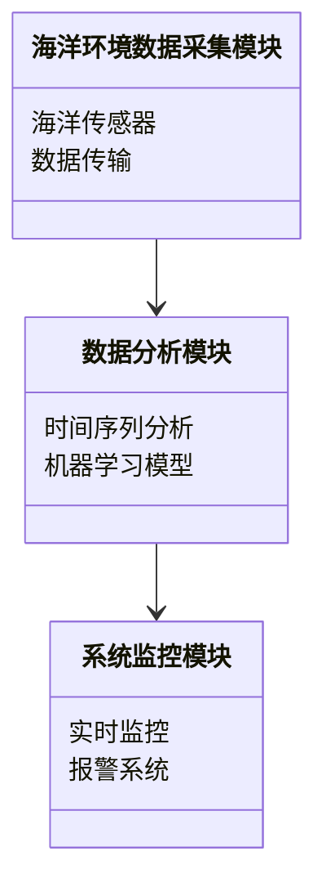
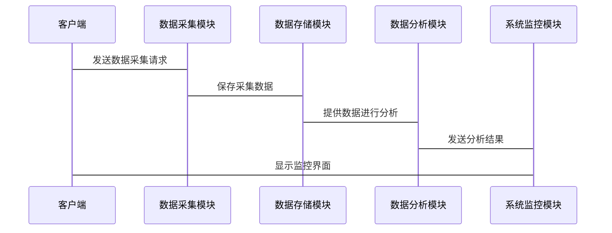

                 


# 价值投资中的智能海洋能源采集系统分析

---

## 关键词：
智能海洋能源采集系统、价值投资、机器学习、系统架构、投资分析

---

## 摘要：
本文探讨了如何将智能技术应用于海洋能源采集，并结合价值投资的策略进行系统分析。通过详细分析智能海洋能源采集系统的组成、算法原理及系统架构，本文为投资者提供了评估和优化投资决策的方法，最终帮助读者在技术和金融领域找到平衡点，实现长期收益。

---

## 第一部分: 智能海洋能源采集系统与价值投资概述

### 第1章: 背景与概述

#### 1.1 智能海洋能源采集系统背景
智能海洋能源采集系统是利用智能技术（如物联网、机器学习）来监测和采集海洋中的可再生能源（如潮汐能、波浪能、温差能等）。随着全球能源需求的增长和对可再生能源的关注，智能海洋能源采集系统的重要性日益凸显。

##### 1.1.1 海洋能源的定义与分类
- **定义**：海洋能源是指海洋中蕴藏的各种能量资源，包括潮汐能、波浪能、海流能、温差能和盐差能等。
- **分类**：
  1. **机械能**：潮汐能、波浪能、海流能。
  2. **热能**：温差能、盐差能。

##### 1.1.2 智能化采集技术的发展历程
- **传统采集技术**：依赖简单的机械装置，效率低，维护成本高。
- **智能化采集技术**：引入传感器、物联网、人工智能等技术，实现自动化监测、数据采集和优化控制。

##### 1.1.3 智能海洋能源采集系统的现状与趋势
- **现状**：技术逐渐成熟，但大规模商业化仍面临挑战。
- **趋势**：向高效化、智能化、网络化方向发展。

#### 1.2 价值投资的背景与核心理念
##### 1.2.1 价值投资的基本定义
价值投资是一种长期投资策略，强调以低于内在价值的价格购买优质资产，通过长期持有实现收益。

##### 1.2.2 价值投资的核心理念与原则
- **核心理念**：寻找具有持续竞争优势的公司，关注长期价值而非短期波动。
- **原则**：
  1. 低市盈率、低市净率。
  2. 高ROE（净资产收益率）。
  3. 财务健康，现金流稳定。

##### 1.2.3 价值投资在现代金融中的地位
价值投资是金融市场的基石之一，尤其在应对市场波动和经济不确定性时表现突出。

---

### 第2章: 智能海洋能源采集系统的核心概念

#### 2.1 系统组成与功能模块
##### 2.1.1 数据采集模块
- **功能**：实时采集海洋环境数据（如温度、盐度、流速等）。
- **技术**：使用传感器和物联网（IoT）进行数据传输。

##### 2.1.2 数据分析模块
- **功能**：对采集的数据进行清洗、分析和建模，预测能源产量。
- **技术**：利用机器学习算法（如随机森林、神经网络）进行预测。

##### 2.1.3 能源优化模块
- **功能**：优化能源采集策略，提高效率。
- **技术**：基于预测结果，动态调整采集设备参数。

##### 2.1.4 系统监控模块
- **功能**：实时监控系统运行状态，及时发现和处理异常。
- **技术**：使用可视化工具（如Matplotlib）展示系统状态。

#### 2.2 价值投资中的关键指标
##### 2.2.1 系统成本分析
- **固定成本**：设备采购、安装费用。
- **可变成本**：维护、运营费用。

##### 2.2.2 系统收益预测
- **收入来源**：能源销售、政府补贴。
- **预测模型**：基于历史数据和机器学习模型进行预测。

##### 2.2.3 竞争优势评估
- **技术优势**：系统的技术创新性和专利情况。
- **市场优势**：市场份额、竞争对手分析。

##### 2.2.4 风险管理模型
- **风险因素**：技术风险、市场风险、政策风险。
- **应对策略**：分散投资、风险对冲。

---

## 第二部分: 系统分析与算法原理

### 第3章: 数据采集与分析算法

#### 3.1 数据采集算法
##### 3.1.1 数据采集流程
1. **传感器采集**：使用多种传感器（如温度传感器、盐度传感器）采集海洋环境数据。
2. **数据传输**：通过无线通信技术（如LoRa、5G）将数据传输到中央控制系统。
3. **数据存储**：将采集的数据存储到数据库（如MySQL、MongoDB）中。

##### 3.1.2 数据清洗与预处理
- **数据清洗**：去除噪声数据、填补缺失值。
- **数据预处理**：标准化、归一化处理。

##### 3.1.3 数据特征提取
- **特征选择**：使用统计方法（如方差分析）选择关键特征。
- **特征工程**：创建新特征（如时间序列特征）以提高模型性能。

#### 3.2 数据分析算法
##### 3.2.1 时间序列分析
- **方法**：使用ARIMA模型进行短期预测。
- **流程**：
  1. 数据平稳化（差分）。
  2. 模型参数估计。
  3. 模型验证与优化。

##### 3.2.2 机器学习模型
- **随机森林**：
  - **优势**：适用于高维数据，抗过拟合。
  - **流程**：
    1. 数据分割（训练集、测试集）。
    2. 模型训练。
    3. 模型评估（准确率、召回率）。
- **神经网络**：
  - **优势**：适合非线性关系建模。
  - **流程**：
    1. 网络结构设计（如LSTM）。
    2. 模型训练（反向传播）。
    3. 模型预测。

##### 3.2.3 数据可视化与趋势预测
- **工具**：使用Matplotlib或Seaborn绘制时间序列图。
- **趋势预测**：基于机器学习模型预测未来能源产量。

---

## 第三部分: 系统架构与设计

### 第4章: 系统架构与设计

#### 4.1 系统架构设计
##### 4.1.1 分层架构
- **数据采集层**：负责数据的采集和传输。
- **数据处理层**：进行数据清洗、特征提取和建模。
- **决策层**：基于分析结果优化采集策略。

##### 4.1.2 模块化设计
- **数据采集模块**：传感器、通信模块。
- **数据分析模块**：算法模型、数据存储。
- **用户界面模块**：可视化界面、报警系统。

#### 4.2 系统功能设计
##### 4.2.1 领域模型类图


##### 4.2.2 系统架构图


#### 4.3 接口设计与交互流程图
##### 4.3.1 系统接口设计
- **数据接口**：RESTful API，提供数据查询和修改功能。
- **用户接口**：Web界面，展示系统状态和分析结果。

##### 4.3.2 交互流程图


---

## 第四部分: 项目实战

### 第5章: 项目实战

#### 5.1 环境安装与配置
- **开发环境**：Python 3.8以上版本，Jupyter Notebook。
- **依赖库安装**：
  ```bash
  pip install numpy pandas scikit-learn matplotlib
  ```

#### 5.2 核心代码实现
##### 5.2.1 数据采集模块
```python
import numpy as np
import pandas as pd

# 生成模拟数据
data = {
    'time': range(100),
    'temperature': np.random.normal(20, 2, 100),
    'salinity': np.random.uniform(35, 36, 100)
}
df = pd.DataFrame(data)
```

##### 5.2.2 数据分析模块
```python
from sklearn.ensemble import RandomForestRegressor
from sklearn.metrics import mean_absolute_error

# 数据准备
X = df[['time', 'temperature', 'salinity']]
y = df['energy_output']

# 模型训练
model = RandomForestRegressor()
model.fit(X, y)

# 模型预测
y_pred = model.predict(X)
print(mean_absolute_error(y, y_pred))
```

#### 5.3 代码解读与分析
- **数据采集模块**：使用Python生成模拟数据，展示如何采集和存储数据。
- **数据分析模块**：利用随机森林模型进行预测，评估模型性能。

#### 5.4 案例分析
- **案例背景**：假设在某海域部署智能采集系统，分析其能源采集效率。
- **分析结果**：通过模型预测，得出最佳采集时间和位置。

#### 5.5 项目小结
- **总结**：智能海洋能源采集系统的实现需要结合先进的传感器技术和机器学习算法，才能有效提高能源采集效率和投资回报率。

---

## 第五部分: 价值投资分析

### 第6章: 价值投资中的系统评估

#### 6.1 项目评估与分析
- **内在价值计算**：基于现金流折现法（DCF）评估项目价值。
- **竞争优势分析**：技术壁垒、成本优势、市场地位。

#### 6.2 投资策略制定
- **分散投资**：避免单一项目风险。
- **长期持有**：关注企业的长期发展，而非短期波动。

#### 6.3 风险管理与控制
- **风险对冲**：通过期权、保险等方式降低风险。
- **定期评估**：持续监控项目进展和市场变化，及时调整投资策略。

---

## 第六部分: 总结与展望

### 第7章: 总结与展望

#### 7.1 内容回顾
本文从智能海洋能源采集系统的背景出发，分析了其核心概念、算法原理和系统架构，并结合价值投资的策略进行了详细分析。

#### 7.2 未来展望
- **技术发展**：人工智能和大数据技术将进一步提升能源采集效率。
- **投资趋势**：绿色能源投资将成为主流，智能海洋能源采集系统将得到更广泛应用。

---

## 作者信息

作者：AI天才研究院/AI Genius Institute & 禅与计算机程序设计艺术/Zen And The Art of Computer Programming

---

感谢您的耐心阅读！希望本文能为您提供有价值的技术和投资分析视角，帮助您在智能海洋能源采集系统领域做出更明智的决策。

