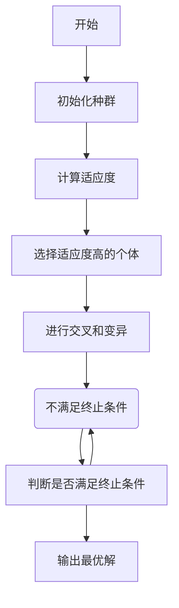
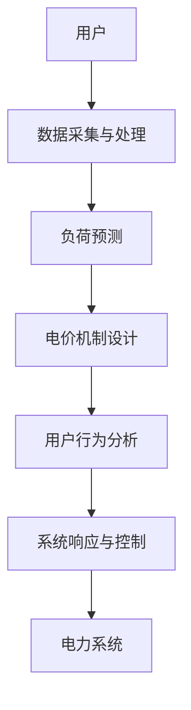

                 


# 价值投资中的智能电网需求侧响应系统分析

> 关键词：智能电网，需求侧响应系统，价值投资，电力系统优化，能源管理

> 摘要：本文从价值投资的角度分析智能电网中的需求侧响应系统，探讨其在电力系统优化中的潜力与应用。通过深入分析系统的核心概念、算法原理、系统架构和实际案例，揭示如何通过价值投资策略优化需求侧响应系统的性能和投资回报。

---

## 第一部分：智能电网与需求侧响应系统概述

### 第1章：智能电网的基本概念

#### 1.1 智能电网的定义
智能电网是一种现代化的电力网络，通过整合先进的信息通信技术、数据分析和自动化控制，实现电力的高效传输、分配和管理。它能够实时监测和响应电力系统的状态，优化电力供应和需求之间的平衡。

#### 1.2 智能电网的核心特征
智能电网具有以下几个核心特征：
1. **智能化**：通过数据采集和分析，实现对电力系统的实时监控和智能决策。
2. **分布式能源**：支持分布式发电（如太阳能、风能）的接入和管理。
3. **双向通信**：用户和电网之间可以实现双向数据交换，支持需求侧响应。
4. **自适应性**：能够根据负荷变化和电网状态自动调整运行策略。

#### 1.3 智能电网的组成部分
智能电网主要由以下几个部分组成：
1. **发电系统**：包括传统发电厂和分布式能源。
2. **输电系统**：高压输电网，用于长距离电力传输。
3. **配电系统**：将电力分配到用户端。
4. **用户终端**：包括工业、商业和居民用户。
5. **信息通信系统**：支持数据采集、传输和分析。

### 第2章：需求侧响应系统的基本概念

#### 2.1 需求侧响应的定义
需求侧响应（Demand Response, DR）是一种通过激励机制引导用户调整用电行为，以优化电力系统运行的技术。它通过改变用户用电模式，减少高峰负荷，提高电力系统的稳定性和经济性。

#### 2.2 需求侧响应的核心功能
需求侧响应系统的核心功能包括：
1. **负荷预测**：基于历史数据和用户行为，预测未来电力需求。
2. **电价机制设计**：通过动态电价激励用户在高峰时段减少用电。
3. **用户行为分析**：分析用户的用电模式，制定个性化的需求响应策略。

#### 2.3 需求侧响应的分类与特点
需求侧响应可以分为以下几类：
1. **价格型响应**：基于电价的变化，用户主动调整用电行为。
2. **激励型响应**：通过给予用户奖励（如折扣、返利）来鼓励用户参与需求响应。
3. **反馈型响应**：用户实时接收电网的反馈信息，动态调整用电行为。

---

## 第二部分：需求侧响应系统的核心概念与联系

### 第3章：需求侧响应系统的核心原理

#### 3.1 需求侧响应系统的运行机制
需求侧响应系统通过以下步骤实现电力系统的优化：
1. **数据采集**：收集用户的用电数据和电网的实时状态。
2. **负荷预测**：基于历史数据和当前负荷，预测未来的用电需求。
3. **电价机制设计**：根据预测结果，制定动态电价策略。
4. **用户行为分析**：分析用户的用电模式，制定个性化的需求响应策略。
5. **系统响应**：根据用户响应情况，调整电力系统的运行策略。

#### 3.2 需求侧响应系统的数学模型
需求侧响应系统的优化目标可以表示为以下数学模型：
$$ \text{目标函数} = \min \sum_{t=1}^{T} C_t $$
其中，\( C_t \) 表示第 \( t \) 时刻的电力成本。

约束条件包括：
1. \( \sum_{t=1}^{T} D_t \leq S_t \)（电力需求不超过供应能力）。
2. \( D_t \geq 0 \)（电力需求非负）。

---

## 第三部分：需求侧响应系统的算法原理

### 第4章：需求侧响应系统的优化算法

#### 4.1 需求侧响应系统的优化目标
需求侧响应系统的优化目标通常包括以下几项：
1. **最小化电力成本**：通过优化用电行为，降低电力系统的总成本。
2. **最大化用户收益**：通过动态电价和激励机制，提高用户的参与度。
3. **提高系统稳定性**：通过调整负荷，避免电力系统的过载和崩溃。

#### 4.2 需求侧响应系统的优化算法
需求侧响应系统的优化可以采用多种算法，如遗传算法（Genetic Algorithm, GA）和粒子群优化（Particle Swarm Optimization, PSO）。以下是一个遗传算法的简单流程图：



#### 4.3 需求侧响应系统的数学模型
以下是一个简单的优化模型：
$$ \text{目标函数} = \min \sum_{i=1}^{n} x_i $$
约束条件：
$$ \sum_{i=1}^{n} x_i \leq C $$
其中，\( x_i \) 表示第 \( i \) 个用户的用电量，\( C \) 表示系统的容量限制。

---

## 第四部分：需求侧响应系统的系统分析

### 第5章：需求侧响应系统的系统架构

#### 5.1 需求侧响应系统的功能设计
需求侧响应系统的主要功能包括：
1. **数据采集与处理**：采集用户的用电数据和电网的实时状态。
2. **负荷预测**：基于历史数据和当前负荷，预测未来的用电需求。
3. **电价机制设计**：根据预测结果，制定动态电价策略。
4. **用户行为分析**：分析用户的用电模式，制定个性化的需求响应策略。
5. **系统响应与控制**：根据用户响应情况，调整电力系统的运行策略。

#### 5.2 需求侧响应系统的架构图
以下是一个需求侧响应系统的架构图：



#### 5.3 需求侧响应系统的接口设计
需求侧响应系统的接口设计需要考虑以下几个方面：
1. **用户接口**：用户可以通过手机APP或网页界面查看实时电价和用电情况。
2. **电网接口**：与电力系统进行数据交换和控制。
3. **数据接口**：与第三方数据源（如气象数据）进行数据集成。

---

## 第五部分：需求侧响应系统的项目实战

### 第6章：需求侧响应系统的项目实战

#### 6.1 项目环境安装
以下是需求侧响应系统所需的环境配置：
1. **Python**：安装Python 3.8或更高版本。
2. **库依赖**：安装以下Python库：
   - `numpy`
   - `pandas`
   - `scipy`
   - `matplotlib`
   - `pymermaid`

#### 6.2 需求侧响应系统的核心实现
以下是一个简单的Python代码示例：

```python
import numpy as np
import pandas as pd

# 假设用户用电数据存储在data.csv文件中
data = pd.read_csv('data.csv')

# 计算用户的用电量
user_load = data['load'].values

# 计算电力系统的容量限制
system_capacity = 1000

# 使用遗传算法优化用电量
def fitness_function(individual):
    total_cost = sum(individual)
    return total_cost

# 初始化种群
population = np.random.randint(0, 100, size=(100, len(user_load)))

# 计算适应度
fitness = np.array([fitness_function(individual) for individual in population])

# 选择适应度高的个体
selected = population[np.argsort(fitness)[:10]]

# 进行交叉和变异
# （具体实现略）
```

#### 6.3 项目实战总结
通过实际案例分析，我们可以看到，需求侧响应系统可以通过优化用电行为，降低电力系统的总成本，同时提高用户的收益。

---

## 第六部分：总结与展望

### 第7章：总结与展望

#### 7.1 本章总结
本文从价值投资的角度分析了智能电网中的需求侧响应系统，探讨了其在电力系统优化中的潜力与应用。通过深入分析系统的核心概念、算法原理、系统架构和实际案例，揭示了如何通过价值投资策略优化需求侧响应系统的性能和投资回报。

#### 7.2 未来展望
未来，随着智能电网和能源互联网的快速发展，需求侧响应系统将在电力系统优化中发挥越来越重要的作用。通过进一步的研究和实践，我们可以探索更多的优化算法和应用场景，为电力系统的可持续发展提供更多的支持。

---

## 作者信息

作者：AI天才研究院/AI Genius Institute & 禅与计算机程序设计艺术 /Zen And The Art of Computer Programming

