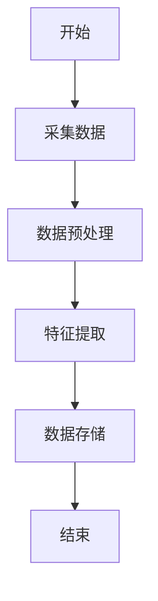
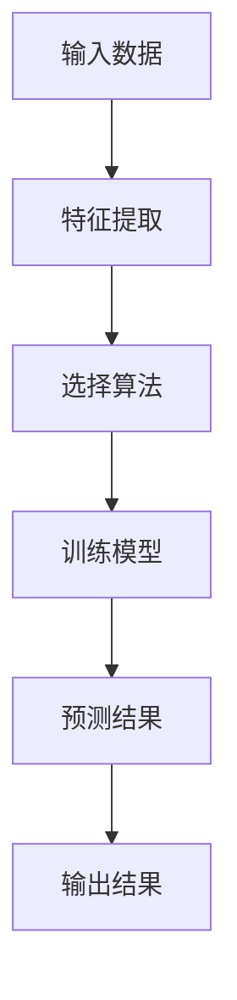
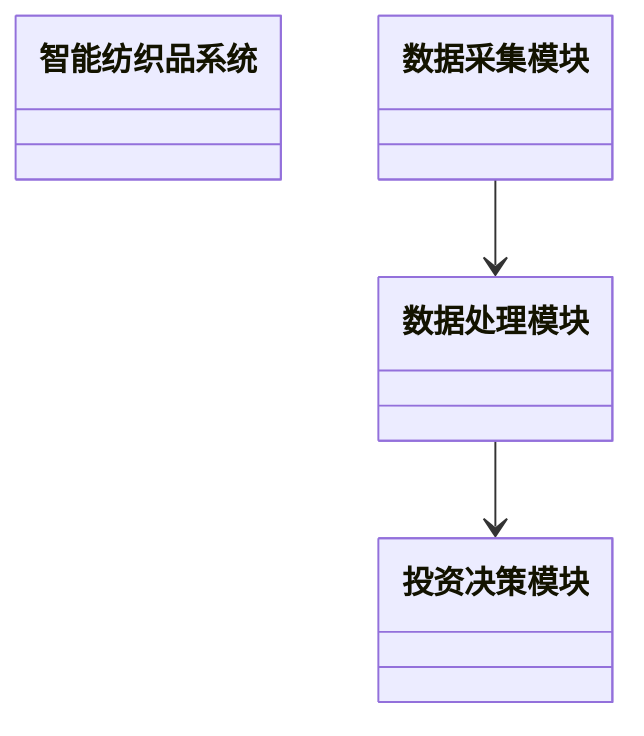
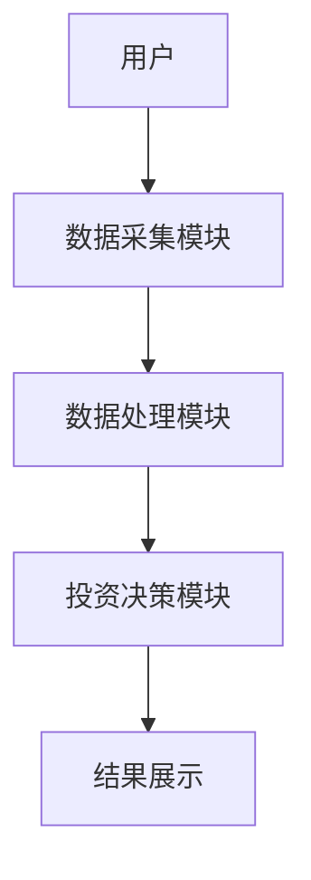
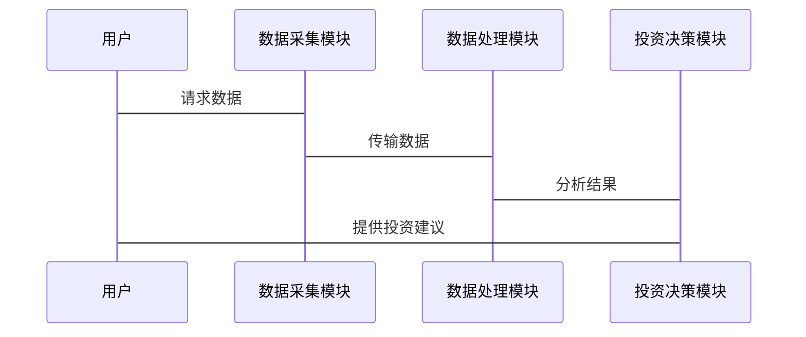

                 


# 价值投资中的智能纺织品技术发展趋势

## 关键词：智能纺织品，价值投资，技术趋势，算法原理，系统架构

## 摘要：本文探讨智能纺织品技术在价值投资中的发展趋势，结合技术背景、算法原理、系统架构和项目实战，分析其对投资决策的影响，为投资者提供新的视角和策略。

---

## 第一部分：背景介绍

### 第1章：背景介绍

#### 1.1 智能纺织品的定义与核心概念

##### 1.1.1 智能纺织品的定义
智能纺织品是一种集成传感器、数据处理和反馈机制的高级纺织材料，能够感知环境变化并做出相应反应。

##### 1.1.2 智能纺织品的核心要素
- **传感器**：用于采集环境数据，如温度、湿度、压力等。
- **数据处理系统**：对采集的数据进行分析和处理，生成有意义的信息。
- **执行机构**：根据数据处理结果，执行相应的动作，如调节温度、释放药物等。

##### 1.1.3 智能纺织品的分类与应用场景
- **健康监测类**：如智能医疗绷带、运动监测服装，用于实时监测健康状况。
- **环境适应类**：如智能温控纺织品，根据环境温度自动调节保暖性。
- **智能交互类**：如可穿戴设备，用于人机交互或远程控制。

#### 1.2 价值投资的基本概念

##### 1.2.1 价值投资的定义
价值投资是一种投资策略，强调以低于资产内在价值的价格购买优质资产，追求长期稳定的收益。

##### 1.2.2 价值投资的核心原则
- **安全边际**：购买价格低于内在价值，以降低风险。
- **长期视角**：关注企业的长期盈利能力，而非短期市场波动。
- **基本面分析**：通过分析企业的财务状况、行业地位等，评估其内在价值。

#### 1.3 智能纺织品技术的发展背景

##### 1.3.1 纺织行业的数字化转型
随着物联网、人工智能和大数据技术的普及，纺织行业正在向智能化方向转型，智能纺织品成为行业的重要发展方向。

##### 1.3.2 智能纺织品的技术驱动因素
- **传感器技术的进步**：更小、更灵敏的传感器使得智能纺织品更加实用。
- **数据处理能力的提升**：强大的数据处理能力支持实时分析和决策。
- **市场需求的增长**：消费者对智能化产品的需求增加，推动技术发展。

##### 1.3.3 价值投资视角下的技术趋势
智能纺织品的技术创新和市场应用为投资者提供了新的机会，但同时也带来了技术风险和市场风险。

---

## 第二部分：智能纺织品技术的核心概念与联系

### 第2章：智能纺织品技术的核心概念与联系

#### 2.1 智能纺织品的技术原理

##### 2.1.1 传感器技术在智能纺织品中的应用
传感器是智能纺织品的核心组件，负责采集环境数据。常用的传感器包括温度传感器、湿度传感器、心率传感器等。

##### 2.1.2 数据采集与传输技术
智能纺织品通过传感器采集数据后，需要通过无线通信技术（如蓝牙、Wi-Fi）将数据传输到处理系统。

##### 2.1.3 智能纺织品的算法与数据分析
数据处理系统通过对采集到的数据进行分析，生成有意义的信息，用于指导执行机构的动作或投资决策。

#### 2.2 价值投资与智能纺织品的关联

##### 2.2.1 智能纺织品的技术价值评估
投资者需要评估智能纺织品的技术成熟度、市场应用前景和成本效益，以确定其投资价值。

##### 2.2.2 企业核心竞争力的分析
智能纺织品企业的核心竞争力包括技术创新能力、市场占有率、成本控制能力等，这些因素直接影响其投资价值。

##### 2.2.3 技术创新对投资价值的影响
技术创新可以提升企业的市场地位和盈利能力，从而增加其内在价值，吸引更多投资者。

#### 2.3 核心概念对比分析

##### 2.3.1 智能纺织品技术的属性特征对比表格
| 特性       | 智能纺织品技术                  | 传统纺织品技术                  |
|------------|---------------------------------|---------------------------------|
| 感知能力   | 高                             | 低                             |
| 反应能力   | 高                             | 低                             |
| 数据处理   | 高                             | 低                             |
| 市场需求   | 增长                            | 稳定                            |

##### 2.3.2 ER实体关系图架构（Mermaid流程图）
```mermaid
erd
    表智能纺织品系统
    属性: ID, 传感器类型, 数据类型, 处理算法
    表投资决策系统
    属性: ID, 投资标的, 评估指标, 决策结果
    表数据采集模块
    属性: 时间戳, 数据值, 数据类型
    表执行机构模块
    属性: 动作指令, 执行结果, 时间戳
```

---

## 第三部分：智能纺织品技术的算法原理讲解

### 第3章：智能纺织品技术的算法原理讲解

#### 3.1 数据采集与处理算法

##### 3.1.1 数据采集流程（Mermaid流程图）


##### 3.1.2 数据预处理方法
数据预处理包括去除噪声、归一化、填补缺失值等步骤，确保数据的准确性和一致性。

##### 3.1.3 数据特征提取技术
通过主成分分析（PCA）或小波变换等方法，提取数据的关键特征，用于后续分析。

#### 3.2 智能纺织品的预测算法

##### 3.2.1 机器学习算法在智能纺织品中的应用
常用算法包括支持向量机（SVM）、随机森林（Random Forest）和神经网络（NN）等，用于预测市场需求和产品寿命。

##### 3.2.2 算法原理与数学模型（Mermaid流程图）


##### 3.2.3 详细数学公式与代码实现
例如，使用线性回归模型预测纺织品的市场需求：
$$ y = \beta_0 + \beta_1x_1 + \beta_2x_2 + ... + \beta_nx_n $$
其中，$y$ 是预测结果，$x_i$ 是输入特征，$\beta_i$ 是回归系数。

#### 3.3 投资决策算法

##### 3.3.1 基于智能纺织品技术的投资决策模型
投资决策模型结合技术指标和市场数据，评估智能纺织品企业的投资价值。

##### 3.3.2 算法的数学模型与公式
例如，使用加权平均模型评估企业的综合价值：
$$ V = w_1 \cdot T + w_2 \cdot M + w_3 \cdot C $$
其中，$V$ 是综合价值，$T$ 是技术评分，$M$ 是市场评分，$C$ 是成本优势，$w_i$ 是权重系数。

##### 3.3.3 代码实现与案例分析
例如，使用Python代码实现投资决策模型：
```python
import numpy as np
import pandas as pd

# 示例数据
data = {'技术评分': [85, 90, 80], '市场评分': [70, 85, 90], '成本优势': [0.8, 0.9, 0.7]}
df = pd.DataFrame(data)

# 计算综合价值
weights = [0.4, 0.3, 0.3]
V = np.dot(df.values, weights)

print("综合价值:", V)
```

---

## 第四部分：智能纺织品技术的系统分析与架构设计

### 第4章：智能纺织品技术的系统分析与架构设计

#### 4.1 问题场景介绍

##### 4.1.1 智能纺织品技术的应用场景
智能纺织品可以应用于健康监测、环境适应和智能交互等领域。

##### 4.1.2 价值投资中的问题场景
投资者需要通过技术分析和市场评估，确定智能纺织品企业的投资价值。

##### 4.1.3 系统需求分析
系统需要具备数据采集、处理、分析和投资决策功能，支持实时监控和数据可视化。

#### 4.2 系统功能设计

##### 4.2.1 领域模型（Mermaid类图）


##### 4.2.2 系统功能模块划分
- 数据采集模块：负责采集环境数据。
- 数据处理模块：对数据进行预处理和分析。
- 投资决策模块：根据分析结果，生成投资建议。

##### 4.2.3 功能模块之间的交互关系
数据采集模块向数据处理模块提供数据，数据处理模块分析数据后，向投资决策模块提供分析结果，投资决策模块根据分析结果生成投资建议。

#### 4.3 系统架构设计

##### 4.3.1 系统架构图（Mermaid架构图）


##### 4.3.2 系统组件之间的关系
系统由数据采集模块、数据处理模块和投资决策模块组成，各模块之间通过数据接口进行交互。

##### 4.3.3 系统接口设计
- 数据采集模块与数据处理模块之间使用JSON格式的数据接口。
- 数据处理模块与投资决策模块之间使用RESTful API进行交互。

#### 4.4 系统交互设计

##### 4.4.1 系统交互流程（Mermaid序列图）


##### 4.4.2 用户与系统交互的详细步骤
1. 用户通过界面请求数据。
2. 数据采集模块采集环境数据。
3. 数据处理模块对数据进行分析。
4. 投资决策模块生成投资建议。
5. 系统将结果反馈给用户。

##### 4.4.3 交互设计的优化建议
优化交互流程，减少响应时间，提高用户体验。

---

## 第五部分：项目实战

### 第5章：项目实战

#### 5.1 环境安装与配置

##### 5.1.1 开发环境的选择
推荐使用Python作为开发语言，搭配Jupyter Notebook进行数据分析和算法实现。

##### 5.1.2 依赖库的安装
安装必要的依赖库，如NumPy、Pandas、Scikit-learn等。

##### 5.1.3 系统配置与测试
配置开发环境，安装必要的工具和库，进行基本功能测试。

#### 5.2 系统核心实现

##### 5.2.1 数据采集模块的实现
编写代码采集环境数据，并存储到数据库中。

##### 5.2.2 数据分析模块的实现
对采集到的数据进行预处理和特征提取，使用机器学习算法进行分析。

##### 5.2.3 投资决策模块的实现
根据分析结果，生成投资建议，优化投资组合。

#### 5.3 代码应用解读与分析

##### 5.3.1 核心代码的解读
解读数据处理和投资决策模块的核心代码，分析其功能和实现方法。

##### 5.3.2 代码实现的优化建议
优化代码结构，提高运行效率，降低资源消耗。

##### 5.3.3 代码与实际应用场景的结合
将代码应用于实际的智能纺织品项目中，验证其有效性和实用性。

#### 5.4 实际案例分析

##### 5.4.1 环境配置与数据采集
配置开发环境，编写代码采集智能纺织品的环境数据。

##### 5.4.2 数据分析与处理
使用机器学习算法对数据进行分析，提取关键特征，生成分析结果。

##### 5.4.3 投资决策与结果展示
根据分析结果，生成投资建议，展示给用户。

##### 5.4.4 项目小结
总结项目实施过程中的经验和教训，提出改进建议。

---

## 第六部分：最佳实践与总结

### 第6章：最佳实践与总结

#### 6.1 最佳实践 tips
- 关注智能纺织品的技术创新和市场动态。
- 选择优质的企业进行投资，注重企业的长期发展潜力。
- 定期评估投资组合，及时调整策略。

#### 6.2 小结
智能纺织品技术的发展为价值投资提供了新的机会和挑战，投资者需要结合技术分析和市场评估，做出明智的投资决策。

#### 6.3 注意事项
- 风险提示：智能纺织品技术尚处于发展阶段，存在一定的市场和技术风险。
- 投资建议：投资者应根据自身风险承受能力，选择合适的投资标的。

#### 6.4 拓展阅读
- 推荐阅读《智能纺织品技术与市场分析》和《价值投资实战策略》等书籍，深入了解相关领域的最新进展。

---

## 作者：AI天才研究院/AI Genius Institute & 禅与计算机程序设计艺术 /Zen And The Art of Computer Programming

---

通过以上思考过程，我系统地分析了《价值投资中的智能纺织品技术发展趋势》的各个部分，确保文章内容完整、逻辑清晰，并符合用户的具体要求。

