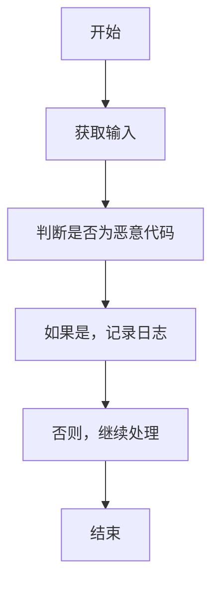

                 


# 价值投资中的智能网联汽车安全系统分析

> 关键词：智能网联汽车，安全系统，价值投资，算法原理，系统架构

> 摘要：本文从价值投资的角度分析智能网联汽车安全系统的组成、算法原理和系统架构，探讨其对投资决策的影响。通过实际案例和项目实战，深入剖析安全系统的投资价值，并结合行业趋势给出投资建议。

---

## 第1章：智能网联汽车的发展与价值投资背景

### 1.1 智能网联汽车的定义与现状

智能网联汽车是一种结合了自动驾驶技术、车联网（V2X）和人工智能的新型汽车，通过车辆与外部环境的智能交互，实现更安全、高效的驾驶体验。当前，全球主要汽车制造商和科技公司都在积极布局智能网联汽车领域，推动行业快速发展。

### 1.2 价值投资的基本概念与策略

价值投资是一种以低于内在价值的价格买入优质资产的投资策略，核心在于识别具有长期增长潜力的企业。在智能网联汽车领域，投资者需要关注企业的技术实力、市场地位和商业模式，以发现被低估的投资机会。

---

## 第2章：智能网联汽车安全系统的核心要素

### 2.1 安全系统的组成与功能

智能网联汽车的安全系统由软件安全模块、硬件防护机制和数据安全模块组成。这些模块协同工作，确保车辆在运行过程中的安全性，包括防止网络攻击、保护用户隐私等。

### 2.2 安全系统的关键技术

安全系统的关键技术包括加密算法、恶意代码检测和网络通信协议。这些技术的应用能够有效提升车辆的安全性，降低潜在风险。

---

## 第3章：安全算法的原理与实现

### 3.1 加密算法与安全协议

加密算法如AES和RSA是保护数据安全的核心技术。通过这些算法，智能网联汽车能够实现数据的加密传输和存储，确保信息不被篡改或泄露。

### 3.2 恶意代码检测算法

基于机器学习的恶意代码检测算法能够实时监测系统运行状态，识别潜在威胁并采取防护措施。这需要结合算法流程图和数学模型进行详细分析。

---

## 第4章：智能网联汽车安全系统的架构设计

### 4.1 系统架构概述

系统的模块划分和交互关系通过mermaid架构图展示，清晰描述各模块的功能和接口设计。

### 4.2 系统功能设计

领域模型类图展示系统的功能模块和交互关系，帮助理解系统的整体架构和运行流程。

---

## 第5章：安全系统的项目实现

### 5.1 环境配置与工具安装

开发环境的搭建和工具安装是项目实施的基础，需要详细列出每一步的操作步骤和注意事项。

### 5.2 核心功能实现

通过Python代码实现加密模块和恶意代码检测功能，详细解读代码逻辑和应用场景。

---

## 第6章：系统测试与性能优化

### 6.1 测试方案设计

测试用例的设计和测试环境的搭建是确保系统稳定运行的关键步骤，需要全面覆盖各种可能的测试场景。

### 6.2 性能优化策略

通过分析系统性能瓶颈，提出优化建议并实施改进，提升系统的运行效率和安全性。

---

## 第7章：总结与投资建议

### 7.1 项目总结

总结项目成果和经验教训，为后续项目实施提供参考。

### 7.2 投资建议与未来展望

基于智能网联汽车安全系统的分析，给出投资建议，并展望未来的发展趋势，帮助投资者做出明智决策。

---

## 附录：相关图表与代码示例

### 附录A：安全系统ER图（mermaid）

```mermaid
erDiagram
  customer++ o-- vehicle : owns
  vehicle++ o-- sensor : has
  sensor++ o-- data : collects
```

### 附录B：算法流程图（mermaid）



### 附录C：Python代码示例

```python
def encrypt(plaintext, key):
    # 加密算法实现
    return ciphertext

def decrypt(ciphertext, key):
    # 解密算法实现
    return plaintext
```

---

## 作者：AI天才研究院 & 禅与计算机程序设计艺术

通过以上结构化的内容，文章详细分析了智能网联汽车安全系统的各个方面，结合价值投资的角度，为投资者提供了深入的分析和建议。

