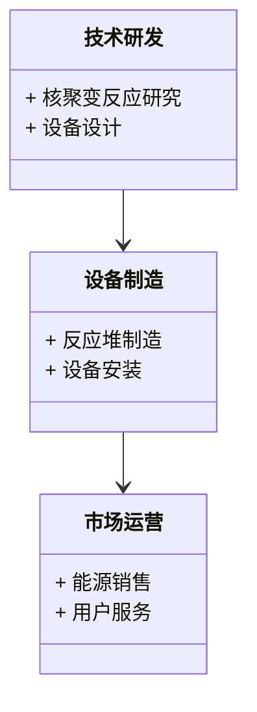
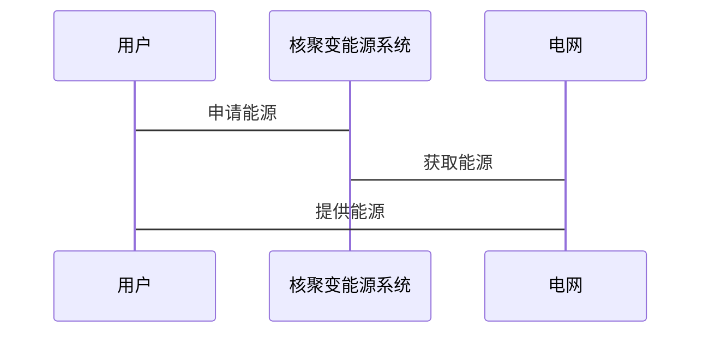

                 

# 价值投资中的核聚变能源商业化技术前景

## 关键词
核聚变能源，价值投资，商业化前景，技术评估，风险分析

## 摘要
本文探讨了核聚变能源的商业化技术前景及其在价值投资中的应用。通过分析核聚变能源的技术原理、市场潜力、商业模式和投资策略，本文为投资者提供了全面的技术和经济评估，帮助他们做出明智的投资决策。同时，本文还讨论了核聚变能源商业化过程中可能面临的技术和市场风险，并提出了相应的应对策略。

---

## 第一章：核聚变能源与价值投资的背景介绍

### 1.1 核聚变能源的基本概念

#### 1.1.1 核聚变的定义与基本原理
核聚变是指轻核的原子核在高温高压条件下结合成较重的原子核，并释放出巨大能量的过程。与核裂变不同，核聚变不会产生长期放射性废物，是一种更加安全和可持续的能源形式。

**核聚变反应的基本方程：**  
氘（²H）和氚（³H）的聚变反应：  
$$ 2^1_1\text{H} + 3^1_1\text{H} \rightarrow 4^2_2\text{He} + 1^0_1\text{n} + 23.8 \text{MeV} $$  
该反应释放出大量能量，是核聚变的核心反应。

#### 1.1.2 核聚变与核裂变的区别
| 核聚变 | 核裂变 |
|------|------|
| 轻核聚合成较重核 | 重核分裂为较轻核 |
| 不会产生长期放射性废物 | 会产生放射性废物 |
| 反应条件：高温高压 | 反应条件：中子轰击 |

#### 1.1.3 核聚变能源的核心要素与概念结构
核聚变能源的核心要素包括：  
1. **反应物质**：氘、氚等轻核。  
2. **反应条件**：高温、高压环境。  
3. **能量释放**：通过聚变反应释放能量。  
4. **技术设备**：聚变反应器、磁场约束装置等。

### 1.2 价值投资的基本概念

#### 1.2.1 价值投资的定义与核心理念
价值投资是一种投资策略，旨在通过分析企业的内在价值，寻找市场价格低于内在价值的投资标的。其核心理念是“买入便宜的东西”，而非盲目追随市场趋势。

#### 1.2.2 价值投资的边界与外延
价值投资不仅适用于传统行业，还可以应用于高科技领域。在核聚变能源领域，价值投资需要考虑技术可行性、市场潜力和商业模式等因素。

#### 1.2.3 价值投资与核聚变能源的联系
核聚变能源的技术突破和商业化将带来巨大的市场机会。投资者可以通过价值投资的方法，筛选出具有技术优势和市场潜力的企业，实现长期收益。

---

## 第二章：核聚变能源技术的原理与挑战

### 2.1 核聚变反应的物理原理

#### 2.1.1 融合反应的基本方程
核聚变反应的核心方程是氘和氚的聚变反应：  
$$ 2^1_1\text{H} + 3^1_1\text{H} \rightarrow 4^2_2\text{He} + 1^0_1\text{n} + 23.8 \text{MeV} $$  
该反应释放出大量能量，其中大部分能量以动能形式释放。

#### 2.1.2 核聚变反应的热力学分析
核聚变反应需要高温高压环境才能发生。通常，反应温度需要达到数亿摄氏度，反应压力也需要达到极高的水平。

#### 2.1.3 聚变反应的约束条件
为了实现核聚变，需要满足以下条件：  
1. **高温**：反应物质需要达到数亿摄氏度。  
2. **高密度**：反应物质需要达到一定的密度。  
3. **约束方式**：通过磁场或机械装置约束反应物质。

### 2.2 核聚变技术的核心算法

#### 2.2.1 聚变反应的模拟算法
核聚变反应可以通过蒙特卡洛模拟算法进行模拟，计算反应过程中的能量释放和物质变化。

#### 2.2.2 聚变装置的优化算法
聚变装置的设计需要考虑反应的物理条件和工程实现。优化算法可以通过参数调整，找到最优的设计方案。

#### 2.2.3 能量提取与转化的算法
核聚变反应释放出的能量需要通过热交换器等设备进行提取和转化，转化为电能或其他形式的能量。

---

## 第三章：核聚变能源商业化前景的市场分析

### 3.1 核聚变能源的市场潜力

#### 3.1.1 全球能源市场的现状与趋势
全球能源需求持续增长，化石能源的使用导致环境问题日益严重。核聚变能源作为一种清洁的替代能源，具有广阔的市场潜力。

#### 3.1.2 核聚变能源的市场定位
核聚变能源可以作为化石能源的替代品，广泛应用于发电、工业等领域。

#### 3.1.3 核聚变能源的经济可行性分析
核聚变能源的经济性取决于技术突破和规模化生产。目前，技术尚未完全成熟，但未来有望实现经济性。

### 3.2 核聚变能源的商业模式

#### 3.2.1 技术研发的商业模式
核聚变技术研发需要巨额投入，可以通过政府资助、私人投资等方式进行。

#### 3.2.2 产业化应用的商业模式
核聚变能源的产业化应用需要建立聚变电站，提供清洁能源服务。

#### 3.2.3 市场竞争与合作模式
核聚变能源领域的竞争较为激烈，企业需要通过合作和技术创新来获取竞争优势。

---

## 第四章：价值投资中的核聚变能源技术评估

### 4.1 技术评估的核心指标

#### 4.1.1 能源转化效率
核聚变反应的能量转化效率是评估其技术可行性的重要指标。

#### 4.1.2 技术成熟度
技术成熟度包括实验室验证、小试、中试等阶段。

#### 4.1.3 成本效益分析
核聚变能源的成本效益分析需要考虑研发成本、生产成本和市场收益。

### 4.2 价值投资的评估方法

#### 4.2.1 财务指标分析
投资者需要关注企业的财务状况、盈利能力、现金流等指标。

#### 4.2.2 风险评估模型
核聚变能源的技术风险和市场风险需要通过风险评估模型进行量化。

#### 4.2.3 投资回报预测
通过技术评估和市场分析，可以预测核聚变能源的投资回报。

---

## 第五章：核聚变能源商业化中的风险与应对策略

### 5.1 技术风险分析

#### 5.1.1 技术瓶颈与解决方案
核聚变技术的关键挑战包括高温约束、能量提取等问题。

#### 5.1.2 技术迭代与投资策略
投资者需要关注技术的迭代和进步，选择具有技术优势的企业。

#### 5.1.3 技术路线的选择与优化
投资者需要根据技术可行性、经济性和市场潜力，选择合适的技术路线。

### 5.2 市场风险分析

#### 5.2.1 市场需求波动
核聚变能源的需求受政策、经济等因素影响，存在一定的波动风险。

#### 5.2.2 市场竞争格局
核聚变能源领域的竞争日益激烈，企业需要具备竞争优势。

#### 5.2.3 市场政策影响
政策的变化可能对核聚变能源的商业化产生重大影响。

---

## 第六章：核聚变能源商业化项目的系统设计与实现

### 6.1 项目系统架构设计

#### 6.1.1 系统功能模块划分
核聚变能源项目可以划分为技术研发、设备制造、市场运营等功能模块。

#### 6.1.2 系统架构的Mermaid类图

#### 6.1.3 系统架构的Mermaid架构图

### 6.2 项目接口与交互设计

#### 6.2.1 系统接口设计
核聚变能源系统需要与电网、用户等外部系统进行接口交互。

#### 6.2.2 系统交互的Mermaid序列图

---

## 总结

核聚变能源作为一种清洁、可持续的能源形式，具有广阔的市场前景。投资者可以通过价值投资的方法，评估核聚变能源的技术可行性、市场潜力和经济性，选择具有竞争优势的企业进行投资。同时，投资者也需要关注技术风险和市场风险，制定合理的投资策略。

---

## 作者信息

作者：AI天才研究院/AI Genius Institute & 禅与计算机程序设计艺术 /Zen And The Art of Computer Programming

