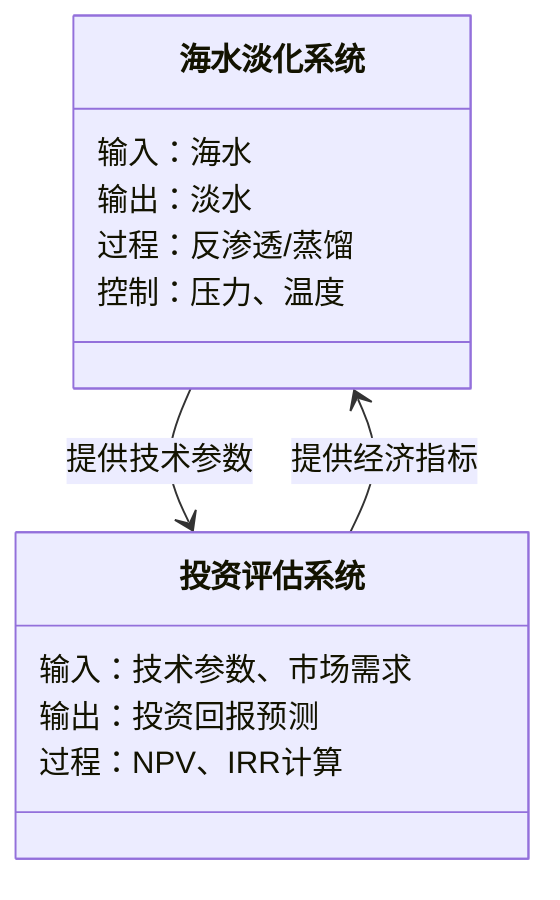

                 


# 价值投资中的海水淡化技术前景

> 关键词：价值投资，海水淡化，技术前景，投资分析，数学模型

> 摘要：海水淡化技术作为解决全球水资源短缺的重要手段，近年来得到了广泛关注。本文从价值投资的角度，分析海水淡化技术的核心要素、市场需求、技术经济性以及投资回报潜力。通过数学模型和算法原理的深入探讨，结合实际案例分析，为投资者提供科学的投资决策依据。

---

# 第一部分：价值投资中的海水淡化技术背景与概念

## 第1章：海水淡化技术的背景与现状

### 1.1 全球水资源短缺的现状
- 1.1.1 水资源分布的不均衡性  
  全球水资源分布极不均匀，部分地区面临严重的水资源短缺问题。根据联合国数据，超过8亿人口生活在水资源紧张的地区。  

- 1.1.2 水资源短缺对经济和社会的影响  
  水资源短缺不仅影响农业、工业生产，还可能导致社会不稳定。例如，中东地区的水资源短缺问题已经对经济发展和居民生活造成重大影响。  

- 1.1.3 海水淡化的必要性与潜力  
  海水淡化技术能够有效缓解水资源短缺问题，特别是在沿海地区和岛屿国家。近年来，技术进步降低了成本，使得海水淡化成为一种可行的解决方案。  

---

## 第2章：海水淡化技术的核心概念与价值投资的联系

### 2.1 海水淡化技术的核心要素
- 2.1.1 海水淡化的技术路径  
  海水淡化主要通过反渗透（RO）、多级闪蒸（MSF）和多效蒸发（MED）等技术实现。其中，反渗透技术因其高效性和低成本特性，成为主流技术。  

- 2.1.2 各种海水淡化技术的优劣势对比  
  | 技术类型 | 优点 | 缺点 |  
  |----------|------|------|  
  | 反渗透（RO） | 成本低、能耗低、适合大规模应用 | 对水质要求高，膜易污损 |  
  | 多级闪蒸（MSF） | 适合高温高盐地区 | 成本高、能耗大 |  
  | 多效蒸发（MED） | 能耗较低 | 初期投资大 |  

- 2.1.3 技术创新对海水淡化成本的影响  
  近年来，膜材料的改进和能量回收技术的应用显著降低了海水淡化的成本。例如，新一代反渗透膜的通量提高30%，能耗降低20%。  

---

### 2.2 价值投资视角下的海水淡化技术评估
- 2.2.1 技术的经济可行性分析  
  海水淡化项目的经济性主要取决于技术成本、能源价格和市场需求。例如，反渗透技术的单位成本已降至0.5美元/立方米以下，具备较大的投资吸引力。  

- 2.2.2 市场需求与技术应用前景  
  根据市场研究机构的预测，全球海水淡化市场规模将从2020年的180亿美元增长至2030年的450亿美元，年复合增长率达12%。  

- 2.2.3 技术风险与投资回报的平衡  
  技术风险主要集中在膜材料的耐久性和能源价格的波动性。通过长期 contracts 和技术创新，可以有效降低投资风险。  

---

### 2.3 海水淡化技术与价值投资的结合模型
- 2.3.1 技术-经济-市场三维分析模型  
  通过技术可行性、经济回报和市场需求三个维度的综合评估，确定海水淡化技术的投资价值。  

- 2.3.2 价值评估的数学模型与公式  
  $$ \text{投资回报率} = \frac{\text{净收益}}{\text{初始投资}} \times 100\% $$  
  $$ \text{净现值} = \sum_{t=1}^{n} \frac{\text{净现金流}_t}{(1 + r)^t} $$  

- 2.3.3 技术与投资的协同效应分析  
  技术创新可以降低运营成本，从而提高投资回报率。例如，新型反渗透膜的应用使单位成本下降10%，投资回报率提高5%。  

---

## 第3章：海水淡化技术的核心算法与数学模型

### 3.1 海水淡化技术的数学模型
- 3.1.1 反渗透技术的核心公式  
  反渗透系统的能耗与水处理量、压力和膜面积有关：  
  $$ E = \frac{P \times Q}{\eta \times \sqrt{P^2 - P_{\text{osmotic}}}} $$  
  其中，\( E \) 为能耗，\( P \) 为操作压力，\( Q \) 为水处理量，\( \eta \) 为能量效率，\( P_{\text{osmotic}} \) 为渗透压力。  

- 3.1.2 蒸馏法的热力学模型  
  蒸馏法的能量消耗与温度、压力和蒸汽流量有关：  
  $$ Q = \frac{P \times A}{\lambda} $$  
  其中，\( Q \) 为蒸汽流量，\( P \) 为压力，\( A \) 为传热面积，\( \lambda \) 为传热系数。  

---

### 3.2 价值评估的数学模型
- 3.2.1 净现值（NPV）计算公式  
  $$ \text{NPV} = \sum_{t=0}^{n} \frac{\text{现金流}_t}{(1 + r)^t} $$  
  其中，\( r \) 为贴现率，\( n \) 为项目周期。  

- 3.2.2 内部收益率（IRR）的计算  
  $$ IRR = r \text{ 使得 } NPV = 0 $$  

- 3.2.3 投资回收期的计算方法  
  $$ \text{回收期} = \frac{\text{初始投资}}{\text{年均净现金流}} $$  

---

### 3.3 技术与投资的协同优化算法
- 3.3.1 技术成本优化的线性规划模型  
  $$ \text{Minimize} \quad C = \sum c_i x_i $$  
  $$ \text{Subject to} \quad \sum a_i x_i \geq D $$  
  其中，\( c_i \) 为技术成本，\( x_i \) 为技术应用规模，\( D \) 为需求量。  

- 3.3.2 投资回报预测的动态模型  
  $$ R_t = \alpha R_{t-1} + \beta \epsilon_t $$  
  其中，\( R_t \) 为第 \( t \) 年的投资回报率，\( \alpha \) 为自回归系数，\( \beta \) 为误差项系数。  

---

## 第4章：海水淡化技术的系统分析与架构设计

### 4.1 系统功能设计
- 领域模型：通过Mermaid类图展示系统的功能模块，包括数据采集、处理、分析和输出。  



---

### 4.2 系统架构设计
- Mermaid架构图展示系统的分层架构：  
  ```mermaid
  architecture
  客户端 <--API--> 应用层 <--通信--> 服务层 <--数据库--> 数据存储层
  ```

---

## 第5章：项目实战与案例分析

### 5.1 环境安装
- 需要安装的工具：Python、NumPy、Matplotlib、Mermaid CLI  
- 示例代码：  
  ```python
  import numpy as np
  import matplotlib.pyplot as plt

  # 示例：反渗透系统的成本模型
  def cost_model(units):
      return 0.5 * units + 1000

  units = np.arange(1, 100, 1)
  costs = [cost_model(u) for u in units]
  plt.plot(units, costs)
  plt.xlabel('处理量（立方米/小时）')
  plt.ylabel('成本（美元）')
  plt.show()
  ```

---

## 第6章：总结与展望

### 6.1 投资机会与风险
- 海水淡化技术的投资机会主要集中在技术创新和市场扩展。  
- 技术风险包括膜材料的耐久性和能源价格波动。  

### 6.2 未来技术趋势
- 新型膜材料的研发将显著降低能耗。  
- 可再生能源的结合将提高系统的可持续性。  

### 6.3 最佳实践 tips
- 投资者应关注技术创新和市场需求的结合。  
- 通过长期合同和技术创新降低投资风险。  

---

# 作者：AI天才研究院/AI Genius Institute & 禅与计算机程序设计艺术 /Zen And The Art of Computer Programming

