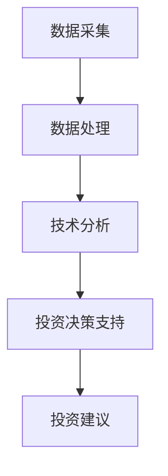

                 


# 价值投资中的海洋可再生能源开发技术前景

## 关键词：价值投资，海洋可再生能源，技术前景，投资策略，系统架构

## 摘要：本文探讨了价值投资在海洋可再生能源开发中的应用前景。通过分析海洋可再生能源的技术特点、市场潜力和投资价值，结合系统的架构设计和实际案例，展示了如何利用价值投资的方法评估和选择具有潜力的海洋能源项目。

---

## 第一部分：背景介绍

### 第1章：价值投资与海洋可再生能源的结合

#### 1.1 价值投资的基本概念
- 价值投资是一种基于对公司内在价值评估的投资策略，强调以低于内在价值的价格买入优质资产。
- 在可再生能源领域，价值投资关注企业的长期盈利能力、竞争优势和可持续发展能力。

#### 1.2 海洋可再生能源的开发背景
- 海洋可再生能源包括潮汐能、波浪能、潮流能等，具有储量大、分布广的特点。
- 随着技术进步，海洋能的开发成本逐渐降低，市场潜力巨大。

#### 1.3 价值投资与海洋可再生能源的结合
- 通过价值投资的方法，筛选出具有技术优势和市场竞争力的海洋能源项目。
- 分析海洋能源开发的技术风险和市场不确定性，评估其投资价值。

---

## 第二部分：核心概念与技术分析

### 第2章：海洋可再生能源的技术分析

#### 2.1 海洋能的分类与特点
- **潮汐能**：利用潮汐的涨落产生的能量，技术成熟但受地理位置限制。
- **波浪能**：利用海洋波浪的能量，技术尚在发展阶段，成本较高。
- **潮流能**：利用海水流动的能量，适合深水区域，技术潜力大。

#### 2.2 海洋能源开发的技术挑战
- **技术瓶颈**：设备可靠性、能源转换效率等问题。
- **环境影响**：海洋能源开发可能对生态产生影响。
- **成本控制**：降低设备和运维成本是关键。

#### 2.3 技术对比与经济性分析
- 通过对比不同海洋能的技术特点和经济性，选择最具投资潜力的技术路线。

---

## 第三部分：价值评估与投资策略

### 第3章：价值投资的理论与方法

#### 3.1 价值投资的核心理念
- 买入低于内在价值的资产，长期持有优质企业。
- 重点关注企业的财务健康、管理团队和竞争优势。

#### 3.2 可再生能源领域的价值评估
- **财务指标分析**：如ROE（净资产收益率）、现金流等。
- **行业趋势分析**：全球能源转型趋势和政策支持。
- **企业竞争优势**：技术领先地位、市场占有率等。

#### 3.3 海洋能源项目的投资策略
- 选择具有技术优势和市场前景的项目。
- 关注政策支持和市场风险，制定合理的投资组合。

---

## 第四部分：系统分析与架构设计

### 第4章：海洋可再生能源开发的系统架构

#### 4.1 系统架构概述
- **数据采集模块**：收集海洋环境数据和项目财务数据。
- **技术分析模块**：分析不同技术的优缺点和经济性。
- **投资决策支持模块**：基于数据分析提供投资建议。

#### 4.2 系统功能设计
- **数据处理**：清洗和转换原始数据。
- **模型构建**：建立技术经济模型，评估项目价值。
- **决策支持**：生成投资报告和风险评估。

#### 4.3 系统架构图


---

## 第五部分：项目实战与案例分析

### 第5章：价值投资中的项目实战

#### 5.1 项目环境与工具安装
- **开发环境**：Python、Jupyter Notebook。
- **数据来源**：公开的海洋能源项目数据和企业财务数据。

#### 5.2 核心代码实现
```python
import pandas as pd
import numpy as np
from sklearn.metrics import mean_squared_error

# 示例：计算项目净现值
def calculate_net_present_value(cash_flows, discount_rate):
    npv = 0
    for i, cash_flow in enumerate(cash_flows):
        npv += cash_flow / (1 + discount_rate)**i
    return npv

# 示例数据
cash_flows = [ -100, 50, 60, 80 ]
discount_rate = 0.1

npv = calculate_net_present_value(cash_flows, discount_rate)
print(f"净现值为：{npv}")
```

#### 5.3 案例分析
- 选择一个潮汐能项目，分析其技术可行性和投资回报。
- 通过模型预测项目收益，评估其是否符合价值投资标准。

---

## 第六部分：总结与展望

### 第6章：总结与未来发展方向

#### 6.1 总结
- 价值投资在海洋可再生能源开发中具有重要意义。
- 通过技术分析和经济评估，可以选择具有潜力的项目进行投资。

#### 6.2 未来展望
- 技术进步将降低海洋能源开发成本。
- 政策支持和市场需求将推动行业快速发展。
- 价值投资方法将更加成熟，帮助投资者捕捉更多机会。

---

## 作者：AI天才研究院 & 禅与计算机程序设计艺术

