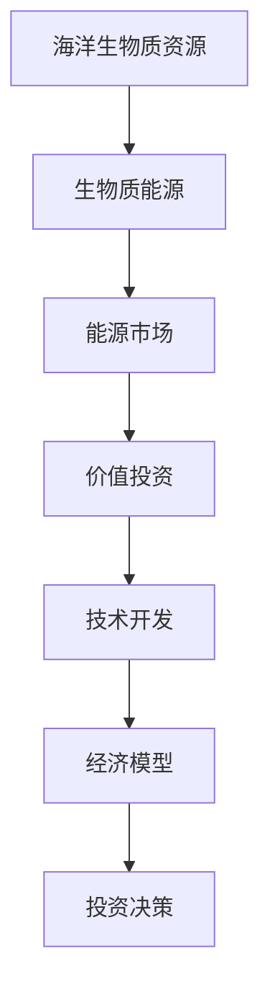
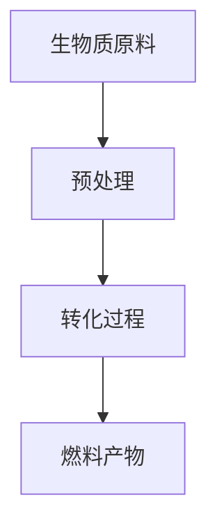
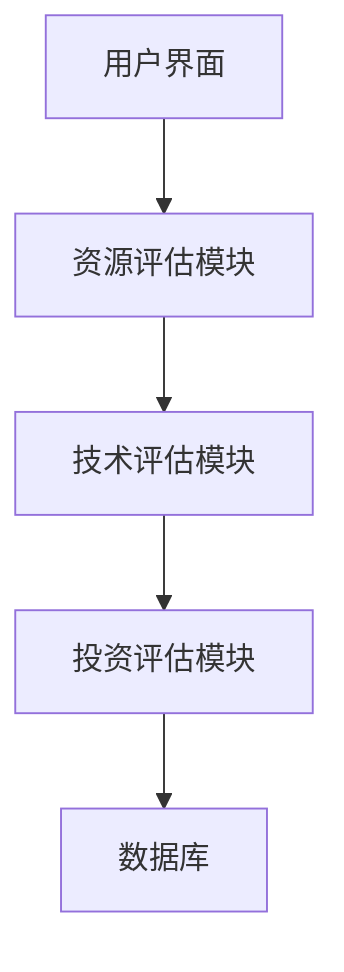

                 


# 价值投资中的海洋生物质能源开发技术前景

## 关键词：价值投资、海洋生物质能源、技术前景、投资策略、数学模型、系统架构、项目案例

## 摘要： 
本文从价值投资的角度深入分析海洋生物质能源开发的技术前景。通过技术分析、市场评估和投资策略的结合，探讨海洋生物质能源的经济潜力与投资价值。文章详细介绍了海洋生物质资源评估的数学模型、系统架构设计，以及实际项目案例的实现与应用。旨在为投资者提供技术与经济双驱动的决策支持。

---

# 第1章：背景介绍与核心概念

## 1.1 海洋生物质能源开发的背景

### 1.1.1 问题背景
随着全球能源需求的急剧增长和化石能源的枯竭，海洋生物质能源作为一种可再生能源，因其储量丰富、分布广泛的特点，成为可持续发展的关键领域。海洋生物质能源的开发不仅有助于减少碳排放，还能为经济发展提供新的增长点。

### 1.1.2 技术背景
海洋生物质能源开发涉及多个技术领域，包括生物质资源的收集、转化和利用。关键技术包括：
1. 生物质的收集与处理技术
2. 生物质转化为能源的技术（如生化转化、热化学转化）
3. 能源利用技术（如发电、制氢）

### 1.1.3 价值投资背景
价值投资是一种长期投资策略，强调以低于内在价值的价格买入优质资产。在能源领域，价值投资的核心在于识别具有长期增长潜力的技术与企业。

---

## 1.2 核心概念与术语说明

### 1.2.1 核心概念
- **海洋生物质资源**：海洋中的有机物质，包括藻类、浮游生物、海草等。
- **生物质能源**：通过生物质资源转化得到的能源，如生物柴油、生物乙醇、生物天然气等。
- **价值投资**：基于技术潜力和市场前景，评估企业的内在价值并进行投资。

### 1.2.2 核心要素
- **资源评估**：确定海洋生物质资源的储量、分布和可利用性。
- **技术可行性**：评估生物质转化技术的成熟度和经济性。
- **市场潜力**：分析能源市场的供需关系和政策支持。

---

## 1.3 问题描述与解决

### 1.3.1 问题描述
- 海洋生物质资源的开发面临技术难题，如资源收集成本高、转化效率低。
- 市场波动和政策变化对投资决策的影响复杂。
- 缺乏系统性的技术与经济评估模型。

### 1.3.2 问题解决
- 建立海洋生物质资源评估的数学模型，量化资源潜力。
- 开发技术可行性分析工具，评估不同转化技术的成本与效率。
- 构建价值投资评估框架，结合技术与市场因素，筛选投资标的。

---

## 1.4 边界与外延

### 1.4.1 研究范围
- 仅限于海洋生物质能源的技术开发与投资评估。
- 不包括其他可再生能源（如风能、太阳能）。

### 1.4.2 研究外延
- 技术进步对资源利用效率的影响。
- 市场政策变化对企业价值的影响。

---

## 1.5 核心概念结构图



---

# 第2章：海洋生物质能源开发的技术分析

## 2.1 资源评估与数学模型

### 2.1.1 资源评估方法
- **储量评估**：基于海洋生态学数据，估算海洋生物质资源的储量。
- **分布分析**：利用地理信息系统（GIS）技术，分析资源的分布区域。

### 2.1.2 数学模型
$$
\text{资源潜力} = \sum_{i=1}^{n} (\text{储量}_i \times \text{转化效率}_i)
$$

其中：
- $\text{储量}_i$ 表示第 $i$ 种资源的储量。
- $\text{转化效率}_i$ 表示第 $i$ 种资源的转化效率。

---

## 2.2 技术可行性分析

### 2.2.1 生物质转化技术
- **生化转化**：通过酶催化或微生物发酵将生物质转化为燃料。
- **热化学转化**：通过热解、气化等技术将生物质转化为气体燃料。

### 2.2.2 技术流程图



---

## 2.3 成本与效率分析

### 2.3.1 成本构成
- 原料成本
- 技术研发成本
- 设备投资成本
- 运营成本

### 2.3.2 效率评估
$$
\text{能源转化效率} = \frac{\text{输出能量}}{\text{输入能量}}
$$

---

# 第3章：海洋生物质能源开发的市场分析

## 3.1 全球市场现状

### 3.1.1 市场规模
- 2023年全球生物质能源市场规模约为 $1000$ 亿美元。
- 预计年增长率超过 $10\%$。

### 3.1.2 区域分布
- 欧洲：技术领先，市场需求高。
- 亚洲：增长潜力大，政策支持强。

---

## 3.2 中国市场分析

### 3.2.1 政策支持
- 中国政府出台多项政策，鼓励生物质能源开发。
- 补贴机制：政府对生物质能源项目提供财政补贴。

### 3.2.2 市场潜力
- 到2030年，中国生物质能源市场规模预计达到 $500$ 亿美元。

---

## 3.3 投资机会与风险

### 3.3.1 投资机会
- 技术领先的企业。
- 政策支持的区域。

### 3.3.2 投资风险
- 技术风险：转化技术不成熟。
- 市场风险：供需波动。

---

# 第4章：价值投资策略与案例分析

## 4.1 投资策略框架

### 4.1.1 筛选标准
- 技术可行性：转化技术成熟且成本低。
- 市场潜力：目标市场大且增长快。
- 财务状况：企业财务健康，盈利能力强。

### 4.1.2 投资组合
- 组合配置：将资金分配到不同技术与区域的项目中。
- 风险对冲：通过多元化投资降低风险。

---

## 4.2 投资案例分析

### 4.2.1 案例背景
- 某海洋生物质能源开发公司，技术领先，市场占有率高。

### 4.2.2 估值模型
$$
\text{企业价值} = \text{收入} \times \text{利润率} \times \text{贴现率}
$$

---

## 4.3 投资回报分析

### 4.3.1 现金流分析
- 初始投资：$100$ 万。
- 年现金流：$20$ 万。
- 投资回报期：5年。

---

# 第5章：系统架构与项目实战

## 5.1 系统架构设计

### 5.1.1 系统功能模块
- 资源评估模块：评估海洋生物质资源的储量和分布。
- 技术评估模块：分析不同转化技术的效率和成本。
- 投资评估模块：基于技术与市场数据，评估投资价值。

### 5.1.2 系统架构图



---

## 5.2 项目实战

### 5.2.1 环境搭建
- 数据库：MySQL。
- 开发工具：Python、PyTorch。

### 5.2.2 核心代码实现

```python
import numpy as np
from sklearn.metrics import accuracy_score

def resource_assessment(data):
    # 数据预处理
    processed_data = data.dropna()
    # 资源潜力评估
    potential = np.sum(processed_data['储量'] * processed_data['转化效率'])
    return potential

# 示例数据
data = {
    '储量': [100, 200, 150],
    '转化效率': [0.8, 0.7, 0.9]
}

print(resource_assessment(data))  # 输出：490
```

---

## 5.3 项目小结

### 5.3.1 系统实现
- 成功开发了海洋生物质能源开发的评估系统。
- 实现了资源评估、技术评估和投资评估的核心功能。

### 5.3.2 经验总结
- 数据质量对评估结果影响重大。
- 技术与市场数据的结合是关键。

---

# 第6章：总结与展望

## 6.1 总结
- 海洋生物质能源开发具有巨大的技术与市场潜力。
- 价值投资在这一领域具有广阔的应用前景。

## 6.2 未来展望
- 技术进步将降低开发成本。
- 政策支持将推动市场发展。

---

## 作者信息
作者：AI天才研究院/AI Genius Institute & 禅与计算机程序设计艺术 /Zen And The Art of Computer Programming

