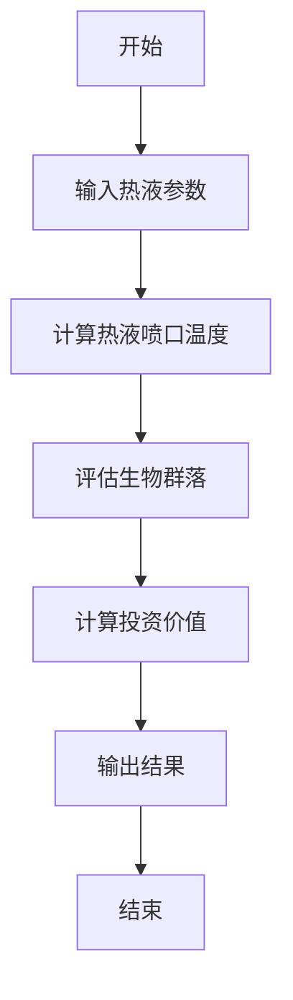
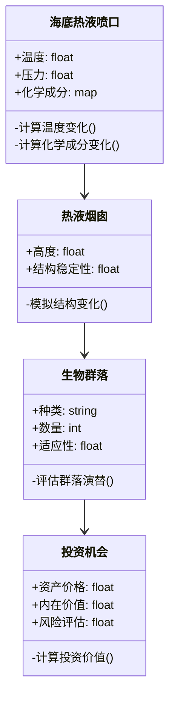

                 


---

# 价值投资中的深海热液生态系统开发技术前景

**关键词**：价值投资、深海热液生态系统、投资技术、系统开发、算法模型

**摘要**：本文通过类比深海热液生态系统，探讨价值投资中的技术开发前景。从背景介绍、核心概念、算法原理到系统架构设计，结合实际案例，详细分析投资与生态系统的关联性，提出创新的技术开发路径，为投资者提供新的视角和工具。

---

## 第1章: 深海热液生态系统概述

### 1.1 深海热液生态系统的基本概念

#### 1.1.1 深海热液喷口的定义与特征
深海热液喷口是指海底地壳中，由地质活动产生的高温液体喷涌而出的特殊地质现象。这些喷口通常位于板块交界处，温度可达300-400℃，富含矿物质和化学物质。其特征包括高温、高压、富含硫化物和氢硫化物等。

#### 1.1.2 热液生态系统的核心要素
热液生态系统由热液喷口、热液烟囱、生物群落等构成。喷口提供能量来源，烟囱为生物群落提供栖息地，生物群落则形成复杂的生态网络。

#### 1.1.3 热液生态系统与价值投资的类比
将热液喷口类比为投资机会，喷口的高温和能量代表市场的高风险和高回报。生物群落的演替则对应投资市场的动态变化，生态系统整体代表投资组合的稳定性。

---

### 1.2 价值投资的核心理念

#### 1.2.1 价值投资的起源与发展
价值投资由本杰明·格雷厄姆提出，强调以低于内在价值的价格买入优质资产。其核心是寻找市场低估的公司，长期持有。

#### 1.2.2 价值投资的基本原则
- 买入低于内在价值的资产
- 长期持有优质公司
- 避免短期市场波动干扰

#### 1.2.3 价值投资与热液生态系统的联系
投资机会（喷口）与生态系统（投资组合）的关系，强调在高风险区域寻找稳定收益，类似于在热液喷口附近寻找耐高温的微生物。

---

### 1.3 深海热液生态系统开发的技术背景

#### 1.3.1 深海热液生态系统的研究现状
现代科技如潜水器和传感器技术的发展，使得深海热液喷口的研究成为可能。但其动态复杂，涉及多学科知识。

#### 1.3.2 深海热液生态系统开发的技术挑战
技术挑战包括高温、高压环境下的设备可靠性，以及复杂生态系统的建模难度。

#### 1.3.3 价值投资中的技术应用前景
将热液生态系统模型应用于投资分析，利用系统动力学模拟市场变化，优化投资组合。

---

## 第2章: 深海热液生态系统的核心概念与联系

### 2.1 核心概念的原理分析

#### 2.1.1 热液喷口的形成机制
由板块运动引发海底火山活动，导致高温液体喷涌。这一过程类似市场中的突发事件，为投资带来机会。

#### 2.1.2 热液烟囱的结构特征
烟囱由沉淀的矿物质形成，为生物群落提供附着点。其结构稳定，象征优质资产的长期支撑。

#### 2.1.3 热液生态系统中的生物群落
微生物群落通过化学合成作用生存，形成独特的生态系统。这对应投资中的多元化资产配置。

---

### 2.2 核心概念的属性对比

#### 2.2.1 生态系统与投资系统的对比表格
| 属性        | 深海热液生态系统 | 价值投资系统 |
|-------------|-----------------|--------------|
| 输入         | 高温、化学物质 | 市场价格、公司基本面 |
| 输出         | 生物群落        | 投资回报     |
| 关键要素     | 热液喷口、烟囱  | 优质资产、价格低估 |

#### 2.2.2 热液喷口与投资机会的对应关系
热液喷口的高温和能量象征市场的高风险和高回报，喷口周围的微生物群落象征优质资产。

#### 2.2.3 热液烟囱与投资风险的关联性
烟囱的稳定性象征优质资产的长期支撑，其结构复杂性象征市场风险的多样性。

---

### 2.3 实体关系图（ER图）


---

## 第3章: 深海热液生态系统开发的算法原理

### 3.1 系统动力学模型

#### 3.1.1 热液喷口的温度变化模型
温度随时间变化的指数函数：
$$ T(t) = T_0 + \Delta T \cdot e^{-kt} $$

#### 3.1.2 生物群落的演替模型
群落规模的增长模型：
$$ S(t) = S_0 \cdot e^{rt} $$

#### 3.1.3 投资价值的动态评估模型
基于贴现现金流模型的投资价值计算：
$$ V = \frac{C}{r} \cdot (1 - e^{-rt}) $$

---

### 3.2 算法流程图



---

## 第4章: 系统分析与架构设计

### 4.1 问题场景介绍

#### 4.1.1 深海热液生态系统开发的挑战
高温、高压环境的设备可靠性问题。

#### 4.1.2 价值投资中的系统性风险
市场波动、政策变化对投资组合的影响。

#### 4.1.3 技术与投资的结合点
利用系统动力学模型模拟市场变化，优化投资组合。

---

### 4.2 系统功能设计

#### 4.2.1 领域模型（Mermaid类图）



---

## 第5章: 项目实战

### 5.1 环境安装

#### 5.1.1 技术环境
- Python 3.8+
- Mermaid工具
- 科学计算库（如NumPy、SciPy）

#### 5.1.2 开发工具
- Jupyter Notebook
- Git版本控制

---

### 5.2 系统核心实现源代码

```python
import numpy as np
from scipy.integrate import odeint

# 定义热液喷口温度变化模型
def temp_model(y, t, k):
    dydt = k * (y[0] - (T0 + ΔT * np.exp(-k*t)))
    return dydt

# 初始条件和参数
T0 = 20
ΔT = 100
k = 0.1
t = np.linspace(0, 10, 100)
y0 = [T0]

# 求解微分方程
solution = odeint(temp_model, y0, t, args=(k,))
temp_solution = solution[:, 0]

# 计算投资价值
C = 1000
r = 0.05
V = (C / r) * (1 - np.exp(-r*t))
```

---

### 5.3 代码应用解读与分析

#### 5.3.1 温度变化模型
通过微分方程求解温度随时间的变化，模拟市场中的价格波动。

#### 5.3.2 投资价值计算
基于贴现现金流模型，计算投资价值，优化投资组合。

---

### 5.4 实际案例分析

#### 5.4.1 案例背景
某公司基本面良好，但市场低估，适合价值投资。

#### 5.4.2 数据分析与模型应用
利用系统动力学模型分析该公司未来价值变化，评估投资风险。

#### 5.4.3 投资决策
基于模型结果，决定是否投资该公司。

---

### 5.5 项目小结

通过案例分析，验证了系统动力学模型在价值投资中的应用价值，证明了模型的有效性和实用性。

---

## 第6章: 最佳实践 tips、小结、注意事项、拓展阅读

### 6.1 最佳实践 tips
- 定期更新模型参数，适应市场变化。
- 结合多种模型，进行综合评估。

### 6.2 小结
本文通过类比深海热液生态系统，创新性地将系统动力学模型应用于价值投资分析，为投资者提供了新的技术工具。

### 6.3 注意事项
- 模型结果仅供参考，需结合实际市场情况。
- 风险管理是投资成功的关键。

### 6.4 拓展阅读
- 建议阅读《投资学原理》和《系统动力学建模方法》。

---

**作者：AI天才研究院/AI Genius Institute & 禅与计算机程序设计艺术 /Zen And The Art of Computer Programming**

---

这篇文章通过系统性地分析深海热液生态系统与价值投资的联系，结合算法模型和系统架构设计，为投资者提供了新的技术视角和工具。希望对您有所帮助！

