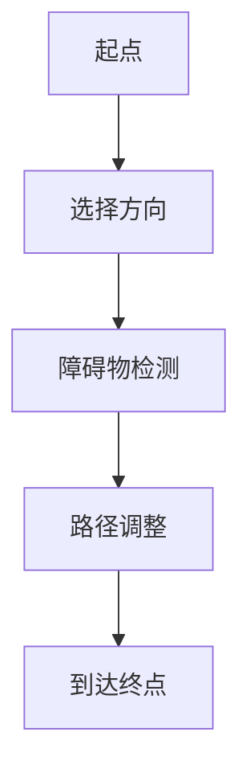
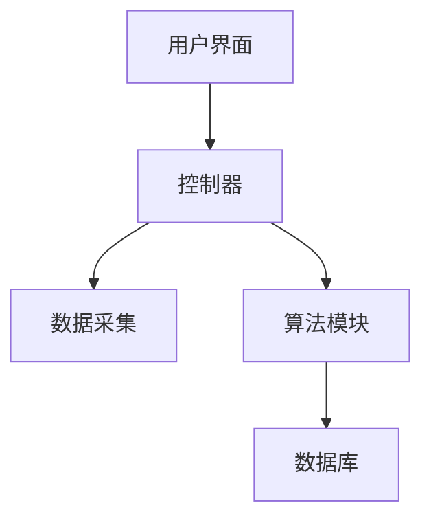

                 


# 价值投资中的深海采矿机器人技术前景

## 关键词：深海采矿、机器人技术、价值投资、技术前景、投资策略

## 摘要：  
随着深海资源开发的日益重要，深海采矿机器人技术正成为投资领域的新热点。本文从技术背景、核心概念、算法原理、系统架构、项目实战等多维度分析深海采矿机器人技术的前景，并结合价值投资的角度，探讨该技术对投资价值的影响。通过详细的技术分析和案例解读，为投资者提供科学的决策依据。

---

# 第一部分: 深海采矿机器人技术背景

## 第1章: 深海采矿机器人技术概述

### 1.1 深海采矿的定义与重要性  
深海采矿是指在海洋深处进行矿产资源的勘探和开采活动。随着陆地资源的逐渐枯竭，深海采矿成为全球关注的焦点。其重要性体现在以下几个方面：  
1. **资源丰富性**：深海矿床中含有大量的稀有金属和矿产资源，如多金属结核、多金属硫化物等。  
2. **经济价值**：这些资源在新能源、高科技产业中具有重要应用，如电池生产、半导体材料等。  
3. **技术挑战**：深海环境复杂，包括高压、低温、强腐蚀等极端条件，对采矿技术提出更高要求。  

### 1.2 机器人技术在深海采矿中的应用  
机器人技术是深海采矿的核心，其应用主要体现在以下几个方面：  
1. **自动化勘探**：机器人可以通过传感器和摄像头进行海底地形测绘和矿床定位。  
2. **精准开采**：机器人能够精确切割和提取矿石，减少对海底生态的破坏。  
3. **数据采集与分析**：机器人可以实时采集地质数据，为后续采矿决策提供支持。  

### 1.3 价值投资与深海采矿技术的结合  
价值投资的核心是寻找具有长期增长潜力的优质资产。深海采矿机器人技术的出现，为投资者提供了新的机会：  
1. **技术创新带来的投资价值**：机器人技术的突破将降低深海采矿的成本，提高效率。  
2. **市场前景广阔**：随着新能源产业的发展，深海矿产需求将大幅增长。  
3. **风险与收益的平衡**：投资者需要关注技术风险、政策风险和市场波动，选择具有核心竞争力的企业进行投资。  

---

## 第2章: 深海采矿机器人技术的核心概念与联系  

### 2.1 深海采矿机器人技术的核心原理  
深海采矿机器人技术结合了多种先进技术，包括：  
- **机器人控制技术**：实现机器人的自主操作和远程控制。  
- **人工智能技术**：用于数据处理、模式识别和决策优化。  
- **材料科学**：开发耐高压、耐腐蚀的机器人材料。  

### 2.2 深海采矿机器人技术的属性特征对比  

| 技术属性      | 特点描述                       |  
|----------------|-------------------------------|  
| 自主性         | 机器人具备自主决策能力       |  
| 精准性         | 高精度传感器和执行机构         |  
| 耐环境性       | 能够在高压、低温环境中稳定运行 |  

### 2.3 深海采矿机器人技术的ER实体关系图  
以下是深海采矿机器人技术的实体关系图：

```mermaid
erDiagram
    class Robot {
        id
        name
        type
        manufacturer
    }
    class Sensor {
        id
        type
        model
    }
    class Controller {
        id
        type
        manufacturer
    }
    class Data {
        id
        value
        timestamp
    }
    Robot --> Sensor : "uses"
    Robot --> Controller : "controlled by"
    Sensor --> Data : "senses"
    Controller --> Data : "processes"
```

---

## 第3章: 深海采矿机器人技术的算法原理  

### 3.1 算法原理概述  
深海采矿机器人技术的核心算法包括路径规划、目标识别和数据处理等。以下是一个典型的路径规划算法流程图：



### 3.2 算法的数学模型与公式  
路径规划算法的数学模型如下：  
$$ \text{路径长度} = \sqrt{(x_2 - x_1)^2 + (y_2 - y_1)^2} $$  
其中，$(x_1, y_1)$和$(x_2, y_2)$分别是起点和终点的坐标。  

### 3.3 算法的实现与代码  
以下是路径规划算法的Python实现代码：  

```python
import math

def calculate_distance(x1, y1, x2, y2):
    return math.sqrt((x2 - x1)**2 + (y2 - y1)**2)

# 示例调用
distance = calculate_distance(0, 0, 10, 10)
print(distance)  # 输出：14.1421...
```

---

## 第4章: 深海采矿机器人技术的系统分析与架构设计  

### 4.1 系统分析  
深海采矿机器人系统包括以下几个模块：  
- **数据采集模块**：负责收集海底地形和矿床数据。  
- **机器人控制模块**：实现机器人的自主操作。  
- **数据处理模块**：对采集的数据进行分析和优化。  

### 4.2 系统架构设计  



---

## 第5章: 深海采矿机器人技术的项目实战  

### 5.1 项目背景与目标  
某公司计划开发一款深海采矿机器人，目标是实现高效、低成本的深海矿产开采。  

### 5.2 项目实现步骤  
1. **需求分析**：明确机器人功能需求。  
2. **系统设计**：设计机器人架构和算法模块。  
3. **开发与测试**：编写代码并进行实验测试。  
4. **优化与部署**：根据测试结果优化系统性能。  

### 5.3 项目代码实现  
以下是机器人控制模块的Python代码示例：  

```python
class RobotController:
    def __init__(self, name):
        self.name = name
        self.position = (0, 0)

    def move_to(self, x, y):
        distance = calculate_distance(self.position[0], self.position[1], x, y)
        print(f"{self.name} 正在移动到 ({x}, {y})，距离为 {distance} 单位。")
        self.position = (x, y)

# 示例调用
robot = RobotController("DeepSeaBot")
robot.move_to(10, 10)
```

### 5.4 项目小结  
通过该项目，我们可以看到深海采矿机器人技术在实现中的关键步骤和技术难点。投资者需要关注技术的可行性和市场的接受度。

---

# 第六章: 总结与展望  

## 6.1 本章小结  
本文从技术背景、核心概念、算法原理、系统架构和项目实战等多个方面，详细分析了深海采矿机器人技术的前景。结合价值投资的角度，探讨了该技术对投资价值的影响。  

## 6.2 投资建议  
1. **关注技术创新**：优先选择具有自主知识产权和技术优势的企业。  
2. **评估市场风险**：深入了解深海采矿的政策法规和市场前景。  
3. **分散投资风险**：通过多元化投资降低单一项目的风险。  

## 6.3 未来展望  
随着人工智能和机器人技术的不断进步，深海采矿机器人技术将更加成熟。未来，投资者可以关注以下领域：  
- 新型采矿技术的研发与应用。  
- 深海采矿机器人技术的商业化进程。  
- 国际市场与政策法规的变化。  

---

# 作者：AI天才研究院 & 禅与计算机程序设计艺术

