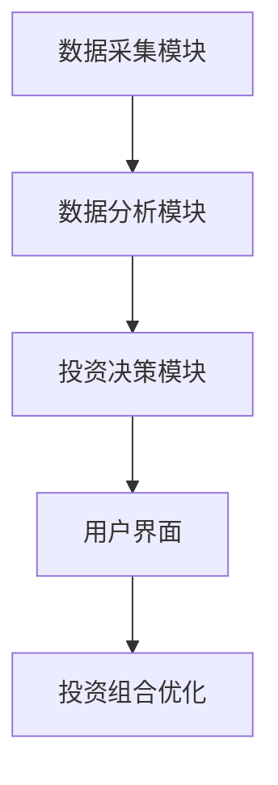

                 

# 《价值投资中的环境因素考量》

> **关键词**：价值投资、环境因素、宏观经济、行业分析、风险管理  
> **摘要**：本文探讨了在价值投资过程中，环境因素如何影响投资决策。通过分析宏观经济、行业和公司层面的环境因素，本文提供了系统的方法来评估这些因素对投资组合的影响，并给出了实际案例分析和风险管理策略。

---

## 第一部分：价值投资中的环境因素概述

### 第1章：环境因素的基本概念与重要性

#### 1.1 环境因素的定义与内涵

- **1.1.1 环境因素的定义**  
  环境因素是指外部和内部的各种条件，这些条件可能影响企业的经营状况、行业发展趋势以及宏观经济走向。在价值投资中，环境因素是评估企业长期价值的重要依据。

- **1.1.2 环境因素的核心要素**  
  - **宏观经济环境**：包括GDP增长率、通货膨胀率、利率水平等。
  - **行业环境**：包括行业生命周期、竞争结构、政策法规等。
  - **公司环境**：包括公司治理、管理团队、财务状况等。

- **1.1.3 环境因素与投资决策的关系**  
  环境因素通过影响企业的盈利能力、行业发展趋势和宏观经济状况，进而影响投资标的的价值和风险。

#### 1.2 环境因素对投资的影响机制

- **1.2.1 宏观环境对投资的影响**  
  宏观经济环境的变化直接影响企业的盈利能力和市场整体走势。例如，经济衰退可能导致企业利润下降，而通货膨胀可能增加企业的成本。

- **1.2.2 行业环境对投资的影响**  
  行业环境的变化直接影响企业的竞争地位和市场份额。例如，政策变化可能导致某些行业的需求增加或减少。

- **1.2.3 公司环境对投资的影响**  
  公司内部环境的变化，如管理团队的变动或财务状况的恶化，可能影响企业的长期发展。

#### 1.3 环境因素分析的方法与工具

- **1.3.1 宏观环境分析工具（PEST分析）**  
  PEST分析模型用于分析政治、经济、社会和技术环境。  
  - **政治因素**：政府政策、法律法规的变化。
  - **经济因素**：GDP增长率、利率、通货膨胀。
  - **社会因素**：人口结构、消费习惯。
  - **技术因素**：技术创新、技术法规。

- **1.3.2 行业环境分析工具（SWOT分析）**  
  SWOT分析模型用于分析优势（Strengths）、劣势（Weaknesses）、机会（Opportunities）和威胁（Threats）。  
  - **优势**：内部资源和能力。
  - **劣势**：内部资源和能力的不足。
  - **机会**：外部环境中的有利条件。
  - **威胁**：外部环境中的不利条件。

- **1.3.3 公司环境分析工具（价值链分析）**  
  价值链分析用于分析公司内部的各个价值创造环节，包括采购、生产、销售等。

#### 1.4 经典案例分析：环境因素在投资中的实际应用

- **1.4.1 石油行业环境变化对投资的影响**  
  石油行业的投资决策受到原油价格波动、政策法规和地缘政治的影响。例如，2020年的油价暴跌对石油公司的价值产生了重大影响。

- **1.4.2 科技行业政策环境变化对投资的影响**  
  科技行业受政策法规影响较大。例如，数据隐私法规的变化可能影响科技公司的业务模式。

- **1.4.3 消费行业市场环境变化对投资的影响**  
  消费行业的市场环境变化，如人口结构的变化，可能影响企业的目标客户群体和市场需求。

---

### 第2章：宏观经济环境对投资的影响

#### 2.1 宏观经济环境的核心指标

- **2.1.1 国内生产总值（GDP）与经济增长**  
  GDP是衡量经济活动的重要指标。经济增长率的变化直接影响企业的盈利能力。

- **2.1.2 消费者价格指数（CPI）与通货膨胀**  
  CPI衡量通货膨胀水平。通货膨胀可能导致企业成本上升，影响盈利能力。

- **2.1.3 利率与货币政策**  
  利率的变化直接影响企业的融资成本和投资决策。例如，低利率环境可能促进投资。

- **2.1.4 外汇汇率与国际贸易**  
  汇率变化影响出口企业的竞争力和国际贸易平衡。

#### 2.2 宏观经济周期对投资的影响

- **2.2.1 经济周期的定义与特征**  
  经济周期分为衰退、复苏、增长和繁荣四个阶段。不同阶段的投资策略不同。

- **2.2.2 不同经济周期阶段的投资策略**  
  - **衰退阶段**：倾向于防御性投资，如债券。
  - **复苏阶段**：倾向于周期性股票。
  - **增长阶段**：倾向于成长股。
  - **繁荣阶段**：倾向于高增长行业。

- **2.2.3 经济周期对行业选择的影响**  
  在衰退阶段，防御性行业（如公用事业）表现较好；在增长阶段，科技和制造业表现较好。

---

### 第3章：行业环境对投资的影响

#### 3.1 行业生命周期分析

- **3.1.1 行业生命周期的四个阶段**  
  - 初创期：高增长、高风险。
  - 成长期：增长稳定、竞争加剧。
  - 成熟期：增长放缓、竞争饱和。
  - 衰退期：需求下降、企业利润减少。

- **3.1.2 不同行业周期的投资策略**  
  - 初创期：寻找具有创新能力和竞争优势的企业。
  - 成长期：投资于市场份额增长的企业。
  - 成熟期：投资于高分红企业。
  - 衰退期：避免投资于夕阳行业。

#### 3.2 行业竞争结构分析

- **3.2.1 五力分析模型**  
  五力分析模型（波特的五力模型）包括新进入者的威胁、替代品的威胁、供应商的议价能力、买家的议价能力和现有竞争者之间的竞争程度。

- **3.2.2 行业集中度分析**  
  高集中度行业通常具有更强的定价能力和更高的利润率。

#### 3.3 行业趋势预测

- **3.3.1 技术进步对行业的影响**  
  技术创新可能改变行业的竞争格局和盈利模式。

- **3.3.2 政策变化对行业的影响**  
  政策变化可能直接影响行业的市场需求和企业运营。

---

### 第4章：公司环境对投资的影响

#### 4.1 公司治理结构

- **4.1.1 公司治理的重要性**  
  良好的公司治理能够提高企业的透明度和管理效率。

- **4.1.2 公司治理的关键要素**  
  - 股东结构
  - 董事会结构
  - 高管团队

#### 4.2 管理团队

- **4.2.1 管理团队的能力与经验**  
  优秀的管理团队能够带领企业应对挑战和抓住机会。

- **4.2.2 管理团队的稳定性**  
  管理团队的频繁变动可能影响企业的长期发展。

#### 4.3 财务状况分析

- **4.3.1 财务报表分析**  
  - 利润表：评估企业的盈利能力。
  - 资产负债表：评估企业的资产结构和负债水平。
  - 现金流量表：评估企业的现金流情况。

- **4.3.2 财务比率分析**  
  - 偿债能力：流动比率、速动比率。
  - 盈利能力：净利率、ROE。
  - 运营效率：存货周转率、应收账款周转率。

---

### 第5章：投资策略与风险管理

#### 5.1 投资策略制定

- **5.1.1 确定投资目标**  
  明确投资目标和风险承受能力。

- **5.1.2 分析环境因素**  
  结合宏观经济、行业和公司环境进行综合分析。

- **5.1.3 构建投资组合**  
  根据环境分析结果，选择具有竞争优势和长期增长潜力的企业。

#### 5.2 风险管理

- **5.2.1 风险识别**  
  识别可能影响投资的主要风险因素。

- **5.2.2 风险评估**  
  评估各个风险因素的影响程度和发生概率。

- **5.2.3 风险控制**  
  通过分散投资、设定止损等方式降低风险。

#### 5.3 投资组合优化

- **5.3.1 资产配置**  
  根据风险偏好和市场环境，合理配置股票、债券、现金等资产。

- **5.3.2 定期再平衡**  
  定期调整投资组合，以适应市场环境的变化。

---

### 第6章：环境因素考量的系统架构设计

#### 6.1 系统功能设计

- **6.1.1 数据采集模块**  
  采集宏观经济数据、行业数据和公司数据。

- **6.1.2 数据分析模块**  
  对数据进行清洗、分析和建模，评估环境因素对投资的影响。

- **6.1.3 投资决策模块**  
  根据分析结果，生成投资策略和风险提示。

#### 6.2 系统架构设计

---

### 第7章：项目实战与案例分析

#### 7.1 项目实战：分析能源行业的投资机会

- **7.1.1 项目背景**  
  当前能源行业受政策和技术创新的双重影响。

- **7.1.2 数据分析**  
  使用Python进行数据分析，评估能源企业的财务状况和行业趋势。

- **7.1.3 投资策略制定**  
  根据分析结果，选择具有竞争优势的企业进行投资。

#### 7.2 案例分析：某能源公司投资决策

- **7.2.1 公司背景**  
  某能源公司是行业龙头企业，具有较强的市场竞争力。

- **7.2.2 数据分析**  
  通过财务报表分析，评估公司的盈利能力和发展潜力。

- **7.2.3 投资建议**  
  建议长期持有该公司的股票，同时关注政策变化和行业趋势。

---

## 第二部分：总结与展望

### 第8章：总结与注意事项

#### 8.1 总结

- 环境因素是价值投资中的重要考量因素。
- 投资者需要综合考虑宏观经济、行业和公司环境的影响。
- 通过系统的分析和科学的投资策略，可以有效降低投资风险并提高收益。

#### 8.2 注意事项

- **避免过度依赖单一因素**：环境因素只是投资决策的一部分，需要结合其他因素综合分析。
- **持续关注环境变化**：环境因素可能会随时间发生变化，投资者需要及时调整投资策略。
- **合理分散投资**：通过分散投资降低单一环境因素变化带来的风险。

### 第9章：未来展望与最佳实践

#### 9.1 未来展望

- **人工智能在环境因素分析中的应用**  
  人工智能技术可以帮助投资者更准确地预测环境变化对投资的影响。

- **ESG投资的兴起**  
  环境、社会和治理（ESG）因素越来越受到投资者的重视。

#### 9.2 最佳实践

- **持续学习**：保持对宏观经济、行业和公司环境变化的关注。
- **使用工具辅助**：利用数据分析工具和模型提高投资决策的科学性。
- **保持风险意识**：在投资过程中时刻关注风险，合理控制投资组合。

---

## 作者简介

作者：AI天才研究院/AI Genius Institute & 禅与计算机程序设计艺术/Zen And The Art of Computer Programming

---

感谢您的阅读！希望这篇文章能为您提供有价值的投资见解和实用的分析方法。

