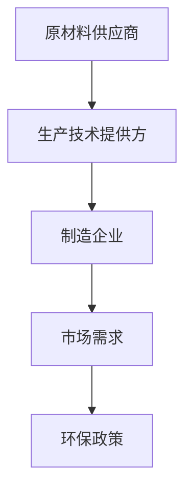
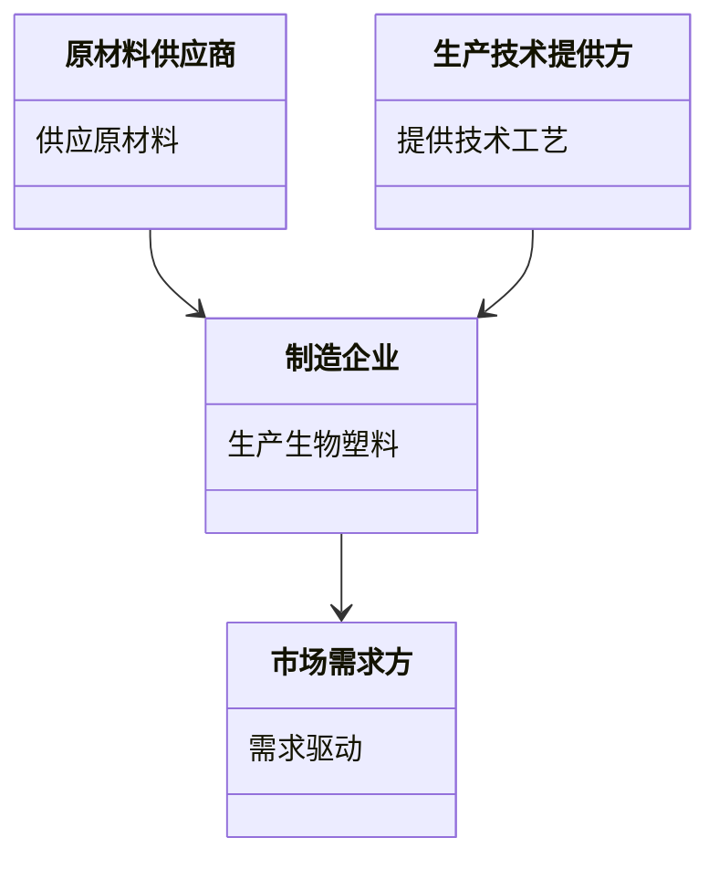
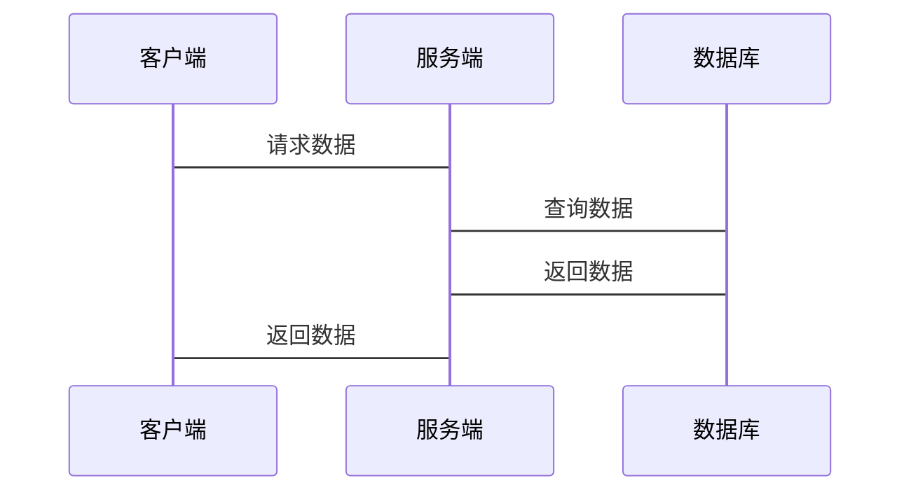

                 


# 价值投资中的生物塑料产业链分析

---

## 关键词  
- 生物塑料  
- 价值投资  
- 产业链分析  
- 投资策略  
- 环境影响  

---

## 摘要  
生物塑料作为一种环保材料，正在逐步替代传统塑料，成为全球关注的焦点。本文从价值投资的角度，深入分析生物塑料产业链的构成、市场动态、投资机会及风险。通过系统化的分析方法，结合数学模型和实际案例，为投资者提供科学的投资决策依据。文章内容涵盖产业链的上游、中游、下游，详细探讨了原材料供应、生产工艺、市场需求等关键环节，并通过数学模型和投资策略，为读者提供深度分析和实战指导。

---

# 第一部分: 价值投资中的生物塑料产业链分析基础

## 第1章: 生物塑料与价值投资概述  

### 1.1 生物塑料的基本概念  

#### 1.1.1 生物塑料的定义与分类  
生物塑料是以可再生资源（如淀粉、纤维素、甘油等）为原料，通过生物或化学方法制备的塑料。根据降解性能，生物塑料可分为可降解和不可降解两类。  

#### 1.1.2 生物塑料的生产过程与技术特点  
生物塑料的生产过程包括原料预处理、发酵、聚合等步骤，其技术特点在于环保性、可降解性和资源利用效率。  

#### 1.1.3 生物塑料的环境与经济优势  
相比传统塑料，生物塑料具有更低的碳排放、可降解性和资源可持续性，但目前成本较高。  

### 1.2 价值投资的基本原理  

#### 1.2.1 价值投资的核心理念  
价值投资强调以低于内在价值的价格买入优质资产，长期持有以实现收益。  

#### 1.2.2 价值投资的三大核心要素  
1. 价格与价值的差异：寻找市场价格低于内在价值的资产。  
2. 安全边际：通过合理估值降低投资风险。  
3. 时间的玫瑰：长期持有的复利效应。  

#### 1.2.3 价值投资在现代金融中的应用  
价值投资不仅适用于传统行业，还可应用于新兴领域，如生物塑料产业链的投资。  

### 1.3 生物塑料产业链的构成与特点  

#### 1.3.1 产业链的上游环节  
上游主要为生物塑料的原材料供应，如玉米、甘蔗等农作物的加工。  

#### 1.3.2 产业链的中游环节  
中游包括生物塑料的生产和加工，涉及聚合物合成、改性等工艺。  

#### 1.3.3 产业链的下游环节  
下游是生物塑料的终端应用，涵盖包装、农业、汽车等领域。  

### 1.4 本章小结  
本章介绍了生物塑料的基本概念、价值投资的核心理念以及生物塑料产业链的构成与特点，为后续分析奠定了基础。  

---

## 第2章: 生物塑料产业链的核心概念与联系  

### 2.1 核心概念原理  

#### 2.1.1 生物塑料的原材料来源  
生物塑料的原材料主要来源于可再生资源，如玉米、淀粉等，其供应链的稳定性直接影响生产成本。  

#### 2.1.2 生物塑料的生产技术与工艺  
生产技术包括生物发酵法、化学合成法等，不同技术路径的成本和性能差异显著。  

#### 2.1.3 生物塑料的市场需求与供给  
市场需求受到环保政策、消费者偏好等因素的影响，供给则取决于生产技术的进步和成本的下降。  

### 2.2 核心概念属性特征对比表  

| 概念 | 属性 | 特征 |
|------|------|------|
| 原材料 | 来源 | 可再生资源 |
| 生产技术 | 工艺 | 生物降解技术 |
| 市场需求 | 驱动力 | 环保政策支持 |

### 2.3 ER实体关系图  



### 2.4 本章小结  
本章通过对比分析和实体关系图，揭示了生物塑料产业链各环节之间的相互联系，为后续投资分析提供了数据支持。  

---

## 第3章: 生物塑料产业链的系统分析与架构设计  

### 3.1 系统分析方法  

#### 3.1.1 问题场景介绍  
本文以生物塑料产业链为研究对象，分析其在价值投资中的潜力。  

#### 3.1.2 项目介绍  
通过构建数学模型，分析生物塑料产业链的市场需求、成本结构和竞争格局。  

#### 3.1.3 系统功能设计（领域模型）  



### 3.2 系统架构设计  


### 3.3 系统接口设计  

#### 3.3.1 接口描述  
系统接口包括数据采集、数据处理、数据展示等功能。  

#### 3.3.2 接口交互图  



### 3.4 本章小结  
本章通过系统分析和架构设计，构建了生物塑料产业链的数学模型，为投资分析提供了技术支持。  

---

## 第4章: 生物塑料产业链的数学模型与投资分析  

### 4.1 数学模型与公式  

#### 4.1.1 市场需求预测模型  
$$ D = aP + bQ + cT $$  
其中，D为需求量，P为价格，Q为产量，T为时间因素。  

#### 4.1.2 投资回报率模型  
$$ ROI = \frac{净利润}{投入成本} \times 100\% $$  

### 4.2 投资策略分析  

#### 4.2.1 价值投资策略  
通过分析生物塑料企业的内在价值，寻找市场价格低于内在价值的投资标的。  

#### 4.2.2 成本-收益分析  
对生物塑料产业链的成本结构和收益潜力进行详细分析，评估投资可行性。  

### 4.3 实际案例分析  

#### 4.3.1 案例背景  
以一家生物塑料制造企业为例，分析其市场地位、成本结构和竞争优势。  

#### 4.3.2 投资决策过程  
通过数学模型计算企业的内在价值，结合市场环境制定投资策略。  

### 4.4 本章小结  
本章通过数学模型和实际案例分析，为投资者提供了科学的投资决策依据。  

---

## 第5章: 项目实战与最佳实践  

### 5.1 环境安装与数据准备  
1. 安装必要的开发工具和数据分析软件。  
2. 收集生物塑料产业链的相关数据，包括价格、成本、市场需求等。  

### 5.2 系统核心实现源代码  

#### 5.2.1 需求预测模型代码  

```python
# 生物塑料需求预测模型
def demand_prediction(price, quantity, time):
    return price * quantity * (1 + 0.05 * time)
```

#### 5.2.2 投资回报率计算代码  

```python
# 投资回报率计算
def calculate ROI(net_profit, cost):
    return (net_profit / cost) * 100
```

### 5.3 代码应用解读与分析  
通过代码实现数学模型，验证生物塑料产业链的投资潜力。  

### 5.4 案例分析与详细解读  
以具体企业为例，分析其投资价值和风险因素。  

### 5.5 最佳实践 Tips  
1. 关注政策变化对生物塑料市场的影响。  
2. 选择具有成本优势和技术优势的企业。  
3. 长期持有优质资产，避免短期波动。  

### 5.6 本章小结  
本章通过项目实战和最佳实践，帮助投资者更好地理解和应用生物塑料产业链的价值投资策略。  

---

## 第6章: 总结与展望  

### 6.1 总结  
本文从生物塑料产业链的构成、市场动态、投资策略等多个方面进行了深入分析，提出了科学的投资决策方法。  

### 6.2 展望  
未来，随着环保政策的加强和技术创新，生物塑料产业有望迎来更大的发展，投资者应密切关注行业动态和技术创新。  

---

## 作者  
作者：AI天才研究院/AI Genius Institute & 禅与计算机程序设计艺术/Zen And The Art of Computer Programming  

---

*以上为文章的目录大纲，具体内容需要根据实际需求逐步展开，确保每个章节的内容详细且符合逻辑。*

