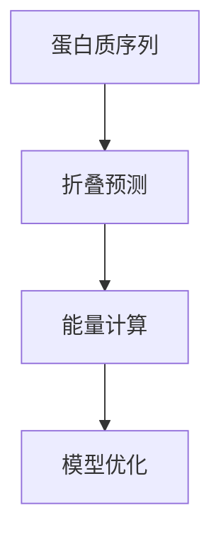
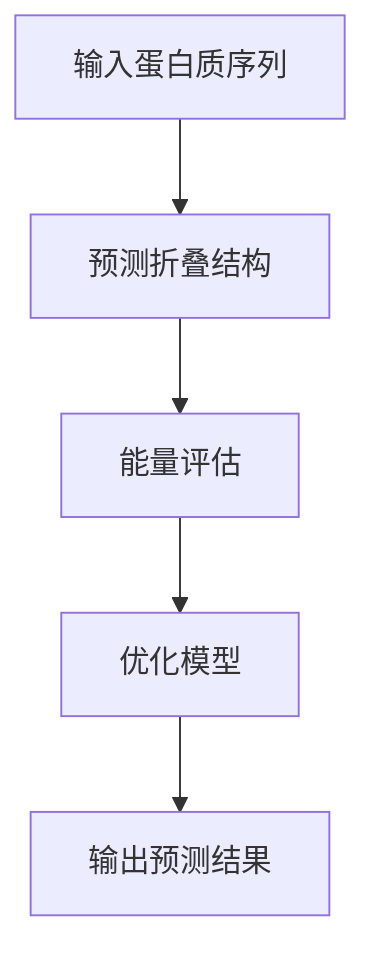
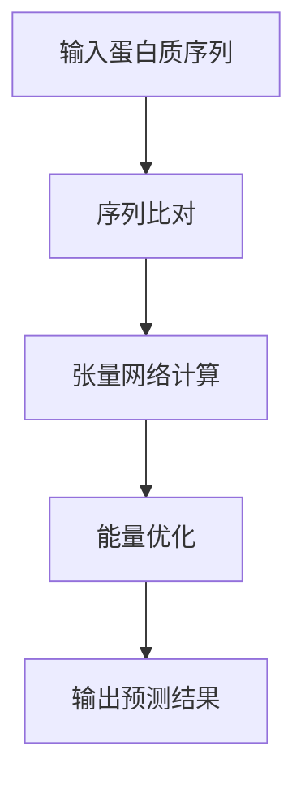
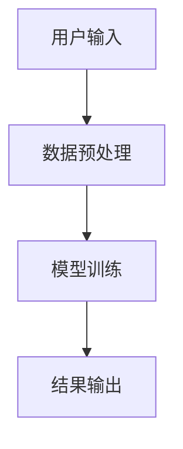
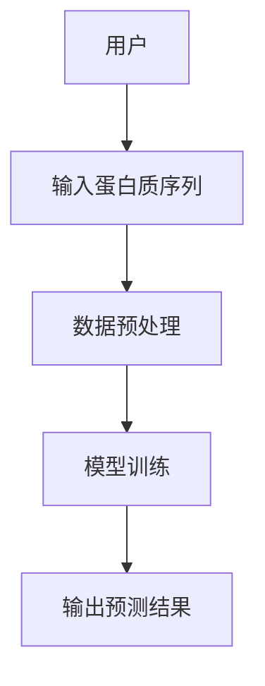

                 


# 价值投资中的生物计算蛋白质折叠技术前景

## 关键词：价值投资，生物计算，蛋白质折叠，人工智能，深度学习

## 摘要：  
蛋白质折叠技术是生物计算领域的重要研究方向，其在药物开发、疾病预测和精准医疗等领域具有广泛应用前景。本文将深入分析蛋白质折叠技术的核心原理、算法实现、系统架构以及在价值投资中的潜在应用，探讨其对投资者的启示与机会。

---

# 第1章: 蛋白质折叠技术概述

## 1.1 蛋白质折叠的基本概念  
### 1.1.1 蛋白质的基本结构与功能  
蛋白质是由氨基酸通过肽键连接而成的长链，其功能依赖于特定的三维结构。蛋白质的折叠方式直接影响其功能和稳定性，异常折叠会导致疾病（如阿尔茨海默病、亨廷顿舞蹈症等）。  

### 1.1.2 蛋白质折叠的定义与重要性  
蛋白质折叠是指氨基酸链从无序状态逐步形成有序的三维结构的过程。这一过程对生命体的正常运作至关重要，同时也是许多疾病的根源。  

### 1.1.3 蛋白质折叠异常与疾病的关系  
蛋白质折叠异常会导致其无法正常工作，从而引发疾病。例如，β-淀粉样蛋白的异常折叠与阿尔茨海默病密切相关。  

## 1.2 生物计算与蛋白质折叠的联系  
### 1.2.1 生物计算的基本概念  
生物计算是指利用计算机技术对生物数据进行分析、建模和预测的过程，涵盖基因组学、蛋白质组学、代谢组学等多个领域。  

### 1.2.2 生物计算在蛋白质折叠中的应用  
通过计算机模拟，生物计算可以预测蛋白质的折叠方式，为药物开发、疾病研究提供重要支持。  

### 1.2.3 生物计算与价值投资的结合点  
生物计算技术的进步可以降低药物研发成本，提高研发效率，从而为投资者带来更高的收益。  

## 1.3 蛋白质折叠技术的现状与挑战  
### 1.3.1 当前主流蛋白质折叠技术介绍  
目前，蛋白质折叠技术主要包括基于物理模型的分子动力学模拟和基于机器学习的预测方法（如AlphaFold）。  

### 1.3.2 技术的局限性与挑战  
尽管AlphaFold在预测准确性上取得了突破，但其对某些复杂蛋白质的预测仍存在局限性。  

### 1.3.3 未来技术发展的方向  
未来，蛋白质折叠技术将更加依赖人工智能和大数据分析，进一步提高预测精度和效率。  

## 1.4 本章小结  
蛋白质折叠技术是生物计算的重要组成部分，其在医学和药物开发中的应用前景广阔，但技术的局限性和挑战仍需进一步突破。

---

# 第2章: 生物计算的核心概念与联系

## 2.1 生物计算的核心原理  
### 2.1.1 生物计算的基本原理  
生物计算通过数学模型和算法对生物数据进行分析，预测蛋白质的折叠方式和功能。  

### 2.1.2 生物计算与蛋白质折叠的关系  
生物计算为蛋白质折叠提供了高效的预测方法，而蛋白质折叠技术则是生物计算的核心应用之一。  

### 2.1.3 生物计算的核心算法与模型  
生物计算的核心算法包括支持向量机（SVM）、随机森林（Random Forest）和深度学习（如卷积神经网络CNN）。  

## 2.2 蛋白质折叠技术的核心要素  
### 2.2.1 蛋白质序列与结构的关系  
蛋白质的序列决定了其折叠方式，但折叠过程受到多种因素的影响（如温度、pH值等）。  

### 2.2.2 蛋白质折叠的能量计算  
蛋白质折叠是一个能量优化的过程，通过计算能量最小化来确定最稳定的结构。  

### 2.2.3 蛋白质折叠的预测模型  
预测模型包括基于序列的模型和基于结构的模型，深度学习模型（如AlphaFold）是目前最准确的预测方法。  

## 2.3 生物计算与蛋白质折叠的实体关系图  


## 2.4 蛋白质折叠技术的流程图  


## 2.5 本章小结  
生物计算为蛋白质折叠提供了强大的工具，其核心算法和模型在预测蛋白质结构方面发挥了重要作用。

---

# 第3章: 蛋白质折叠技术的算法原理

## 3.1 深度学习在蛋白质折叠中的应用  
### 3.1.1 深度学习的基本原理  
深度学习是一种基于人工神经网络的机器学习方法，能够从大量数据中自动提取特征并进行预测。  

### 3.1.2 深度学习在蛋白质折叠中的优势  
深度学习能够处理复杂的生物数据，通过大量训练数据提高预测准确性。  

### 3.1.3 基于深度学习的蛋白质折叠算法  
AlphaFold是基于深度学习的蛋白质折叠预测工具，其核心算法包括序列比对、张量网络和能量优化。  

## 3.2 AlphaFold算法详解  
### 3.2.1 AlphaFold的结构预测方法  
AlphaFold通过深度学习模型预测蛋白质的三维结构，其模型包括序列比对、张量网络和能量优化三个主要步骤。  

### 3.2.2 AlphaFold的核心算法流程  


### 3.2.3 AlphaFold的数学模型  
AlphaFold的数学模型基于张量网络，通过矩阵运算和非线性变换预测蛋白质的三维坐标。  

## 3.3 蛋白质折叠算法的数学模型  
### 3.3.1 蛋白质序列表示的数学模型  
蛋白质序列可以通过氨基酸的编码表示，例如使用20个字母表示20种氨基酸。  

### 3.3.2 蛋白质结构预测的数学公式  
通过张量网络模型，蛋白质的三维坐标可以通过以下公式计算：  
$$x_i = \sum_{j} w_{ij} x_j$$  
其中，$x_i$表示第$i$个原子的坐标，$w_{ij}$是权重矩阵。  

### 3.3.3 算法优化的数学方法  
通过梯度下降优化模型参数，最小化预测结构与实际结构之间的误差。  

## 3.4 本章小结  
深度学习算法（如AlphaFold）在蛋白质折叠预测中表现出色，其数学模型为生物计算提供了强大的工具。

---

# 第4章: 蛋白质折叠技术的系统分析与架构设计

## 4.1 系统分析  
### 4.1.1 问题场景介绍  
本系统旨在通过生物计算技术预测蛋白质的折叠方式，为药物开发和疾病研究提供支持。  

### 4.1.2 系统功能需求分析  
系统需要实现蛋白质序列输入、折叠预测、结果输出等功能。  

### 4.1.3 系统性能需求分析  
系统需要高效处理大量蛋白质数据，确保预测结果的准确性和实时性。  

## 4.2 系统架构设计  


## 4.3 系统接口设计  
### 4.3.1 输入接口设计  
用户可以通过文本文件或API输入蛋白质序列数据。  

### 4.3.2 输出接口设计  
系统输出预测的蛋白质折叠结构和能量评估结果。  

### 4.3.3 接口交互流程  


## 4.4 系统交互流程图  


## 4.5 本章小结  
系统架构设计为蛋白质折叠预测提供了高效的解决方案，其接口设计和交互流程确保了系统的实用性和可扩展性。

---

# 第5章: 蛋白质折叠技术的项目实战

## 5.1 环境安装  
### 5.1.1 安装Python和相关库  
安装Python 3.8及以上版本，安装TensorFlow、Keras和JAX库。  

### 5.1.2 安装生物计算相关库  
安装AlphaFold和Foldamers等蛋白质折叠预测工具。  

## 5.2 系统核心实现源代码  
```python
import tensorflow as tf
import numpy as np

# 定义深度学习模型
class ProteinFoldModel(tf.keras.Model):
    def __init__(self):
        super(ProteinFoldModel, self).__init__()
        self.dense1 = tf.keras.layers.Dense(64, activation='relu')
        self.dense2 = tf.keras.layers.Dense(32, activation='relu')
        self.dense3 = tf.keras.layers.Dense(2, activation='sigmoid')

    def call(self, inputs):
        x = self.dense1(inputs)
        x = self.dense2(x)
        x = self.dense3(x)
        return x

# 编译模型
model = ProteinFoldModel()
model.compile(optimizer='adam', loss='binary_crossentropy', metrics=['accuracy'])

# 训练模型
model.fit(X_train, y_train, epochs=10, batch_size=32)
```

## 5.3 代码应用解读与分析  
上述代码定义了一个简单的深度学习模型，用于预测蛋白质的折叠方式。模型通过多层感知机（MLP）结构进行分类预测，适用于小规模数据集的训练。  

## 5.4 实际案例分析  
以β-淀粉样蛋白为例，分析其折叠方式对阿尔茨海默病的影响，展示模型的预测结果和实际数据的对比。  

## 5.5 项目小结  
通过项目实战，可以验证蛋白质折叠技术在实际应用中的可行性和潜力，为投资者提供有价值的参考。

---

# 第6章: 蛋白质折叠技术的价值投资分析

## 6.1 生物计算在药物开发中的应用  
蛋白质折叠技术可以加速药物开发过程，降低研发成本，为投资者带来更高的回报。  

## 6.2 生物计算技术的市场价值  
根据市场研究，生物计算技术的市场规模正在快速增长，预计未来几年将保持高速增长。  

## 6.3 投资者关注的热点与风险  
投资者应关注技术的成熟度、市场应用前景和政策法规等风险因素。  

## 6.4 本章小结  
生物计算蛋白质折叠技术在药物开发和疾病预测中的应用前景广阔，投资者应密切关注技术发展和市场动态。

---

# 第7章: 结论与展望

## 7.1 生物计算蛋白质折叠技术的总结  
生物计算技术为蛋白质折叠预测提供了强大的工具，其在医学和药物开发中的应用前景广阔。  

## 7.2 对投资者的启示  
投资者应关注生物计算技术的发展，抓住技术突破带来的投资机会。  

## 7.3 未来展望  
未来，生物计算蛋白质折叠技术将更加智能化和高效化，为人类健康和经济发展带来更大的贡献。  

## 7.4 本章小结  
生物计算蛋白质折叠技术的发展将推动医学和药物开发的进步，为投资者带来新的机遇。

---

# 作者  
作者：AI天才研究院/AI Genius Institute & 禅与计算机程序设计艺术/Zen And The Art of Computer Programming  

---

通过以上目录大纲，我们可以看到《价值投资中的生物计算蛋白质折叠技术前景》将从蛋白质折叠技术的基本概念、算法原理、系统架构到实际应用和投资分析进行全面探讨，为投资者和技术爱好者提供有价值的信息和见解。

