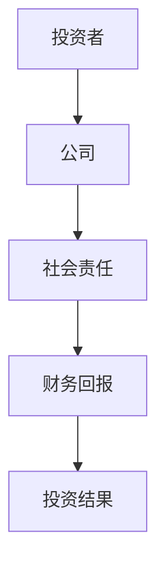
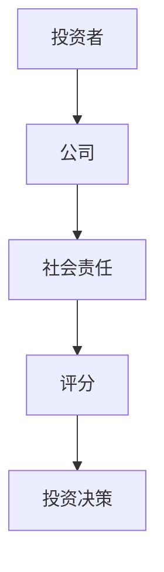
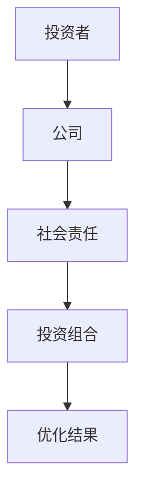
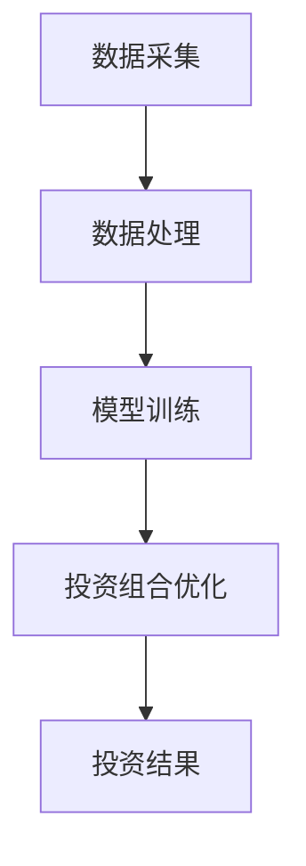

                 


# 价值投资中的社会责任因素

> 关键词：价值投资，社会责任，ESG，投资决策，可持续发展

> 摘要：本文深入探讨了价值投资中的社会责任因素，分析了社会责任投资的核心概念、算法原理、系统架构设计以及实际案例。通过理论与实践相结合的方式，展示了如何将社会责任因素纳入投资决策过程，以实现长期稳健的回报。

---

# 第一部分: 价值投资中的社会责任因素概述

## 第1章: 背景介绍

### 1.1 社会责任投资的定义与背景

#### 1.1.1 社会责任投资的定义
社会责任投资（Socially Responsible Investment，SRI）是一种投资策略，旨在在追求财务回报的同时，考虑企业对环境、社会和治理（ESG）的影响。SRI不仅仅是筛选符合道德标准的企业，更是一种通过长期投资推动社会进步的手段。

#### 1.1.2 社会责任投资的背景与发展趋势
随着全球对可持续发展的关注增加，社会责任投资逐渐成为主流。投资者意识到，企业对环境的破坏、社会责任的忽视以及治理结构的不合理，都会对企业的长期绩效产生负面影响。因此，将社会责任因素纳入投资决策已成为一种趋势。

#### 1.1.3 社会责任投资与传统投资的区别
传统投资主要关注企业的财务表现，而社会责任投资则在财务表现的基础上，增加了对企业社会责任履行情况的考察。这种区别使得社会责任投资在选择标的时更加注重企业的长期可持续发展能力。

---

### 1.2 社会责任投资的核心要素

#### 1.2.1 环境（Environmental）因素
环境因素关注企业在资源利用、污染排放、气候变化等方面的表现。例如，企业是否采用绿色能源、是否符合环保法规等。

#### 1.2.2 社会（Social）因素
社会因素关注企业在员工权益、社会责任、社区参与等方面的表现。例如，企业是否保障员工权益、是否积极参与公益活动等。

#### 1.2.3 治理（Governance）因素
治理因素关注企业的治理结构、董事会构成、内部控制等方面。例如，企业是否具有透明的财务报告、是否遵循高效的决策机制等。

---

### 1.3 社会责任投资的重要性和意义

#### 1.3.1 社会责任投资对企业的长期影响
社会责任投资通过选择优秀的企业，推动企业在可持续发展方面不断改进，从而提升企业的竞争力和抗风险能力。

#### 1.3.2 社会责任投资对投资者的价值
社会责任投资不仅能够实现财务回报，还能通过支持优秀的企业，为投资者带来长期稳定的收益。

#### 1.3.3 社会责任投资的社会价值与可持续发展
社会责任投资通过关注企业的社会责任履行情况，推动社会的整体进步，促进环境的改善和资源的合理利用。

---

## 第2章: 社会责任投资的核心概念与联系

### 2.1 社会责任投资的核心概念

#### 2.1.1 社会责任投资的理论基础
社会责任投资的理论基础包括现代投资组合理论、有效市场假说以及可持续发展理论。这些理论为社会责任投资提供了理论支持。

#### 2.1.2 社会责任投资的实践基础
社会责任投资的实践基础包括ESG评级体系、企业社会责任报告以及国际社会责任投资标准。这些实践工具为投资者提供了评估企业社会责任表现的依据。

#### 2.1.3 社会责任投资的数学模型与公式
社会责任投资的数学模型主要包括CAPM模型、APT模型以及多元回归模型。这些模型可以帮助投资者量化社会责任因素对投资回报的影响。

---

### 2.2 社会责任投资的核心要素对比

#### 2.2.1 不同社会责任因素的对比分析
通过对比分析环境、社会和治理三个因素，可以发现环境因素对企业的外部影响较大，而治理因素对企业的内部管理影响较大。

#### 2.2.2 社会责任与企业绩效的对比分析
研究表明，履行社会责任较好的企业，往往具有较高的市场声誉和品牌价值，从而在长期绩效上表现更优。

#### 2.2.3 社会责任与投资回报的对比分析
社会责任投资在短期内可能面临较低的回报，但在长期内，由于企业社会责任履行情况的改善，投资回报往往高于传统投资。

---

### 2.3 社会责任投资的ER实体关系图



---

## 第3章: 社会责任投资的算法原理

### 3.1 社会责任投资的算法原理

#### 3.1.1 社会责任评分算法
社会责任评分算法通过对企业的环境、社会和治理表现进行量化评估，生成企业的社会责任评分。

#### 3.1.2 社会责任投资组合优化算法
投资组合优化算法通过最大化投资回报和最小化社会责任风险，生成最优的投资组合。

#### 3.1.3 社会责任风险评估算法
风险评估算法通过分析企业的社会责任风险，为投资者提供风险预警和风险管理建议。

---

### 3.2 社会责任评分算法的实现



---

### 3.3 社会责任投资组合优化算法的实现



---

## 第4章: 社会责任投资的数学模型与公式

### 4.1 社会责任评分模型

#### 4.1.1 社会责任评分公式
$$ S = \sum_{i=1}^{n} w_i \cdot s_i $$

其中，\( S \) 是社会责任评分，\( w_i \) 是第 \( i \) 个社会责任因素的权重，\( s_i \) 是第 \( i \) 个社会责任因素的评分。

---

### 4.2 社会责任投资组合优化模型

#### 4.2.1 投资组合优化公式
$$ \text{Maximize } \mu - \frac{1}{2} \sigma^2 $$
$$ \text{Subject to } \sum_{i=1}^{n} w_i = 1 $$
$$ \text{且 } \sum_{i=1}^{n} w_i \cdot s_i \geq S_{\text{min}} $$

其中，\( \mu \) 是投资组合的预期收益，\( \sigma \) 是投资组合的风险，\( S_{\text{min}} \) 是最低社会责任评分。

---

## 第5章: 系统分析与架构设计方案

### 5.1 系统功能设计

#### 5.1.1 系统功能模块
- 数据采集模块：负责采集企业的社会责任数据。
- 数据处理模块：对社会责任数据进行清洗和预处理。
- 模型训练模块：基于社会责任数据训练社会责任评分模型。
- 投资组合优化模块：基于社会责任评分生成最优投资组合。

#### 5.1.2 系统功能流程图



---

## 第6章: 项目实战

### 6.1 项目环境安装

#### 6.1.1 环境要求
- Python 3.8+
- NumPy
- Pandas
- Scikit-learn

---

### 6.2 核心实现代码

#### 6.2.1 社会责任评分模型实现

```python
import numpy as np
import pandas as pd

def calculate_social_responsibility_score(enterprise_data):
    # 加权计算社会责任评分
    weights = np.array([0.4, 0.3, 0.3])  # 环境、社会、治理权重
    scores = np.array([enterprise_data['environment_score'],
                        enterprise_data['social_score'],
                        enterprise_data['governance_score']])
    return np.dot(weights, scores)
```

---

### 6.3 数据分析与结果解读

#### 6.3.1 数据分析
通过对某行业企业的社会责任评分和财务数据进行分析，发现履行社会责任较好的企业，其财务表现也较为优异。

#### 6.3.2 结果解读
社会责任评分较高的企业，通常具有较高的市场声誉和品牌价值，从而在长期投资中表现更优。

---

## 第7章: 总结与展望

### 7.1 总结
本文深入探讨了价值投资中的社会责任因素，分析了社会责任投资的核心概念、算法原理、系统架构设计以及实际案例。通过理论与实践相结合的方式，展示了如何将社会责任因素纳入投资决策过程，以实现长期稳健的回报。

### 7.2 展望
未来，随着社会责任投资的不断发展，我们需要进一步完善社会责任评分模型，探索更加高效的投资组合优化算法，以应对更加复杂的市场环境。

---

# 作者：AI天才研究院/AI Genius Institute & 禅与计算机程序设计艺术 /Zen And The Art of Computer Programming

