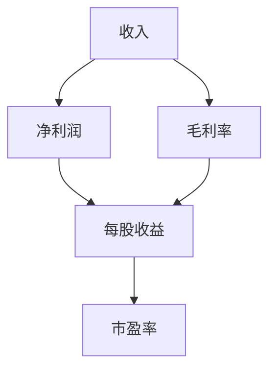

                 


```markdown
# 价值投资中的空间技术商业化前景

## 关键词
价值投资，空间技术，商业化前景，卫星互联网，太空资源，投资策略

## 摘要
随着技术的进步，空间技术正在迅速商业化，为投资者提供了新的机会。本文探讨了价值投资在空间技术商业化中的应用，分析了空间技术的现状、商业化模式、投资策略以及风险因素。通过理论与实践相结合，为投资者提供有价值的指导。

---

## 第一部分：引言
### 第1章：引言
#### 1.1 本书的目的与意义
在科技迅速发展的今天，空间技术正在从军事应用转向民用和商业领域。价值投资作为一种长期有效的投资策略，在这一领域具有广阔的应用前景。本书旨在探讨如何将价值投资的理念应用于空间技术的商业化过程中，帮助投资者识别潜在机会，规避风险。

#### 1.2 研究背景与现状
近年来，SpaceX等公司的成功展示了空间技术的商业化潜力。然而，这一领域仍然面临技术和市场的双重挑战。本文将从价值投资的角度，分析如何在这些挑战中寻找投资机会。

#### 1.3 研究方法与框架
本文结合了文献分析、案例研究和模型构建等方法，通过系统性分析，提出了空间技术商业化中的价值投资框架。

---

## 第二部分：价值投资基础
### 第2章：价值投资的起源与发展
#### 2.1 价值投资的定义与核心理念
价值投资是一种基于对公司内在价值评估的投资策略。其核心理念是寻找市场价格低于内在价值的公司，长期持有，等待市场重新估值。

#### 2.2 价值投资的历史发展与代表人物
价值投资的理论基础可以追溯到本杰明·格雷厄姆和戴维·多德。他们的理论在实践中被沃伦·巴菲特等投资者发扬光大。

#### 2.3 价值投资在现代金融中的地位
尽管现代金融学引入了更多的量化工具，价值投资仍然在长期投资中占据重要地位，尤其是在技术驱动的新兴领域。

---

### 第3章：价值投资的核心理论与方法
#### 3.1 股票内在价值的评估方法
内在价值的计算通常基于自由现金流折现模型（DCF）。本文将使用公式：
$$
\text{内在价值} = \sum_{t=1}^{n} \frac{\text{现金流}_t}{(1+r)^t} + \frac{残值}{(1+r)^n}
$$

#### 3.2 财务报表分析与估值模型
通过分析公司的财务报表，可以评估其盈利能力、成长性和财务健康状况。本文将使用Mermaid图展示财务指标分析框架。



#### 3.3 市场情绪与周期分析
市场情绪可以通过分析历史数据和投资者情绪指标（如恐慌指数）来判断。本文将使用时间序列分析模型预测市场周期。

---

### 第4章：价值投资的成功案例分析
#### 4.1 历史经典案例回顾
本文将分析巴菲特投资可口可乐等案例，探讨其成功的原因。

#### 4.2 近期成功投资案例分析
以SpaceX的投资为例，分析其估值逻辑和市场表现。

#### 4.3 案例分析的启示与经验总结
总结成功案例中的共同点，提出适用于空间技术投资的策略。

---

## 第三部分：空间技术商业化现状
### 第5章：空间技术的现状与发展
#### 5.1 卫星互联网技术的商业化进程
卫星互联网是5G时代的重要组成部分。本文将分析其商业模式，包括通信服务和数据服务。

#### 5.2 太空资源开发的技术与法律问题
太空资源的开发涉及技术难题和法律障碍。本文将探讨资源开发的潜力和挑战。

#### 5.3 空间探索的商业化模式
SpaceX等公司的成功展示了发射服务和太空旅游的商业化潜力。

---

### 第6章：空间技术商业化的核心技术与挑战
#### 6.1 卫星制造与发射技术
本文将分析卫星制造的成本下降趋势和发射技术的进步。

#### 6.2 空间数据采集与应用
数据应用是空间技术商业化的重要部分，包括遥感数据和通信数据。

---

## 第四部分：空间技术商业化中的价值投资分析
### 第7章：空间技术商业化的价值投资框架
#### 7.1 价值投资框架的构建
本文将构建一个基于DCF模型的评估框架，用于评估空间技术公司的内在价值。

#### 7.2 商业模式与竞争优势分析
分析公司的商业模式和竞争优势，例如成本优势和技术壁垒。

#### 7.3 风险因素与情景分析
通过情景分析，评估不同市场环境下的投资风险。

---

### 第8章：投资策略与案例分析
#### 8.1 不同领域的投资机会
本文将分析卫星制造、发射服务和太空资源开发等领域的投资机会。

#### 8.2 投资策略与实际案例
以SpaceX的投资为例，分析其估值逻辑和市场表现。

#### 8.3 案例分析的启示与经验总结
总结成功案例中的共同点，提出适用于空间技术投资的策略。

---

## 第五部分：空间技术商业化中的风险管理
### 第9章：风险管理与策略
#### 9.1 技术风险
分析技术失败和更新换代带来的风险。

#### 9.2 市场风险
评估市场需求变化和竞争格局的影响。

#### 9.3 政策风险
探讨政府政策变化对行业的影响。

#### 9.4 风险应对策略
提出分散投资、加强监控和建立预警机制等策略。

---

## 第六部分：未来趋势与展望
### 第10章：未来趋势与投资机会
#### 10.1 空间技术的发展方向
预测未来的技术进步和商业化趋势。

#### 10.2 投资机会的变化
分析技术进步和市场变化对投资机会的影响。

#### 10.3 应对策略
提出投资者应采取的应对策略。

---

## 结语
空间技术的商业化为价值投资提供了新的机遇和挑战。通过深入分析技术、市场和政策因素，投资者可以在这一领域找到长期稳定的收益。

---

## 作者
作者：AI天才研究院 & 禅与计算机程序设计艺术
```

