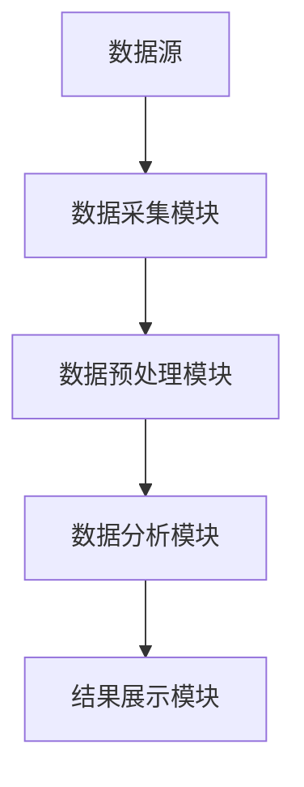
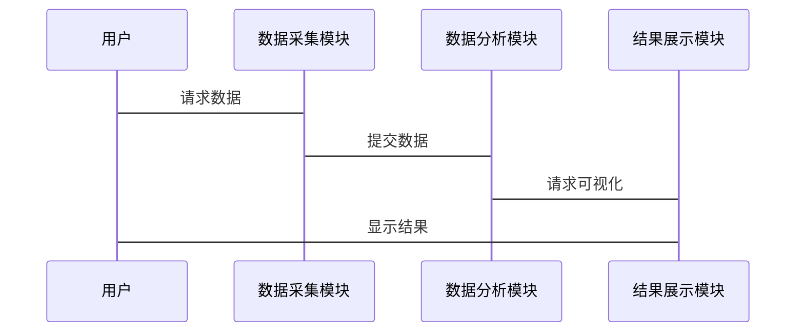

                 


# 价值投资中的绿色经济机遇

## 关键词：绿色经济，价值投资，可持续发展，投资策略，绿色金融

## 摘要：随着全球对可持续发展的关注不断增加，绿色经济正成为投资领域的重要趋势。本文将探讨绿色经济对价值投资的影响，分析绿色产业的特征、投资策略的优化方法，以及绿色经济与企业长期价值的关系。通过构建数学模型和投资决策支持系统，本文旨在为投资者提供科学的指导，帮助其在绿色经济中把握投资机遇。

---

# 第1章 绿色经济与价值投资的背景与概念

## 1.1 绿色经济的定义与特征

### 1.1.1 绿色经济的定义
绿色经济是以可持续发展为核心，强调环境保护、资源高效利用和经济结构优化的经济模式。其本质是通过技术创新和制度创新，实现经济增长与环境保护的协调统一。

### 1.1.2 绿色经济的核心特征
- **环保性**：减少资源消耗和环境污染。
- **可持续性**：强调长期发展，而非短期利益。
- **创新驱动**：依赖技术进步和制度创新。

### 1.1.3 绿色经济与传统经济的区别
- **目标**：传统经济注重 GDP 增长，绿色经济注重可持续发展。
- **资源利用**：传统经济浪费资源，绿色经济强调循环利用。
- **外部性**：绿色经济通过减少外部成本（如污染）提高效率。

## 1.2 价值投资的基本概念

### 1.2.1 价值投资的定义
价值投资是一种以企业基本面分析为基础的投资策略，旨在以低于内在价值的价格买入优质资产，长期持有，获得超额收益。

### 1.2.2 价值投资的核心理念
- **安全边际**：买入价格低于内在价值，以降低风险。
- **长期视角**：关注企业的长期盈利能力，而非短期波动。
- **选股标准**：选择具有竞争优势、良好治理和可持续发展的企业。

### 1.2.3 绿色经济与价值投资的结合
绿色经济的兴起为价值投资提供了新的维度。投资者需要将企业的环境、社会和治理（ESG）表现纳入分析框架，以识别具有长期竞争优势的绿色企业。

---

# 第2章 绿色经济与价值投资的核心概念

## 2.1 绿色产业的分析框架

### 2.1.1 绿色产业的分类
绿色产业可以分为以下几类：
- **清洁能源**：如太阳能、风能等可再生能源。
- **节能环保**：如节能设备、环保技术等。
- **绿色交通**：如电动汽车、智能交通系统等。
- **绿色建筑**：如绿色建筑、低碳城市等。

### 2.1.2 绿色产业的特征
- **高成长性**：绿色产业符合全球发展趋势，市场需求大。
- **高技术门槛**：依赖技术创新，竞争优势明显。
- **政策支持**：政府通过补贴、税收优惠等手段支持绿色产业发展。

## 2.2 价值投资中的绿色经济策略

### 2.2.1 绿色经济对投资决策的影响
- **企业价值评估**：绿色企业具有更高的社会价值和长期盈利能力，可能被市场给予更高的估值。
- **风险控制**：关注企业的环境风险，避免投资于高污染、高能耗企业。
- **投资机会**：绿色产业符合全球可持续发展趋势，具有较高的投资价值。

### 2.2.2 绿色经济与企业长期价值的关系
绿色企业通过技术创新和可持续发展，能够提升品牌价值、降低运营成本，并在未来的市场竞争中占据优势地位。

---

# 第3章 绿色经济中的数学模型与算法

## 3.1 绿色经济评价指标体系

### 3.1.1 指标体系构建
绿色经济评价指标可以从以下几个方面构建：
- **环境指标**：如单位 GDP 能耗、碳排放强度等。
- **经济指标**：如绿色产业增加值、就业率等。
- **社会指标**：如居民幸福感、社会公平度等。

### 3.1.2 层次分析法（AHP）的应用
层次分析法是一种用于多指标决策的分析方法，可以将复杂的决策问题分解为若干层次，通过比较和计算，确定各指标的权重。

$$
AHP\_weight = \frac{\sum w_i}{n}
$$

其中，$w_i$ 是各指标的权重，$n$ 是指标的数量。

### 3.1.3 案例分析：绿色企业的综合评价
假设某企业 A 和企业 B 的绿色经济指标如下：

| 指标       | 企业 A | 企业 B |
|------------|--------|--------|
| 碳排放强度 | 0.5    | 0.6    |
| 能耗效率   | 1.2    | 1.0    |
| 绿色收入占比 | 40%    | 30%    |

通过层次分析法，计算各指标的权重，并对企业进行综合评价。

## 3.2 投资决策支持系统的算法实现

### 3.2.1 算法流程
1. 数据采集：收集企业的 ESG 表现、财务数据等。
2. 数据预处理：清洗数据，处理缺失值。
3. 模型训练：使用机器学习算法（如随机森林、支持向量机）对数据进行分类或回归分析。
4. 结果分析：根据模型预测结果，筛选出具有投资价值的企业。

### 3.2.2 代码实现

```python
import pandas as pd
from sklearn.ensemble import RandomForestClassifier

# 数据加载
data = pd.read_csv('green_investment.csv')

# 数据预处理
data.dropna(inplace=True)

# 特征与标签分离
X = data.drop('target', axis=1)
y = data['target']

# 模型训练
model = RandomForestClassifier()
model.fit(X, y)

# 模型预测
predictions = model.predict(X)
```

---

# 第4章 投资决策支持系统的架构设计

## 4.1 系统功能设计

### 4.1.1 功能模块
- **数据采集**：从多种数据源（如企业财报、ESG报告）获取数据。
- **数据分析**：对数据进行清洗、建模和分析。
- **结果展示**：将分析结果以可视化形式呈现。

### 4.1.2 系统功能图（mermaid）



## 4.2 系统架构设计

### 4.2.1 系统架构图（mermaid）


### 4.2.2 接口设计
- **输入接口**：接受外部数据源的输入。
- **输出接口**：将分析结果输出为报告或可视化图表。

### 4.2.3 交互流程



---

# 第5章 项目实战：构建绿色经济投资分析系统

## 5.1 环境安装

### 5.1.1 安装依赖
```bash
pip install pandas scikit-learn matplotlib
```

## 5.2 核心代码实现

### 5.2.1 数据预处理
```python
import pandas as pd

data = pd.read_csv('green_investment.csv')
data = data.dropna()
```

### 5.2.2 模型训练
```python
from sklearn.ensemble import RandomForestClassifier

X = data.drop('target', axis=1)
y = data['target']

model = RandomForestClassifier()
model.fit(X, y)
```

### 5.2.3 结果分析
```python
importances = model.feature_importances_
print(importances)
```

## 5.3 案例分析

### 5.3.1 案例背景
某绿色能源公司，其财务数据和 ESG 表现如下：

| 指标       | 数据       |
|------------|------------|
| 营业收入   | 100 million |
| 净利润     | 10 million |
| 碳排放强度 | 0.5        |
| ESG 评分   | 85         |

### 5.3.2 分析结果
通过模型分析，该公司被判定为具有较高的投资价值。

---

# 第6章 绿色经济投资的实际应用

## 6.1 案例分析

### 6.1.1 案例背景
某投资者通过绿色经济投资策略，投资于一家新能源汽车公司。

### 6.1.2 投资回报
- 投资金额：100 万元
- 持股 3 年，年化收益率：20%

## 6.2 投资策略总结

### 6.2.1 关键成功因素
- 选择具有技术优势和政策支持的绿色企业。
- 关注企业的 ESG 表现，降低投资风险。

### 6.2.2 注意事项
- 绿色经济投资需要长期视角，避免短期波动。
- 注重风险管理，分散投资组合。

---

# 第7章 结论与展望

## 7.1 全文总结
绿色经济的兴起为价值投资提供了新的机遇。通过构建数学模型和投资决策支持系统，投资者可以更好地识别绿色产业中的优质企业，实现长期稳健的收益。

## 7.2 未来展望
随着技术的进步和政策的支持，绿色经济将在全球范围内得到更广泛的应用。未来的研究可以进一步探索绿色金融、ESG 投资等领域的创新。

---

# 作者：AI天才研究院/AI Genius Institute & 禅与计算机程序设计艺术 /Zen And The Art of Computer Programming

