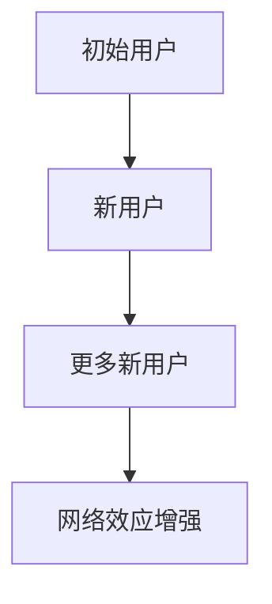

                 


# 价值投资中的网络效应分析

> **关键词**：价值投资、网络效应、用户增长模型、企业竞争优势、投资决策

> **摘要**：  
本文系统地探讨了网络效应在价值投资中的应用，从网络效应的基本概念到其在不同行业中的具体表现，结合数学模型和实际案例，分析了网络效应对企业价值的影响。文章还提供了网络效应的定量分析方法和系统架构设计，帮助投资者更好地理解和应用网络效应进行投资决策。

---

## 第1章: 网络效应的基本概念与价值投资的结合

### 1.1 网络效应的定义与核心特征

网络效应是指当一个产品的价值随着用户数量的增加而增加时的现象。其核心特征包括：

- **用户数量的正反馈效应**：用户越多，产品价值越高，进一步吸引更多用户。
- **边际成本递减**：随着用户数量增加，单位用户的边际成本降低。
- **边际收益递增**：用户数量的增加带来收益的非线性增长。

网络效应与价值投资的结合点在于，具有强网络效应的企业通常具有较高的护城河和持续的收益增长能力。

---

### 1.2 价值投资的基本原理

价值投资是一种以基本面分析为基础的投资策略，强调寻找市场低估的企业，长期持有以获得超额收益。其核心理念包括：

- **安全边际**：买入价格低于内在价值。
- **长期视角**：关注企业的长期增长潜力。
- **竞争优势**：寻找具有独特竞争优势的企业。

网络效应作为竞争优势的一种，能够显著提升企业的长期价值。

---

### 1.3 网络效应在价值投资中的重要性

网络效应对投资价值的影响主要体现在：

- **提升企业价值**：网络效应强的企业能够通过用户增长和成本分摊实现收益的快速增长。
- **巩固竞争优势**：网络效应使得竞争对手难以在短时间内复制商业模式。
- **指导投资决策**：网络效应对企业成长性和抗风险能力具有重要影响。

---

## 第2章: 网络效应的类型与分析框架

### 2.1 网络效应的分类

- **正向网络效应**：用户数量增加直接提升产品价值，例如社交媒体平台。
- **负向网络效应**：用户数量增加反而降低产品价值，例如某些通信网络。
- **双边网络效应**：产品价值依赖于两个或多个用户群体的相互作用，例如支付平台。

---

### 2.2 网络效应的分析框架

- **强度分析**：衡量用户增加对产品价值的影响程度。
- **范围分析**：评估网络效应在不同用户群体中的扩散情况。
- **可持续性分析**：判断网络效应是否能够长期维持。

---

### 2.3 网络效应与企业价值的关系

- **正向网络效应**能够显著提升企业价值，但需警惕负向网络效应的风险。
- **双边网络效应**在某些行业（如支付平台）中尤为重要。

---

## 第3章: 网络效应的数学模型与定量分析

### 3.1 网络效应的数学公式

- **用户增长模型**：  
  $$ \text{用户增长速度} = k \times e^{rt} $$  
  其中，$k$为初始用户数，$r$为增长率，$t$为时间。

- **收益增长模型**：  
  $$ \text{收益} = a \times n + b \times n^2 $$  
  其中，$a$为每用户的收益，$n$为用户数量，$b$为每用户对其他用户的影响系数。

- **成本分摊模型**：  
  $$ \text{边际成本} = \frac{C}{n} $$  
  其中，$C$为总成本，$n$为用户数量。

---

### 3.2 算法原理与流程图

使用mermaid绘制网络效应的传播过程：  


---

## 第4章: 网络效应在价值投资中的应用案例

### 4.1 社交媒体行业的网络效应分析

- **典型企业**：Facebook、Twitter。
- **分析**：用户生成内容的丰富性和用户粘性是网络效应的重要体现。
- **投资案例**：早期投资于社交媒体平台，随着用户数量的增加，企业价值迅速增长。

---

### 4.2 电子商务行业的网络效应分析

- **典型企业**：亚马逊、淘宝。
- **分析**：用户基数越大，平台的议价能力越强，商品种类越丰富。
- **投资案例**：投资于具有强大物流和用户基础的电商平台。

---

### 4.3 金融科技行业的网络效应分析

- **典型企业**：支付宝、PayPal。
- **分析**：用户基数越大，交易成本越低，用户信任度越高。
- **投资案例**：投资于具有广泛用户基础和高效支付系统的金融科技公司。

---

## 第5章: 网络效应的系统分析与架构设计

### 5.1 系统功能设计

- **领域模型**：使用mermaid类图展示用户、企业、平台之间的关系。  
  ```mermaid
  classDiagram
  class 用户 {
    用户ID
    用户名
    }
  class 企业 {
    企业ID
    企业名称
    }
  class 平台 {
    平台ID
    平台名称
    }
  用户 --> 平台: 使用平台
  企业 --> 平台: 提供服务
  ```

---

### 5.2 系统架构设计

- **架构图**：  
  ```mermaid
  graph TD
  用户 --> 服务层
  服务层 --> 数据层
  数据层 --> 持久化层
  ```

---

### 5.3 系统接口设计

- **用户接口**：注册、登录、使用平台功能。
- **企业接口**：入驻、提供服务、管理账户。

---

## 第6章: 项目实战

### 6.1 环境安装

- 安装必要的开发工具：Python、Jupyter Notebook、Mermaid CLI。

---

### 6.2 核心实现源代码

网络效应评估系统代码示例：  
```python
import numpy as np
import matplotlib.pyplot as plt

# 用户增长模型
def user_growth(k, r, t):
    return k * np.exp(r * t)

# 收益增长模型
def revenue(a, b, n):
    return a * n + b * n**2

# 成本分摊模型
def marginal_cost(C, n):
    return C / n

# 绘制用户增长曲线
k = 1000
r = 0.1
t = np.linspace(0, 10, 100)
plt.plot(t, user_growth(k, r, t))
plt.xlabel('时间')
plt.ylabel('用户数量')
plt.show()
```

---

### 6.3 代码应用解读

上述代码展示了如何使用数学模型模拟网络效应下的用户增长和收益变化，帮助投资者进行定量分析。

---

### 6.4 案例分析

选择具体企业进行网络效应分析，如分析社交媒体平台的用户增长曲线和收益变化，验证模型的准确性。

---

### 6.5 项目小结

通过实际案例分析，验证了网络效应模型的有效性，为企业价值评估提供了新的视角。

---

## 第7章: 最佳实践、小结、注意事项、拓展阅读

### 7.1 最佳实践

- 在进行价值投资时，优先考虑具有强大网络效应的企业。
- 结合定量分析和定性分析，全面评估企业的网络效应。

---

### 7.2 小结

本文系统地分析了网络效应在价值投资中的应用，提供了理论基础、分析框架和实践案例。

---

### 7.3 注意事项

- 网络效应可能带来正向和负向影响，需谨慎评估。
- 网络效应的强度和范围因行业而异，需结合具体情况分析。

---

### 7.4 拓展阅读

建议阅读相关领域的书籍和论文，深入理解网络效应的复杂性和多样性。

---

## 作者：AI天才研究院 & 禅与计算机程序设计艺术

---

通过以上分析，我们深入探讨了网络效应在价值投资中的应用，从理论到实践，为投资者提供了系统的分析框架和实际案例。希望本文能为价值投资者提供新的视角和方法，帮助他们在复杂的市场环境中做出更明智的投资决策。

