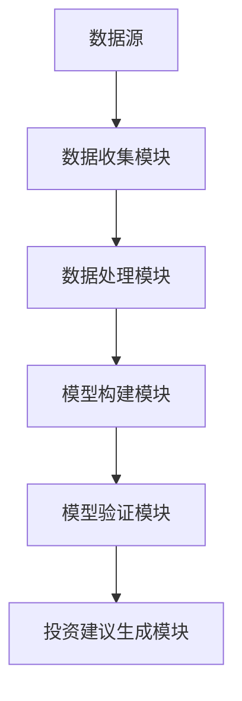
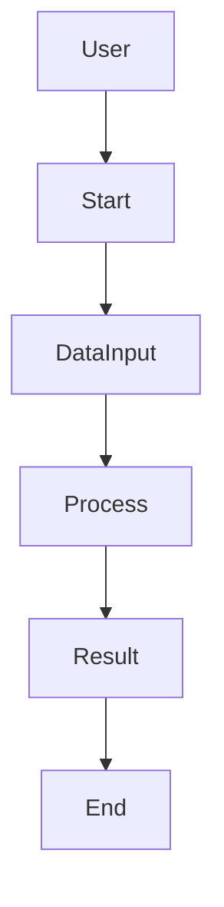

                 


# 价值投资中的老龄化社会机遇

> 关键词：价值投资，老龄化社会，投资策略，投资模型，数学公式

> 摘要：本文深入探讨了老龄化社会对价值投资的影响，分析了其中的投资机遇和挑战，并提出了相应的投资策略和数学模型。通过详细讲解价值投资的基本原理、老龄化社会中的投资机会以及具体的数学模型和算法，本文为投资者提供了实用的指导和参考。

---

# 第一部分: 老龄化社会的背景与价值投资概述

## 第1章: 老龄化社会的背景与问题分析

### 1.1 老龄化社会的现状与趋势

#### 1.1.1 全球人口老龄化的基本情况
全球人口老龄化是一个不可逆转的趋势。根据联合国的数据，65岁及以上人口的比例将从2020年的9.9%上升到2050年的16.4%。这一趋势对全球经济、社会和投资领域产生了深远的影响。

#### 1.1.2 老龄化社会的定义与特征
老龄化社会是指65岁及以上人口占总人口的比例超过7%的社会。其主要特征包括人口结构的变化、劳动人口的减少、社会福利支出的增加以及经济增长模式的转变。

#### 1.1.3 老龄化社会对经济与社会的影响
老龄化社会对经济的影响主要体现在劳动力短缺、生产效率下降以及社会保障体系的压力增大。同时，老龄化社会也催生了新的投资机会，例如医疗健康、养老服务等领域。

### 1.2 老龄化社会中的投资机遇

#### 1.2.1 老龄化社会中的投资机会
老龄化社会带来了多个投资领域的机会，包括医疗健康、养老服务、智能家居、健康食品等。这些领域的市场需求随着老年人口的增加而快速增长。

#### 1.2.2 价值投资的基本概念与原则
价值投资是一种以基本面分析为基础的投资方法，强调以低于内在价值的价格买入优质资产。其核心原则包括长期投资、关注企业内在价值以及避免情绪化投资。

#### 1.2.3 老龄化社会与价值投资的结合
老龄化社会为价值投资者提供了新的投资方向。例如，投资于那些在医疗健康领域具有竞争优势的企业，能够获得长期稳定的收益。

### 1.3 老龄化社会中的问题背景

#### 1.3.1 老龄化社会中的主要问题
老龄化社会的主要问题包括社会保障体系的压力、经济增长放缓以及投资风险的增加。这些问题对投资者提出了更高的要求，需要更加谨慎地选择投资标的。

#### 1.3.2 问题的解决思路与方法
通过价值投资的方法，投资者可以识别那些在老龄化社会中具有竞争优势的企业，从而规避市场风险，获得稳定的收益。

#### 1.3.3 老龄化社会与价值投资的核心联系
老龄化社会与价值投资的核心联系在于，前者为后者提供了丰富的投资机会，而后者为前者提供了有效的投资工具和方法。

### 1.4 老龄化社会中的核心概念

#### 1.4.1 老龄化社会的核心要素
老龄化社会的核心要素包括人口结构、社会保障体系、经济增长模式以及社会需求的变化。

#### 1.4.2 价值投资的核心要素
价值投资的核心要素包括企业基本面分析、内在价值评估以及长期投资策略。

#### 1.4.3 老龄化社会与价值投资的核心联系
老龄化社会与价值投资的核心联系在于，前者为后者提供了丰富的投资机会，而后者为前者提供了有效的投资工具和方法。

## 第2章: 老龄化社会中的价值投资策略

### 2.1 价值投资的基本原理

#### 2.1.1 价值投资的核心理念
价值投资的核心理念是通过深入分析企业的基本面，寻找那些被市场低估的优质资产进行投资。

#### 2.1.2 价值投资的基本原则
价值投资的基本原则包括长期投资、分散投资、避免情绪化投资以及注重企业的财务健康状况。

#### 2.1.3 价值投资的实施步骤
价值投资的实施步骤包括确定投资目标、进行基本面分析、评估内在价值、选择优质资产以及持续监控和调整投资组合。

### 2.2 老龄化社会中的投资机会分析

#### 2.2.1 老龄化社会中的主要投资领域
老龄化社会中的主要投资领域包括医疗健康、养老服务、智能家居、健康食品以及旅游休闲等。

#### 2.2.2 老龄化社会中的投资机会分析
通过对老龄化社会中的市场需求和企业竞争优势进行分析，投资者可以找到那些具有持续增长潜力的企业进行投资。

#### 2.2.3 老龄化社会中的投资风险分析
老龄化社会中的投资风险主要体现在市场需求的变化、政策风险以及企业的经营风险等方面。

### 2.3 价值投资在老龄化社会中的应用

#### 2.3.1 价值投资在老龄化社会中的具体应用
投资者可以通过分析老龄化社会中的市场需求，选择那些在医疗健康、养老服务等领域具有竞争优势的企业进行投资。

#### 2.3.2 价值投资在老龄化社会中的成功案例
例如，投资于一家在医疗健康领域具有竞争优势的企业，通过长期持有获得稳定的收益。

#### 2.3.3 价值投资在老龄化社会中的未来发展趋势
随着老龄化社会的加剧，价值投资在这一领域的应用将更加广泛，投资者需要不断学习和适应市场的变化。

## 第3章: 老龄化社会中的价值投资模型

### 3.1 老龄化社会中的价值投资模型概述

#### 3.1.1 模型的基本原理
价值投资模型的基本原理是通过分析企业的财务状况、市场地位、竞争优势以及未来发展前景，评估其内在价值，并据此进行投资决策。

#### 3.1.2 模型的核心要素
模型的核心要素包括企业的财务状况、市场地位、竞争优势、未来发展前景以及内在价值评估。

#### 3.1.3 模型的输入与输出
模型的输入包括企业的财务数据、市场数据以及宏观经济指标，输出包括企业的内在价值、投资评级以及投资建议。

### 3.2 老龄化社会中的价值投资模型实现

#### 3.2.1 模型的实现步骤
模型的实现步骤包括数据收集、数据处理、模型构建、模型验证以及模型应用。

#### 3.2.2 模型的数学公式
模型的数学公式包括内在价值计算公式、投资评级公式以及投资建议公式。

### 3.3 模型的优化与改进

#### 3.3.1 模型的优化方法
模型的优化方法包括参数调整、模型结构优化以及数据预处理等。

#### 3.3.2 模型的改进方向
模型的改进方向包括引入更多的数据源、提高模型的预测精度以及增强模型的可解释性等。

#### 3.3.3 模型的实际应用
模型的实际应用包括在老龄化社会中的具体投资决策，例如选择那些在医疗健康领域具有竞争优势的企业进行投资。

## 第4章: 老龄化社会中的价值投资算法

### 4.1 老龄化社会中的价值投资算法概述

#### 4.1.1 算法的基本原理
算法的基本原理是通过分析企业的财务状况、市场地位、竞争优势以及未来发展前景，评估其内在价值，并据此进行投资决策。

#### 4.1.2 算法的核心步骤
算法的核心步骤包括数据收集、数据处理、模型构建、模型验证以及模型应用。

### 4.2 算法的实现与优化

#### 4.2.1 算法的实现步骤
算法的实现步骤包括数据收集、数据处理、模型构建、模型验证以及模型应用。

#### 4.2.2 算法的优化方法
算法的优化方法包括参数调整、模型结构优化以及数据预处理等。

### 4.3 算法的数学模型与公式

#### 4.3.1 内在价值计算公式
$$ V = \frac{CF}{r - g} $$
其中，\( V \) 是内在价值，\( CF \) 是未来现金流，\( r \) 是折现率，\( g \) 是增长率。

#### 4.3.2 投资评级公式
$$ Rating = \frac{V - P}{P} \times 100 $$
其中，\( Rating \) 是投资评级，\( V \) 是内在价值，\( P \) 是市场价格。

#### 4.3.3 投资建议公式
$$ S = \begin{cases} 
\text{买入} & \text{如果 } Rating > 10\% \\
\text{持有} & \text{如果 } 5\% < Rating < 10\% \\
\text{卖出} & \text{如果 } Rating < 5\% 
\end{cases} $$

### 4.4 算法的实战应用

#### 4.4.1 算法的环境安装
需要安装Python、NumPy、Pandas、Matplotlib等库。

#### 4.4.2 算法的代码实现
以下是一个简单的价值投资算法的Python代码示例：

```python
import numpy as np
import pandas as pd
import matplotlib.pyplot as plt

# 数据收集
data = pd.read_csv('data.csv')

# 数据处理
data['PE'] = data['Price'] / data['Earnings']

# 模型构建
data['Intrinsic Value'] = data['Earnings'] * (1 + 0.05) / (0.1 - 0.05)

# 模型验证
plt.plot(data['PE'], data['Intrinsic Value'], 'ro')
plt.xlabel('PE')
plt.ylabel('Intrinsic Value')
plt.show()

# 投资建议
data['Rating'] = (data['Intrinsic Value'] - data['Price']) / data['Price'] * 100
data['S'] = np.where(data['Rating'] > 10, '买入',
                      np.where(data['Rating'] < 5, '卖出', '持有'))
```

#### 4.4.3 算法的案例分析
以某医疗健康公司为例，通过算法分析其内在价值和投资评级，得出投资建议。

## 第5章: 老龄化社会中的价值投资系统架构设计

### 5.1 系统功能设计

#### 5.1.1 系统功能模块
系统功能模块包括数据收集、数据处理、模型构建、模型验证以及投资建议生成。

#### 5.1.2 系统功能流程
系统功能流程包括数据输入、数据清洗、模型训练、模型验证以及结果输出。

### 5.2 系统架构设计

#### 5.2.1 系统架构图
使用Mermaid绘制系统架构图，展示系统的各个模块及其之间的关系。



#### 5.2.2 系统接口设计
系统接口设计包括数据输入接口、模型训练接口以及结果输出接口。

### 5.3 系统交互设计

#### 5.3.1 系统交互流程
使用Mermaid绘制系统交互流程图，展示用户与系统之间的交互过程。



#### 5.3.2 系统交互细节
系统交互细节包括用户输入数据、系统处理数据、生成投资建议并输出结果。

## 第6章: 老龄化社会中的价值投资项目实战

### 6.1 项目环境安装

#### 6.1.1 环境安装步骤
安装Python、NumPy、Pandas、Matplotlib等库。

### 6.2 项目核心实现

#### 6.2.1 数据收集与处理
使用爬虫或API获取老龄化社会相关的数据，并进行清洗和预处理。

#### 6.2.2 模型构建与验证
基于收集的数据，构建价值投资模型，并进行验证和优化。

### 6.3 项目案例分析

#### 6.3.1 案例选择
选择某医疗健康公司作为案例，分析其内在价值和投资评级。

#### 6.3.2 案例分析与解读
通过模型分析，得出该公司的投资建议，并解释分析结果。

### 6.4 项目小结

#### 6.4.1 项目总结
总结项目的主要成果和经验教训。

#### 6.4.2 项目意义
说明项目在理论和实践上的意义，以及对未来的启示。

## 第7章: 老龄化社会中的价值投资最佳实践

### 7.1 价值投资的注意事项

#### 7.1.1 投资者需要注意的问题
投资者需要注意市场风险、政策风险以及企业经营风险等。

#### 7.1.2 投资策略的调整
根据市场变化和企业情况，及时调整投资策略。

### 7.2 投资者的最佳实践

#### 7.2.1 长期投资的重要性
长期投资是价值投资的核心原则之一，能够规避短期市场的波动风险。

#### 7.2.2 优质资产的选择
选择那些具有强大竞争优势和良好财务状况的企业进行投资。

### 7.3 价值投资的未来发展

#### 7.3.1 老龄化社会中的投资机会
随着老龄化社会的加剧，医疗健康、养老服务等领域将有更多的投资机会。

#### 7.3.2 技术进步对投资的影响
人工智能、大数据等技术的进步将为价值投资提供更多的工具和方法。

### 7.4 本章小结

#### 7.4.1 本章总结
总结价值投资在老龄化社会中的最佳实践，强调长期投资和优质资产选择的重要性。

#### 7.4.2 本章意义
说明价值投资在老龄化社会中的重要性，以及对投资者的指导意义。

---

# 作者：AI天才研究院/AI Genius Institute & 禅与计算机程序设计艺术 /Zen And The Art of Computer Programming

