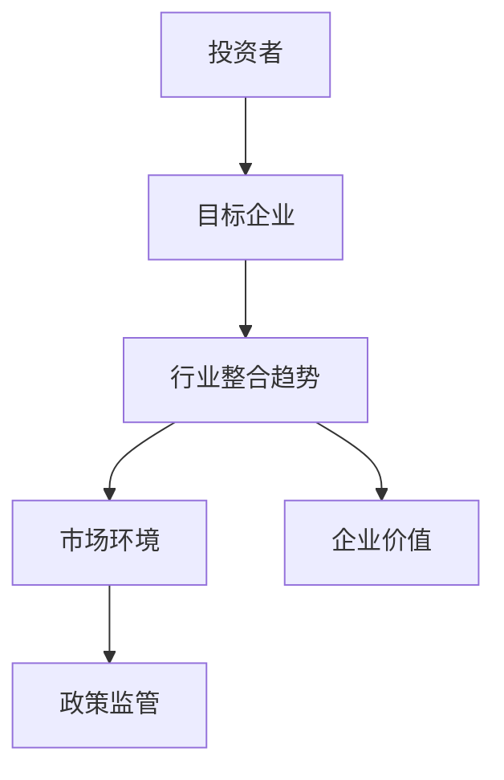
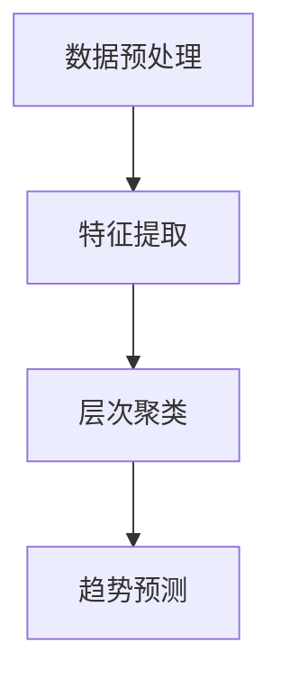
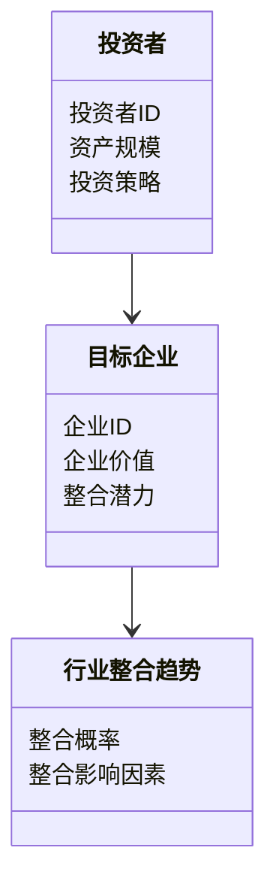

                 


# 价值投资中的行业整合趋势分析

> 关键词：价值投资、行业整合、趋势分析、投资策略、机器学习、市场分析

> 摘要：本文从价值投资的角度出发，深入分析行业整合趋势的核心概念、算法原理、系统架构及实战案例，帮助投资者更好地理解行业整合趋势对投资决策的影响，并提供基于机器学习的行业整合趋势预测方法。

---

## 第一部分: 价值投资中的行业整合趋势分析基础

### 第1章: 价值投资与行业整合趋势概述

#### 1.1 价值投资的基本概念

- **1.1.1 价值投资的定义与核心理念**
  - 价值投资是一种长期投资策略，强调以低于内在价值的价格买入优质资产。
  - 核心理念：市场先生是短期情绪化的，但长期会反映企业的真实价值。
  - 价值投资的核心在于寻找那些被市场低估的优秀企业。

- **1.1.2 价值投资与其它投资策略的对比**
  - 短期交易 vs. 长期持有：价值投资强调长期持有，而非频繁交易。
  - 技术分析 vs. 基本分析：价值投资侧重于基本面分析，而非价格图表。
  - 高风险高回报 vs. 稳定回报：价值投资追求的是稳定且可持续的回报。

- **1.1.3 价值投资在现代金融中的地位**
  - 价值投资是巴菲特、彼得·林奇等投资大师的首选策略。
  - 在现代金融中，价值投资与量化投资、趋势投资形成互补关系。

#### 1.2 行业整合趋势的背景与意义

- **1.2.1 行业整合的定义与特征**
  - 行业整合：指行业内企业通过并购、重组等方式，优化资源配置，提升竞争力的过程。
  - 特征：集中化、规模化、专业化。

- **1.2.2 行业整合趋势的驱动因素**
  - 市场竞争加剧：企业通过整合减少竞争压力。
  - 规模经济效应：整合后企业可以降低成本，提高效率。
  - 政策环境：行业政策变化推动整合。

- **1.2.3 行业整合对价值投资的影响**
  - 行业整合为价值投资者提供了寻找低估企业的机会。
  - 整合后的企业往往具有更高的市场份额和盈利能力。

#### 1.3 价值投资与行业整合趋势的结合

- **1.3.1 价值投资视角下的行业整合机会**
  - 行业整合后，企业价值可能被低估，为价值投资者提供买入机会。
  - 行业整合过程中，龙头企业的价值可能被市场忽视。

- **1.3.2 行业整合趋势对投资决策的影响**
  - 投资者需要关注行业整合的趋势，选择具有整合潜力的企业。
  - 行业整合可能带来短期波动，但长期来看是价值提升的过程。

- **1.3.3 价值投资与行业整合的协同效应**
  - 行业整合为价值投资提供了结构性机会。
  - 价值投资为行业整合提供了资本支持。

#### 1.4 本书分析框架

- **1.4.1 分析方法与工具**
  - 基于机器学习的行业整合趋势预测。
  - 基于基本面分析的行业整合机会识别。

- **1.4.2 研究范围与边界**
  - 研究范围：主要关注制造业、科技行业、金融行业。
  - 研究边界：短期市场波动不作为研究重点。

- **1.4.3 目标读者与应用场景**
  - 目标读者：价值投资者、行业分析师、企业管理者。
  - 应用场景：投资决策、行业研究、企业战略规划。

---

### 第2章: 行业整合趋势的核心概念与联系

#### 2.1 行业整合趋势的核心概念

- **2.1.1 行业整合的驱动力**
  - 市场竞争：企业通过整合减少竞争压力。
  - 经济周期：经济下行时，整合趋势更为明显。
  - 技术进步：技术驱动的整合趋势在科技行业尤为明显。

- **2.1.2 行业整合的模式与类型**
  - 横向整合：同一行业内的并购。
  - 纵向整合：上下游产业的并购。
  - 混合整合：跨行业的并购。

- **2.1.3 行业整合的周期性与波动性**
  - 行业整合具有周期性，通常与经济周期同步。
  - 整合趋势可能受到政策、市场环境等多种因素影响。

#### 2.2 价值投资与行业整合趋势的关系

- **2.2.1 价值投资视角下的行业整合机会**
  - 行业整合后，企业价值可能被低估。
  - 整合过程中，龙头企业价值可能被市场忽视。

- **2.2.2 行业整合趋势对投资策略的影响**
  - 投资者需要关注行业整合的趋势，选择具有整合潜力的企业。
  - 整合可能带来短期波动，但长期来看是价值提升的过程。

- **2.2.3 价值投资与行业整合趋势的协同效应**
  - 行业整合为价值投资提供了结构性机会。
  - 价值投资为行业整合提供了资本支持。

#### 2.3 行业整合趋势的核心要素对比

- **2.3.1 不同行业整合趋势的特征对比**
  - 制造业：整合趋势明显，集中化程度高。
  - 科技行业：整合趋势受技术发展驱动，具有不确定性。
  - 金融行业：整合趋势受政策监管影响较大。

- **2.3.2 不同区域市场的整合趋势差异**
  - 发达市场：整合趋势较为成熟，企业规模较大。
  - 发展中市场：整合趋势正在快速发展，企业规模逐步扩大。

- **2.3.3 不同规模企业的整合趋势对比**
  - 大型企业：整合趋势为主导地位的巩固。
  - 中小型企业：整合趋势为寻找合作伙伴，提升竞争力。

#### 2.4 行业整合趋势的ER实体关系图



---

### 第3章: 行业整合趋势分析的算法原理

#### 3.1 行业整合趋势分析的算法选择

- **3.1.1 常见的行业整合趋势分析方法**
  - 统计分析：基于历史数据的回归分析。
  - 机器学习：基于特征的分类与预测。
  - 文本挖掘：基于新闻、财报的语义分析。

- **3.1.2 基于机器学习的行业整合趋势预测**
  - 使用机器学习模型预测行业整合的概率。
  - 通过特征工程提取影响整合的关键因素。

- **3.1.3 基于统计学的行业整合趋势分析**
  - 使用时间序列分析预测整合趋势。
  - 通过聚类分析识别整合的潜在目标。

#### 3.2 基于层次聚类的行业整合趋势分析



#### 3.3 行业整合趋势分析的Python实现

```python
import numpy as np
import pandas as pd
from sklearn.cluster import AgglomerativeClustering

# 示例数据
data = np.random.rand(100, 5)
df = pd.DataFrame(data, columns=['feature1', 'feature2', 'feature3', 'feature4', 'feature5'])

# 层次聚类
model = AgglomerativeClustering(n_clusters=3)
model.fit(df)

# 获取聚类结果
clusters = model.labels_
print(clusters)
```

---

### 第4章: 行业整合趋势分析的数学模型

#### 4.1 行业整合趋势预测的数学模型

- **行业整合概率模型**
  - $$ P(\text{整合}) = \frac{\text{历史整合案例数}}{\text{总企业数}} $$
- **整合影响因素模型**
  - $$ I = \beta_0 + \beta_1 x_1 + \beta_2 x_2 + \ldots + \beta_n x_n $$

---

### 第5章: 系统分析与架构设计方案

#### 5.1 系统功能设计

- **领域模型类图**


#### 5.2 系统架构设计


---

### 第6章: 项目实战

#### 6.1 环境安装与数据准备

```bash
pip install numpy pandas scikit-learn
```

#### 6.2 核心代码实现

```python
import numpy as np
import pandas as pd
from sklearn.cluster import AgglomerativeClustering

# 示例数据
data = np.random.rand(100, 5)
df = pd.DataFrame(data, columns=['feature1', 'feature2', 'feature3', 'feature4', 'feature5'])

# 层次聚类
model = AgglomerativeClustering(n_clusters=3)
model.fit(df)

# 获取聚类结果
clusters = model.labels_
print(clusters)
```

#### 6.3 案例分析与结果展示

- **案例分析：假设我们分析某行业100家企业的整合趋势。**
  - 数据处理：提取企业的财务数据、市场份额、竞争力指标。
  - 模型训练：使用层次聚类算法进行整合趋势预测。
  - 结果展示：输出每个企业的整合概率和潜在整合目标。

---

### 第7章: 最佳实践与总结

#### 7.1 最佳实践

- **行业整合趋势分析的关键点**
  - 确保数据的准确性和完整性。
  - 选择合适的算法和模型。
  - 结合基本面分析和量化分析。

- **注意事项**
  - 行业整合趋势具有不确定性，需结合市场环境动态调整。
  - 价值投资需长期坚持，避免短期波动影响判断。

#### 7.2 小结

- 通过本文的分析，投资者可以更好地理解行业整合趋势对价值投资的影响。
- 结合机器学习和基本面分析，投资者可以更精准地识别整合机会。

#### 7.3 拓展阅读

- 《价值投资实战》
- 《行业整合与企业战略》
- 《机器学习在金融中的应用》

---

### 作者：AI天才研究院/AI Genius Institute & 禅与计算机程序设计艺术/Zen And The Art of Computer Programming

---

以上为《价值投资中的行业整合趋势分析》的完整大纲，结合了技术分析、行业研究和价值投资的策略，旨在为投资者提供实用的分析工具和方法。

