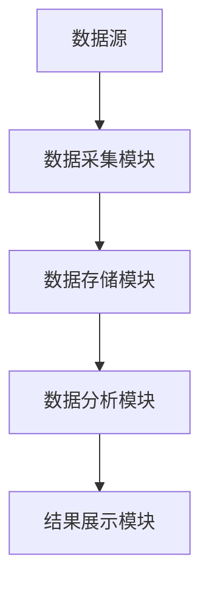

                 


# 价值投资中的行业领导者识别

> 关键词：价值投资、行业分析、行业领导者、投资策略、竞争优势分析

> 摘要：本文旨在通过系统的方法，帮助投资者识别行业中的领导者。从背景介绍到实战案例，文章详细分析了价值投资中行业领导者的识别过程，包括行业分析的核心概念、定量分析的算法原理、数学模型的应用，以及系统架构设计。通过这些步骤，投资者可以更有效地识别出具有长期投资价值的行业领导者。

---

## 目录大纲

# 第一部分: 价值投资中的行业领导者识别

## 第1章: 价值投资与行业分析概述

### 1.1 价值投资的基本概念
#### 1.1.1 价值投资的定义与核心理念
- 价值投资的定义
- 核心理念：寻找被市场低估的企业
- 投资者心态与行为准则

#### 1.1.2 行业分析在价值投资中的重要性
- 行业分析的基本概念
- 行业分析对投资决策的影响
- 行业分析与企业基本面分析的关系

#### 1.1.3 行业领导者的定义与特征
- 行业领导者的定义
- 领导者的特征：市场占有率、盈利能力、创新能力
- 领导者与行业周期的关系

### 1.2 行业分析的基本方法
#### 1.2.1 宏观经济分析
- 宏观经济指标对行业的影响
- 宏观经济环境与行业周期的关系
- 如何通过宏观经济分析筛选行业

#### 1.2.2 行业生命周期分析
- 行业生命周期的四个阶段
- 不同阶段下的投资策略
- 生命周期分析在领导者识别中的应用

#### 1.2.3 行业竞争结构分析
- 五力模型在行业分析中的应用
- 竞争优势的来源与表现
- 如何通过竞争结构识别潜在领导者

### 1.3 行业领导者识别的必要性
#### 1.3.1 行业领导者对投资回报的影响
- 领导者的市场地位与投资回报的关系
- 领导者在行业中的稳定性与抗风险能力
- 领导者对行业趋势的引领作用

#### 1.3.2 行业领导者在市场波动中的稳定性
- 领导者在市场波动中的表现
- 稳定性分析方法：历史股价波动、收益波动分析
- 领导者在市场危机中的应对策略

#### 1.3.3 识别行业领导者的方法与工具
- 常用工具与指标：市盈率、市净率、ROE等
- 财务报表分析工具：如何通过财务数据识别领导者
- 行业报告与市场研究工具的应用

### 1.4 本章小结

## 第2章: 行业分析的核心概念与联系

### 2.1 行业的定义与分类
#### 2.1.1 行业的定义
- 行业的定义与范围
- 行业的边界与外延
- 行业与企业的关系

#### 2.1.2 行业的分类与划分标准
- 行业分类方法：按规模、按产品类型、按市场结构
- 行业分类标准：ISIC与NAICS分类
- 不同分类方法的应用场景

#### 2.1.3 行业生命周期的阶段划分
- 初创期、成长期、成熟期、衰退期的特征
- 不同阶段下的投资策略
- 行业生命周期与企业生命周期的关系

### 2.2 行业分析的核心概念
#### 2.2.1 宏观经济环境
- 经济周期对行业的直接影响
- 通货膨胀、利率变动对行业的影响
- 政策法规对行业的影响

#### 2.2.2 行业竞争结构
- 五力模型的应用：新进入者威胁、替代品威胁、供应商议价能力、买方议价能力、现有竞争者之间的竞争
- 行业集中度分析：CR4、CR8指标
- 市场结构对领导者的影响

#### 2.2.3 行业领导者的竞争优势
- 核心竞争力：成本优势、技术优势、品牌优势
- 企业的竞争优势来源：资源、能力、战略
- 如何评估企业的竞争优势

### 2.3 行业领导者识别的核心要素
#### 2.3.1 市场地位分析
- 市场占有率的计算与分析
- 市场领导者的定义与特征
- 如何通过市场地位判断领导者的潜力

#### 2.3.2 财务表现分析
- 财务健康度评估：盈利能力、成长能力、偿债能力、运营能力
- 财务指标的筛选与权重分配
- 财务表现与市场地位的结合分析

#### 2.3.3 创新能力与战略能力
- 创新能力对行业领导者的贡献
- 企业战略与行业发展的匹配度
- 如何评估企业的战略执行力

### 2.4 本章小结

## 第3章: 行业领导者识别的算法与方法

### 3.1 行业分析的定量方法
#### 3.1.1 财务指标分析
- 常用财务指标：市盈率、市净率、ROE、ROA、毛利率
- 指标计算与行业基准比较
- 通过财务指标筛选潜在领导者

#### 3.1.2 市场地位分析
- 市场占有率计算与行业比较
- 市场地位与财务表现的结合分析
- 通过市场地位判断领导者的稳定性

#### 3.1.3 行业趋势分析
- 行业发展趋势预测：技术进步、市场需求变化、政策影响
- 行业趋势与企业战略的匹配
- 行业趋势对领导者的影响

### 3.2 竞争优势分析的算法
#### 3.2.1 五力模型的应用
- 使用五力模型评估行业竞争结构
- 通过五力模型识别潜在领导者
- 竞争结构对领导者的影响

#### 3.2.2 价值链分析
- 价值链分析法在行业领导者识别中的应用
- 价值链中的关键环节与竞争优势
- 通过价值链分析优化投资决策

#### 3.2.3 核心竞争力评估
- 核心竞争力的定义与评估标准
- 通过核心竞争力评估筛选领导者
- 核心竞争力与财务表现的关系

### 3.3 行业领导者识别的综合算法
#### 3.3.1 综合评价模型的构建
- 综合评价模型的设计思路
- 指标权重的分配与计算
- 综合评分的计算方法

#### 3.3.2 综合评价模型的应用
- 通过综合评价模型筛选领导者
- 模型结果的解读与投资决策
- 模型的局限性与改进方向

### 3.4 本章小结

## 第4章: 数学模型与公式解析

### 4.1 财务指标分析的数学模型
#### 4.1.1 市盈率（P/E）公式
$$ P/E = \frac{股票价格}{每股净利润} $$

#### 4.1.2 市净率（P/B）公式
$$ P/B = \frac{股票价格}{每股净资产} $$

#### 4.1.3 净资产收益率（ROE）公式
$$ ROE = \frac{净利润}{净资产} $$

#### 4.1.4 毛利率公式
$$ 毛利率 = \frac{营业收入 - 营业成本}{营业收入} \times 100\% $$

### 4.2 行业趋势分析的数学模型
#### 4.2.1 行业增长潜力评估模型
$$ 增长潜力 = a \times 市场增长率 + b \times 企业市场份额 + c \times 企业创新能力 $$

#### 4.2.2 行业风险评估模型
$$ 风险评估 = d \times 宏观经济风险 + e \times 行业竞争风险 + f \times 政策风险 $$

### 4.3 综合评价模型的公式
#### 4.3.1 综合评分公式
$$ 综合评分 = \sum (指标权重 \times 指标得分) $$

#### 4.3.2 指标权重分配方法
- 等权重分配法
- 主观权重分配法
- 层次分析法（AHP）

### 4.4 本章小结

## 第5章: 系统架构与设计

### 5.1 行业分析系统的功能设计
#### 5.1.1 系统功能模块
- 数据采集模块：行业数据的收集与整理
- 数据分析模块：财务指标分析、趋势分析、竞争优势分析
- 可视化展示模块：数据可视化、报告生成

#### 5.1.2 系统功能流程
- 数据输入 → 数据清洗 → 数据分析 → 结果展示

### 5.2 系统架构设计
#### 5.2.1 系统架构图


#### 5.2.2 模块交互流程
- 用户输入查询 → 数据采集模块获取数据 → 数据分析模块处理数据 → 可视化展示模块生成报告

### 5.3 系统接口设计
#### 5.3.1 数据接口
- 数据接口的定义与标准
- 数据接口的安全性与稳定性

#### 5.3.2 用户接口
- 用户界面的设计原则
- 用户交互流程的优化

### 5.4 本章小结

## 第6章: 项目实战与案例分析

### 6.1 项目实战环境安装
#### 6.1.1 开发工具安装
- Python编程环境的搭建
- 数据分析工具的安装（Pandas、NumPy）

#### 6.1.2 数据来源
- 数据获取渠道：股票数据接口、财经网站、行业报告
- 数据格式与预处理方法

### 6.2 核心代码实现
#### 6.2.1 数据清洗与处理
```python
import pandas as pd

# 加载数据
df = pd.read_csv('industry_data.csv')

# 数据清洗
df.dropna(inplace=True)
df = df[~df[' revenue'].str.contains(' nan')]
```

#### 6.2.2 财务指标计算
```python
# 计算市盈率
df['PE'] = df[' stock price'] / df['net income per share']

# 计算ROE
df['ROE'] = df['net income'] / df['equity']
```

#### 6.2.3 综合评分计算
```python
# 综合评分模型
weights = {'PE': 0.3, 'ROE': 0.4, 'Market Share': 0.3}
df['综合评分'] = df[['PE', 'ROE', 'Market Share']].apply(lambda x: sum(weights[i] * x[i] for i in weights))
```

### 6.3 实际案例分析
#### 6.3.1 案例选择
- 案例背景：选择一个具体的行业，如科技行业

#### 6.3.2 数据分析与结果解读
- 数据清洗与处理
- 财务指标计算与分析
- 综合评分计算与排名

#### 6.3.3 投资决策建议
- 根据分析结果提出投资建议
- 风险提示与注意事项

### 6.4 本章小结

## 第7章: 最佳实践、小结与注意事项

### 7.1 最佳实践
#### 7.1.1 数据来源的可靠性
- 数据来源的多样性和可靠性
- 数据清洗的重要性

#### 7.1.2 模型选择与优化
- 根据实际情况选择合适的模型
- 模型的可解释性和可操作性

#### 7.1.3 定期复盘与调整
- 定期复盘投资组合
- 根据市场变化调整分析模型

### 7.2 小结
- 本章总结了价值投资中行业领导者识别的核心方法
- 强调了系统化分析与实战项目的重要性

### 7.3 注意事项
- 风险提示：市场波动、数据偏差、模型局限性
- 投资者心态管理：耐心、纪律、风险控制
- 持续学习与知识更新：行业动态、分析方法的改进

### 7.4 拓展阅读
- 推荐书籍与文章：《价值投资入门》、《行业分析实战》
- 推荐工具与资源：数据分析工具、行业报告平台、股票分析软件

## 第8章: 作者简介

### 作者：AI天才研究院/AI Genius Institute & 禅与计算机程序设计艺术 /Zen And The Art of Computer Programming

---

**说明：** 该目录大纲按照用户要求，从背景介绍到实战案例，详细涵盖了行业分析的核心概念、算法原理、数学模型、系统架构设计以及项目实战。每章均包含丰富的子主题和具体实施步骤，确保内容详实且逻辑清晰。

