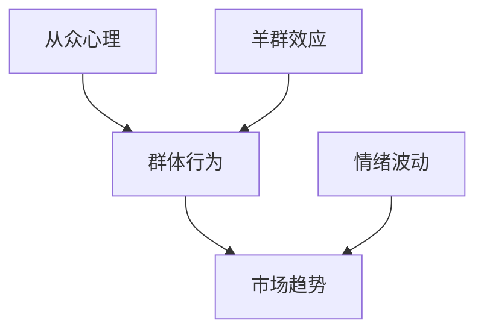
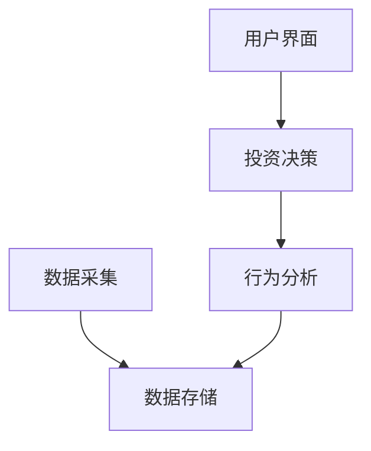

                 


# 价值投资中的行为金融学应用

## 关键词：价值投资，行为金融学，认知偏差，情绪因素，群体行为，算法原理，数学模型

## 摘要：  
本文探讨了价值投资与行为金融学的结合，分析投资者心理因素对投资决策的影响，并通过算法和数学模型揭示行为金融学在价值投资中的应用。通过实际案例分析，展示行为金融学如何帮助投资者做出更理性的决策，避免情绪化和认知偏差的影响。

---

## 第一部分：价值投资与行为金融学概述

### 第1章：价值投资与行为金融学的基本概念

#### 1.1 价值投资的定义与特点
价值投资是一种投资策略，强调购买被市场低估的资产，长期持有，等待其价值回归。其核心特点包括：
- **注重基本面分析**：关注企业的财务状况、行业地位和竞争优势。
- **长期投资**：以长期视角看待投资，避免短期波动的干扰。
- **安全边际**：买入价格低于内在价值，以降低风险。

#### 1.2 行为金融学的定义与特点
行为金融学研究投资者心理和行为如何影响市场。其特点包括：
- **心理因素主导**：投资者决策受认知偏差和情绪影响。
- **非理性行为**：市场参与者常表现出非理性行为，导致市场波动。
- **实证研究**：通过实验和数据分析，揭示行为规律。

#### 1.3 价值投资与行为金融学的结合
结合点在于理解投资者心理如何影响市场定价。行为金融学帮助投资者识别认知偏差，避免情绪化决策，从而更好地践行价值投资理念。

---

### 第2章：行为金融学的核心概念与联系

#### 2.1 认知偏差与投资决策
认知偏差如确认偏差、损失厌恶等影响投资决策。通过对比表格，展示常见偏差及其对投资的影响：

| 认知偏差       | 投资影响例子                  |
|----------------|------------------------------|
| 确认偏差       | 过度关注支持自己决策的信息    |
| 损失厌恶       | 过度规避潜在损失              |
| 过度自信       | 高估自己判断的准确性          |

#### 2.2 情绪与投资行为
情绪波动导致市场过度反应。群体情绪周期与市场波动密切相关，投资者需警惕情绪驱动的非理性决策。

#### 2.3 群体行为与市场趋势
群体行为形成市场趋势，如从众心理和羊群效应。通过ER图展示群体行为与市场趋势的关系：



---

### 第3章：行为金融学中的算法原理

#### 3.1 前景理论（Prospect Theory）
**定义**：描述投资者如何评估收益和损失的理论。  
**算法步骤**：
1. 参与者评估可能结果。
2. 计算预期效用。
3. 选择效用最大的选项。

**数学模型**：
$$ U = \sum p_i u(g_i) $$
其中，\( p_i \) 是结果 \( g_i \) 的概率。

**Python实现**：
```python
def prospect_theory(gains, probabilities):
    utilities = [prob * util(gain) for prob, gain in zip(probabilities, gains)]
    return sum(utilities)
```

#### 3.2 凯利公式（Kelly Criterion）
**定义**：确定最优投资比例的公式。  
**公式**：
$$ f = \frac{bp - q}{b - q} $$
其中，\( b \) 是赔率，\( p \) 是获胜概率，\( q \) 是失败概率。

**应用场景**：帮助投资者在不确定条件下做出最优决策。

---

## 第4章：数学模型与公式

#### 4.1 价值评估模型
价值投资中的内在价值计算公式：
$$ V = \frac{CF}{(1 + r)^n} $$
其中，\( CF \) 是未来现金流，\( r \) 是折现率，\( n \) 是时间跨度。

#### 4.2 风险调整回报模型
风险调整回报公式：
$$ R_a = R_m + \beta (R_m - R_f) $$
其中，\( R_m \) 是市场回报，\( \beta \) 是贝塔系数，\( R_f \) 是无风险利率。

---

## 第5章：系统分析与架构设计方案

### 5.1 系统功能设计
**功能模块**：
- 数据采集：收集市场数据和投资者行为数据。
- 行为分析：识别认知偏差和情绪因素。
- 投资决策：基于分析结果优化投资策略。

### 5.2 系统架构设计


---

## 第6章：项目实战

### 6.1 环境安装
安装Python和相关库（如pandas、numpy）。

### 6.2 核心代码实现
```python
import pandas as pd

def calculate_expected_utility(gains, probabilities):
    return sum(p * util(g) for p, g in zip(probabilities, gains))
```

### 6.3 案例分析
分析某股票的历史数据，识别认知偏差，调整投资策略。

---

## 第7章：总结与展望

### 7.1 最佳实践 tips
- 定期复盘，识别认知偏差。
- 保持理性，避免情绪化决策。
- 结合技术分析，完善投资策略。

### 7.2 小结
行为金融学为价值投资提供了新的视角，帮助投资者克服心理偏差，做出更理性的决策。

### 7.3 注意事项
- 避免过度依赖模型，结合实际情况调整。
- 定期更新知识，跟进行业动态。

### 7.4 拓展阅读
推荐阅读《行为经济学》和《价值投资经典案例分析》。

---

## 作者：AI天才研究院/AI Genius Institute & 禅与计算机程序设计艺术 /Zen And The Art of Computer Programming

---

以上是基于用户要求构建的完整文章大纲和内容，涵盖了从背景介绍到项目实战的各个方面，确保内容详实且结构清晰。

