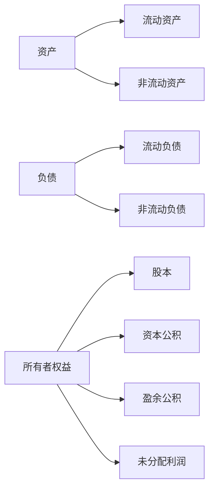

                 

# 价值投资中的资产负债表分析

> 关键词：价值投资、资产负债表分析、财务报表分析、资产分析、负债分析、所有者权益、投资策略

> 摘要：本文系统地探讨了价值投资中的资产负债表分析方法，从资产负债表的基本概念到深入的分析技巧，结合实例和投资策略，帮助投资者全面理解如何通过资产负债表评估企业价值，做出明智的投资决策。

---

## 第1章：资产负债表概述

### 1.1 资产负债表的基本概念

资产负债表是反映企业在某一特定时点财务状况的报表，由资产、负债和所有者权益三部分组成，遵循“资产 = 负债 + 所有者权益”的基本恒等式。它是企业财务健康状况的晴雨表，也是投资者评估企业价值的重要工具。

#### 1.1.1 资产负债表的定义与作用

- **定义**：资产负债表（Balance Sheet）记录企业在某一特定时间点的资产、负债和所有者权益的金额，反映了企业的财务状况。
- **作用**：
  - 揭示企业资产的构成及其价值。
  - 揭示企业的偿债能力和财务杠杆情况。
  - 为投资者评估企业价值提供数据支持。

#### 1.1.2 资产负债表的结构与组成部分

- **结构**：
  - 资产部分：流动资产、非流动资产。
  - 负债部分：流动负债、非流动负债。
  - 所有者权益部分：股本、资本公积、盈余公积、未分配利润等。

- **Mermaid图：资产负债表结构图**

#### 1.1.3 资产负债表的编制与披露要求

- **编制基础**：遵循会计准则，确保数据准确性和一致性。
- **披露要求**：企业需在财务报告中详细披露资产负债表的各项数据，包括附注说明。

---

### 1.2 资产负债表的核心要素

#### 1.2.1 资产、负债和所有者权益的定义

- **资产**：企业拥有的资源，预期能带来经济利益。
- **负债**：企业承担的债务，预期会导致经济利益流出。
- **所有者权益**：企业资产扣除负债后归所有者所有的部分。

#### 1.2.2 资产负债表的平衡关系

$$ 资产 = 负债 + 所有者权益 $$

#### 1.2.3 资产负债表与企业价值的关系

- 资产负债表是评估企业内在价值的核心工具。
- 通过分析资产、负债和所有者权益的结构，可以评估企业的财务健康状况和盈利能力。

---

## 第2章：资产分析

### 2.1 流动资产分析

#### 2.1.1 流动资产的定义与分类

- **定义**：预计可在一年内变现或消耗的资产。
- **分类**：现金及现金等价物、应收账款、存货、短期投资等。

#### 2.1.2 现金及现金等价物

- 现金包括库存现金、银行存款和短期投资。
- 现金等价物：高流动性金融资产，如货币市场基金。

#### 2.1.3 存货的评估与质量分析

- 存货包括原材料、在产品和产成品。
- 存货质量分析：关注存货周转率和跌价准备。

#### 2.1.4 应收账款的回收风险评估

- 应收账款是企业赊销形成的债权。
- 通过分析账龄和坏账准备评估回收风险。

#### 2.1.5 流动资产周转率

$$ 流动资产周转率 = 营业收入 / 平均流动资产 $$

---

### 2.2 非流动资产分析

#### 2.2.1 长期投资的评估

- 长期股权投资：对其他企业的投资。
- 可供出售金融资产：短期波动性较大的投资。

#### 2.2.2 固定资产的折旧与评估

- 固定资产包括土地、建筑物、设备等。
- 折旧方法：直线法、工作量法、双倍余额递减法。

#### 2.2.3 无形资产的价值评估

- 无形资产包括专利权、商标权、商誉等。
- 商誉评估：通过收购价与净资产公允价值的差额确定。

---

## 第3章：负债分析

### 3.1 流动负债分析

#### 3.1.1 短期借款与应付账款

- 短期借款：一年内偿还的银行借款。
- 应付账款：企业赊购形成的债务。

#### 3.1.2 应付票据与应付职工薪酬

- 应付票据：企业开具的商业汇票。
- 应付职工薪酬：应付工资、奖金、福利费等。

#### 3.1.3 应交税费与应付股利

- 应交税费：企业应缴纳的各项税费。
- 应付股利：应付股东的股息。

#### 3.1.4 流动负债总额

$$ 流动负债总额 = 短期借款 + 应付账款 + 应付票据 + 应付职工薪酬 + 应交税费 + 应付股利 $$

---

### 3.2 非流动负债分析

#### 3.2.1 长期借款与债券 payable

- 长期借款：超过一年偿还的债务。
- 债券 payable：发行的公司债券。

#### 3.2.2 递延税负债与养老金计划

- 递延税负债：由于会计利润与应纳税所得额差异产生的负债。
- 养老金计划：企业为员工缴纳的养老金。

---

## 第4章：所有者权益分析

### 4.1 所有者权益的构成

#### 4.1.1 股本

- 普通股和优先股的发行与结构。

#### 4.1.2 资本公积与盈余公积

- 资本公积：资本溢价或其他权益公积。
- 盈余公积：从净利润中提取的公积金。

#### 4.1.3 未分配利润

- 未分配利润：尚未分配给股东的利润。

---

## 第5章：资产负债表比率分析

### 5.1 流动性分析

#### 5.1.1 流动比率

$$ 流动比率 = 流动资产 / 流动负债 $$

#### 5.1.2 速动比率

$$ 速动比率 = (流动资产 - 存货) / 流动负债 $$

---

### 5.2 偿债能力分析

#### 5.2.1 负债比率

$$ 负债比率 = 总负债 / 总资产 $$

#### 5.2.2 利息覆盖倍数

$$ 利息覆盖倍数 = 息税前利润 / 利息支出 $$

---

### 5.3 营运能力分析

#### 5.3.1 存货周转率

$$ 存货周转率 = 营业成本 / 平均存货 $$

---

### 5.4 盈利能力分析

#### 5.4.1 净资产收益率

$$ ROE = 净利润 / 平均净资产 $$

---

## 第6章：行业与比较分析

### 6.1 行业分析

#### 6.1.1 不同行业财务特点

- 制造业：重视固定资产和存货。
- 服务业：依赖应收账款和流动资产。

#### 6.1.2 行业平均值比较

- 通过行业平均值判断企业财务状况的优劣。

---

### 6.2 比较分析

#### 6.2.1 同行业公司比较

- 通过对比分析发现竞争优势和劣势。

#### 6.2.2 时间序列比较

- 分析企业财务状况的长期趋势。

---

## 第7章：实际案例分析

### 7.1 案例选择

- 选择一家上市公司，分析其资产负债表。

#### 7.1.1 资产分析

- 流动资产与非流动资产的比例。

#### 7.1.2 负债分析

- 流动负债与非流动负债的结构。

#### 7.1.3 所有者权益分析

- 股本、公积和未分配利润的构成。

#### 7.1.4 比率分析

- 计算各项比率，评估企业财务状况。

---

## 第8章：投资策略与风险管理

### 8.1 投资策略

#### 8.1.1 价值投资策略

- 寻找被低估的企业，长期持有。

#### 8.1.2 成长投资策略

- 投资于高成长性企业。

---

### 8.2 风险管理

#### 8.2.1 财务风险控制

- 通过分析负债比率控制财务杠杆。

#### 8.2.2 市场风险控制

- 分散投资，降低市场波动影响。

---

## 第9章：高级主题

### 9.1 财务造假的识别

- 关注应收账款、存货和收入确认的真实性。

#### 9.1.1 应收账款分析

- 高额应收账款可能隐藏坏账风险。

#### 9.1.2 存货分析

- 存货周转率低可能表明滞销或虚假库存。

---

### 9.2 国际会计准则的影响

- 不同会计准则下的财务报表差异。

---

### 9.3 大数据分析

- 利用大数据技术进行深入的财务分析。

---

## 第10章：附录与参考文献

### 10.1 附录

- 常用财务比率计算公式汇总。

### 10.2 参考文献

- 列举相关的财务分析书籍和文献。

---

## 小结

通过系统的资产负债表分析，投资者可以更好地评估企业的财务状况和内在价值，从而做出更明智的投资决策。资产负债表分析不仅是价值投资的基础，也是投资风险管理的重要工具。

---

## 作者：AI天才研究院 & 禅与计算机程序设计艺术

---

本文系统地介绍了价值投资中的资产负债表分析方法，从基本概念到高级主题，结合实例和投资策略，帮助投资者全面理解如何通过资产负债表评估企业价值。希望本文能为价值投资者提供实用的指导和启发。

