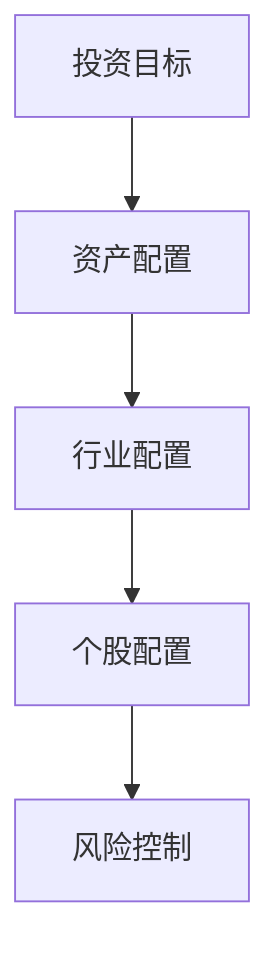

                 


# 价值投资中的资本配置策略

---

## 关键词：
价值投资、资本配置、数学模型、系统架构、项目实战

---

## 摘要：
本文深入探讨了价值投资中的资本配置策略，从核心概念、数学模型、系统架构到项目实战，详细分析了如何通过科学的方法优化投资组合，实现长期稳健的收益。文章结合理论与实践，提供了丰富的案例和代码示例，帮助读者全面理解和应用价值投资中的资本配置策略。

---

## 第一部分: 价值投资中的资本配置策略概述

---

## 第1章: 价值投资与资本配置的背景介绍

### 1.1 价值投资的核心概念

#### 1.1.1 价值投资的定义
价值投资是一种以基本面分析为基础的投资策略，旨在通过识别市场低估的资产，长期持有以实现超额收益。其核心在于寻找具有持续竞争优势、良好治理和合理估值的企业。

#### 1.1.2 资本配置的定义与作用
资本配置是指将资金分配到不同的资产或资产类别中，以实现风险和收益的最优平衡。资本配置在投资组合中起到决定性作用，直接影响投资的收益和风险。

#### 1.1.3 价值投资与资本配置的关系
价值投资与资本配置相辅相成。价值投资通过基本面分析筛选低估资产，资本配置则根据市场环境和投资者风险偏好，确定各资产的权重，优化组合表现。

#### 1.1.4 价值投资的核心要素与属性对比表格
| 核心要素 | 定义 | 属性 |
|----------|------|------|
| 资产质量 | 公司资产的健康程度 | 财务健康、低负债 |
| 股东权益 | 股东拥有的资产净值 | 高ROE、低负债 |
| 竞争优势 | 公司在市场中的竞争优势 | 技术壁垒、品牌优势 |
| 管理团队 | 公司管理层的能力 | 优秀管理、透明决策 |

---

### 1.2 资本配置的基本原理

#### 1.2.1 资本配置的理论基础
资本配置的理论基础包括现代投资组合理论（MPT）和资本资产定价模型（CAPM）。MPT强调通过分散投资降低风险，CAPM则用于评估资产的预期收益。

#### 1.2.2 资本配置的核心要素
资本配置的核心要素包括资产类别选择、风险承受能力、投资期限和市场环境。这些要素决定了投资组合的结构和权重分配。

#### 1.2.3 资本配置的边界与外延
资本配置的边界在于投资者的风险承受能力和资金规模，外延则涉及动态调整和风险管理。

---

## 第2章: 资本配置的数学模型与公式

### 2.1 资本配置的数学模型

#### 2.1.1 资本资产定价模型（CAPM）
CAPM用于评估资产的预期收益，公式为：
$$ E(r_i) = r_f + \beta_i (E(r_m) - r_f) $$
其中，\( E(r_i) \) 是资产的预期收益，\( r_f \) 是无风险利率，\( \beta_i \) 是资产的beta系数，\( E(r_m) \) 是市场预期收益。

#### 2.1.2 马科维茨投资组合理论
马科维茨理论通过优化投资组合的方差（风险）来实现收益最大化。公式为：
$$ \text{最小方差组合} = \argmin_w \{ w^T \Sigma w \} $$
其中，\( w \) 是权重向量，\( \Sigma \) 是资产间的协方差矩阵。

#### 2.1.3 股票估值模型（DCF模型）
DCF模型用于评估企业的内在价值，公式为：
$$ \text{内在价值} = \sum_{t=1}^{n} \frac{CF_t}{(1 + r)^t} $$
其中，\( CF_t \) 是自由现金流，\( r \) 是折现率。

### 2.2 资本配置的公式应用

#### 2.2.1 股票选择的数学公式
股息率用于筛选高分红股票，公式为：
$$ \text{股息率} = \frac{\text{股息}}{\text{股价}} $$

#### 2.2.2 投资组合的风险与收益平衡
夏普比率用于衡量投资组合的风险调整后收益，公式为：
$$ \text{夏普比率} = \frac{\text{收益} - \text{无风险利率}}{\text{收益的标准差}} $$

### 2.3 价值投资中的数学模型应用

#### 2.3.1 企业估值的数学模型
$$ \text{内在价值} = \sum_{t=1}^{n} \frac{CF_t}{(1 + r)^t} $$

#### 2.3.2 资本配置的优化公式
$$ \text{最优权重} = \frac{w_i}{\sum w_j} $$

---

## 第3章: 资本配置的系统分析与架构设计

### 3.1 资本配置系统的总体架构



### 3.2 资本配置的系统功能设计

#### 3.2.1 数据收集模块
数据收集模块负责获取市场数据，包括股票价格、财务报表等，为后续分析提供基础。

#### 3.2.2 资产配置模块
资产配置模块根据投资者的偏好和市场环境，确定各类资产的配置比例。

#### 3.2.3 风险管理模块
风险管理模块通过监控市场波动和调整持仓，控制投资组合的整体风险。

---

## 第4章: 项目实战

### 4.1 环境配置

#### 4.1.1 安装Python环境
使用Anaconda安装Python 3.8及以上版本。

#### 4.1.2 安装必要的库
```bash
pip install numpy pandas matplotlib
```

### 4.2 核心实现

#### 4.2.1 数据获取
使用Yahoo Finance获取股票数据：
```python
import pandas as pd
import numpy as np

def get_data(ticker):
    data = pd.DataFrame()
    # 获取数据
    return data
```

#### 4.2.2 模型实现
计算各资产的beta系数：
```python
def calculate_beta(asset_return, market_return):
    # 计算协方差和方差
    covariance = np.cov(asset_return, market_return)[0, 1]
    variance = np.var(market_return)
    beta = covariance / variance
    return beta
```

#### 4.2.3 结果分析
绘制投资组合的收益-风险曲线：
```python
import matplotlib.pyplot as plt

portfolios = generate_portfolios()
portfolios['夏普比率'] = (portfolios['收益'] - r_f) / portfolios['标准差']

plt.scatter(portfolios['标准差'], portfolios['收益'], c=portfolios['夏普比率'])
plt.xlabel('标准差')
plt.ylabel('收益')
plt.colorbar(label='夏普比率')
plt.show()
```

### 4.3 案例分析

#### 4.3.1 投资组合优化
假设我们有三只股票，通过计算beta系数和优化权重，找到最优投资组合。

#### 4.3.2 动态调整
根据市场变化，定期重新评估资产配置，动态调整权重。

---

## 第5章: 总结与展望

### 5.1 本章小结
本文系统地介绍了价值投资中的资本配置策略，从理论到实践，提供了全面的分析和代码示例。

### 5.2 最佳实践 tips
- **风险管理**：定期监控和调整投资组合，控制风险。
- **长期投资**：避免频繁交易，长期持有优质资产。
- **分散投资**：通过多元化降低投资风险。

### 5.3 注意事项
- 资本配置需根据市场环境和投资者偏好动态调整。
- 价值投资需结合基本面分析，避免仅依赖数学模型。

### 5.4 拓展阅读
推荐阅读《投资最重要的事》和《证券分析》等书籍，深入理解价值投资的精髓。

---

## 作者：AI天才研究院/AI Genius Institute & 禅与计算机程序设计艺术/Zen And The Art of Computer Programming

---

通过以上结构和内容，文章详细阐述了价值投资中的资本配置策略，从理论到实践，帮助读者全面理解和应用这些策略。

