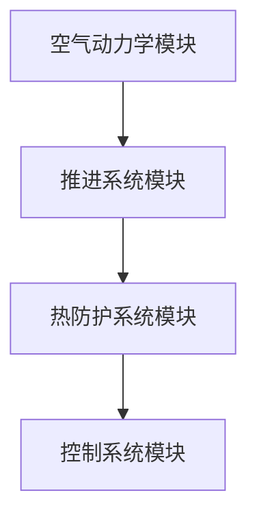
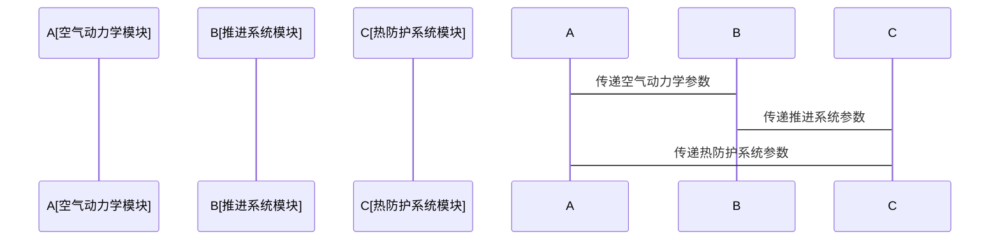

                 

# 价值投资中的高超音速技术机遇

> 关键词：价值投资，高超音速技术，数学模型，算法原理，系统架构，风险管理

> 摘要：本文深入探讨了高超音速技术与价值投资的结合，分析了高超音速技术的定义、特点、市场现状及其在投资领域的潜力。通过数学模型和算法原理的详细讲解，结合实际案例，为投资者提供了高超音速技术投资的系统性分析框架和实战指南。文章还讨论了高超音速技术投资中的风险管理策略，并展望了未来的投资机会。

---

# 第一部分: 高超音速技术与价值投资的背景与基础

## 第1章: 高超音速技术的定义与价值投资概述

### 1.1 高超音速技术的定义与特点
#### 1.1.1 高超音速技术的定义
高超音速技术是指飞行速度超过5马赫（即5倍音速）的飞行技术，涉及空气动力学、热防护系统、推进系统等多个复杂领域。高超音速技术的核心在于突破音障，实现高速、高效、长距离的飞行能力。

#### 1.1.2 高超音速技术的核心特点
- **高速性**：飞行速度超过5马赫，能够显著缩短飞行时间。
- **技术复杂性**：涉及高温材料、空气动力学、推进系统等多学科的交叉。
- **应用广泛**：可用于军事、航天、民用交通等领域。

#### 1.1.3 高超音速技术与传统技术的区别
- **速度**：高超音速技术的速度远超传统飞行技术。
- **技术要求**：高超音速技术需要更复杂的材料和系统设计。
- **应用场景**：高超音速技术主要用于长距离、快速运输和军事用途。

### 1.2 价值投资的基本概念
#### 1.2.1 价值投资的定义
价值投资是一种投资策略，旨在通过分析企业的基本面，寻找市场价格低于其内在价值的投资机会。

#### 1.2.2 价值投资的核心原则
- **安全边际**：买入价格低于内在价值，确保一定的安全空间。
- **长期视角**：关注企业的长期盈利能力，而非短期市场波动。
- **独立思考**：基于深入研究做出投资决策，避免盲目跟风。

#### 1.2.3 高超音速技术与价值投资的结合
高超音速技术的快速发展为企业带来了巨大的市场潜力，而价值投资则为企业提供了评估其内在价值的工具。

### 1.3 高超音速技术的市场现状与未来趋势
#### 1.3.1 高超音速技术的当前发展状况
当前，高超音速技术主要应用于军事领域，同时在民用交通领域也展现出巨大潜力。

#### 1.3.2 高超音速技术的未来发展趋势
随着技术的进步，高超音速技术将逐步应用于商业航空、太空探索等领域，市场潜力巨大。

#### 1.3.3 高超音速技术在投资领域的潜力
高超音速技术的商业化应用将为企业带来巨大的收益，相关企业在未来几年内具有较大的投资潜力。

---

## 第2章: 高超音速技术的核心概念与价值投资的联系

### 2.1 高超音速技术的核心原理
#### 2.1.1 高超音速飞行器的基本原理
高超音速飞行器需要克服高温、高速带来的空气动力学问题，同时需要高效的推进系统。

#### 2.1.2 高超音速技术的关键技术
- **高温材料**：耐高温、高强度的材料是高超音速技术的核心。
- **空气动力学设计**：优化的空气动力学设计可以降低飞行阻力。
- **推进系统**：高效的推进系统是实现高超音速的关键。

#### 2.1.3 高超音速技术的数学模型
高超音速飞行器的空气动力学模型可以通过以下公式表示：

$$
C_d = \frac{0.5 \cdot \rho \cdot v^2 \cdot A}{F}
$$

其中，$C_d$为阻力系数，$\rho$为空气密度，$v$为飞行速度，$A$为迎风面积，$F$为阻力。

### 2.2 价值投资的核心原理
#### 2.2.1 价值投资的基本原理
价值投资的核心在于寻找市场价格低于内在价值的企业。

#### 2.2.2 价值投资的关键指标
- **市盈率（P/E）**：企业市值与净利润的比率。
- **市净率（P/B）**：企业市值与净资产的比率。
- **股息率**：企业股息与股价的比率。

#### 2.2.3 高超音速技术与价值投资的结合
通过分析高超音速技术企业的基本面，寻找具有长期盈利潜力且市场价格低于内在价值的投资机会。

### 2.3 高超音速技术与价值投资的联系
#### 2.3.1 高超音速技术的市场需求与价值投资的关系
高超音速技术的市场需求将直接影响企业的盈利能力和内在价值。

#### 2.3.2 高超音速技术的行业趋势与价值投资的结合
行业趋势分析是价值投资的重要部分，高超音速技术的行业趋势将决定企业的长期发展潜力。

#### 2.3.3 高超音速技术的创新与价值投资的机遇
技术创新是高超音速技术的核心驱动力，也是价值投资的重要考量因素。

---

## 第3章: 高超音速技术的数学模型与算法原理

### 3.1 高超音速技术的数学模型
#### 3.1.1 高超音速飞行器的空气动力学模型
空气动力学模型可以通过以下公式表示：

$$
L = 0.5 \cdot \rho \cdot v^2 \cdot C_l \cdot A
$$

其中，$L$为升力，$\rho$为空气密度，$v$为飞行速度，$C_l$为升力系数，$A$为迎风面积。

#### 3.1.2 高超音速技术的热防护系统模型
热防护系统的设计需要考虑高温条件下的材料性能，可以通过以下公式评估：

$$
Q = \frac{P \cdot A}{\rho \cdot v}
$$

其中，$Q$为热量传递率，$P$为压力，$A$为面积，$\rho$为空气密度，$v$为飞行速度。

#### 3.1.3 高超音速技术的推进系统模型
推进系统效率可以通过以下公式计算：

$$
\eta = \frac{I_{sp} \cdot g_0}{v_e}
$$

其中，$\eta$为效率，$I_{sp}$为比冲，$g_0$为标准重力加速度，$v_e$为喷气速度。

### 3.2 价值投资的数学模型
#### 3.2.1 价值投资的基本公式
价值投资的核心公式为：

$$
\text{内在价值} = \frac{\text{现金流}}{\text{折现率}}
$$

#### 3.2.2 价值投资的市场分析模型
市场分析模型可以通过以下公式表示：

$$
P = \sum_{t=1}^{n} \frac{C_t}{(1 + r)^t}
$$

其中，$P$为股票价格，$C_t$为第$t$年的现金流，$r$为折现率。

#### 3.2.3 高超音速技术与价值投资的算法结合
通过算法分析高超音速技术企业的财务指标和市场趋势，寻找具有投资价值的企业。

---

## 第4章: 高超音速技术的系统分析与架构设计

### 4.1 高超音速技术的系统架构
#### 4.1.1 系统功能设计
高超音速技术系统包括空气动力学模块、推进系统模块、热防护系统模块。

#### 4.1.2 系统架构设计
系统架构设计可以通过以下mermaid图表示：

#### 4.1.3 系统接口设计
系统接口设计需要考虑各模块之间的数据交互，例如：

- 空气动力学模块与推进系统模块的数据交互。
- 推进系统模块与热防护系统模块的数据交互。

#### 4.1.4 系统交互设计
系统交互设计可以通过以下mermaid图表示：

---

## 第5章: 高超音速技术的项目实战

### 5.1 项目背景与目标
#### 5.1.1 项目背景
高超音速技术的商业化应用需求日益增长，投资者需要通过价值投资策略寻找具有潜力的企业。

#### 5.1.2 项目目标
通过价值投资策略，寻找具有长期盈利潜力的高超音速技术企业。

### 5.2 项目实施步骤
#### 5.2.1 市场分析
分析高超音速技术的市场需求和行业趋势。

#### 5.2.2 财务建模
通过财务模型评估企业的内在价值。

#### 5.2.3 投资组合构建
根据分析结果，构建高超音速技术相关的投资组合。

### 5.3 项目实战案例
#### 5.3.1 案例分析
以某高超音速技术企业为例，分析其财务指标和市场表现。

#### 5.3.2 投资决策
基于分析结果，做出投资决策。

### 5.4 项目总结
通过项目实战，验证价值投资策略在高超音速技术投资中的有效性。

---

## 第6章: 风险管理与投资策略

### 6.1 风险管理
#### 6.1.1 风险识别
高超音速技术投资中的主要风险包括技术失败、市场需求不足等。

#### 6.1.2 风险评估
通过概率论和统计学方法评估各风险的影响程度。

#### 6.1.3 风险应对策略
制定风险管理策略，如分散投资、设置止损等。

### 6.2 投资策略
#### 6.2.1 稳健投资策略
注重企业的基本面分析，选择具有长期盈利潜力的企业。

#### 6.2.2 价值投资策略
通过价值投资策略，寻找市场价格低于内在价值的企业。

---

## 第7章: 总结与展望

### 7.1 总结
高超音速技术与价值投资的结合为企业带来了巨大的投资机遇，同时也需要投资者具备深入的技术和市场分析能力。

### 7.2 展望
随着高超音速技术的不断发展，未来将有更多的投资机会。投资者需要持续关注技术进步和市场变化，抓住投资机遇。

---

## 第8章: 最佳实践与小结

### 8.1 最佳实践 tips
- 深入研究高超音速技术的核心原理和行业趋势。
- 关注企业的财务指标和市场表现。
- 制定科学的风险管理策略。

### 8.2 小结
高超音速技术的价值投资机遇需要投资者具备技术背景和投资能力，通过系统的分析和实践，可以实现长期的收益。

---

# 作者：AI天才研究院/AI Genius Institute & 禅与计算机程序设计艺术 /Zen And The Art of Computer Programming

---

以上是基于用户需求设计的完整目录和内容概要，涵盖了高超音速技术与价值投资的各个方面，结合了技术分析、数学模型、系统设计和实战案例，为投资者提供了全面的指导。

